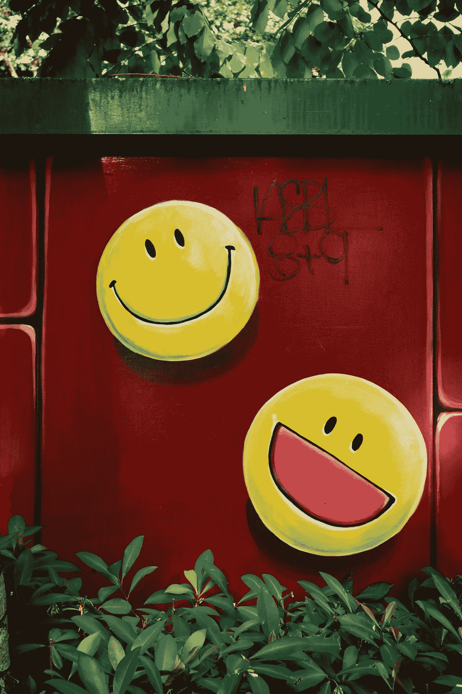
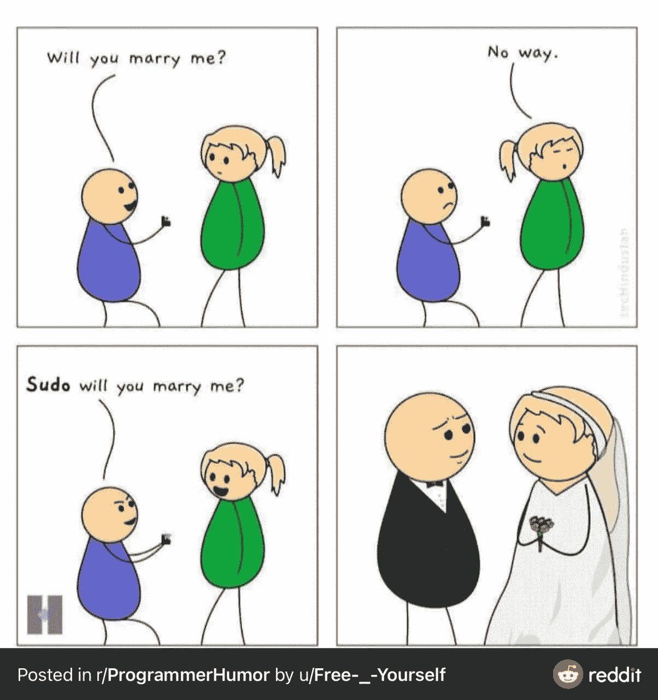
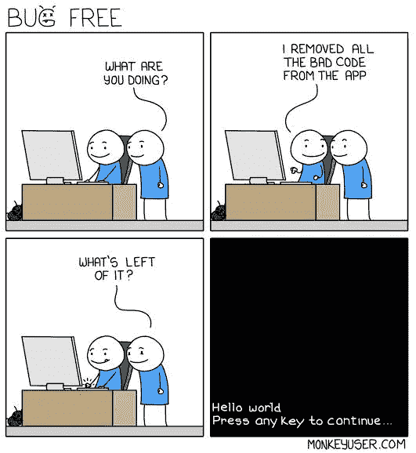
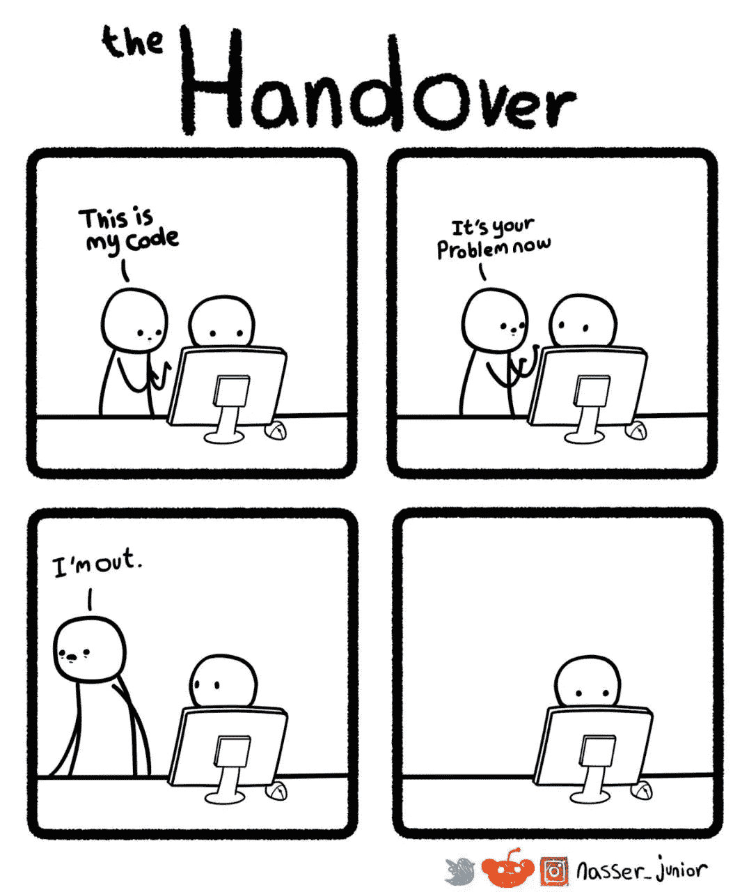
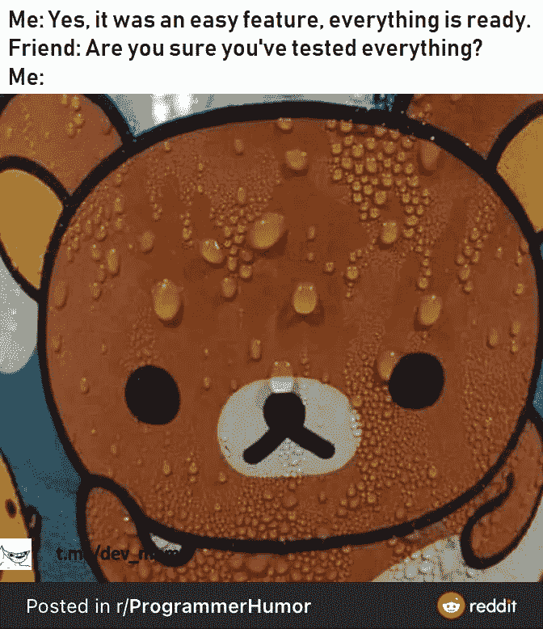
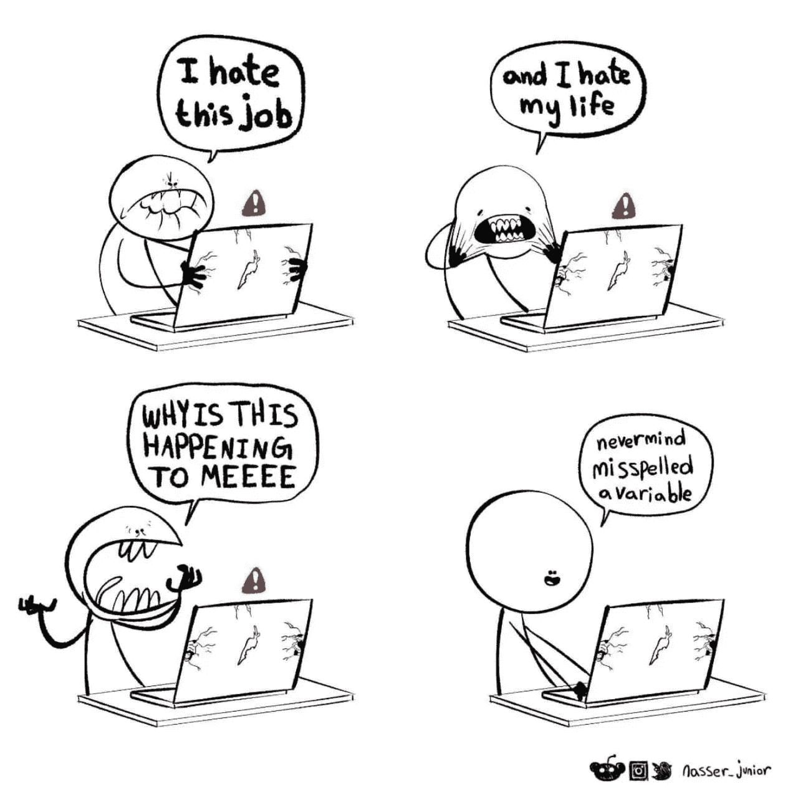
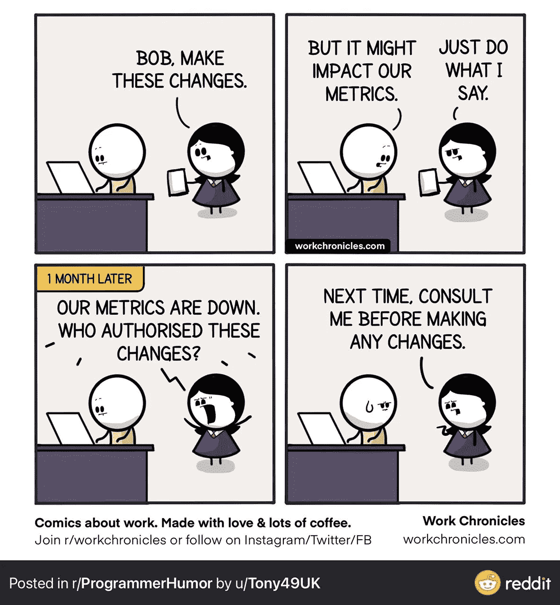
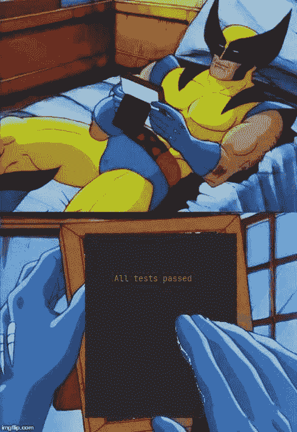
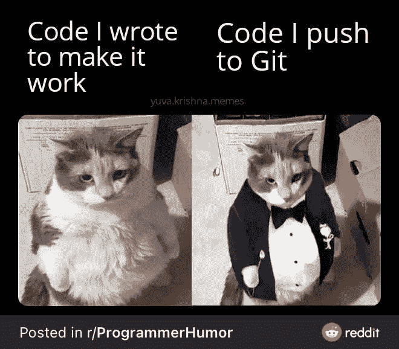
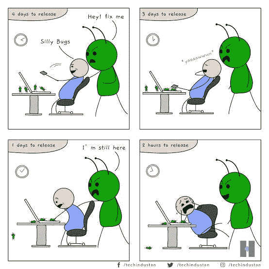

# 9 个终极编程笑话

> 原文：<https://levelup.gitconnected.com/9-ultimate-programming-jokes-aa4970492af4>

## 程序员生活中的笑话，你可以与之相关

[卓成友](https://unsplash.com/@benjamin_1017?utm_source=medium&utm_medium=referral)在 [Unsplash](https://unsplash.com?utm_source=medium&utm_medium=referral) 上拍照

笑是缓解压力的最佳方式之一。有什么比编笑话来减轻这种压力更好的呢？我们都喜欢笑话，尤其是当我们把它们和我们的日常生活联系起来的时候。

我想出了一些与你的工作相关的笑话。我希望这篇文章能让你振作起来，让你在笑声中开始新的一天😃

# 0.这招每次都管用

我想现在我要和我不存在的虚拟女友尝试一下。我会让你知道这是否可行:)

# 1.没有代码，没有 bug

当你试图从你的代码中移除 bug，但最终移除了所有的代码，因为你所有的代码都是 bug。-

信用:[猴子用户](https://www.monkeyuser.com/)。com

# 2.现在都是你的了

信用:[纳赛尔 _ 朱尼尔](http://www.nasserjunior.com/)

# 3.当发布新功能时

Tes-ted？你这话是什么意思？你吃吗？

# 4.唷！只是一个拼写错误的变量

当您不断发现 bug 并不断得到错误时，这种情况总是会发生。当你发现只是一个变量被拼错时，那种如释重负的感觉。

啊，生命中如此美妙的时刻，不是吗？

信用:[纳赛尔 _ 朱尼尔](http://www.nasserjunior.com/)

# 5.每次都是这样

当您的经理要求您对代码进行更改时，您警告他们其他代码度量可能会失败。但是他们坚持要你做出改变，当你这样做的时候，他们开始因为代码失败而责备你。

> 生活窍门 1:让他们通过电子邮件发送指令，并说我今天晚些时候就开始做

# 6.也许，有一天

当您为代码编写单元测试时，这种情况经常发生，但是每次都有一个单元测试失败。通过所有的测试是每个开发者的梦想。

> 生活窍门#2:如果你从不写任何东西，测试就永远不会失败😜

# 7.当代码表示就是一切的时候

当你把代码推给 Git 时，代码表示就是一切，因为你不想在高级开发人员审查你的代码时被他们责骂。

# 8.时间永远不够

信用:[技术产业](https://twitter.com/techindustan?ref_src=twsrc%5Egoogle%7Ctwcamp%5Eserp%7Ctwgr%5Eauthor)

**感谢阅读！我希望你喜欢这篇文章，它让你开怀大笑😃**

# 分级编码

感谢您成为我们社区的一员！[订阅我们的 YouTube 频道](https://www.youtube.com/channel/UC3v9kBR_ab4UHXXdknz8Fbg?sub_confirmation=1)或者加入 [**Skilled.dev 编码面试课程**](https://skilled.dev/) 。

 [## 编码面试课程+登陆你的开发工作

### 掌握编码面试的过程

技术开发](https://skilled.dev) 

你可以在这里免费订阅我的时事通讯: [Pralabh 的时事通讯](https://pralabhsaxena.medium.com/subscribe)