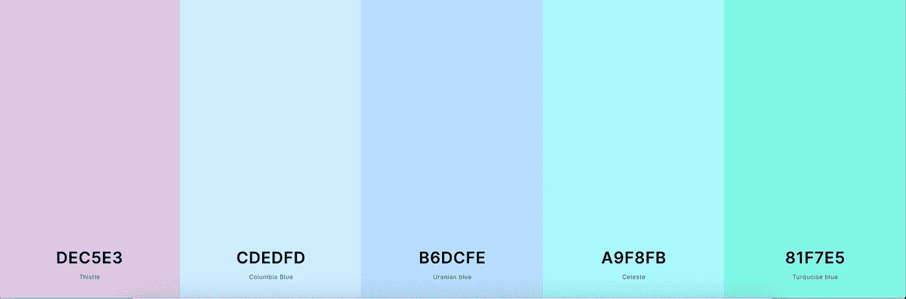

# 9 个对 Web 开发者有用的 CSS 工具

> 原文：<https://levelup.gitconnected.com/9-useful-css-tools-for-web-developers-4ae3e8747b8a>

Elena Mozhvilo 在 [Unsplash](https://unsplash.com?utm_source=medium&utm_medium=referral) 上的照片

## 他们可以帮助你让你的生活变得轻松一点

作为开发人员，不管你有多有经验，你都想让你的生活尽可能的简单。合适的工具可以帮助您实现这一目标。你的能力取决于你使用的工具，所以花些时间选择适合你需求的工具是明智的。

在本文中，我们将浏览一个工具列表，每个 web 开发人员都可以使用它来使您的生活变得更简单，并且变得更高效。

> “我们改变我们的工具，然后我们的工具改变我们。”—杰夫·贝索斯

# 1.过渡生成器

CSS 属性之一有很多可能性，这使得你很难记住所有的可能性，那就是*转换*属性。

当你不确定你想要什么样的转变，或者当你只想尝试一系列转变时，这个工具非常有用。这个工具可以很容易地混合过渡的不同方面，如持续时间和延迟。这样，您可以准确地看到每个不同的过渡是如何工作的。

请注意，这个网站提供了许多其他不同的工具，如渐变和变换生成器。

# 2.变压器

Transfonter】是用来转换字体的工具，这样你就可以在网上使用它们了。它支持许多不同的格式，比如 TTF、EOT、WOFF、WOFF2 和 SVG。

当你有一个需要在网上使用的自定义字体时，这真的很有用！

# 3.翻转开关发生器

每隔一段时间，您可能需要为您正在构建的新应用程序实现一个翻转开关。您可以使用[这个工具](https://www.cssportal.com/css3-flip-switch/)来为您生成代码，而不必一遍又一遍地重新发明轮子。

多甜蜜啊！

# 4.Flexbox.help

[Flexbox.help](https://flexbox.help/) 是一个很棒的工具，无论何时你需要 Flexbox 方面的帮助，你都可以利用它。如果您对 flexboxes 相对陌生，这是一个很好的结果。使用这个工具，您可以尝试所有可用的 flex 选项。CSS 会根据您选择的选项自动生成，因此您不必自己键入所有代码。

# 5.与 CSS 顶嘴

使用[这个工具](https://jsonformatter.org/sass-to-css)你可以将你的 SASS 代码转换回 CSS。每当您需要使您编写的 SASS 代码准备好在 web 上使用时，这可能是有用的。

# 6.纯 CSS 图像效果

CSS *滤镜*属性在元素显示之前提供对元素渲染的模糊或颜色偏移等效果的访问。[这个工具](http://angrytools.com/css-generator/filter/)让你尝试过滤器属性提供的所有可能性。

看看吧，看看你能用这个特性创造出多少伟大的效果！

# 7.生成配色方案

有时候，你只是缺乏灵感，当谈到找到最好的颜色用于某个设计或网站。每当你失去灵感时，你应该使用这个工具。这是一个非常优雅和易于使用的工具，为您提供最好的配色方案。

# 8.风格指南生成器

无论何时，当你在一个有多人在前端工作的团队中工作时，这个工具都非常受欢迎。它让您可以生成一个样式指南，因此对于如何设计某些元素的样式不会有任何误解。

# 9.使某种颜色变暗或变亮

[列表中的最后一个工具](https://www.cssfontstack.com/oldsites/hexcolortool/)可以让你变暗或变亮任何颜色。有很多情况下，当你有了一种颜色，你想得到一种稍微深一点或浅一点的颜色。例如，在为按钮寻找背景颜色时。

寻找一个伟大的专色从未如此简单！

# 就是这样！

现在我们已经到了这个列表的末尾，我希望你已经拿起了一个或两个工具，可以让你的生活稍微轻松一点。

你认为这个列表中缺少了一个很棒的工具吗？或者你有一个神奇的数字 10 吗？让我知道！

感谢您的阅读！