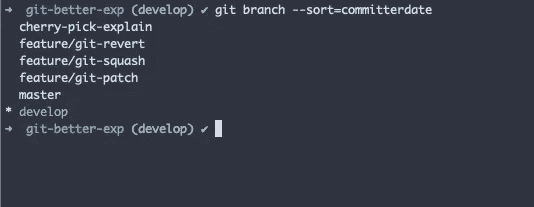
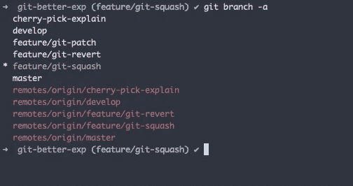
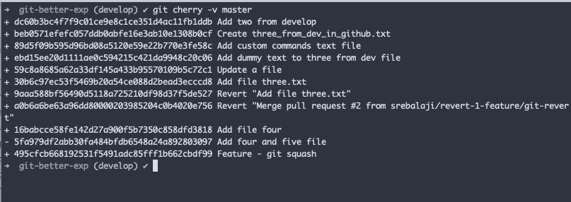

# 你可能不知道的 9 个有用的 git 分支技巧

> 原文：<https://levelup.gitconnected.com/9-useful-tricks-of-git-branch-you-might-not-know-a2bad3c54804>


## 列出已经合并到特定分支的所有分支

```
git branch --merged <respective_branch_name> **Example** git branch --merged master
```

上面的命令将帮助您找到所有已经与**主**分支合并的分支。

## 快速切换到上一个分支

```
git checkout -
```

这将切换到您签出的前一个分支。

**替代品**

```
git checkout @{-1} // checks out to previous branch git checkout @{-2} // checks out to second previous branch
```

## 列出按最近提交排序的所有分支

```
git branch --sort=committerdate
```

上面的命令将按照最近提交的顺序列出分支。因此，您可以看到最近使用最多的分支。

非常有用的命令，当你处理多个分支时，它非常方便。



在上面的例子中，**开发**具有最近的提交。并且**主**具有第二最近的提交，以此类推。

## 删除本地和远程分支

```
git branch -d <branch_name>
```

只有当分支与父分支合并时，此命令才会删除分支。

```
git branch -D <branch_name>
```

该命令将删除分支，不管它是否被合并。

要删除远程分支，您可以使用

```
git push origin <branch_name> -d
```

**-d** 属性也将删除远程中的分支。

## 显示分支之间的差异

我们已经在之前的两期中看到了这个命令。

```
git log master..develop
```

这个命令将帮助您显示来自 **develop** 的所有提交，但是不在主分支中。通过这种方式，您可以知道有多少新的提交被添加到了开发分支中，而主分支中却没有。并确保在比较之前在本地有更新的更改。

## 重命名分支名称

```
git branch -m <old_name> <new_name> **Example** git branch -m development develop
```

上述命令将在本地重命名分支名称。

要将更新的分支名称推送到远程，

```
git push origin :old_name new_name **Example** git push origin :development develop
```

## 列出远程分支

```
git branch -a
```

该命令将列出所有本地和远程分支。



要仅列出远程分支

```
git branch -r
```

这些命令将有助于查看哪些远程分支仍然存在于本地，以便您可以删除它们。

我的意思是，即使在远程删除分支之后，在本地机器中也会有对它的引用。

要删除本地的所有远程引用，可以使用

```
git remote prune origin
```

## 列出包含特定提交散列的分支

```
git branch --contains <commit-hash> **Example** git branch --contains f9456ba
```

上述命令将列出包含所提供的提交散列的所有分支。

## 显示当前分支中尚未合并到父分支的所有提交

```
git cherry -v <parent_branch> **Example** git cherry -v master
```

上面的命令将列出当前分支中尚未合并到相应分支的所有提交。



感谢您的阅读。希望你学到了新东西:)

如果你已经来了这么久，那么我想你会对 Git 更感兴趣。可以订阅我的简讯[**Git better**](https://gitbetter.substack.com/)**获取 Git 的招数、技巧、高级话题。**

# 分级编码

感谢您成为我们社区的一员！ [**订阅我们的 YouTube 频道**](https://www.youtube.com/channel/UC3v9kBR_ab4UHXXdknz8Fbg?sub_confirmation=1) 或者加入 [**Skilled.dev 编码面试课程**](https://skilled.dev/) 。

[](https://skilled.dev) [## 编写面试问题

### 掌握编码面试的过程

技术开发](https://skilled.dev)