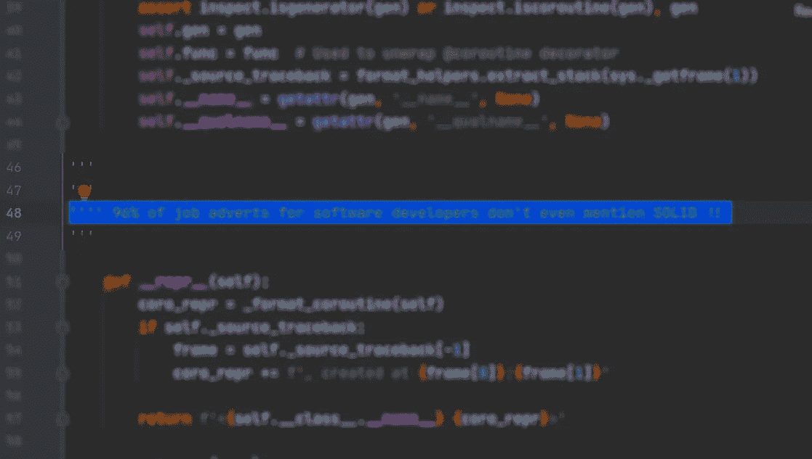
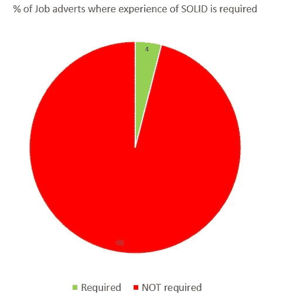
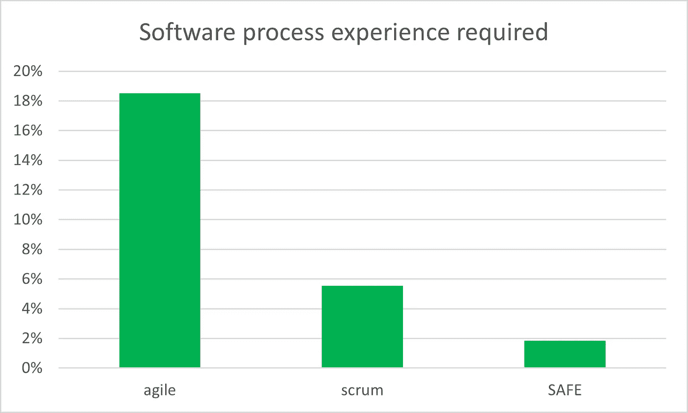
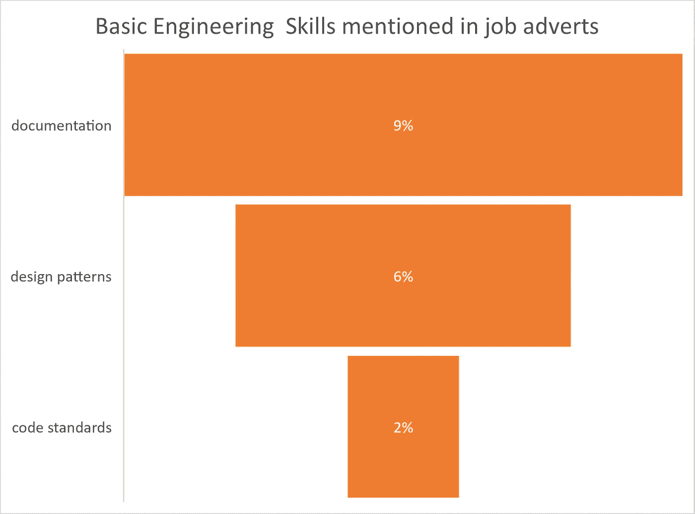
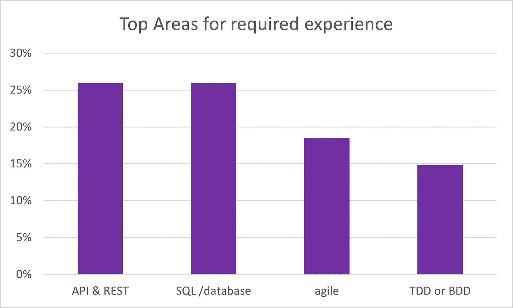

# 96%的雇主不要求扎实的软件技能！

> 原文：<https://levelup.gitconnected.com/96-of-employers-dont-require-solid-software-skills-7ca782375908>

## 对开发人员招聘广告的分析显示了令人震惊的招聘趋势

## 他们想要特定语言的编码员，而不是工程师

作者格雷格·比灵顿的图片

令人震惊的是，2021 年的软件开发工作对一般工程原则的要求非常低，如可靠、敏捷和设计模式。在 **medium** 上读了这么多关于基础架构和设计原则的好文章后，我决定快速检查一下，看看招聘广告是否反映了新员工标准的最佳实践。作为一个行业，看起来我们的雇主主要只是在寻找用特定语言输入代码的能力。

# 招聘广告中提到了坚实的原则吗？

**SOLID** 是五个工程原则列表的首字母缩写，作为一个集体，我们认为这是创建优秀软件的基础。固体是第一步，不是一个完整的知识库或一个广泛和完全包含的描述，但它是一个广为人知和普遍理解的术语。因此，非常令人担忧的是，只有 4%的招聘广告在寻找具有某种基本原理经验的候选人来开发软件。

# 需要什么开发流程经验？

构建软件产品的关键部分是了解如何在团队中创建、构建、组装和部署软件。这个过程是一系列的任务，以及共同的期望和术语，这样几个人就可以作为一个团队有效地运作。

图片作者格雷格·比灵顿

对这种工艺经验的要求在极少的招聘广告中有所体现，这令人惊讶。不到 1/5 的广告要求敏捷体验，只有 1/20 要求 scrum，1/50 要求安全体验。

# 需要基本的工程技能吗？

不要！只有很低比例的招聘广告提到了基础知识，比如文档、理解设计模式或编码标准。考虑到主要焦点是对特定语言进行编码，这并没有灌输对质量的信心，只有 **2%** 的广告提到对编码标准的体验。

> 这意味着 98%的雇主在招聘的最前沿没有质量、最佳实践和良好的代码，哇！

# 但至少代码是安全的，对吗？

不，看起来不是那样！只有 2%的广告提到任何类型的安全体验。

# 招聘广告的首要标准是什么？

那么，在 2021 年的招聘广告中，你可能会发现哪些标准呢？

*   特定语言的经验( ***100%的广告陈述精确的语言和框架*** 一个人应该有的经验)。
*   26%的广告提及**休息**和 **API** 体验。
*   26%的广告要求有数据库或 SQL 的经验。
*   18%的广告提到了**的敏捷**体验。
*   15%的广告陈述了 **TDD** (测试驱动开发)或 **BDD** (行为驱动开发)体验。

# 技能的正式认证

需要专业培训和考试委员会颁发的特定技能正式证书的招聘广告数量如此之少…… **只有 2%！！**

作者格雷格·比灵顿的图片

# 结论

不幸的是，它描绘了一幅令人沮丧的画面，即雇主正在寻找编写特定语言代码的人，质量和安全性很少被提及。优秀工程和设计的基本原则也不太受欢迎。

其中提到了敏捷、API、TDD/BDD 和数据库，这让人放心，尤其是对开发角色的测试方面的强调。正式的资格和认证率也在名单的底部。

从这个例子来看，策略似乎是获得特定语言的经验，并在你的简历上突出这些语言，因为这正是市场所寻求的。面试中可能会涉及其他工程领域，但要参加面试，你的简历需要展示你的语言和编码技能。

# 研究详情

这项调查是在 2021 年 6 月 21 日在 indeed.com 的一个求职网站上搜索“**软件开发员**”的职位进行的。对列出的前 54 个结果进行了检查，涵盖了全栈、前端、嵌入式和 web 开发角色。

# 进一步阅读

 [## 24%的测试人员招聘广告需要正式资格，而程序员只有 2%

### ISEB/ISTQB 资格证书为专业测试人员树立了标杆

levelup.gitconnected.com](/24-of-job-adverts-for-testers-need-formal-qualifications-vs-2-for-programmers-3941917e3a86)  [## 坚实还不够！

### 我们需要说明和例子而不是原则吗？

blog.devgenius.io](https://blog.devgenius.io/solid-isnt-enough-a631aa73f4c3)  [## 坚实是旅程的一部分，而不是目标

### 什么是好的软件？

blog.devgenius.io](https://blog.devgenius.io/solid-is-part-of-the-journey-not-the-goal-658c17787335)  [## 不用抢劫银行，用一根纯金棒就能做出伟大的软件。

### GOLD 能像 SOLID 做编码那样做开发吗？

blog.devgenius.io](https://blog.devgenius.io/make-great-software-with-a-pure-s-o-l-i-d-gold-bar-without-raiding-a-bank-7090528c154f) 

# 关于作者的更多信息

**Greg** 是一名经验丰富的软件专业人士，也是[**outsource . dev**](https://outsource.dev/)**，**的首席技术官，他曾在多家公司工作过，现在热衷于帮助他人在软件开发、管理和[外包](https://outsource.dev/how-to-successfully-outsource-software-development-and-it-projects/)方面取得成功。

如果你喜欢这篇文章，那么请鼓掌👏和**跟着**我。