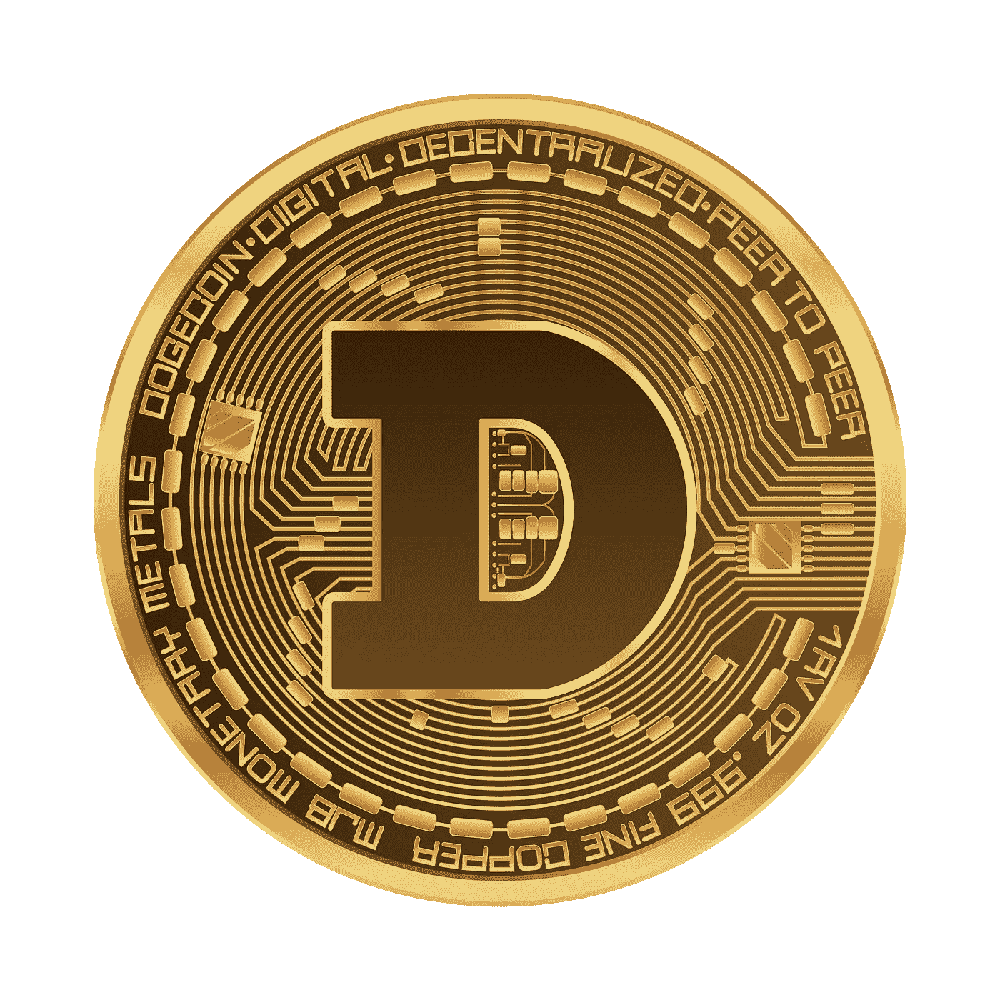
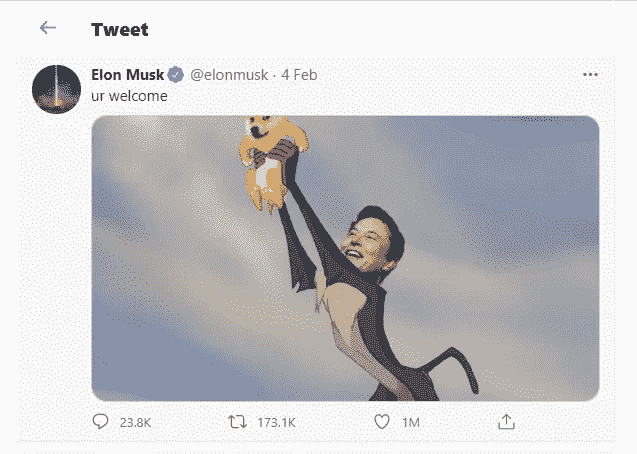
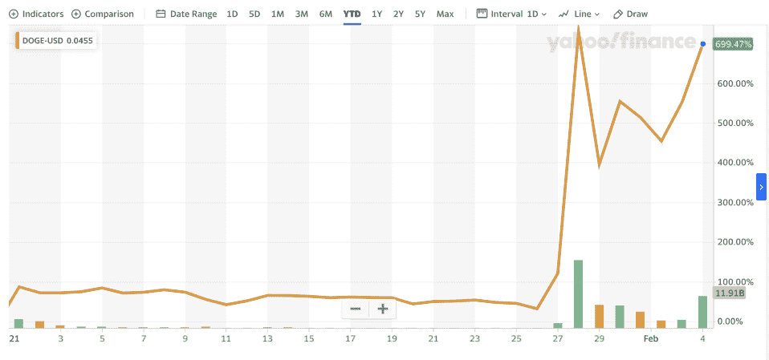

# Dogecoin:成为真正加密货币的迷因

> 原文：<https://levelup.gitconnected.com/98c18d4ba079>

## 加密货币

来源:[知识共享](https://commons.wikimedia.org/wiki/File:DOGECOIN.png)

作为迷因创造的加密货币现在比一个西方联盟更有价值。第 12 大加密货币，市场超过 61 亿美元是个笑话。

## Dogecoin 是什么？

[Dogecoin](https://en.wikipedia.org/wiki/Dogecoin) 是一种加密货币，始于 2013 年的一个笑话。这是一部讽刺作品，除了搞笑之外没有其他真正的目的。

但它的价值在过去是 **380%** ，今年是 **697%** 。

它是以一只拼写习惯不好的[柴犬](https://en.wikipedia.org/wiki/Doge_(meme))的形象命名的——拼的是 **doge** 而不是 **dog** 。

> 程序员比利·马库斯和杰克逊·帕尔默在 2013 年共同开发了 dogecoin。

过去两周，Reddit 散户投资者大举买入 Dogecoin，最近推高了 GME 和 Amc 股票。

Dogecoin 强劲增长的主要原因是特斯拉首席执行官埃隆·马斯克(Elon Musk)，他通过定期使用调查、模因和有趣的言论发布关于加密货币的推特来提升价格。

> “Dogecoin 是人民的密码，”马斯克在推特上说。

来源:[推特/埃隆马斯克](https://twitter.com/elonmusk/status/1357236825589432322?ref_src=twsrc%5Etfw%7Ctwcamp%5Etweetembed%7Ctwterm%5E1357236825589432322%7Ctwgr%5E%7Ctwcon%5Es1_&ref_url=https%3A%2F%2Ffinance.yahoo.com%2Fnews%2Fwhat-is-dogecoin-the-meme-cryptocurrency-elon-musk-has-sent-soaring-170244933.html)

他进一步补充道，“没有高潮，没有低谷，只有狗崽，”他还在推特上发了一张自己的照片，照片上的猴子抱着狗崽的头，就像辛巴一样。

在接受俱乐部应用采访时，埃隆·马斯克提到了 dogecoin，

> “可以说最有趣的结果，也是最讽刺的结果将是 Dogecoin 成为未来地球的货币。”

来源:[雅虎财经](https://s.yimg.com/ny/api/res/1.2/0LNk9AqOQ8Ur7z0kLjgc4w--/YXBwaWQ9aGlnaGxhbmRlcjt3PTk2MDtoPTQ0OS44NjczNzQwMDUzMDUwNw--/https://s.yimg.com/os/creatr-uploaded-images/2021-02/ddedcdb0-670c-11eb-9eff-35bce31a310b)

1 月 28 日，Dogecoin 超越比特币，成为单日微博点击率最高的加密货币。

在过去的 24 小时内，DOGE 的价值增加了 8%以上，达到 0.0782 美元，在 30 天内增加了大约 700%。

## 投资狗粮的风险

众所周知，加密货币非常不稳定，会上下波动。

例如，在特斯拉公司表示[投资了 15 亿美元的数字货币](https://rabinderkumar.medium.com/100a18cfb848)后，比特币在周一上涨了%13，达到 44000 美元。特斯拉还表示，它开始接受比特币作为正式支付方式。

> 研究负责人 Garrick Hileman 说:“我确实担心对加密货币的所有关注，这种货币在历史上没有任何吸引力，有点像一个笑话。”

所有加密货币的市场交易额在 1 月份首次触及[1 万亿美元](https://finance.yahoo.com/news/crypto-market-cap-surges-above-155208118.html)，具有讽刺意味的是，像 **dogecoin** 这样的硬币是其中非常真实的一部分。

此外，我们必须看看 dogecoin 能走多远，并在加密市场上有所作为。

# 放弃

本文仅用于信息和教育目的。它无意成为任何投资意见或建议。

来源:

1-[https://finance . Yahoo . com/news/what-is-dog ecoin-the-meme-cryptocurrency-elon-musk-has-send-sowing-170244933 . html](https://finance.yahoo.com/news/what-is-dogecoin-the-meme-cryptocurrency-elon-musk-has-sent-soaring-170244933.html)