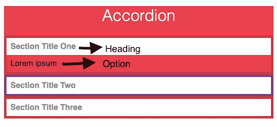
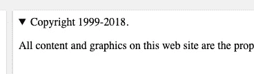

# 使用本地 HTML 标签的 10 行 React Accordion

> 原文：<https://levelup.gitconnected.com/a-10-line-react-accordion-using-native-html-tags-8217f4b0388c>


手风琴！

在最近的一个项目中，我在 React 应用程序中需要一个 accordion 组件。我有几个选择，比如使用 [Material UI](https://v1.material-ui.com/demos/expansion-panels/) 或者一些开源组件[这个](https://reactjsexample.com/tag/accordion/)和[这个](https://codepen.io/adamaoc/pen/wBGGQv)。

在我的用例中，accordion 选项集是动态的，它们本身携带着是否应该打开的信息。

我尝试了几个组件，但一两天后，我总是不得不回去删除组件或自己添加一些额外的行为。在大多数手风琴组件中，父母跟踪打开部分的状态，孩子使用一个变化处理器来通知父母何时应该打开它们。

所以，我自己用几行代码创建了一个，没有使用任何第三方库。



我来介绍一下 HTML `<detail>`标签。

这个标签本身带有按需显示/隐藏特性，这是 accordion 的核心。我们将使用其中的一组来创建我们的组件，这将节省我们自己处理打开和关闭行为的几十行代码。这可以用来创建我们的交互式小部件，它将有一个决定是否显示或隐藏内容的`open`道具。除了 React 之外，所有这些都是一个*非 JavaScript* 小部件。

助手链接:[详细标签](https://www.w3schools.com/tags/tag_details.asp)

我们还需要一个标签，那就是`<summary>`。该标签定义了一个标题，单击该标题可以显示或隐藏内容部分。它还带有一个内置的切换箭头，我们可以定制。

这是它在普通 HTML 中的样子:



# 手风琴部件

```
function Accordion({ children: options }) {
  const toOpen = options.props.open ? true : null;
  return options.map(options => (
    <details open={toOpen}>{options}</details>
  ));
}
```

这里要注意两件事:

1.  `children`不管他们愿不愿意开，都带着财物。这里我们把它改名为`options`。我们使用它包含的`open`道具来决定手风琴部分是否应该打开。
2.  在 JSX，`props`编译成普通的 JavaScript 对象，然后作为属性应用到 HTML 中。因此，我们返回`null`来禁止组件被添加到 HTML 中。由于我们使用了`null`而不是`boolean`，它不会将道具视为存在，也不会将其包含在 DOM 中。详细的解释:

[](https://stackoverflow.com/questions/41798027/react-inline-conditional-component-attribute/41798074#41798074) [## 反应内联条件组件属性

### 首先，JSX 只是 React.createElement 的语法糖。所以，它可能看起来像，但是，在现实中，你不…

stackoverflow.com](https://stackoverflow.com/questions/41798027/react-inline-conditional-component-attribute/41798074#41798074) 

它将被这样使用:

```
<Accordion>
   ...Options
</Accordion>
```

# 选项组件

这将是手风琴中每一节的内容。它使用一个`<summary>`标签来显示可点击部分的标签(标题)。它为每个部分呈现`children`,不需要任何额外的 JavaScript。

```
function Option({ label, children }) {
  return (
    <React.Fragment>
      <summary>
        {label}
      </summary>
      {children}
    </React.Fragment>
  );
}
```

我是这样用的:

```
<Accordion>
 {this.getOptions(status)}
</Accordion>
```

获取选项列表的代码:

```
function getOptions(status) {
 // status decides which options to return with what open flag
return [
     ...moreOptions, 
     <Option label="heading" open={status === "status1"}>
        <Component1
          someProp={someProp}
        />
     </Option>
   ]}
```

这是应用了一些 CSS 的最终输出。

> *注意:禁用摘要组件中的默认图标:*

```
summary::-webkit-details-marker {
  display: none;
}
```

现在你可以随意摆弄它了。对于简单的用例，不要下载和保存第三方库通常是明智的。我试了 5 次，才决定只用不到 10 行代码就能做到，并不断添加第三方组件。简单的功能通常可以提取出来独立使用。

谢谢你坚持到帖子的最后，你太棒了！
如果你觉得有帮助，请分享它，或者在 [twitter](https://twitter.com/Dpkahuja) :)上给我打个招呼