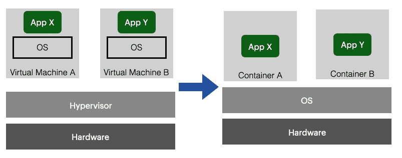
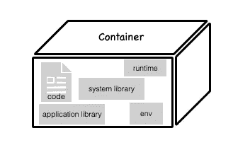
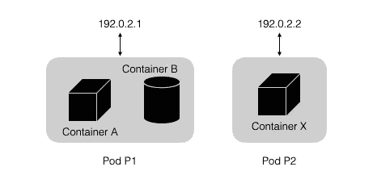
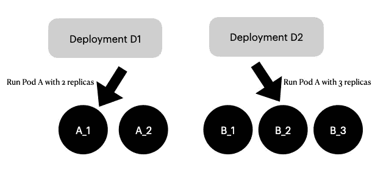
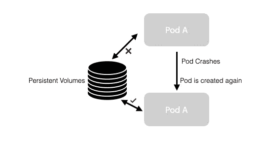
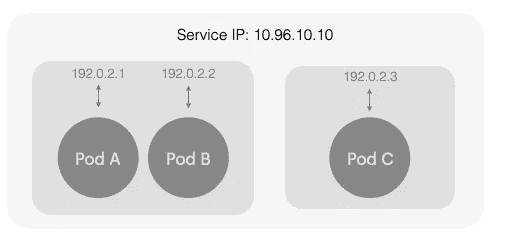

# 从 1000 英尺的高度俯瞰库伯内特斯

> 原文：<https://levelup.gitconnected.com/a-1000-foot-overview-of-kubernetes-c00e410b1983>

## 以及为什么它是部署和管理软件的新标准


艾莉娜·格鲁布尼亚克在 [Unsplash](https://unsplash.com/s/photos/network?utm_source=unsplash&utm_medium=referral&utm_content=creditCopyText) 上的照片

Kubernetes 是由 Google 开发的开源编排工具(它是他们的 [Borg](https://en.wikipedia.org/wiki/Borg_(cluster_manager)) 项目的一个分支),用于跨分布式节点集群管理微服务或容器化应用。正如 kubernetes.io 解释的那样，

> Kubernetes 是一个可移植、可扩展的开源平台，用于管理容器化的工作负载和服务，方便了声明式配置和自动化

在我们深入挖掘之前，首先理解为什么要引入 Kubernetes 是很重要的。

# 那么，为什么是 Kubernetes？

在过去，软件部署艰难、耗时且成本高昂。这主要是因为我们需要根据这些应用程序的需求购买大量的物理机。几年后，虚拟化变得非常普遍，并允许共享 CPU 和内存。这节省了一些成本，因为一个强大的裸机服务器可以托管多台机器。在现代，机器可以被分割成比虚拟服务器更小的部分，称为容器。这是虚拟机与容器的区别:



虚拟机与容器。作者图片

因此，容器为应用程序启用了虚拟操作系统。通过 Linux 内核特性，如 [cgroups](https://en.wikipedia.org/wiki/Cgroups) 、 [chroot](https://en.wikipedia.org/wiki/Chroot) 、 [UnionFS](https://en.wikipedia.org/wiki/UnionFS) 和[名称空间](https://en.wikipedia.org/wiki/Linux_namespaces)，容器能够实现文件系统、进程和网络隔离。这意味着您只需为一台物理主机付费，安装一个操作系统，并运行您的硬件所能处理的尽可能多的容器。减少您需要在同一台主机上运行的操作系统数量意味着更少的存储、内存和 CPU 浪费。

这种在同一个操作系统上以容器(或流程)的形式运行完整服务的能力是革命性的。Docker 是 2010 年推出的一款产品，利用容器进行软件部署。但它也带来了一些其他需要解决的问题:

1.  在这种基于微服务的架构中，通过添加容器来添加功能非常简单，但管理起来却很麻烦。
2.  升级时，您需要确保不会导致整个应用程序停止运行。相反，我们需要一种方法来以受控和系统化的方式进行升级，确保应用程序始终处于运行状态。手动操作既复杂又容易出错
3.  为了实现高可用性，您需要为每个组件创建多个容器。这就产生了谁来响应客户请求的问题。
4.  负载平衡
5.  集装箱崩溃时的恢复
6.  其他问题，如向适当的主机分发容器、发现、流量路由等。

所有这些问题都需要一个指挥者。库伯内特斯出场了。Kubernetes 为您完成所有的编排工作，比如容器调度、容器管理、管理服务端点等。让我们不要深入了解库伯内特斯的成分

# 容器

虽然解释得有点早，但让我试着详细解释一下。



集装箱。作者图片

容器提供了一种逻辑打包机制，应用程序可以从它们实际运行的环境中抽象出来。这种分离允许基于容器的应用程序被容易地、一致地部署，而不考虑目标机器。它包含所需的代码和任何运行时、应用程序和系统库，以及任何重要设置的默认值。

# 分离舱



荚的例子。作者图片

pod 封装了一个或多个相关的容器，是可以在集群中部署和管理的最小单元。pod 中的容器共享端口号、Linux 内核名称空间和网络堆栈设置。容器可以很容易地与同一个 pod 中的其他容器通信，就像它们在同一台机器上一样，同时保持与其他容器的一定程度的隔离。

尽管我们可以在一个 pod 中有多个容器，但是最佳实践是尽可能少地捆绑。因为单元是作为一个单元向上和向下扩展的，所以单元中的所有容器必须一起扩展，而不管它们各自的需求。这可能会造成资源浪费。

```
kubectl get allNAME         READY     STATUS    RESTARTS   AGE
pod/PodA     1/1       Running   0          2d21h *# 1 container*
pod/PodB     2/2       Running   0          2d21h *# 2 containers*
```

为了实现高可用性和容错，建议为同一个 pod 创建多个副本(或复制品)。Kubernetes 可以配置为在必要时部署 pod 的新副本。

虽然可以独立部署 pod，但不建议直接部署 pod。相反，建议使用[部署](https://kubernetes.io/docs/concepts/workloads/controllers/deployment/)等工作负载资源来创建它们

# 部署

部署是描述应用程序生命周期的控制类型，例如应用程序使用哪些图像，应该有多少个窗格，以及更新它们的方式。



部署。作者图片

手动更新[容器化应用](https://www.redhat.com/en/topics/containers/what-is-kubernetes-deployment)的过程可能会非常耗时和乏味。将服务升级到下一个版本需要启动新版本的 pod，停止旧版本的 pod，等待并验证新版本是否已成功启动，并且有时在失败的情况下将其全部回滚到以前的版本。

手动执行上述步骤可能会导致人为错误，而正确地编写脚本可能需要大量的工作，这两者都可能使发布过程成为瓶颈。部署通过协调这些步骤来帮助管理这些问题。

# 卷

可以将卷视为 pod 中的容器可以访问的目录。主要有两种基本类型的卷:

**短命** 短命卷种类有一生一个荚。因此，当 pod 崩溃时，该卷中的所有数据都会丢失。如果您打算管理一个有状态的 pod(像一个数据库)，您需要在重启和崩溃之间持久化数据。

**持久卷**



持久卷。作者图片

顾名思义，这些数据在 pod 重新启动后保持不变，并且存在于 pod 的生命周期之外。这可以被认为是使用外部硬盘进入集群。当一个 pod 出现故障时，卷完好无损，新的 pod 会出现并挂接到同一个卷。这就是所谓的 pod 粘性，当跨重新调度的 pod 需要一个持久标识符时，通常使用[有状态集](https://kubernetes.io/docs/concepts/workloads/controllers/statefulset/)(类似于部署)。

# 服务

服务可以被定义为一组逻辑单元，并且是单元顶部的抽象，它提供了可以访问单元的单个 IP 地址和 DNS 名称。依赖于 POD IP 不是一个非常好的主意，因为它会在每次 POD 重新启动时改变。



Kubernetes 的服务。作者图片

通过在 ServiceSpec 中指定类型，可以以不同的方式公开服务:

1.  **集群 IP** :【默认】在集群的内部 IP 上公开服务
2.  **节点端口** —使用 NAT 在集群中每个选定节点的同一端口上公开服务
3.  **负载平衡器** —与云提供商一起创建外部负载平衡器，并将外部 IP 分配给服务和 LB
4.  **外部名称** —将服务映射到 DNS 名称。使 pods 能够使用非容器化服务

以上是 Kubernetes 及其基本组件的 1000 英尺视图。这是一个简化的版本，但应该足够好开始。了解这些基本成分将有助于更深入地了解 Kubernetes。

要了解更多信息，最简单的方法是在本地安装 Kubernetes，然后到处玩。以下内容应该会有很大帮助:

[](/how-to-use-kubernetes-and-minikube-to-set-up-a-relational-database-locally-1ea04ba6cb7f) [## 如何使用 Kubernetes 和 Minikube 在本地建立关系数据库

### 一步一步的过程中，所有的例子

levelup.gitconnected.com](/how-to-use-kubernetes-and-minikube-to-set-up-a-relational-database-locally-1ea04ba6cb7f)