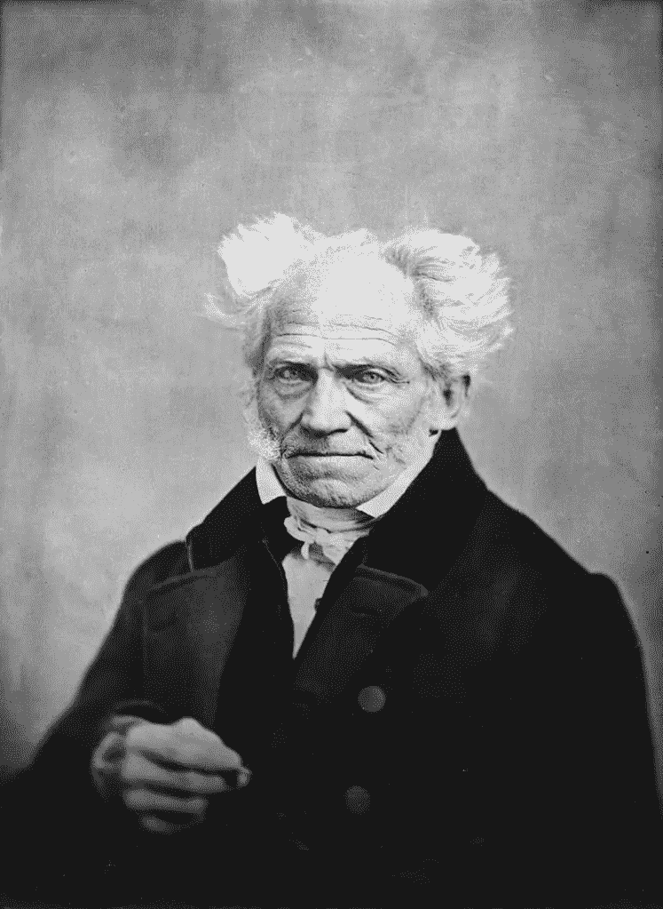

# 一位 19 世纪的德国哲学家预测了我们对比特币的反应

> 原文：<https://levelup.gitconnected.com/a-19th-century-german-philosopher-predicted-our-reactions-to-bitcoin-f7abdb315f4b>

## 人类如何处理重大技术变革

拉蒙·萨利内罗在 Unsplash 上的照片

生活中有些事情会引起极端的情绪，包括支持和反对。

人们很少是矛盾和无私的——相反，他们持有热情和明确的观点，并乐于分享。他们可能已经做了调查，或者只是跟着感觉走。不管怎样，这都不会影响他们的热情和分享的意愿。

*比特币就是这样一个主题。*

它的热心者是福音派——当他们向所有愿意倾听的人宣扬它的好处时，他们的热情是显而易见的。他们一起在网上闲逛，谈论它的未来，并推测可能引发下一次价格飙升的令人兴奋的发展。他们试图说服不相信它的人相信它的价值，用图表和技术证据轰炸他们，如果他们不能或不愿加入，就谴责他们是勒德分子。

对于每一个狂热分子来说，至少都有相同数量的批评者——那些很快指出其价格波动使其作为一种货币不切实际的人。对他们来说，这是富人用来扩大贫富差距的另一个玩物。

他们声称这加剧了社会不平等。他们嘲笑那些选择投资 it 的人的轻信和“快速致富”的欲望。他们指出比特币对能源的贪婪胃口，抨击热衷者对环境如此漫不经心。

我从 2017 年就开始关注比特币——2021 年初，我心血来潮做了一笔小投资。从那以后，我一直试图理解为什么它会引发如此极端的情绪。我一直误以为这是比特币独有的。

后来，我发现了一位 19 世纪德国哲学家的名言，这句话让事情突然变得清晰起来。

# 范式转变的三个阶段

亚瑟·叔本华是一位哲学家，他的工作具有开创性。他是第一个融合西方和印度哲学并将其融合到自己理论中的人。

虽然他在自己的一生中没有得到太多的认可，但他被认为对近代一些最伟大的哲学家和思想家产生了影响，其中包括尼采、荣格、弗洛伊德和爱因斯坦。

就比特币而言，最重要的是，他对公众对新想法的反应做出了如下观察:

> “所有的真理都要经过三个阶段。第一，是嘲讽。其次，它遭到了激烈的反对。第三，它被认为是不言自明的。”
> 
> 亚瑟·叔本华

这给我留下了难以置信的先见之明，不仅仅是在解释公众对比特币的反应方面。对于经历过许多由技术推动的范式转变，我有点年轻，但我认为叔本华描述的阶段在历史上已经一次又一次地被见证了。

这可能发生在人类发现火的时候。当马和驴第一次被人类用作交通工具时。发明轮子的时候。当第一个人让船漂浮在水面上时。当煤电首次被利用时。

人类与生俱来的就是抗拒改变。我们怀疑和不信任任何可能带来危险或威胁我们安全的事物。当我们面对任何可能迫使我们改变思维方式或生活方式的事情时，这种求生本能就会爆发。

叔本华——最初的比特币创造者？[sch fer，Johann，公共领域，通过维基共享媒体](https://commons.wikimedia.org/wiki/File:Arthur_Schopenhauer_by_J_Sch%C3%A4fer,_1859b.jpg)

# 稳步前进

当第一批汽车出现在道路上时，它们很可能受到旁观者的嘲笑，他们看不出其中的意义。有什么理由去建造一台比人类步行速度还慢的复杂机器呢？

汽车比马车有什么优势？成本、噪音和复杂性怎么可能是值得的呢？危险怎么办？

随着汽车变得普遍，创新者和早期采用者显得热情和兴奋，批评家们愤怒地回应。道路对行人或马车不再安全。汽车又吵又臭。当汽车发生故障或撞倒无辜的行人时，就会有人丧生。费用高得让许多人望而却步。由于汽车使他们的产品和服务变得多余，其他公司也倒闭了。

但是渐渐地，不可避免地，汽车变得越来越普及。技术问题解决了，安全性提高了，成本降低了。人们认为汽车是有用的。公众情绪达到了平衡，汽车被认为是生活中不言而喻的一部分。

它花了很多年才发生，但它还是发生了。它遵循了叔本华在第一辆汽车诞生前几十年提出的情感序列模式。

# 历史重演

同样的模式在最近的历史中重复了很多次。

随着动力飞行、火箭推进、太空旅行、核能、家用电脑、微波炉、互联网的发明，以及无数其他承诺改变我们生活方式的技术创新，这一切都发生了。

当这些想法首次提出时，有许多人嘲笑和嘲弄它们:

*   它们是不必要的复杂、混乱、危险，或者只有富人才有。
*   它们价格昂贵，而且似乎没有什么用处或好处。
*   他们似乎是怪人和怪人的领地。
*   它们是针对许多人认为不需要解决或根本不存在的问题的复杂技术解决方案。

当这些想法获得支持时，嘲笑变成了愤怒和反对:

*   创新导致了工作岗位(有时甚至是生命)的丧失。
*   一些行业和相关的工作变得过时了。
*   他们似乎[要求过多的资源，有时甚至是能量。](/is-bitcoin-an-environmental-disaster-waiting-to-happen-d770e4bea5e9)
*   生活方式受到挑战，往往被迫彻底改变。
*   公认的智慧受到审查，社会必须适应新的思维和做事方式。

人们不喜欢变革，许多人强烈而愤怒地抵制变革。

最后，随着技术的发展，变得越来越普通和普遍，人们逐渐接受了创新已经存在的观点:

*   缺陷和毛病都解决了。
*   这些技术变得更便宜、更安全，也更广泛地被 T4 接受。
*   好处变得显而易见，也更容易理解。
*   这些技术融入了日常生活。

# 叔本华应该理解比特币

我想在早期，大约在 2009 年，当 Satoshi Nakomoto 第一次发表技术白皮书，提出一个“[点对点电子现金系统](https://bitcoin.org/bitcoin.pdf)”时，除了密码学爱好者的核心社区之外，几乎没有人注意到。

很少有人真正理解它是什么或者它真正提供了什么好处。更少的人能够理解它是如何工作的。除了最坚定的极客和狂热爱好者之外，矛盾和不感兴趣在所有人中间盛行。

区块链技术出现在白皮书中，并将理论上的比特币带入了生活。势头越来越大，越来越多的人注意到了。它开始显示出真正的价值和用途，人们开始使用它，既作为投资资产，也作为支付手段。

你可能听说过这样一个故事，一个家伙花了 1[0，000 比特币买了几个比萨饼](https://www.bloomberg.com/news/newsletters/2021-02-10/who-bought-pizza-with-bitcoin-he-has-some-advice-for-tesla-fans)(今天的价值超过 4 亿美元)。2010 年，我猜他被比特币爱好者尊为开拓者。我敢肯定，其他人嘲笑他的行为——当你可以用旧美元买披萨时，一种加密的数字货币可能有什么用途？

随着比特币作为一种实体的逐渐增长变得更加普遍，许多人似乎正在经历叔本华所描述的暴力抵抗——适应新真理的第二阶段。

怀疑论者反对新事物，因为他们不理解或不喜欢它所代表的东西——不可避免和不可避免的变化。感觉有威胁。有点危险。

他们担心自己会被迫改变。他们可能担心自己错过了一个机会，并可能因为没有抓住别人抓住的机会而感到有点愚蠢或疏忽。或者，他们可能会怨恨不得不接受它并适应他们的生活方式。

# 比特币是不言自明的真理

随着技术的成熟，更多的机构和知名人士参与比特币，以及比特币价格的持续稳定增长，比特币越来越接近被公众接受。随着时间的推移，它作为一项对社会具有真正价值的技术获得了更多的信任。

在不久的将来的某个时候，符合叔本华的理论，比特币将被接受为不言而喻。

越来越多的人会接受它就在这里，它就是它所说的那样，它对社会中愿意接受它的人有真正的价值和效用。

仍然会有一些人保持怀疑，反对它并拒绝使用或参与它——就像有些人不坐飞机，抗议核能，不使用互联网一样。

尽管有这样的反对意见，但这并不能改变技术已经成熟并会继续存在的事实。

感觉世界正在逐渐得出关于比特币的结论。

如果你喜欢阅读这样的故事，并且愿意支持 Medium 上的作家，考虑注册成为 Medium 会员。一个月 5 美元，给你无限的故事。如果你注册使用我的链接，我会赚一小笔佣金。

 [## 通过我的推荐链接加入灵媒——托比·黑兹伍德

### 作为一个媒体会员，你的会员费的一部分会给你阅读的作家，你可以完全接触到每一个故事…

tobyhazlewood.medium.com](https://tobyhazlewood.medium.com/membership) 

注:*本文仅供参考。不应将其视为财务或法律建议。在做任何重大财务决定之前，先咨询财务专家。*

## [如果你喜欢这篇文章，我希望你加入我的电子邮件列表。](http://bit.ly/TobyHazlewoodList)