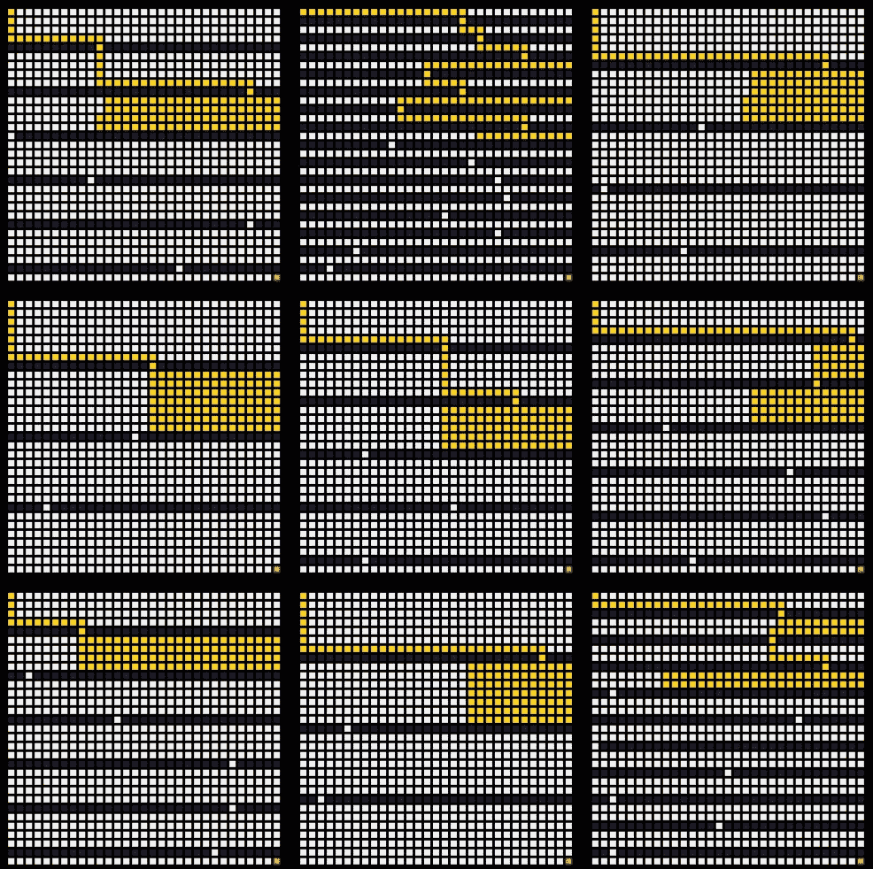
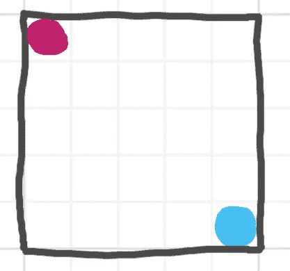
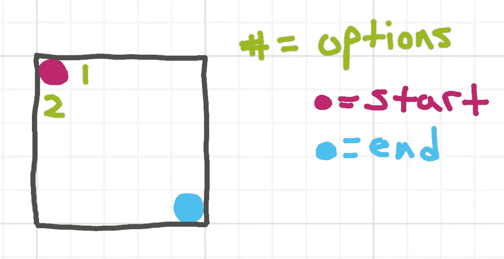
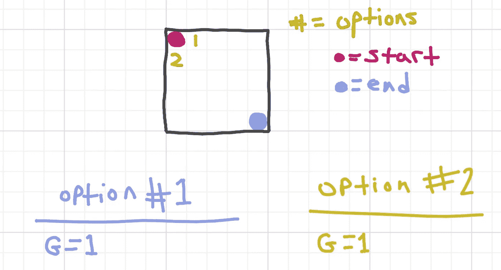
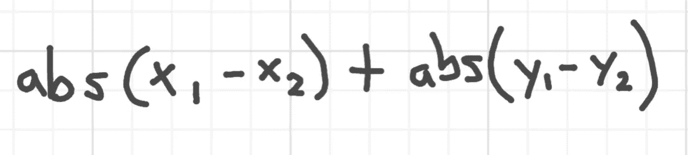
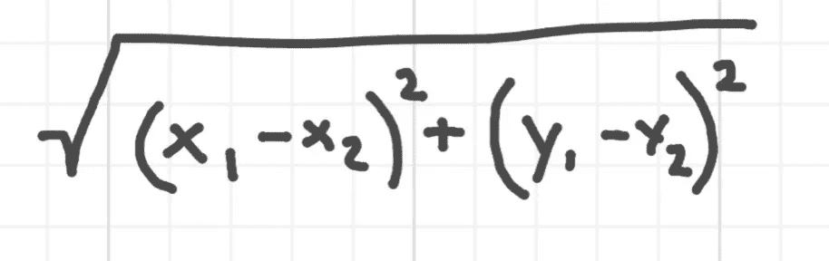
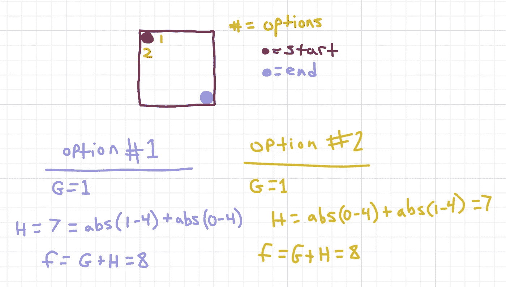
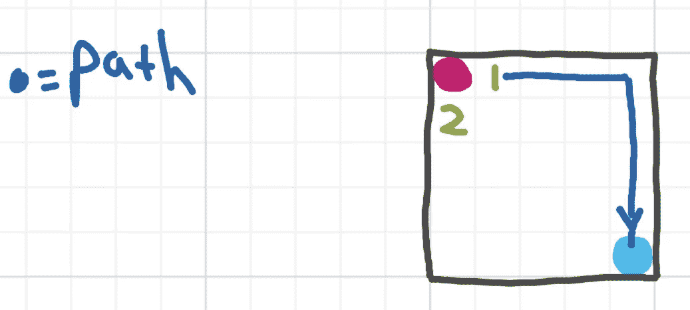
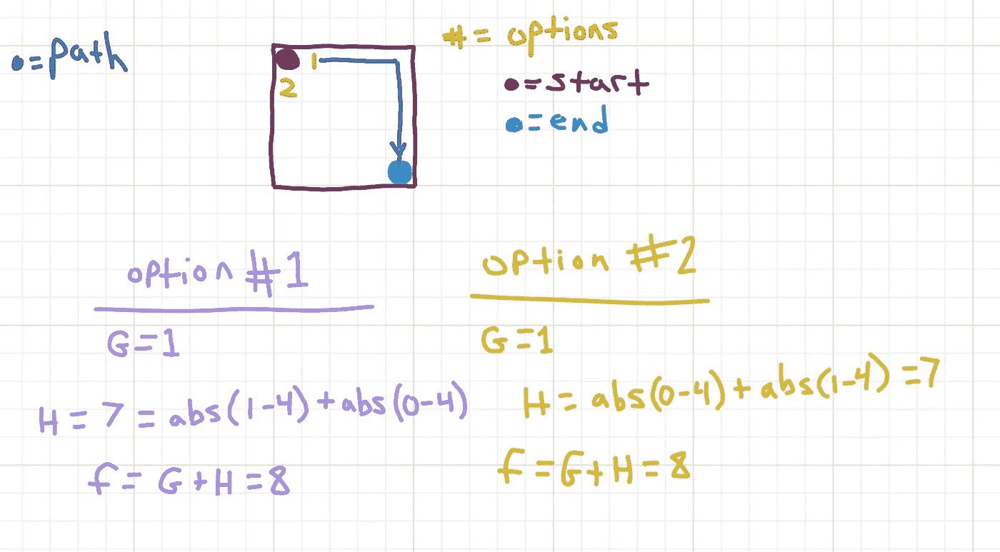

# A*算法— Ruby

> 原文：<https://levelup.gitconnected.com/a-algorithm-with-visualization-ruby-24f7f8b27e6e>

算法中间过程

# 形象化

# 什么是 A*？

像大多数算法和数据结构一样，它有许多使用案例和用途，但在大多数情况下，它是一种流行的寻路算法，对加权和非加权结构都有效。

它不总是最快或最有效的方法，但它几乎总是比 Lee 的算法更快和更有效，Lee 的算法是实现最佳路径的最直接的强力方法。

A*很重要，因为它就像现代最佳路径应用的面包和黄油。80%的情况下，它是最快和最有效的路径方法，同时对于开发人员来说也是相对直接的构建方法。

# **路径比你想象的更容易接近**

当我们走过迷宫时，其中的过程和决策并不复杂。我们有一个起点和一个终点。我们从起点开始，移动到相邻的单元。重复这个过程，直到我们到达终点。

在这些步骤中的任何一点，我们都可以决定如何继续。如果我们将相邻的选项放入一个队列中，我们可以强制进行广度优先搜索。

如果我们将相邻的单元放入一个堆栈中，我们可以使用它进行系统的或深度优先的搜索。

或者，我们可以根据一些观察或计算，启发式地对相邻选项进行排序。改进的潜力是无限的。毫无疑问，即使是最好的算法也可以进一步改进，所需要的只是一颗好奇的心，投入到推动我们认为可能的边界上。

# A*是如何工作的？

简而言之，A*的工作原理是基于以下等式对下一个可能的步骤进行启发式排序:

# **F = H+ G**

其中 **G** 是从起点到当前像元的精确距离成本。

并且 **H** 是从当前单元到终点的估计成本。

F 是在路径中的每一点继续进入任何特定单元的近似成本。

该算法将每个相邻的选项按其价格顺序推入堆栈，最贵的选项放在最前面。这样，当执行搜索时，从堆栈顶部弹出的项总是开销最小的选项。

如果阻力最小的途径陷入僵局，它只会回到更昂贵的选择。

有几种不同的方法可以计算每个变量。并不是所有的方法都非常有效。一些方法包括丢弃空间和时间效率以获得每个单独单元的精确试探法，这将改进搜索时间，减少设置时间。

在这个演示中，我传递 G 到当前单元格的准确距离，然后计算 h 的曼哈顿距离。

# **例如**

假设我从这个网格开始，红色是起点，蓝色是终点。

第一步，相邻单元格是我的选项。

在第一步中，我的两个选项有相同的 **G** 值，因为除了像这样将一个步骤移动到另一个步骤之外，没有其他选项。

由于我的网格使用了 4 个方向的限制，我将使用曼哈顿距离方程来获得每个选项的 T2 H T3 值。简而言之，(x1 — x2)和(y1 — y2)加在一起的绝对值。

如果你使用 8 个方向的限制，你必须使用欧几里德距离公式来计算每个选项的 **H** 值。

我的选项 1 的坐标为[1，0]，终点为[4，4]，我的选项 2 的坐标为[0，1]，终点仍为[4，4]，因此我的选项成本如下:

因为我们的选项都有相同的值，所以它们都将被推入堆栈，程序将取出最上面的一个并从那里继续。由于我们的迷宫没有障碍，并且是一个完美的立方体，因此任何一条路径都将是最佳路径，但是由于我们已经试探性地将项目放入堆栈，算法将只在其中一条路径上继续，而不会像这样回溯:

在每一步中，它仍然会考虑相邻的选项，但是由于我们的迷宫是一个没有障碍的完美正方形，途中的每个选项都将继续具有相同的 **F** 值，因此它将以直接的方式继续。

当我们引入障碍时，积极的结果变得更加明显(见上面的视频)，但即使在这个小网格中，我们至少可以确定我们的算法确实找到了几个等价的最佳路径之一，并且它采取了直接的路线到达那里，而没有检查整个网格(这是 Lee 算法会做的)

# **结论**

A*是一种高效、有效且实用的最佳寻路方法，它通过在每一步做出小决策来实现。

我认为一个明显的改进方向是，如果迷宫中的检查点可以有效地确定，我们可以对每个检查点分段运行 A*算法，这将导致更有效的搜索。

好了，这就是我今天的全部时间。快乐学习。

 [## 碰撞克星/星形算法-可视化

### a 星算法可视化。通过创建帐户，为 Clashbuster/A-star 算法可视化开发做出贡献…

github.com](https://github.com/Clashbuster/A-star-algorithm-visualized) 

计算