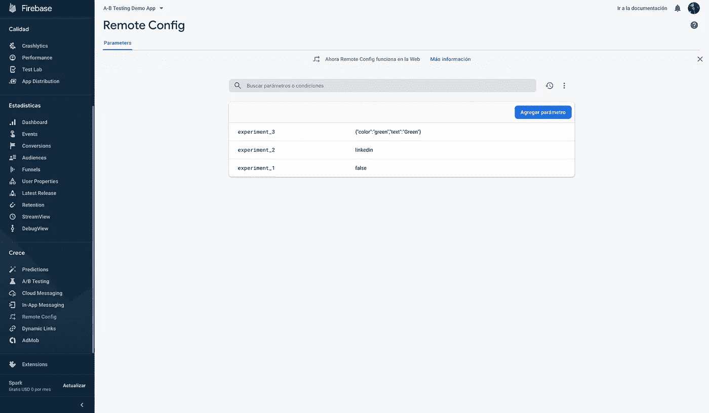
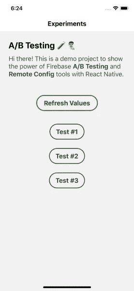
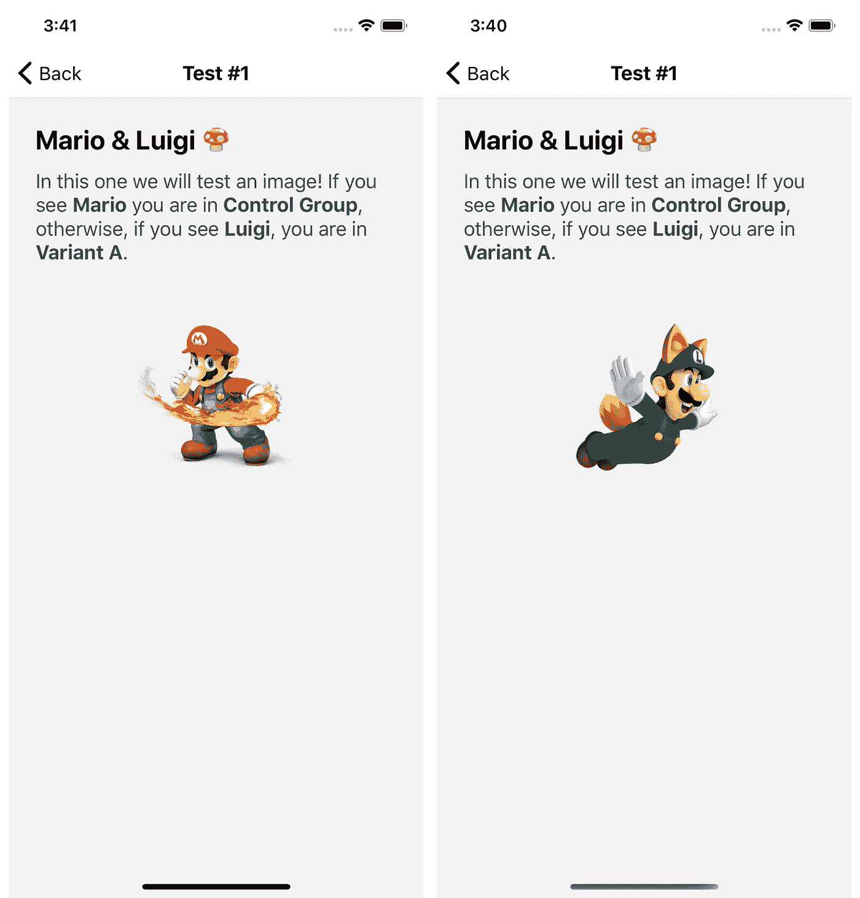
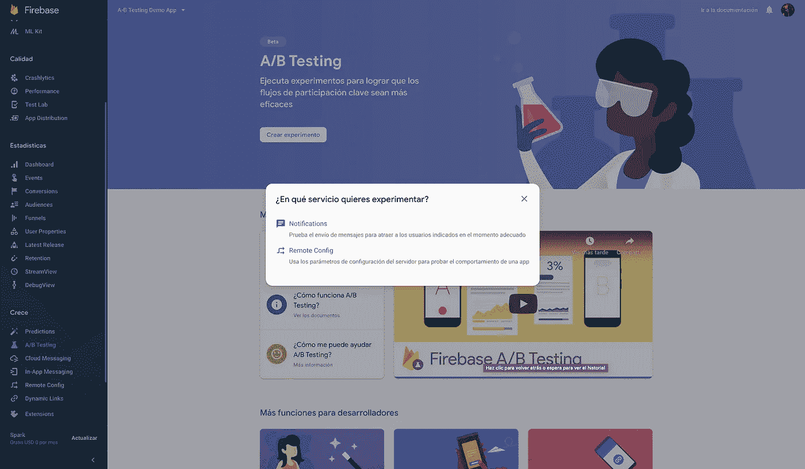
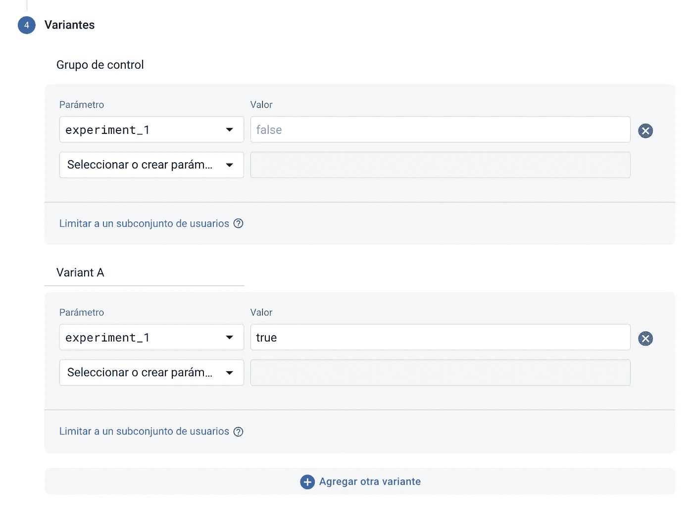

# React Native 中的 A/B 测试从未如此简单:Firebase 就在这里

> 原文：<https://levelup.gitconnected.com/a-b-testing-in-react-native-has-never-so-easy-firebase-is-here-67836a35e0d3>

实验

首先，**什么是 A/B 测试实验**？如果你到了这里，你可能已经有了一个想法，但为了以防万一，让我们来解释一下:

> **A/B 测试**是一种用户体验研究方法，由两个变量 **A** 和 **B** 的随机实验组成。是一种比较单个变量的两个版本的方法，通常是通过测试一个**受试者对变量 A 和变量 B 的反应**，并确定两个变量中哪个**更有效**。另一种说法是使用术语**分割测试**，尽管后者指的是具有两个以上变量的测试。”

好了，现在我们可以说 A/B 测试只有**两个变量**，而分割测试有**两个以上的变量**。很好，但是现在:*我该如何开始实验呢？*

有很多简单的方法可以将实验构建到网络环境中，但是在**React Native****Apps**中就不那么容易了。我们面临一个问题——发布。幸运的是我们还有选择，其中之一就是 [**Firebase**](https://firebase.google.com/) 。

> **Firebase** 是一个位于云端的移动和 web 应用开发平台，与 Google 云平台集成，使用一套工具进行项目的创建和同步。

Firebase 提供了两个我们将会用到的特性。其中一个是**“远程配置值”**，它只不过是 Firebase cloud 中的变量，我们可以从我们的应用程序中访问；另一个是**“A/B 测试”**工具，它将负责划分用户，并根据需要更改每个用户的远程配置变量值。在我们的应用程序方面，**我们将简单地负责根据变量**的值来调节代码，就这么简单。

# 1.装置

为了在我们的 React Native 应用中实现 Firebase，我们必须安装[**@ React-Native-Firebase/app**](https://www.npmjs.com/package/@react-native-firebase/app)，然后，再安装一个额外的库来使用“远程配置”功能[**@ React-Native-Firebase/Remote-Config**](https://www.npmjs.com/package/@react-native-firebase/remote-config)。在本文中我就不赘述安装和初始配置了，因为在官方文档中有很好的解释: [**App 快速启动**](https://invertase.io/oss/react-native-firebase/v6/app/quick-start) 和 [**远程配置快速启动**](https://invertase.io/oss/react-native-firebase/v6/remote-config/quick-start) **。**

# 2.创建方法

我强烈建议在我们的 **"/src"** *(如果你还没有)*中创建一个 **"/services"** 文件夹，用可重用的方法或钩子来定位这个和其他文件。因此，我们将有类似于"**src/services/firebase . js "**的东西，在这里，我们将有三个方法:

Firebase 远程配置挂钩示例

如您所见，我们有一个" **fetchConfig()"** ，它将负责使用" **setConfigSettings()"，**设置初始配置，并使用 **"fetchAndActivate()"** 从 Firebase 获取值，它应该在" App.js "、" Index.js "或我们应用程序中的某个初始位置运行一次。请注意，它不需要异步，但是如果您想在成功获取值时对它们做一些事情，这是一个很好的选择。

我们还有一个**“refresh config()”**，它将用于重新获取值。这是必要的，因为如果我们激活一个实验，而用户从来没有重新打开应用程序，新的值永远不会被提取。(理想情况下，它应该运行在我们的应用程序被刷新的地方)。

最后，我们有一个 **"getRemoteValue()"** ，它接收一个" key "(远程配置变量名)并返回值。请注意，它不获取任何东西，它只是访问之前在我们的 **fetchConfig** 和 **refreshConfig** 中获取的值。

# 3.创建远程配置值

Firebase 控制台(远程配置)

正如你所看到的，这就像去 **Firebase** > **远程配置** > **添加参数>** 写**键*(名称)*** 和**值>发布更改**，瞧！我们有一个远程配置变量。

请记住，对于本文，我将创建一个名为" **experiment_1"** 的变量，它将是一个*布尔值*，其值将是 ***false***

# 4.获取和访问远程配置值

正如我之前在《T21》中所说的，我们创造了三种方法，但是现在我们必须利用它们。为此，我将在 App.js 中展示一个示例:

App.js 中的示例

我们只是做了几件事，但总而言之:

*   我们执行我们的 **fetchConfig** 方法来初始化设置和获取值。
*   我们向用户显示一个“刷新值”按钮(来执行我们的 **refreshConfig** ，但是我稍后会向您展示)。
*   我们用 **React Navigation** 设置了三条路线，将用户带到另一个实验屏幕。

所有这些看起来是这样的:

App.js(截图)

我们必须访问值，所以我将在测试#1 中向您展示一个示例(我不会显示所有的测试屏幕，以免文章太长，但我在这里将 repo 留给您，以防您希望看到它完成)。

让我们继续测试#1:

Test1.js 中的示例

这里我们只是对一个图像进行条件化，如果实验**为真**，我们显示**路易吉的图像**，否则，我们显示**马里奥的图像**。为此，我们从**远程配置**中访问**"实验 _1"** *(这是一个布尔值)*，并将其值保存在常量"**实验"中。**现在根据**【实验】**来调节渲染就这么简单。

看起来是这样的:

但是等等！对于现在你总是看到马里奥，因为**【实验 _ 1】**对于大家来说是 ***假*** 。现在我们必须在 **Firebase** 中创建一个 **A/B 测试实验**来处理这个问题。

# 5.创建 A/B 测试实验

此时，我们只需转到我们的 **Firebase 项目** > **A/B 测试** > **创建实验** > **远程配置**并开始填写表单。在这里，我们可以配置参与我们实验的用户百分比**、**激活事件**和**变量**。对于变量，您会注意到，我们必须选择我们的远程配置变量，我们将始终有一个名为“控制组”的变量，在实验中我们可能会也可能不会更改它。然而，理想的方法是保持这个变体不变，并开始在以后的变体中修改它，就像这样:**

所以现在，我们只需要点击**“开始实验”**就可以了，Firebase 会对我们的用户进行划分，每个用户都有一个特定的远程配置值变量，在这种情况下，可以是**控制组*(假)*** 或**变量 A *(真)。***

# 6.刷新远程配置值

还记得**刷新配置**按钮吗？很好，在这里:

它只是负责运行我们的 **refreshConfig** ，，重新获取所有远程配置值。这很有用，因为如果我们在我们的应用程序中，并且我们激活了一个实验，如果我们不关闭和打开我们的应用程序，我们将不会看到它的运行，但是这个按钮解决了我们的问题。(在生产应用程序中，在我们的应用程序重新加载时运行它是有意义的)。

这就是我们在我们的 **React 原生应用**和 **Firebase** 中进行 A/B 测试实验的方式！

我推荐你阅读 Firebase 的官方文档，在那里你可以找到很多关于远程配置和 A/B 测试的内容。除了 [React Native Firebase](https://invertase.io/oss/react-native-firebase/) 和 [React Native Firebase 远程配置](https://invertase.io/oss/react-native-firebase/v6/remote-config)的官方文档。

最后，我把这些代码和更多的代码留在这里: [fbrn-ab-testing-demo](https://github.com/fervailanti/fbrn-ab-testing-demo) 。看一看！

感谢阅读…🙏