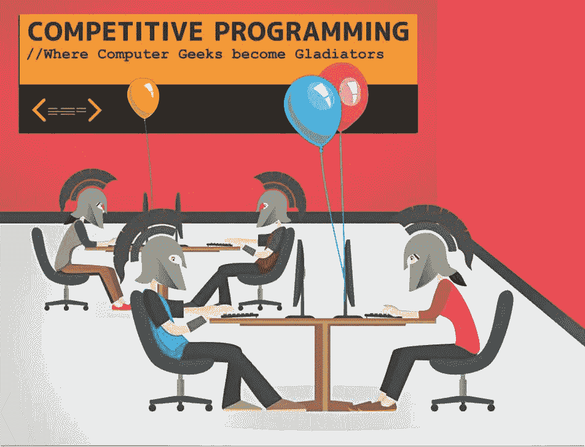
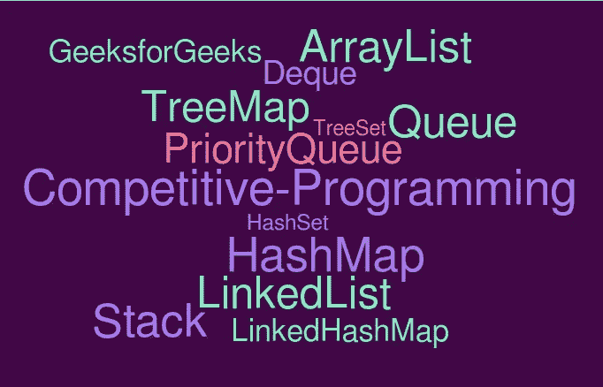
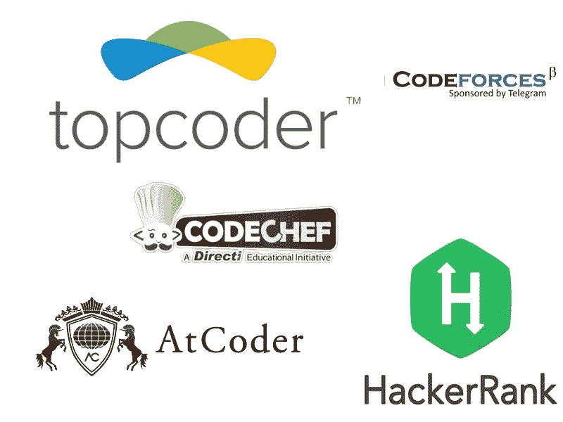
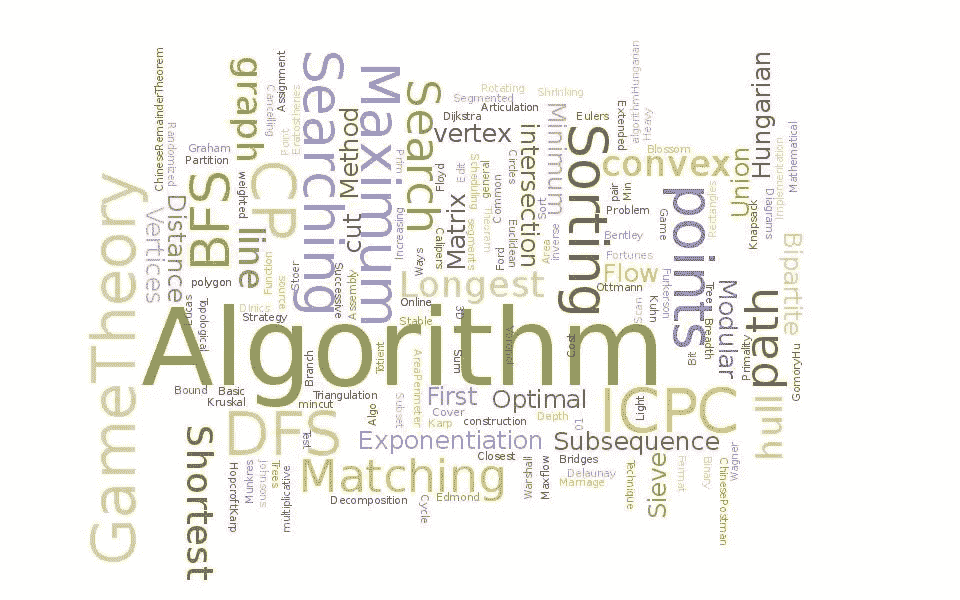

# 竞争性编程初学者指南

> 原文：<https://levelup.gitconnected.com/a-beginners-guide-into-competitive-programming-a63e49b38f69>

# 那是什么？

这是一项脑力运动，你被给予一些问题，并被要求运用你的编程技巧在各种限制下给出一个优化的解决方案。这项运动测试你的逻辑思维，分析思维，模式识别，压力处理，最重要的是你的数据结构和算法知识。

# **我为什么要这么做？**

1.  这是一种极好的精神锻炼
2.  它提高了解决问题的技能
3.  你将习惯于处理具有挑战性的问题。
4.  当你的代码被接受时，你所体验到的肾上腺素激增是惊人的。(不信我这一套！亲身体验！)
5.  每个公司都有一个编码测试，需要对数据结构和算法的良好知识，而竞争性编程是关于 ds 和 Algo 的。

**但是我想成为一名开发者！**

竞争性编程教授将问题分解成小块并为它们制定可行的解决方案的艺术。

此外，为了发展，一个人需要学习一门新的语言(JS，CSS，Django 等)。).人们可以从学校教授的基本语言(C++、JAVA、Python)开始竞争性编程。

# 入门指南

1 **学习一门编程语言:**

一些最常用的竞争性编程语言是 C++，Java，Python。虽然 Python 简单易学，但它是一种相对较慢的语言。有些比赛甚至不允许 python。

Java 也是一些人的首选，但是 Java 代码比较长。此外，你可能会得到 TLE(时间限制超过)在某些情况下，由于缓慢的时间限制方面。

C++是 Python 和 Java 中速度最快的，可以与 C 相媲美。C++提供了一个非常强大的库 STL(标准模板库),对于有竞争力的程序员来说，这使得许多事情变得很容易。(例如。用于分类、搜索的预定义功能；向量、集合、地图、对等。)

学习语言和库的高级概念，这将使你的生活更容易(例如 C++中的 STL 库)。一篇详细介绍 C++库及其用法的详尽文章将很快发布。

2 ***开始练习，参加比赛:***

作为初学者，开始在 Hackerrank 上解决问题求解。按照从容易到中等到困难的顺序，涵盖诸如实现、字符串、排序、搜索、贪婪、位操作等主题。试着得到 6 颗星，你会开始觉得你学到了很多新东西。您的代码长度将会减少，并且您将开始编写更高效的代码。

同时，参加 Codechef 和 Codeforces 等网站上的竞赛，因为它们是学习一些新概念的好方法。开始时，你可能会发现问题的语言有点难以理解，但经过一些争论后，你会习惯的。

此外，不要忘记解决你在竞赛中无法解决的问题。

**从 hackerrank ad 开始尝试在那里获得至少 4 颗星(** [**链接**](https://www.hackerrank.com/domains/data-structures?badge_type=problem-solving) **)。对于初学者来说，这将是一个很好的起点。**

3 ***学习数据结构和算法:***

在练习和参加竞赛时，接触数据结构和算法。

这是你学习如何使你的程序更有效的最重要的部分。对数据结构有很好的了解将有助于你为一个问题选择最佳的数据结构

4接下来呢？

从这里开始，每个人都有自己的旅程。

一些人喜欢虚拟竞赛来获得好的实践，一些人基于评级来过滤问题并解决它们。

代码强制 div 2 和 div3 的前 3 个问题是基于数学和观察的。如果一个人需要快速进步，就需要快速解决问题。

为了练习，我所做的是过滤掉比我当前评分高 100-150 分的问题，然后练习它们。

理想情况下，每天 3-4 个问题对于保持敏锐的编程技巧是必要的。

如果一个人有空闲时间并且刚刚开始，每天 8-10 个问题是必要的。

页（page 的缩写）永远不要失去动力，这不是短跑，而是马拉松。糟糕的一天并不意味着你一无是处。做到这一点，我相信任何有解决问题诀窍的人都会爱上这项美丽的运动！

# 一些该做和不该做的事情:

1.  在任何平台上练习时， ***不尽全力就不要去看解答/社论。*** 偷窥解决方案对你没有任何好处。总是尽最大努力找到解决问题的方法。即使过了一两个小时，如果你还是无法找到解决方案，那就看看社论/讨论，试着彻底理解代码，然后自己实现它。
2.  比赛结束后，总是努力解决你在比赛中无法解决的问题。这是真正学习的开始。看社论和讨论。
3.  不要犹豫 ***大赛后看看其他人/朋友的解答*** *。也许你朋友的方法比你的更好。*
4.  阅读 Codeforces 上由高评价程序员写的博客。你肯定会从他们身上学到很多东西。
5.  **不坚持只是太容易的问题。*走出自己的舒适区，挑战自我。开始解决推动你的问题。*
6.  *交一个同样享受 CP 的朋友的公司，和他们良性竞争。和他们讨论你的疑惑(显然不是在比赛期间)。*
7.  *不用担心各种编码平台的评分。与其关注你的成长，不如关注你的成长。 专注学习，你的评分会自动提高。*
8.  *如果你在比赛中表现不好或者不能解决问题，不要灰心丧气。它发生了。从你的错误中吸取教训，尽量不要再犯。*
9.  *竞争性编码更多的是实践。成为这方面的大师需要时间。所以 ***永远不要放弃*** (除非你不喜欢做这件事)，永远不要自我怀疑。*