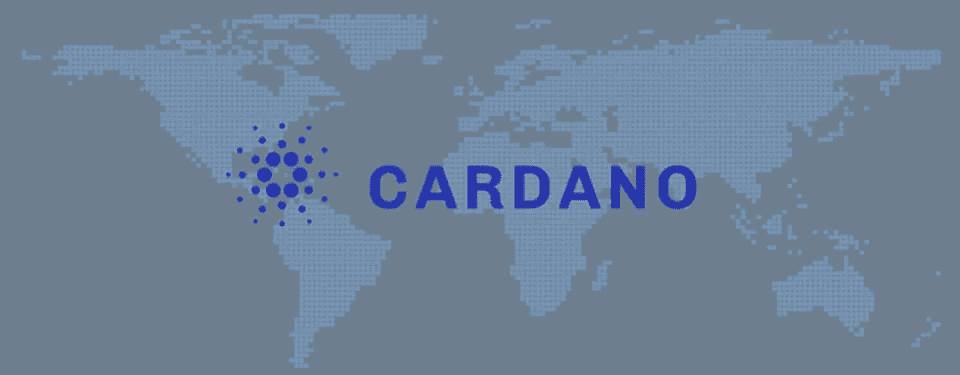
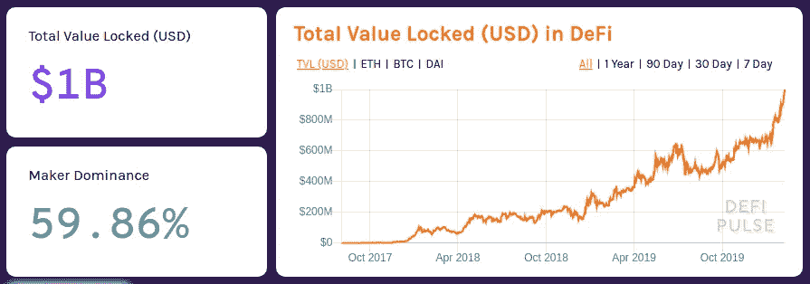
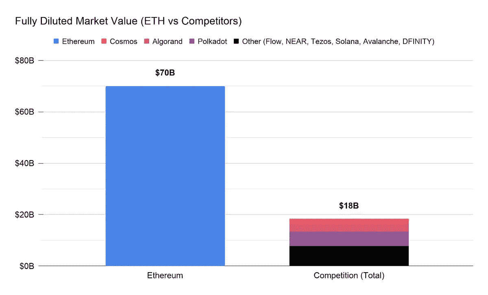

# 卡尔达诺初学者指南

> 原文：<https://levelup.gitconnected.com/a-beginners-guide-to-cardano-a3fbbb3be243>

简要介绍旨在取代以太坊成为区块链基础设施层的“第三代”区块链平台。

自 2020 年夏天以来， [DeFi assets](https://medium.com/the-capital/intro-to-defi-b4ab2ec0f156) 借助最近一轮比特币牛市的东风，出现了爆炸式增长。然后在 2 月初，DeFi 项目超过了锁定的 10 亿美元总价值的里程碑。鉴于大多数 DeFi 项目建立在以太坊的基础设施之上，以太坊似乎进一步巩固了其作为默认区块链提供商的主导地位。然而，不断增长的需求导致的网络拥堵，以及与以太坊网络互动的高油价，使以太坊的可扩展性再次受到质疑。

来源:[除颤脉冲](https://defipulse.com/blog/1-billion-tvl-in-defi/)

Cardano 是一个利益相关的区块链平台，旨在解决遗留在比特币和以太坊等区块链项目中的性能和可扩展性问题。它经常被称为“以太坊黑仔”，但在我们讨论它取代以太坊的潜力之前，让我们更深入地了解这项技术和即将到来的路线图。

# 什么是卡尔达诺

Cardano 是一个区块链平台，由 Charles Hoskinson 于 2015 年创立，他是以太坊的早期开发者之一，也是 BitShares 的联合创始人。Cardano 的一个显著特点是它专注于透明的研究和基于证据的开发。事实上，这是第一个接受同行评审的[区块链项目](https://medium.com/chainrock/cardano-peer-reviewed-blockchain-for-the-thrid-generation-analysis-review-8c697a619bce)。

卡尔达诺这个名字是为了向意大利数学家吉罗拉莫·卡尔达诺致敬。卡尔达诺的本土资产阿达是以阿达·洛芙莱斯的名字命名的，他通常被认为是第一批计算机程序员之一。像以太一样，ADA 既是数字令牌，也是在 Cardano 网络上进行交易的手段。最大 450 亿 ADA 供应量中约 57.6%分布在 2017 年 ICO 中。

Cardano 的开发由三个独立的组织监督:

*   [**卡达诺基金会**](https://cardanofoundation.org/) :监督管理整体项目，主要负责卡达诺品牌的合伙社区和法律方面
*   [**IOHK**](https://iohk.io/)**:**负责卡达诺区块链的开发
*   [**【Emurgo】**](https://emurgo.io/):专注于推动 Cardano 的采用，并支持开发者社区构建解决方案

# 卡尔达诺建筑

Charles Hoskinson 将 Cardano 描述为第三代区块链，比特币和以太坊则是第一代和第二代区块链:

1.  第一代区块链比特币证明了一个去中心化网络的概念，它能够在没有可信第三方的情况下验证交易。
2.  像以太坊这样的第二代区块链引入了智能合约的概念，程序可以在满足某些条件的情况下完成交易。

虽然比特币作为数字黄金在机构中的采用以及 DeFi 应用的持续兴起证明了这些较老的区块链网络的成功，但它们并非没有问题。Hoskinson 主要将它们归类为可伸缩性、互操作性和可持续性问题。

*   **可扩展性:**目前，比特币和以太坊每秒只能处理 5–15 笔交易(TPS)，因为每个完全参与的节点必须处理每笔交易才能达成共识。因此，网络不能通过简单地添加更多资源(例如，向网络添加新的验证器)来扩展。此外，随着区块链的增长，它开始意识到需要压缩或删除旧数据。
*   互操作性:尽管我们已经将比特币和神谕包装起来，以帮助它们在各种区块链网络之间架起桥梁，但我们在区块链领域和传统金融世界之间仍有脆弱的联系。像比特币基地这样的集中交易所目前弥补了这一差距，但整合仍然不是无缝的。
*   **可持续性:**区块链项目的治理模式很差，其中的争议导致了 hardforks(例如以太坊经典、比特币现金)。这进一步加剧了互操作性问题。此外，除了大型 ICO 或风险投资活动，各种项目都在努力寻找可持续的方式来发展生态系统，并进一步投资于基础设施。

卡尔达诺旨在通过以下方式解决这些问题:

1.  卡尔达诺采用分层区块链架构，由[卡尔达诺沉降层(CSL)](https://why.cardano.org/en/introduction/designing-in-layers/) 和[卡尔达诺计算层(CCL)](https://why.cardano.org/en/introduction/cardano-computation-layer/) 组成。CSL 处理交易(即爱丽丝给鲍勃发送了多少)，而 CCL 为基础设施提供部署智能合同的能力(即爱丽丝应该在什么条件下向鲍勃发送资产)。Cardano 选择将发送机制(令牌流)和交易背后的条件分开，不像以太坊那样将两者捆绑在一起。
2.  卡尔达诺使用[大毒蛇共识协议](https://eprint.iacr.org/2016/889.pdf)基于利害关系的证据，而不是工作的证据。这允许被称为槽领导的选定节点组验证事务，而不是让每个节点验证所有事务。根据赌注的大小，从赌注池(ADA 令牌持有者)中随机选择槽头。利益相关者将获得 ADA 令牌来验证交易。此外，计划将一部分块奖励保留到卡达诺国库，以资助各种项目来改善生态系统。
3.  最近发布的[大毒蛇九头蛇](https://cardanojournal.com/hydra-cardano-scalability-solution-46)引入了利益证明系统的切分。这允许随着新节点的增加而增加吞吐量。据报道，[九头蛇交付了 1000 TPS](https://www.altcoinbuzz.io/reviews/altcoin-projects/cardano-vs-algorand-the-ultimate-comparison/)，比 2017 年卡达诺测试时的 257 TPS 有了大幅提升。
4.  为了与其他区块链互动，Cardano 支持 [KMZ 侧链](http://fc16.ifca.ai/bitcoin/papers/KLS16.pdf)。这使得资金可以从 CSL 转移到 CCL 以及支持该协议的其他区块链。
5.  最后，Cardano 有一个[硬分叉组合器](https://docs.cardano.org/en/latest/explore-cardano/what-is-a-hard-fork-combinator.html)，允许硬分叉之间的平滑过渡，没有中断。比如 2020 年从拜伦联邦模式到雪莱分散模式的硬分叉升级，之前链条的历史平滑过渡到新链条，没有一个根本的重启点。

想了解更多关于卡尔达诺的愿景和建筑的细节，请看这段来自查尔斯·霍金森的精彩视频:

# 卡尔达诺路线图

卡尔达诺是一个正在进行的项目，路线图分为五个时代，即:拜伦，雪莱，高更，巴绍和伏尔泰。在撰写本文时(2021 年 2 月)，Cardano 仍处于 Shelley 阶段，预计将于 2021 年 3 月推出 [Goguen mainet。](https://www.newsbtc.com/news/cardano/new-cardano-roadmap-puts-march-2021-date-for-goguen-mainet-rollout/)

*   **Byron**:Byron era 于 2017 年 9 月发布，专注于 Cardano 的基础组件。这实现了联合大毒蛇共识协议，支持 ADA 令牌的转移，并提供了一个 Cardano 专用的钱包来保存令牌(代达罗斯、约罗伊钱包)
*   **Shelley**:Shelley hard fork 于 2020 年 7 月推出，开始提供赌注奖励，以从联合大毒蛇过渡到分散模式。
*   **Goguen:** Goguen update 将智能合约引入 Cardano 网络。Cardano 希望通过它的 Marlowe 语言提供一个伟大的开发者社区来激发更多的 DApp 创作。Cardano 也有望支持与其他语言编写的现有智能合同的互操作性。
*   **Basho:** 这个时代的焦点是优化网络以扩大规模。建议的功能包括侧链，将与主卡达诺链以及并行会计风格互操作。
*   Voltaire :最后的时代将关注可持续发展计划，包括投票和财政系统。

# 卡尔达诺评论

通过专注于严格的研究，卡尔达诺决定采用一种缓慢渐进的推广模式。Cardano 的支持者认为这是一个竞争优势，使他们能够可靠地测试大规模的技术，而批评者指出以太坊在 DeFi 生态系统中日益增长的领先地位。从完全稀释的市值数字来看，以太坊明显领先于所谓的以太坊杀手。尽管如此，作为一个迄今为止尚未支持智能合约的项目，Cardano 在总市值方面一直位列[前 6 名。](https://coinmarketcap.com/)

来源:[比特币基地](https://blog.coinbase.com/around-the-block-10-eth-killers-and-new-chains-a712c04c344f)

接下来的问题是，卡尔达诺的卓越技术是否足以超越以太坊的先发优势以及它迄今为止在基础设施、社区和资金方面的巨大领先优势。纵观历史，我们一次又一次地看到，单靠最好的技术不足以赢得市场。跟踪以太坊 2.0 的推出，以及 Cardano 如何在高油价和拥挤的网络中成功地吸引开发人员和用户离开以太坊将是一件有趣的事情。

*免责声明:本帖并非投资或财务建议。这里表达的所有观点都是我自己的。*