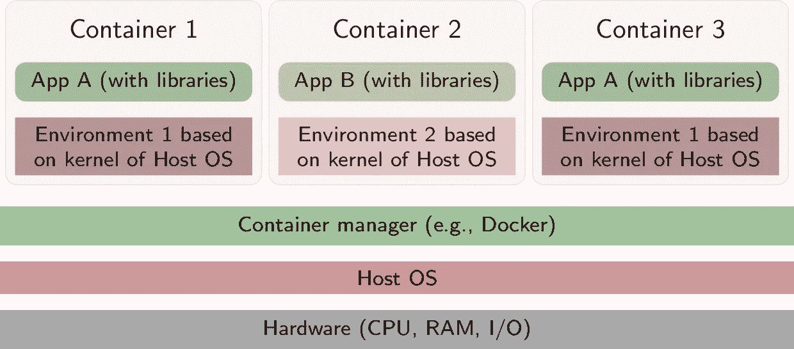

# 码头工人入门指南

> 原文：<https://levelup.gitconnected.com/a-beginners-guide-to-docker-3167e635f857>

# 介绍

docker——一段时间以来，这是科技行业的一个流行词，也是一个最初需要处理的令人生畏的概念。在本文中，我们将探索 Docker 是什么，为什么我们需要它，以及我们如何在 Docker 容器中运行一个基本的 Golang 服务器。所以，让我们开始吧。

## Docker 是什么？

Docker 只是一个生态系统，它为我们提供了一套服务和工具来帮助运行和管理容器。

那么，什么是容器呢？
根据 docker.com、**的说法，“容器是一个标准的软件单元，它将代码及其所有依赖项打包，以便应用程序能够快速可靠地从一个计算环境运行到另一个计算环境”**。
这意味着 docker 容器为你提供了一个打包了你的应用、库、二进制文件和设置的包，这样它就可以在任何与主机 OS 隔离的系统上独立运行。

## 为什么是 Docker？

1.  **无单点故障** —我们都曾遇到过这种情况，一个微小功能的错误会使整个应用崩溃，其功能甚至与其无关，即单点故障。Docker 帮助你避免这种情况。您可以将一个巨大的单片应用程序分解为多个微服务，从而帮助您更轻松地进行部署。
2.  **“在我的机器上工作”综合症**——有没有 npm 包因为你在系统中进行了全新安装而开始表现怪异？或者有人在应用程序中硬编码了一个目录，它无法在您的云上工作。在使用敏捷方法开发的大型团队中经常听到这个术语。Docker 容器带有一个隔离的环境，如果它在容器中工作，那么它在任何地方都可以工作。
3.  **可伸缩性** —借助于诸如 Kubernetes 或 swarm 之类的编排服务，容器可快速伸缩，这些服务可帮助 it 快速创建和销毁容器的多个副本。
4.  **Docker 支持操作系统级别的隔离**——多个容器可以在单个操作系统上运行，而虚拟机可以在操作系统的不同副本上运行它们的隔离环境。容器与其他容器共享系统内核，使它们更快。

参考下图——每个容器在内核之外都有一个隔离的空间，所有容器共享主机的 OS 资源。



## 我们的应用

出于本教程的目的，让我们考虑一个服务于 HTTP 请求的简单 Go 应用程序。下面的代码展示了这一点的实现，其中一个简单的服务器接收 HTTP 请求，并用一条消息进行响应。

上面的代码片段可用于服务一个 GET 请求，该请求发送一个“hello world”的 JSON 响应。

上述代码中的主要功能有两个目的:

1.  处理 GET 请求。
2.  监听端口 8080 上的活动请求。

Go 附带了一个标准的内置`net/http`包，我们将使用它来实现上面列出的功能。

注意——如果你是新手，或者如果你想更好地理解 Golang 的概念，我强烈推荐阅读这本书
[https://github.com/karlseguin/the-little-go-book](https://github.com/karlseguin/the-little-go-book)

## 容器化我们的应用程序

下一步是用我们选择的配置在一个隔离的容器中运行我们的应用程序。

通常，容器包含一个进程或一组进程，这些进程有一组专门分配给它们的资源。它拥有分配给该特定进程的物理资源子集。

为了在容器中运行我们的 go 应用程序，我们需要创建一个 **Docker 映像**。

docker 映像是在容器中运行我们的应用程序所需的文件中的一组指令，映像包含在 Docker 文件的不同步骤中创建的多个层。

docker 图像可以通过创建一个名为“ **Dockerfile** ”的无扩展名文本文件，并将其放在我们应用程序的根目录中来创建。下面的代码显示了我们的 docker 文件。

当我们构建 docker 映像来创建一个容器时，Docker 文件中的每一行都会被顺序执行。以下是相同的步骤。

**步骤 1** —提取基础映像，为我们的应用程序创建一个环境。这是第一步，有助于确定基础层。对于我们的应用程序，我们选择基本图像为 alpine，因为与其他基本图像(如 Ubuntu 或 Debian)相比，该图像的大小较小。根据您的应用需求，您可以选择不同的基础映像。
查看[https://hub.docker.com/search?q=&type = image](https://hub.docker.com/search?q=&type=image)获取可用图像。
**步骤 2** —设置我们的应用程序可以驻留的工作目录，您可以创建额外的目录来启用缓存。
**第三步** —将我们 app 的源代码复制到工作目录中。
**第 4 步** —构建我们的应用程序以创建一个可执行文件(具体到 Go)。
**第 5 步** —设置一条命令，一旦容器启动，该命令将运行。

注意-“fig let”只是一个帮助打印文字横幅的程序。

## 建立我们的码头工人形象

docker build 命令帮助我们从 docker 文件构建 docker 映像。

```
docker build -t simple-web-server:v1 .
```

这将创建一个名为 simple-web-server 的映像，其标签为 v1，如果我们在创建 docker 映像时没有指定标签，docker 将假定该标签为“最新”。

docker build 的典型用法如下所示:

```
docker build [OPTIONS] PATH | URL | -
```

要深入理解构建命令，请点击链接-
[【https://docs.docker.com/engine/reference/commandline/build/】](https://docs.docker.com/engine/reference/commandline/build/)

## 运行我们的 Docker 容器

```
docker run -p 5000:8080 simple-web-server:v1
```

一旦我们运行了上面的命令，容器就开始执行 docker 文件中指定的命令(在我们的例子中，运行我们的 go 应用程序的可执行文件)。这也在容器中创建了一个可写层，我们对容器的所有新更改都将驻留在这个层中。一旦容器被删除，可写层也会被删除。这种行为的主要用途之一是，从同一个映像创建的多个容器可以用不同的状态存储不同的数据。

因为容器是用它们自己的一组端口和分配的资源隔离的，所以我们不能从主机直接访问它们。命令中的**“p”**标志有助于将我们主机的端口映射到运行应用程序的容器的端口。对于我们的应用程序，由于我们使用主机端口 5000，我们将能够通过端口 5000 访问我们的应用程序。

一旦执行了 run 命令，请访问— [http://localhost:5000/](http://localhost:5000/) 查看作为 API 响应的“hello-world”消息。

要查看与运行命令相关的其他标志或深入参考，请查看官方文档—[https://docs.docker.com/engine/reference/commandline/run/](https://docs.docker.com/engine/reference/commandline/run/)。

## 其他有用的命令

1.  通过运行以下命令查看正在运行的 docker 容器

```
docker ps
```

2.查看系统中存在的所有容器，不管它们是否正在运行

```
docker ps -a
```

3.要释放主机的内存并删除所有现有的容器，请使用 prune 命令-[https://docs . docker . com/engine/reference/command line/system _ prune/](https://docs.docker.com/engine/reference/commandline/system_prune/)

# 结论

在本文中，我们介绍了容器化的基础知识，以及一个简单的 go 应用程序如何在容器中运行，同样可以扩展到运行几乎任何东西。
尽管这些概念只是触及了 Docker 世界的表面，但它们在开始使用分布式系统时变得必不可少。

应用程序的代码可以在
[https://github.com/puneeth8994/docker-with-go-server](https://github.com/puneeth8994/docker-with-go-server)上找到

**推荐阅读-** 1。[https://www . freecodecamp . org/news/a-初学者友好-入门-容器-VMs-and-docker-79 a9 e 3 e 119 b/](https://www.freecodecamp.org/news/a-beginner-friendly-introduction-to-containers-vms-and-docker-79a9e3e119b/)
2 .[https://github.com/karlseguin/the-little-go-book](https://github.com/karlseguin/the-little-go-book)