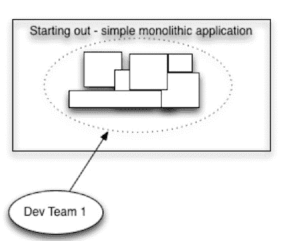
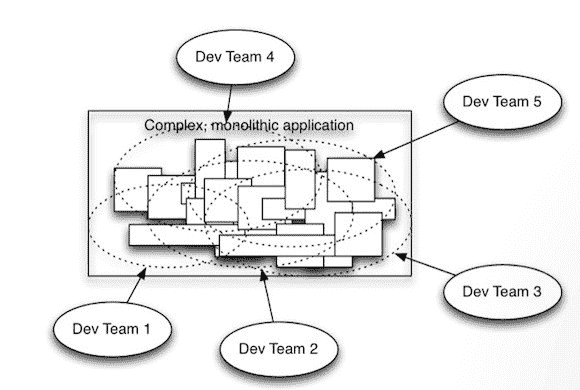

# 微服务初学者指南

> 原文：<https://levelup.gitconnected.com/a-beginners-guide-to-microservices-7510c931215d>

# 背景

在进入[计算机架构](https://www.computersciencedegreehub.com/faq/what-is-computer-architecture/)的世界以及它们的特性、优点和缺点之前，我们需要知道我们为什么要讨论它们。所有软件工程师和计算机科学家都需要使用一套规则、标准和程序来构建他们的代码，传统的方法是使用“[单片架构](https://whatis.techtarget.com/definition/monolithic-architecture)”。

那么，什么是巨石柱呢？

下图描述了一个简单的整体建筑。

然而，这种简单的架构不会持续太久。在软件开发的早期，只有那些拥有计算机和数学博士学位的人才有合适的技能来编写计算机代码。但是 60 年代, [BASIC](https://en.wikipedia.org/wiki/BASIC) 的发展降低了门槛，甚至不同系的非博士生也能编写代码。这导致了计算机应用的迅速扩展，从而增加了这种软件的规模和复杂性。

现在，更大的巨石看起来像这样:

计算机科学家试图用“[分而治之](https://www.tutorialspoint.com/data_structures_algorithms/divide_and_conquer.htm)法则来解决这种情况。

这是什么意思？

不同人的不同研究导致了这一过程的发展，其中一些论文包括:

*   David Parnas 在他 1972 年的论文“将系统分解成模块的标准”中引入了模块化和信息隐藏的概念
*   Edsger W. Dijkstra 在 1974 年的论文“科学思想的作用”中引入了分离关注的概念

这些论文以及其他人的研究导致了 70 年代的[模块化软件开发方法](http://www.kamilgrzybek.com/design/modular-monolith-primer/)，它可以被描述为“松散耦合”(意味着模块之间的依赖性应该非常低)和“高度内聚”(一个模块应该专注于单一或相似的功能)。

但是即使是模块化的方法也不能长久，因为软件子系统的软模块化边界很容易被跨越和误用。

在分析了不同的业务应用程序后，发表了“[大泥球](https://en.wikipedia.org/wiki/Big_ball_of_mud)”论文，根据这些论文，大多数业务应用程序因其整体架构而存在以下问题:

*   不受控制的增长
*   太多的责任
*   缺乏适当的架构
*   意大利面条代码
*   掩盖在地毯下的问题

随着互联网进入移动设备以及 WiFi 和智能手机的兴起，软件工程界发生了寒武纪大爆发。软件开始消费世界，各种行业领域，如银行、酒店、保险等开始使用软件进行运营。像脸书、推特、优步、网飞、Spotify**T3 这样的公司如雨后春笋般涌现，这增加了消费者对软件产品的依赖。**

随着软件消费者数量的快速增长和稳步增加，即使是代码或基础设施中的一个错误也会导致应用程序的彻底失败。一个例子是正在进行促销的在线购物门户。数以千计的用户蜂拥而至，以利用销售，该网站的服务器无法处理这样的流量增加，由于这一原因，整个网站关闭。由于这不是一个分布式场景，很明显，传统的方法(也称为“整体架构”)不适合处理如此大规模和快节奏的应用程序。

# 什么是微服务，为什么微服务更好？

微服务架构，简称微服务，是一种架构范例，它将应用程序组织为一组服务，这些服务

*   松散耦合
*   高度内聚
*   围绕业务能力组织
*   可独立部署
*   由一个小团队拥有

微服务确保大型、复杂的应用能够快速、频繁、可靠地发展。此外，对于组织来说，发展技术堆栈变得更加容易。

## 在对整体架构和微服务进行比较时，微服务显然是赢家。让我们看看如何:

1.  使用整体架构很难实现[水平扩展](https://medium.com/@abhinavkorpal/scaling-horizontally-and-vertically-for-databases-a2aef778610c)，但是使用微服务，这种扩展可以在几秒钟内完成。
2.  由于 monolith 架构的紧密耦合模块，开发人员需要更改架构的不同部分来添加新功能，因此需要花费更多时间来开发应用程序。然而，在微服务中，模块是松散耦合的，尺寸小，因此上市时间比整体模块短
3.  对于开发人员来说，在一个整体架构的巨大代码库上工作是相对困难的。高认知负荷使得开发人员编写高效的代码变得令人沮丧。然而，在微服务中，单个开发人员负责单个模块，这些模块非常轻，有些不存在，相互依赖。
4.  巨石柱需要几个月，甚至几年的时间才能投放市场。如此高的发布周期让公司处于竞争劣势。微服务则不是这样，因为单个模块的开发不会对其他模块造成任何压力。
5.  即使我们在单片中尝试[模块化](https://www.sciencedirect.com/topics/engineering/modularization)，它们的边界开始融合在一起，然后模块变得紧密耦合而不是松散耦合的时候就会到来。然而，在微服务中，边界是物理的，即它们是外部接口，这使得模块很难合并在一起，即使应用程序变得很大。
6.  随着时代的变化，有许多东西需要升级或现代化，以便公司能够在市场上占有优势。在 monoliths 中，现代化有点昂贵，但对于微服务的开发人员来说非常容易，因为每个模块都可以独立部署。因此，微服务中的软件发布周期要小得多。

微服务方法还补充了 [DevOps](https://www.atlassian.com/devops) ，通过消除软件开发和 IT 运营之间的障碍，帮助我们加速软件从开发到生产的交付。在 DevOps 环境中，开发人员和操作工程师作为一个团队一起工作，以更快地提供更高质量的软件。

这有助于我们在很短的生产时间间隔内对应用程序进行快速更改。通过同时利用微服务和 DevOps，软件组织可以完成不久前还被认为是不可能的事情。例如，亚马逊能够每 11.7 秒发布一次新代码，而网飞每天部署数千行新代码，

# 微服务的缺点

1.  尽管整体架构有很多缺点，但它比微服务有一个优点，那就是为业务开发人员提供了“一刀切”的策略。但在微服务中，每个模块都需要独立设计，不能复制给其他应用。
2.  如果说 monoliths 在代码方面很复杂，那么微服务在操作方面也很复杂，比如记录日志和监控几个模块，现有的日志/监控工具变得不太适合微服务更复杂的需求。跟踪在微服务中也非常重要，它可以衡量单个微服务对服务请求的性能/延迟。正如著名的计算机科学家和微服务专家 Martin Fowler 指出的那样，由于操作的复杂性，微服务架构的初始开发速度比整体架构要低。
3.  安全性是一个挑战，因为在微服务中，我们必须确保许多不同的系统是安全的，不像 monoliths，我们必须只保护一个系统。,
4.  微服务不可能拥有自己的数据库，因为微服务需要在它们之间共享数据来实现业务目标。不建议在分布式数据库中保持一致性，原因有二:
5.  它不能扩展，而且许多现代数据库不支持它
6.  大多数现代 NoSQL 数据库只提供最终的一致性，这需要仔细的设计
7.  由于微服务之间的物理网络通信，增加的网络延迟带来了通信的复杂性。微服务可以通过两种方式相互通信，

*   同步通信——使用 REST 和 gRPC 更容易实现，但是会导致一个分布式的整体
*   异步通信——使用消息队列和消息代理实现起来相对复杂。它比同步更灵活。

# 微服务的正确使用是关键

的确，设计和实现微服务架构具有挑战性，与单片软件相比，需要一个[范式转变](https://www.investopedia.com/terms/p/paradigm-shift.asp)。如果使用有效，微服务架构允许您随着开发应用程序的开发人员数量的增加而扩展应用程序。关键是在构建应用程序时，不要在宏观层面上制造复杂、笨拙的东西。这意味着每次向您的系统添加新服务或微服务之间建立新连接时，都要保持跟踪。

微服务并不完全是[万灵药](https://www.merriam-webster.com/dictionary/panacea)，微服务的好处让它成为越来越多现代软件组织的双赢。对于通常开发复杂软件的大型企业来说，微服务架构是解决复杂性和提高市场竞争力的唯一途径。对于中小型企业来说，微服务架构也应该用于可持续的软件开发，这可以带来长期的好处。