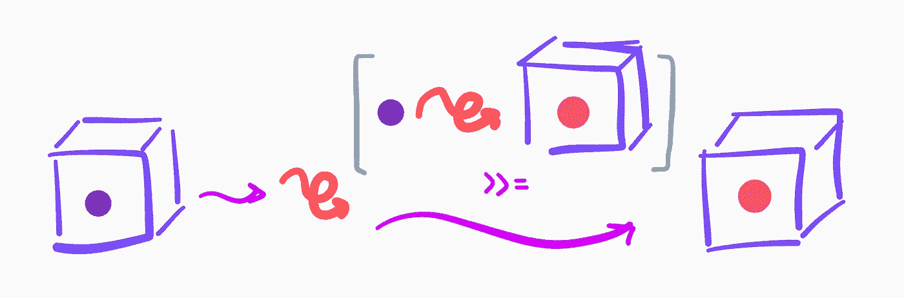

# 单子初学者指南

> 原文：<https://levelup.gitconnected.com/a-beginners-guide-to-monads-d0f1d958eb80>

单子提供了一种与封装在容器中的数据安全交互的方式。这是一个抽象且有时令人困惑的概念，但它是函数式语言的核心特性，有助于以惯用的方式处理错误和管理副作用。

本文需要函数式编程的基础知识，最好是使用 Haskell。我们将讨论以下主题:

*   关于字体类别和种类的提示；
*   函子、应用和单子数据类；
*   Haskell 中的不确定性；
*   在 Haskell 中管理输入和输出；
*   `do`词块和单子的句法糖。

# 基础

Haskell 中的类型可以分为*种*。种类表示一个类型可以接受的参数。例如，`Int`的种类是`*`，这意味着没有更多的参数可以应用于它。`Maybe`可以特化为`Maybe t`用于某种类型的`t`，所以其种类为`* -> *`。我们可以通过在 GHCI 中键入`:kind t`来检查类型`t`的种类。

允许执行相似操作的类型可以组合在一起形成一个*类型类*。一个类型类由一个名称和一个签名列表来表征。它类似于数学中的一个代数结构:我们不用研究整数、矩阵或复数的集合，而是可以研究一般集合，在这些集合上定义了满足某些性质的一些运算。例如，Haskell 有一个类型类`Ord`,用于标识可以订购的对象。对于在`Ord`类中的类型`t`，它需要实现一个函数来比较它的元素:`(<=) :: t -> t -> bool`。我们可以认为任何实现这种函数的类型都属于`Ord`类，但是我们假设它的行为方式和我们期望的比较函数一样:它必须是自反的、反对称的和可传递的。预计它还将定义一个总订单。

# 函子

一个*仿函数*是一种类型，允许将一个函数应用到它所包含的元素，并得到它的输出，*封装了*。更准确地说，它是一种被赋予了功能`fmap :: (a -> b) -> f a -> f b`的类型。`fmap`的用途是将一个函数应用到仿函数中`a`类型的元素，并返回仿函数中函数的输出。那边关于它的更多:[https://hackage . haskell . org/package/base-4 . 16 . 2 . 0/docs/prelude . html # t:Functor](https://hackage.haskell.org/package/base-4.16.2.0/docs/Prelude.html#t:Functor)。

`Maybe`是 Haskell 中最常见的函子之一。它的`fmap`接受一个函数`g`和一个输入`x :: Maybe a`，如果`x = Just y`返回`Just (g y)`，如果`x = Nothing`返回`Nothing`。`fmap`有一个内嵌别名`<$>`。

例如，如果您试图从一个 API 获取一个`[Char]`并接收到一个您想要反转的`Maybe [Char]`，您可以使用带有内置`reverse :: [Char] -> [Char]`的`fmap`，如下所示:

# 应用程序

当使用形式为`a -> b`的签名操作函数时，仿函数非常有用。如果我们将`fmap`与带多个参数的函数一起使用，`fmap`将返回一个新函数，该函数包含在一个仿函数中:

这就是`Applicative`类型类派上用场的地方。一个*应用*是一个被赋予了两个额外功能的函子:`pure`和`(<*>)`(后者是一个内嵌运算符，读作 *app* )。`pure`获取一个值并将其包装在应用程序中。例如，`Maybe`的`pure`实现(也是一个应用程序，也是一个单子，我们将在后面看到)简单地调用`Just`。`(<*>)`接受包装在应用程序中的函数`g :: a -> b`和包装在应用程序中的类型为`b`的对象。它返回一个包装在应用程序中的类型为`c`的对象。`(<*>)`有签名`Applicative f => f (a -> b) -> f a -> f b`。

在`Maybe`的情况下，如果`g = Just h`和`x = Just y`，`g <*> x`返回`Just h y`，否则返回`Nothing`。下面是我们如何计算两个`Maybe Int`的和`x`和`y`的方法，如果它们都是明确定义的，返回`Nothing`，如果其中一个是`Nothing`:

## 多一层抽象；不确定性

如果我们考虑一个任意的函数`g :: a -> b`，我们可以定义`g' = pure g`。`g'`的型号为`Applicative f => f (a -> b)`。不需要关于`f`的信息，除了它是`Applicative`的一个实例。然后，我们可以使用`(<*>)`在任何特定应用程序提供的上下文中评估`g`。比如如果`g x = 2 * x`那么`g' <*> Just 1 = Just 2`和`g' <*> Nothing = Noting`。这种行为是由`Maybe`的`(<*>)`操作符的定义决定的:每个应用`f`都定义了当`app`产生一个围绕`f`的值时函数的特定行为方式。

为了了解这是如何有用的，让我们看看另一个应用程序。

Haskell 中的列表也是`Applicative`的实例。当一个列表被用作一个应用程序时，它代表一个不确定的赋值:`[1, 2, 3]`作为一个变量，它可以取值`1`、`2`或`3`。因此，如果我们将一个列表`xs :: [a]`T21 到`h :: Applicative f => f (a -> b)`中，我们将得到另一个列表`ys :: [b]`，其中包含在`xs`的每个值上评估的函数值。这与将`map`应用于展开的函数相同。

然而，当我们使用带多个参数的函数时，事情变得更有趣了。例如，`pure (+) <*> [1, 2, 3] <*> [4, 5, 6]`计算出一个列表，其中包含将第一个列表中的元素添加到第二个列表中的元素时可以获得的所有值。更一般地说，如果`f :: a1 -> ... -> an`那么`pure f <*> [x11, ..., x1k] <*> ... <*> [xn1, ..., xnk]`包含应用`f y1 ... yn`获得的所有值，其中`y1 = x1p`用于某些 *p* ，…，`yn = xnq`用于某些 *q* 。

# 单子

一个*单子*是一个被赋予了一个额外运算符的应用程序:`(>>=) :: Monad m => m a -> (a -> m b) -> m b`，读作 *bind* 。Bind 接受封装在 monad 中的输入，monad 是一个接受原始输入并给出封装输出的函数，它返回函数的封装输出。通过再次使用绑定操作符，封装的输出`x :: m b`可以依次传递给函数`f :: b -> m c`:`(>>=)`的一个优点是它可以很容易地被链接。

这里有一个简单的例子:

我们想对一个有理数应用三种运算。没有为所有的推理定义操作，所以它们返回一个`Fractional a => Maybe a`。我们不是将每个输出与`Nothing`或`Just x`匹配，而是使用`(>>=)`链接应用程序，如果结果定义良好，则返回`Just`，如果某处出现问题，则返回`Nothing`。

单子有两个额外的方法，它们不是最小定义的一部分(也就是说，如果没有明确定义它们，它们的定义是从最小定义中推断出来的):`(>>)`和`return`。Return 充当`pure`:它将其输入封装到一个单子中。在其默认定义中，`return`等于`pure`。`(>>)`的签名是`Monad m => m a -> m b -> m b`。它取两个封装的值`x :: m a`和`y :: m b`并在评估`x`后返回`y`。其默认实现如果`m >> k = m >>= (\_ -> k)`。这可能看起来很混乱，你可能不明白为什么我们会需要这样的函数，但是一旦你读了下一节就会明白了。

## 应用:输入/输出

管理输入和输出(I/O)从根本上来说是无功能的:其行为依赖于来自文件的输入或写入文件的函数是不确定的。然而，在一元类型的帮助下，我们可以使不纯的行为显化。出于这个原因，Haskell 包含了几个允许以安全的方式操作 I/O 的特性。

正如我们使用`Maybe`来封装可能没有定义的对象一样，我们使用类型`IO`来封装为 I/O 而来的对象。例如，我们可以使用函数`putStrLn :: String -> IO ()`在终端中打印一行。使用`(>>)`，我们可以通过如下方式链接对`putStrLn`的调用来打印多个内容:`putStrLn "hello" >> putStrLn "what's your" >> putStrLn "name?"`:前两个调用的结果被丢弃(反正我们也不需要)，但文本仍然被打印出来。

I/O 函数的另一个有用的例子是`getLine :: IO String`。如果我们想打印`getLine`的结果，即终端中写入的行，我们可以使用`>>=`将封装的字符串发送到`putStrLn`。如果我们想要将任何函数`f :: String -> a`应用到终端输入，我们可以使用`>>=`将封装的字符串发送到一个函数中，该函数封装了`f`应用到其输入的结果，即`\x -> return $ f x`。`getLine >>= (\x -> return $ f x)`的结果是类型`IO a`，并且可以通过*绑定*到另一个函数`g :: a -> IO b`。

使用这些属性，我们可以要求用户输入他的名字，然后输入他的姓，输出他的全名。

很美，不是吗？我们一起来分解一下。

*   我们从在终端中写消息开始。与这个表达式的结果无关，所以我们简单地丢弃它，并移到`>>`的右边。
*   我们读了一个`IO String`。
*   我们将由`IO String`(用户输入的字符串)封装的值传递给一个 lambda 函数。该值被绑定到名称`forename`。
*   我们打印一些文本，丢弃结果，继续前进。
*   我们读取另一个`IO String`，并将底层字符串传递给一个 lambda 函数。用户输入的字符串被绑定到名称`surname`。
*   `forename`和`surname`是两个字符串:我们可以把它们连接起来，得到全称。我们返回全名，封装的(因为这是`>>=`的类型需求)。
*   我们通过使用`>>=`将底层值传递给`putStrLn`来打印封装的全名。

就是这样！

好吧，这看起来真的很酷，但这肯定不是执行如此简单操作的合理方式。这激发了本文的最后一节，在这里我们将引入一些语法糖，使所有这些看起来更好。

# Do 符号

`do`块是具有以下形式的块:

`do`-在某种意义上，块允许在 Haskell 程序中编写命令性代码。

一个接一个地编写多个指令就像用`>>`把它们链接起来一样。例如，我们可以打印多行，如下所示:

`do`模块的另一个特征是`<-`操作符，称为*去糖*操作符。左边是一个名字，右边是一个返回单子的表达式。比如我们可能会写`typed <- getLine`。`typed`的类型将会是`String`。我们可以通过定义以下内容来构造去糖运算符:

作为:

这意味着我们评估`g`的结果`m x`并将`x`绑定到块的其余部分。

使用`do`-符号，下面是我们如何重新编写程序来读取用户的名和姓并打印出他的全名:

哪个看起来更令人愉快…

# 分级编码

感谢您成为我们社区的一员！在你离开之前:

*   👏为故事鼓掌，跟着作者走👉
*   📰查看[升级编码出版物](https://levelup.gitconnected.com/?utm_source=pub&utm_medium=post)中的更多内容
*   🔔关注我们:[Twitter](https://twitter.com/gitconnected)|[LinkedIn](https://www.linkedin.com/company/gitconnected)|[时事通讯](https://newsletter.levelup.dev)

🚀👉 [**加入升级人才集体，找到一份惊艳的工作**](https://jobs.levelup.dev/talent/welcome?referral=true)