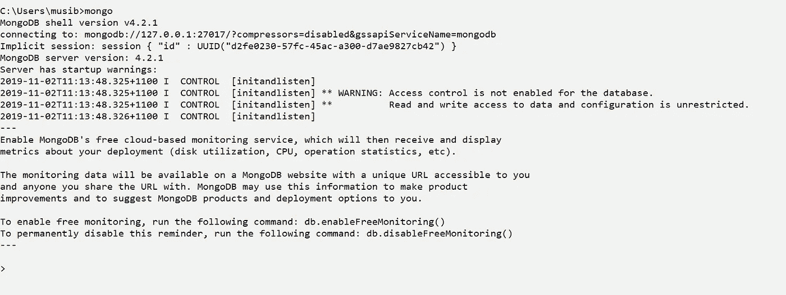
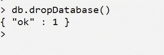
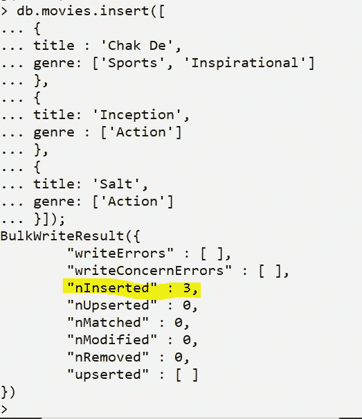

# MongoDB 初学者指南

> 原文：<https://levelup.gitconnected.com/a-beginners-guide-to-mongodb-9a321226544>

## MongoDB 是一个开源的、基于文档的 NoSQL 数据库

MongoDB(图片提供:谷歌图片，标记为重复使用)

# 概观

ongoDB 是一个开源的、基于文档的 NoSQL 数据库。它以类似 JSON 的格式存储数据，具有企业级的特性，如高可用性、可伸缩性和安全性。

以下是 MongoDB 数据库的一些显著特性:

1.  这是一个开源的、跨平台的、基于文档的 NoSQL 数据库。
2.  没有像关系数据库那样的数据库模式概念。数据存储为集合和文档。
3.  集合之间没有通常在关系数据库表中完成的复杂连接。通常在通过组合文档来存储数据的同时执行连接。
4.  数据以 [BSON](https://stackoverflow.com/questions/12438280/what-is-bson-and-exactly-how-is-it-different-from-json) 格式存储(类似 JSON 文档的二进制编码)。
5.  存储在集合中的数据不需要有相似的结构。一个文档可以有一组特定的字段，而另一个文档可以有一组完全不同的字段(类型和数量)。
6.  MongoDB 提供了一个名为**测试**的默认数据库。如果在存储数据时没有选择数据库，MongoDB 使用这个数据库来存储数据。

# 安装 MongoDB

在这一节中，我们将讨论在本地计算机上安装 MongoDB。MongoDB 有两种版本:

1.  社区版
2.  企业版

MongoDB 的社区版是开源的，可以免费获得。企业版已获得许可，可提供一系列商业支持的企业级功能。

关于如何下载和安装 MongoDB 社区版的分步说明可以在[这里](https://docs.mongodb.com/manual/administration/install-community/)找到。在安装时，MongoDB 提供了一个安装 MongoDB Compass 的选项，这是一个用于访问 MongoDB 数据库的 GUI 控制台。或者，也可以从命令行 shell 访问 MongoDB 数据库。

以下是 MongoDB 的命令行界面:

MongoDB Shell

以下是图形用户界面(MongoDB Compass):

MongoDB 罗盘

在本文中，我们将使用 MongoDB 命令行界面。

# MongoDB 组件

MongoDB 有几个数据库组件。然而，我们对两个主要组件感兴趣。我们将在本文中使用这两个组件:

mongod: 这是在后台运行的数据库守护进程。

**mongo:** MongoDB shell。这用于连接到守护进程并执行各种数据库命令。

# 了解 MongoDB 存储结构

在关系数据库中，我们使用数据库模式。如这里的[详细描述的](https://www.lifewire.com/definition-of-a-schema-in-a-database-1019262)，数据库模式可以定义如下:

> *数据库模式*是描述数据库中对象和信息之间关系的数据库元数据的集合。设想模式的一个简单方法是把它想象成一个包含表、存储过程、视图和相关数据资产的盒子。一个模式定义了这个盒子的基础结构

但是，在 MongoDB 中没有模式的概念。它主要使用数据库、集合和文档的概念。以下是对其中每一项的详细描述。为了更好地理解，我们将通过与结构化查询语言(SQL)的比较来定义这些术语。

**数据库**:数据库是集合的物理**容器**。

**集合:**集合是一组 MongoDB 文档。在 SQL 术语中，这类似于数据库**表。**

**文档:**文档是一组键值对。在 SQL 术语中，这类似于数据库表中的**行**。

**字段:**字段是文档中的关键字。在 SQL 术语中，这类似于数据库表中的**列**。

**嵌入文档:**嵌入文档是多个文档的拼接。在 SQL 术语中，这类似于连接几个数据库表。

# 开始使用 MongoDB

在这一节中，我们将探索 MongoDB 的各种特性。我们将创建数据库，集合，从现有集合中检索数据，施加条件等等。

> 大多数 MongoDB 命令都是用 **db 构建的。<任务>(选项)。在这种情况下，任务名称遵循 camelCase 命名模式。例如，要创建一个新的空集合，我们使用 db . create collection(collection name)**

## 通过 MongoDB Shell 连接到 MongoDB

打开命令提示符并键入 **mongo**

通过 ***mongo*** 打开 MongoDB Shell

## **使用帮助**

MongoDB 通过 **db.help()提供了一个有用的数据库命令列表。**该命令列出了所有主要命令，并附有简明描述:

db.help()获取详细的命令列表

## 使用显示

还有一个 show 命令列表，用于显示各种元素，如数据库、集合、用户等。以下是 show 命令列表:

显示命令

例如，我们可以运行`show dbs` 来列出所有现有的数据库:

我的机器中的数据库列表

## **创建 MongoDB 数据库**

我们可以通过用数据库名指定`use`来创建一个新的数据库。如果数据库存在，将使用它。否则，将创建一个新的。

**命令:**

创建新的数据库

注意，尽管数据库已创建，但在至少有一个集合之前，它不会显示在`show dbs`命令中。

## **删除一个 MongoDB 数据库**

使用`use <dbname>`命令切换到要删除的数据库，然后运行以下命令:

**命令:**

删除数据库

> 注意，如果我们不选择数据库，MongoDB 将使用默认的*测试*数据库。如果在没有选择特定数据库的情况下执行 db.dropDatabase()，它也会删除这个默认数据库

## **创作系列**

可以使用以下命令创建新的集合。

**命令:**

这将在选定的数据库中创建一个空集合

在 MongoDB 中创建空集合

一个集合也可以被*限制*，我们可以用可选的 options 属性定义可以存储在该集合中的文档的最大大小和数量。

**选项:**

**封顶:**可能值为真或假。此选项决定此集合是否有上限。

**大小:**此选项决定此集合中可以存储的最大文档数。

**Max:** 这个选项决定这个集合可以容纳的最大字节数。首先检查最大值选项，然后验证大小。

**例如:**

创建封顶的集合

## **丢弃收藏**

可以使用以下命令删除集合:

**命令:**

删除收藏

## **插入文件**

可以使用`insert()`或`save()`方法将文档插入集合

**命令:** `db.*<collectionName>*.insert()` **或** `db.<c*ollectionName>*.save()`
**例如:**

以下示例显示了如何在集合中插入单个**文档:**

插入单个文档

以下示例显示了如何在集合中插入多个文档:

插入多个文档

在上面的插入示例中，我们只提供了两个完全有效的字段。以下是电影收藏中的文档列表:

电影收藏中的文档列表

在我们的任何文档中，我们都没有提供 ObjectId。MongoDB 为这些文档分别创建了一个。

## **查找文件**

可以使用`find()`从 MongoDB 中检索集合中的文档

**命令:**

1.  从集合中查找所有文档:

**命令:** `db.*<collectionName>*.find()`
**举例:** `db.movies.find({})`

我们在 find()中提供了一个{}来检索集合中的所有文档。在 SQL 中，这类似于如下所示:

> 从中选择*

> pretty()与 find()一起使用来美化文档输出

从一个集合中查找具有漂亮字体的所有文档

2.在 find 方法中使用子句

上面的 find()语法用于从一个集合中查找所有的文档。然而，从集合中检索所有文档并不总是有用的，我们通常希望根据条件过滤数据。在 SQL 中，我们使用 WHERE 子句从表中过滤数据。

例如`SELECT col1, col2 FROM table WHERE <condition(s)>`

MongnDB 让我们在 find()方法中添加各种子句来从集合中获取数据:

**相等**

**命令:** `db.coll.find({key:value})`
**举例:** `db.movies.find({‘title’ : ‘Salt’})`

查找有条件的文档

**小于**

**命令:** `db.coll.find({key : {$lt: value}})`
**举例:** `db.movies.find({releaseYear : {$lt: 2016}})`

查找小于条件的文档

**小于等于**

**命令:** `db.coll.find({key : {$lte: value}})`
**示例:** `db.movies.find({releaseYear : {$lte: 2016}})`

查找小于等于条件的文档

**大于**

**命令:** `db.coll.find({key : {$gt: value}})`
**举例:** `db.movies.find({releaseYear : {$gt: 2015}})`

查找具有大于条件的文档

**大于等于**

**命令:** `db.coll.find({key : {$gte: value}})`
**举例:** `db.movies.find({releaseYear : {$gte: 2016}})`

查找具有大于等于条件的文档

**不等于**

**命令:** `db.coll.find({key : {$ne: value}})`
**举例:** `db.movies.find({releaseYear : {$ne: 2016}})`

MongoDB 还允许我们用 AND 和 OR 组合多个条件

**和**

**命令:** `db.coll.find({$and : [{key:value}, {key:value}]})`
**举例:** `db.movies.find({$and: [{title : ‘Jai Ho’}, {releaseYear : 2016}]})`

**或**

**命令:** `db.coll.find({$or : [{key:value}, {key:value}]})`
**举例:** `db.movies.find({$or: [{title : ‘Jai Ho’}, {releaseYear : 2016}]})`

**将 AND 和 OR 结合在一起**

**命令:** `db.coll.find({key : {$lt : value}, $or: [{key:value}, {key:value}]})`
**举例:** `db.coll.find({releaseYear : {$lte : 2016}, $or: [{title : ‘Jai Ho’}, {title : ‘Dangal’}]})`

## **更新文档**

集合中的现有文档可以用 update 或 save 方法更新。

**命令:** `db.<collectionName>.update(SELECTION_CRITERIA, UPDATED_DATA)`
`db.<collectionName>.save(SELECTION_CRITERIA, NEW_DATA)`

**举例:** `db.movies.update({title: ‘Jai Ho’}, {$set: {releaseYear : 2003}})`

## **删除文件**

可以使用 remove()方法从集合中移除文档

**命令:** `db.<collectionName>.remove(DEL_CRITERIA, JUSTONE)`

**举例:**

`db.movies.remove({title: ‘Jai Ho’})` - >只删除满足条件的。

`db.movies.remove({releaseYear: 2016}, 1)` - >如果多个文件满足条件，则仅删除一个。

`db.movies.remove({})` - >从集合中删除所有文档。这相当于 SQL 中的 truncate 命令。

# 结论

在本文中，我们介绍了最流行和最常用的 NoSQL 数据库之一，MongoDB。我们已经解释了与这个数据库交互的方式。一旦您熟悉了这些概念和语法，请参考[文档](https://docs.mongodb.com/)以了解更多关于 MongoDB 的信息。