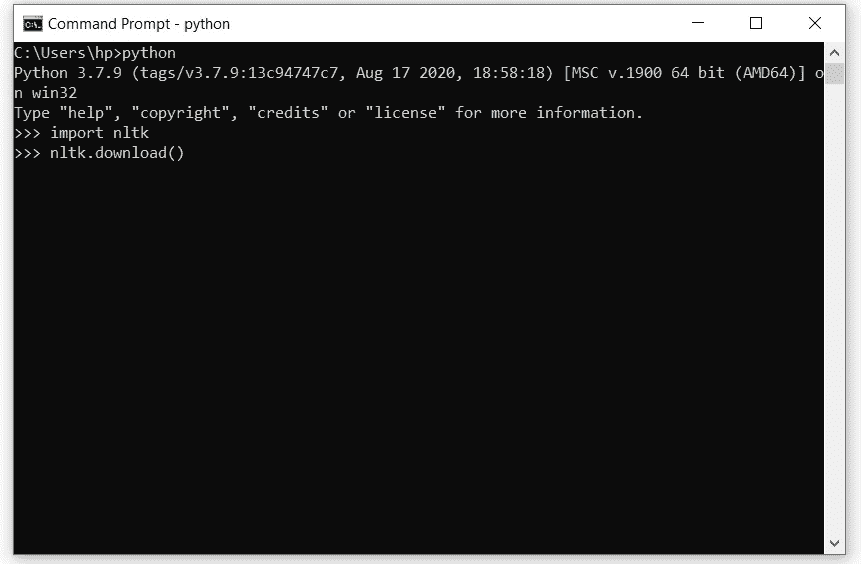

# 使用 NLTK 的 Python 自然语言处理初学者指南

> 原文：<https://levelup.gitconnected.com/a-beginners-guide-to-natural-language-processing-in-python-using-nltk-6e4692b825d4>


克雷格·柯蒂斯在 [Unsplash](https://unsplash.com/s/photos/glasses-with-book?utm_source=unsplash&utm_medium=referral&utm_content=creditCopyText) 上拍摄的照片

自然语言处理是人工智能(AI)的一个子领域，它帮助计算机理解任何给定上下文中的人类语言，以便它们可以执行自动化的重复任务，如翻译、摘要、文本分析等。在本文中，我们将浏览 Python 中的`NLTK`包。这个`NLTK`是什么？

嗯，它是一个自然语言处理库，由不同的软件包组合而成，包括摘要、电离、词性等。简单地说，这是一个用 Python 编写的英语语言处理模块的集合，我们将看到如何使用`NLTK`模块来做文本分析或任何任务。

# 安装:

如果你已经安装了最新版本的 Python，你可以使用下面的命令来安装最新版本的`NLTK`和`pipy`。

`pip install nltk`

一旦你安装了`nltk`，你需要下载所有的 NLP 包。通过在命令提示符或终端上键入“python”打开 python 编译器，然后键入以下命令。

`nltk.download()`



学习自然语言处理

它会打开一个如下的对话框，你只需要下载全部。

# 标记文本:

在开始处理文本之前，你需要先对它进行标记。标记化意味着拆分文本。记号化可以将段落拆分成句子，将句子拆分成单词，将单词拆分成字符。在自然语言处理(NLP)中，我们有两种类型的标记化。

1.  句子标记化
2.  单词标记化

## 句子标记化:

句子标记化方法将文本或段落字符串文本作为参数，并在文本中查找`“.”`并根据它进行拆分。让我们试着在课文中使用句子标记。

如你所见，我们得到的输出是从一个段落中得到的句子列表。

```
Output:['Today is the good day.', 'Yesterday we learn natural language processing.', 'I had an Idea why we learn Python today.']
```

## 单词标记化:

另一方面，单词标记化的工作方式不同于句子标记化，它根据空格、特殊类型字符等分割文本。让我们在一个句子上尝试单词标记化，并观察输出。

```
Output:['Last', 'night', ',', 'I', 'was', 'practicing', 'Python', 'programming', 'language', 'and', 'i', 'found', 'some', 'interesting', 'thing', '.']
```

# 停用词

停用词是对句子没有多大意义的词，它们对句子有贡献，但没有多大重要性。为了获得更好的结果，我们在自然语言处理(NLP)过程中删除了这个停用词。一些常见停用词的例子有`“the”`、 `“a”`、`“he”`等。为了从文本或句子中删除停用词，我们在`NLTK`中有一个停用词类。让我们试着把下面段落中的停用词去掉。

```
In a huge pond, there lived many fish. They were arrogant and never listened to anyone. In this pond, there also lived a kind-hearted crocodile. He advised the fish, “It does not pay to be arrogant and overconfident. It could be your downfall." But the fish never listened to him. “There is that crocodile, advising us again," they would say. One afternoon, the crocodile was resting beside a stone near the pond, when two fishermen stopped there to drink water.The fishermen noticed that the pond had many fish. “Look! This pond is full of fish. Let’s come here tomorrow with our fishing net," said one of them. “I am surprised we have not seen this place before!" exclaimed the other.
```

> 始终标记句子或段落以执行文本分析算法

首先，我们需要从你在`NLTK`下载的`stopwords`包中加载停用词的尸体，然后我们将对段落进行标记，之后，我们将找到停用词并将其从段落中移除。让我们试着实现这个方法。

在输出中，我们得到一个标记化的文本，但没有任何停用词。如果你看到`line 10`我们使用列表理解技术用`stopwords`检查标记化文本中的每个单词，如果单词匹配，我们不把它包括在列表中。当你进行机器学习文本分析时，停用词移除就派上用场了，例如`Sentiment Analysis`。

```
Output:['In', 'huge', 'pond', ',', 'lived', 'many', 'fish', '.', 'They', 'arrogant', 'never', 'listened', 'anyone', '.', 'In', 'pond', ',', 'lived', 'kind-hearted', 'crocodile', '.', 'He', 'advised', 'fish', ',', '``', 'It', 'pay', 'arrogant', 'overconfident', '.', 'It', 'could', 'downfall', '.', "''", 'But', 'fish', 'never', 'listened', '.', '``', 'There', 'crocodile', ',', 'advising', 'us', ',', "''", 'would', 'say', '.', 'One', 'afternoon', ',', 'crocodile', 'resting', 'beside', 'stone', 'near', 'pond', ',', 'two', 'fishermen', 'stopped', 'drink', 'water.The', 'fishermen', 'noticed', 'pond', 'many', 'fish', '.', '``', 'Look', '!', 'This', 'pond', 'full', 'fish', '.', 'Let', "'s", 'tomorrow', 'fishing', 'net', ',', "''", 'said', '.', '``', 'I', 'surprised', 'seen', 'place', '!', "''", 'exclaimed', '.']
```

# 语音标签(位置标签)

语音标注也称为词性标注，它是一种给文本中的每个单词分配一个标签来表示一个`part of speech`的方法，例如时态、数字(单/复数)、名词、动词、副词、形容词、代词、连词及其子类等等。让我们尝试在下面的文本上实现`part of speech`标记。

```
The next morning, the fishermen came and threw their net in the pond. The nets were big and strong. Very soon all the fish were caught. “If only we had listened to Mr. Crocodile. He had only wanted to help. For our arrogance we have to pay with our lives," said the fish.
```

首先，我们将再次加载重要的模块，接下来我们对文本进行标记，并在标记文本上应用语音标记方法。

在这个示例代码中，我们用句子标记器标记我们的文本，然后在第 10–11 行，我们迭代我们的句子，因为我们知道句子标记器根据`“.”`分割文本，通过迭代每个句子，我们将它作为参数传递给`post_tag()`方法，该方法反过来提供带有词性标签的句子中的单词。

```
Output:[('The', 'DT'), ('next', 'JJ'), ('morning', 'NN'), (',', ','), ('the', 'DT'), ('fishermen', 'NNS'), ('came', 'VBD'), ('and', 'CC'), ('threw', 'VBD'), ('their', 'PRP$'), ('net', 'NN'), ('in', 'IN'), ('the', 'DT'), ('pond', 'NN'), ('.', '.')]
[('The', 'DT'), ('nets', 'NNS'), ('were', 'VBD'), ('big', 'JJ'), ('and', 'CC'), ('strong', 'JJ'), ('.', '.')]
[('Very', 'RB'), ('soon', 'RB'), ('all', 'PDT'), ('the', 'DT'), ('fish', 'JJ'), ('were', 'VBD'), ('caught', 'VBN'), ('.', '.')]
[('“', 'NN'), ('If', 'IN'), ('only', 'RB'), ('we', 'PRP'), ('had', 'VBD'), ('listened', 'VBN'), ('to', 'TO'), ('Mr.', 'NNP'), ('Crocodile', 'NNP'), ('.', '.')]
[('He', 'PRP'), ('had', 'VBD'), ('only', 'RB'), ('wanted', 'VBN'), ('to', 'TO'), ('help', 'VB'), ('.', '.')]
[('For', 'IN'), ('our', 'PRP$'), ('arrogance', 'NN'), ('we', 'PRP'), ('have', 'VBP'), ('to', 'TO'), ('pay', 'VB'), ('with', 'IN'), ('our', 'PRP$'), ('lives', 'NNS'), (',', ','), ("''", "''"), ('said', 'VBD'), ('the', 'DT'), ('fish', 'NN'), ('.', '.')]
```

# 堵塞物

词干法是从单词中去掉词缀并返回词根的方法。什么是词缀？。词缀是加在词根末尾或开头的单词或字母，例如这个单词中的`“unstoppable”`，un- is `prefix`和-able is `suffix`前缀和后缀都是词缀的组成部分。词干提取的最好例子是在 google 搜索引擎中给出的，它使用词干提取技术来改进页面的索引。

让我们尝试使用`NLTK`模块实现不同单词的词干。首先，我们加载`nltk`词干算法，嗯`nltk`有很多词干算法，你可以使用其中任何一个，我将使用`Lancaster stemming algorithm`。但是你可以在这里阅读另一个算法[***nltk _ stem _ algos***](https://www.nltk.org/api/nltk.stem.html)。

```
Output:believ
eat
eat
writ
formula
```

不同的词干算法给出不同的准确度结果。你可以选择自己喜欢的词干算法。如果您运行这段代码并检查输出，您将看到唯一的`criteria`单词没有词缀。所以它返回相同的值。

# 词汇化

词干化遵循与词干化相同的工作过程，但词干化和词干化的区别在于词根。Stem 总是返回一个非实际的词根，另一方面，lemmatization 返回实际的词根。如果你看到我们得到的词干示例输出。在这种情况下，他们认为词干输出是`believ`，这是一个不真实的单词，它并不存在，所以我们对此进行了术语化，让我们看看我们得到了什么。

```
Output:
belief
```

太神奇了！lemmatizer 给了我们单词`believes`的实际单词`belief`。你可以试着用其他不同的词来测试它。我们还可以对特定词类的词进行词条化，如动词、名词、形容词等。

让我们试着用 crossing 这个词来搭配名词、动词和形容词。

```
Output:cross
crossing
crossing
```

输出是清楚的，如果你看到语音表的一部分，你会知道输出是相当可怕的。让我们看看我们改变了什么。我们添加了一个名为`pos ( part of speech )`的新参数，并在其中设置了一个角色。该字符将表示词性，如动词、名词等，然后`nltk`模块为`crossing`查找特定的`part of speech`单词。

# 同义词和反义词

NLTK 模块支持使用`wordnet`查找单词的同义词和反义词。WordNet 是一个同义词和反义词的 NLP 数据库，它包括所有单词的同义词和反义词，你可以从`nltk.download()`对话框下载。

## 同义词:

同义词是指与另一个词意思相同或相近的词。让我们试着用同义词 wordnet 找出单词`“happy”`的同义词。

```
Output:[Synset('happy.a.01'), Synset('felicitous.s.02'), Synset('glad.s.02'), Synset('happy.s.04')]
```

它返回单词`happy`的同义词列表。这意味着这些话对`happy`来说是有意义的。当然，你看到的单词也是重复的，完全找到数据集也根据词性返回匹配的单词。

我们还可以找到特定单词的同义词的定义和示例，让我们尝试在列表`index no 2`中的`synonym` glad 上实现它。

```
Output:[Synset('happy.a.01'), Synset('felicitous.s.02'), Synset('glad.s.02'), Synset('happy.s.04')]eagerly disposed to act or to be of service['glad to help']
```

## 反义词

反义词是与词义相反的词，例如，坏词反义词是好，快乐词反义词是悲伤等。我们将使用 wordNet 中的反义词数据集，并将其应用于不同的单词。让我们试着找出单词`Good`的反义词。

嗯，我们必须首先找到同义词，并使用 for 循环迭代这些同义词，对于单词`Good`的每个同义词，我们将找到其引理，如果通过用`line 11`上的`if condition`检查该单词的反义词是否存在，那么我们可以用它附加出反义词列表。

```
Output:{'bad', 'evil', 'evilness', 'ill', 'badness'}
```

# 最后的想法

这是一本初学者指南，我试图教你 NLTK 模块的基础知识，并学习许多有趣的自然语言处理(NLP)算法，你可以在这里[***NLTK _ documentation***](https://www.nltk.org/)探索更多关于`nltk module`的内容。

此外，您现在可以将这篇文章用于您的文本处理，我们已经讨论了自然语言处理的许多有用和重要的主题。它将有助于机器学习情感分析，OCR 阅读，过滤文本等。请随意分享您的回答，并希望这篇文章在将来对您有用。**😃编码快乐！。**

看看我的其他有趣的文章会对你有所帮助。以下是网址。

[](/a-beginners-guide-to-tesseract-ocr-using-pytesseract-23036f5b2211) [## 使用 Pytesseract 的 Tesseract OCR 初学者指南

### 光学字符识别或光学字符阅读器(OCR)是电子或机械转换的图像…

levelup.gitconnected.com](/a-beginners-guide-to-tesseract-ocr-using-pytesseract-23036f5b2211) [](/master-object-oriented-programming-oop-in-python-3-c69a1e8a6d3d) [## 掌握 Python 的面向对象编程(OOP)

### 通过掌握面向对象编程(OOP ),学习用 Python 编写更简洁、更模块化的代码。

levelup.gitconnected.com](/master-object-oriented-programming-oop-in-python-3-c69a1e8a6d3d) [](/build-a-desktop-app-with-python-4a847e3b596c) [## 用 Tkinter 和 Python 构建桌面应用程序

### 在本文中，我们将学习如何使用 python 和 Tkinter 模块开发现代桌面应用程序。一个…

levelup.gitconnected.com](/build-a-desktop-app-with-python-4a847e3b596c) [](/sending-email-with-python-c6bdc9a07cb5) [## 使用 Python 发送电子邮件

### 在今天的世界里，电子邮件是我们生活的一部分，无论是商业、学校、大学，还是发送电子邮件…

levelup.gitconnected.com](/sending-email-with-python-c6bdc9a07cb5) [](/pyqt5-tutorial-learn-gui-programming-with-python-and-pyqt5-df4225d2e3b8) [## PyQt5 教程:用 Python 和 PyQt5 学习 GUI 编程

### Pyqt5 是图形用户界面小部件工具包。它是最强大和最流行的 python 接口之一…

levelup.gitconnected.com](/pyqt5-tutorial-learn-gui-programming-with-python-and-pyqt5-df4225d2e3b8) [](/how-to-work-with-a-pdf-in-python-a1e0c1d127a4) [## 使用 Python 阅读和编辑 PDF 文档

### 在本文中，我们将了解如何使用 python pdf 模块来读写 pdf 文件。PyPDF2 是一个…

levelup.gitconnected.com](/how-to-work-with-a-pdf-in-python-a1e0c1d127a4) [](/creating-a-reddit-bot-using-python-5464d4a5dff2) [## 使用 python 创建 Reddit 机器人

### 一步一步指导如何使用 python 创建带有 Api 的 reddit 机器人

levelup.gitconnected.com](/creating-a-reddit-bot-using-python-5464d4a5dff2) [](/python-pandas-tutorial-a-complete-introduction-for-beginners-add7013095c2) [## Python 熊猫教程:初学者完全入门

### 在本分步教程中，您将了解如何开始使用 Pandas 和 Python 探索数据集。

levelup.gitconnected.com](/python-pandas-tutorial-a-complete-introduction-for-beginners-add7013095c2)