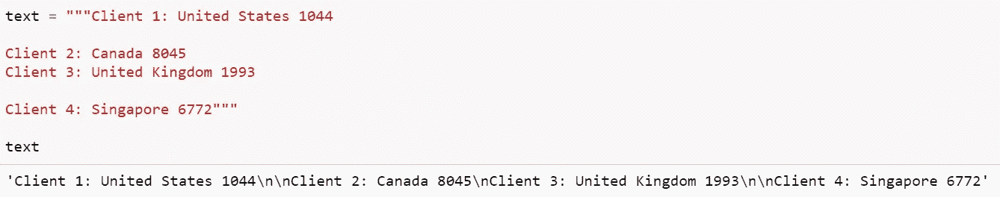

# Python 正则表达式操作初学者指南

> 原文：<https://levelup.gitconnected.com/a-beginners-guide-to-regular-expression-operations-in-python-563160a7f846>

正则表达式(Regex)是一个方便的工具，它由一系列字符组成一个搜索模式。这在处理自然语言处理(NLP)或基于文本的数据时特别有用。假设您想返回 100，000 字文档中与特定搜索模式匹配的所有结果？或者您可能想删除文档中不重要的字符。Regex 是你最好的朋友。

## **普通人物**

正则表达式可以包含普通字符和特殊字符。一些普通字符的例子可能包括:“H”、“e”、“l”、“l”、“0”。

## 特殊字符

而特殊字符可能包括:" | "、" ", "^".特殊人物不同于简单人物，因为他们影响 ***他们周围的普通人物如何影响*** *。*

正则表达式模式中通常使用的其他一些常见的特殊字符有:

*   **\d** (返回字符串中包含从 0 到 9 的数字的匹配项)
*   **\D** (返回字符串不包含任何从 0 到 9 的数字的匹配项)
*   **\w** (返回字符串包含从 a 到 Z 的字符、从 0 到 9 的数字和下划线 _ 字符的匹配项)
*   **\W** (返回字符串不包含从 a 到 Z 的字符、从 0 到 9 的数字和下划线 _ 字符的匹配项)
*   **\s** (匹配 Unicode 空白字符，空白字符是在排版中代表水平或垂直空格的单个或一系列字符。例如，给定的制表符、换行符等 *\t\n\r\f\v*
*   **\S** (匹配任何不是空白字符的字符)
*   **【用户定义的字符】**(在[]括号内，返回指定字符存在的匹配项)
*   **【a-z】**(在[]括号内，返回 a-z 内任何小写 ASCII 字母的匹配项)
*   **【a-zA-Z】**(在[]括号内，返回 A-Z 内任何小写和大写 ASCII 字母的匹配项)
*   **【^abc】**(在[]括号和^内，返回任何小写 ASCII 字母的匹配，不包括字母 a、b 和 c)
*   **[0–9]**(在[]括号内，返回 0 到 9 之间的任何数字的匹配项)
*   **[0–1][0–9]**(在[]括号内，返回 00 到 19 之间的任何数字的匹配项)

## 安装和文档

有关特殊字符和文档的完整列表，请参考[https://docs.python.org/3/library/re.html](https://docs.python.org/3/library/re.html)

通过 pip 安装: ***pip 安装 regex***

在 python 中，有一个内置的正则表达式模块(re)，该模块中的常见函数包括:

*   **搜索**(扫描字符串，寻找正则表达式模式产生匹配的第一个位置)
*   **FindAll** (返回字符串中所有不重叠的模式匹配，作为字符串列表。)
*   **Sub** (用指定的模式替换字符串)
*   **Split** (返回字符串在每个正则表达式模式下被拆分的列表)

## 关于。搜索

让我们从最近从[美国消费者新闻与商业频道](https://www.cnbc.com/2021/03/26/satellite-images-of-ship-ever-given-in-suez-canal-shows-work-underway.html)获得的新闻文章摘录开始，并演示正则表达式的用法。然后，我们将开始探索该模块对文本数据的搜索功能。

我们可以使用搜索功能来查看我们的文档是否匹配特定的单词。例如，检查搜索词“Evergreen”是否出现在我们的文本中。

在我们的示例文档中有一个匹配，因为输出作为 re 返回。匹配对象。如果您想在一个大文档中查找一个特定的单词，这将非常方便。

为了访问特定的结果，我们可以对原始文本文档应用切片函数。

我们还可以包括一个特殊字符的搜索功能。例如，在我们的文本文档中只搜索从 0 到 9 的数字。

需要注意的一个关键点是，搜索函数只返回正则表达式模式产生匹配的第一个位置**。**

## 关于。芬达尔

虽然搜索函数可能很有用，因为我们只在文本文档中查找第一个匹配，但是我们可以应用 findall 函数返回所有与 regex 模式匹配的结果。

正则表达式使用反斜杠字符(" \ ")来表示特殊形式，或者允许使用特殊字符而不调用它们的特殊含义。字母“r”被添加到我们的正则表达式模式的前面以绕过它。

让我们应用一个搜索模式，只返回文本文档中包含从 a 到 Z 的字母、从 0 到 9 的数字以及下划线 _ 字符的单词。

如果我们只想返回文档中的数字。

或者只返回文档中以“ly”结尾或以大写字母开头的副词。

我们甚至可以使用 findall 函数从文本文档中返回电子邮件地址。

根据您的需要，regex 允许复杂或简单的搜索模式，允许根据特定的模式操作和匹配单词。

## 关于。潜水艇

这是一个我经常使用的功能。“Sub”功能非常有用，尤其是用指定的模式替换不必要的字符。

假设我们的未清除注释字符串包含以下内容:

我们可以看到我们的文档包含各种换行符(\n)。在处理未清理的或原始的文本数据时，这是很正常的。现在我们将看看如何使用 re.sub 函数来清理我们的文本。

您可以在搜索模式之后定义替换模式，如果没有找到该模式，字符串将原封不动地返回。假设我们想要删除所有换行符。我们可以用空字符替换它们。

我们也可以删除标点符号，空格和星号。

为了便于说明，我已经单独执行了这些步骤。然而，一旦你掌握了正则表达式的窍门，所有这些都可以在一个步骤中完成，以节省执行时间和代码行。

有时，我们可能会获得带有 HTTP 嵌入链接的文本数据，例如，我们也可以删除这些链接。

是的，这是一个工作链接，如果你想知道的话，不，我没有看过。([*https://www.youtube.com/watch?v=EAysfZiO3Ys*](https://www.youtube.com/watch?v=EAysfZiO3Ys))

我们的输出没有任何 HTTP 链接！

根据您希望保留或更改模式中的字符或数字，该子功能在处理大量文本时肯定会很方便！

## 关于。裂开

接下来，我们来看看 split 函数。这个函数的作用是根据正则表达式模式的出现次数分割字符串。假设我们想用一个新的例子根据每个空白字符将字符串分割成单个的单词。

由于我们的文本中有换行符，我们也可以通过换行符分割文本数据。

如果我们只想将拆分应用于用户定义数量的实例，则将 maxsplit=x 添加到函数中。

另一点是，如果我们想返回我们用来分割字符串的分隔符，我们可以用 regex 模式()括起来。

如果我们想排除分隔符。

在结束这篇文章之前，让我们看看正则表达式模式的一些额外用途。

## 密码匹配

条件未满足:

满足条件:

## 电子邮件地址匹配

条件未满足:

满足条件:

## 日期匹配

条件未满足:

满足条件:

这就是这篇文章的全部内容，我希望您已经学到了一些有用的东西，以及在处理基于字符的数据时，如何合并简单或复杂的正则表达式模式。

好奇的学习者？释放你在媒体上学习的全部潜力，用不到一杯咖啡的钱支持像我这样的作家。

 [## 通过我的推荐链接加入媒体——杰森·LZP

### 作为一个媒体会员，你的会员费的一部分会给你阅读的作家，你可以完全接触到每一个故事…

lzpdatascience.medium.com](https://lzpdatascience.medium.com/membership)