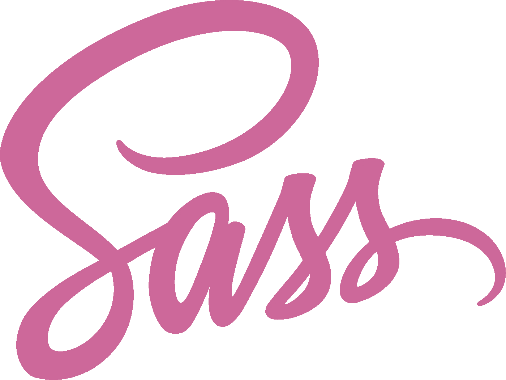
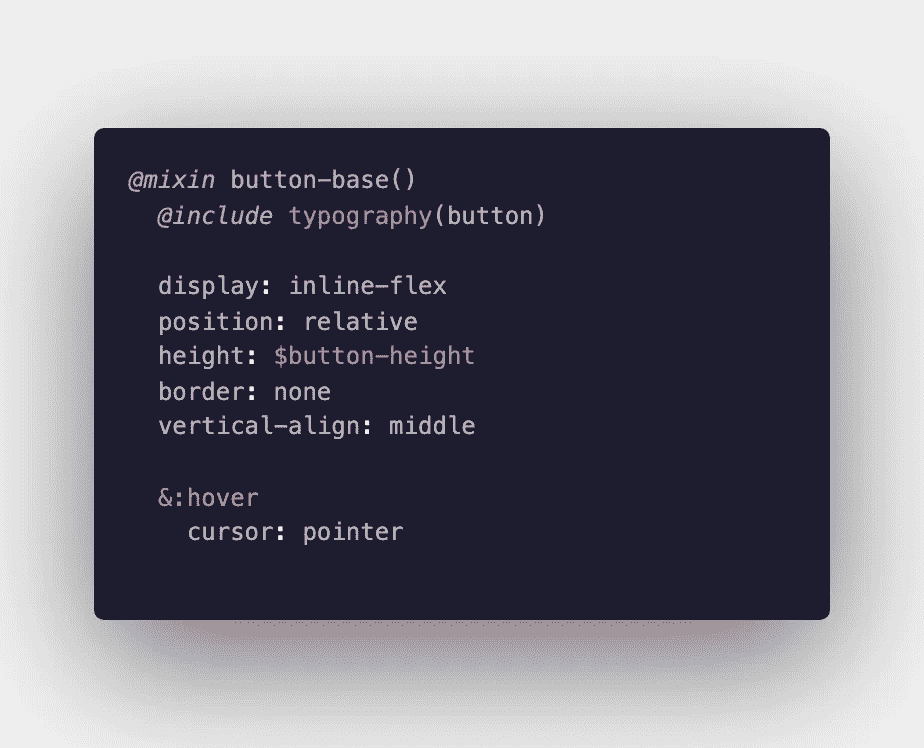
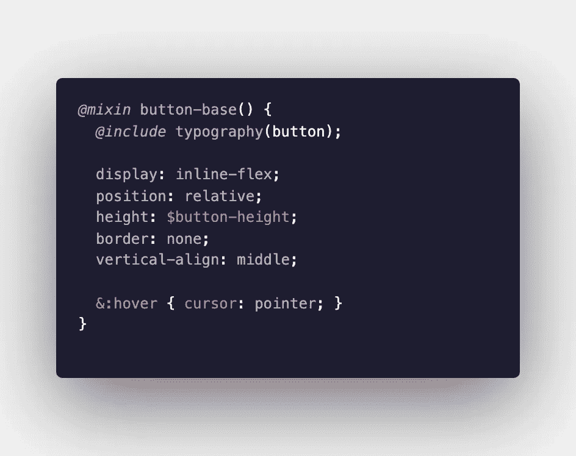
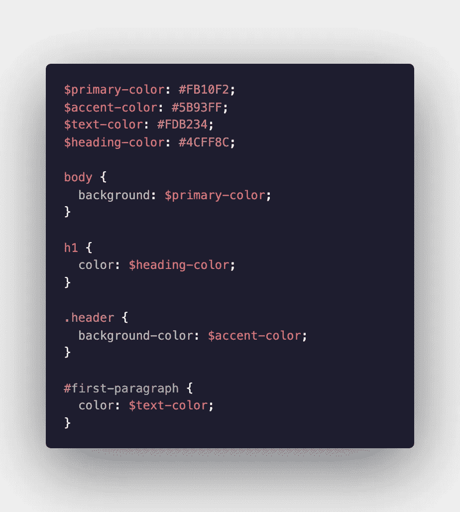
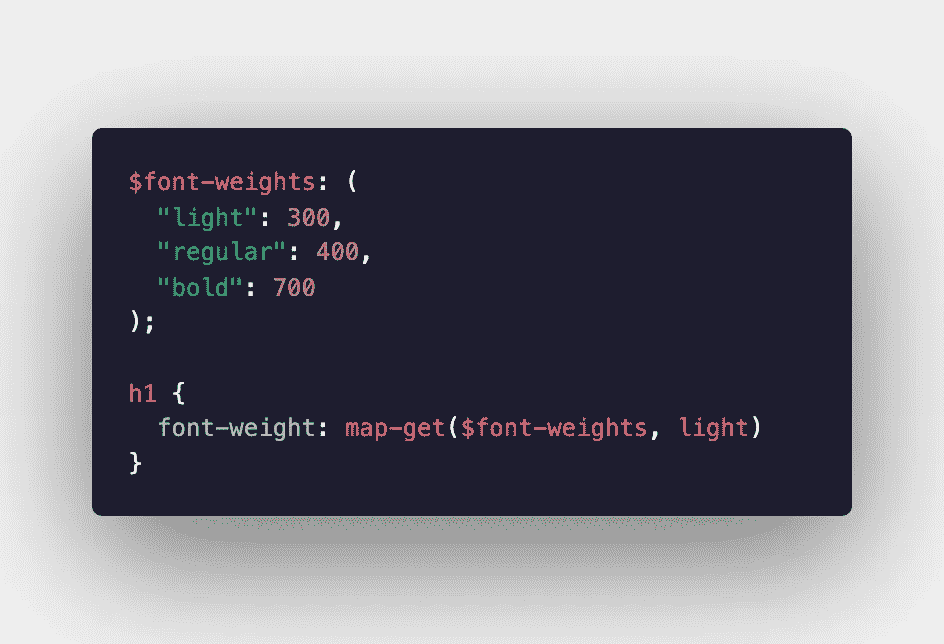
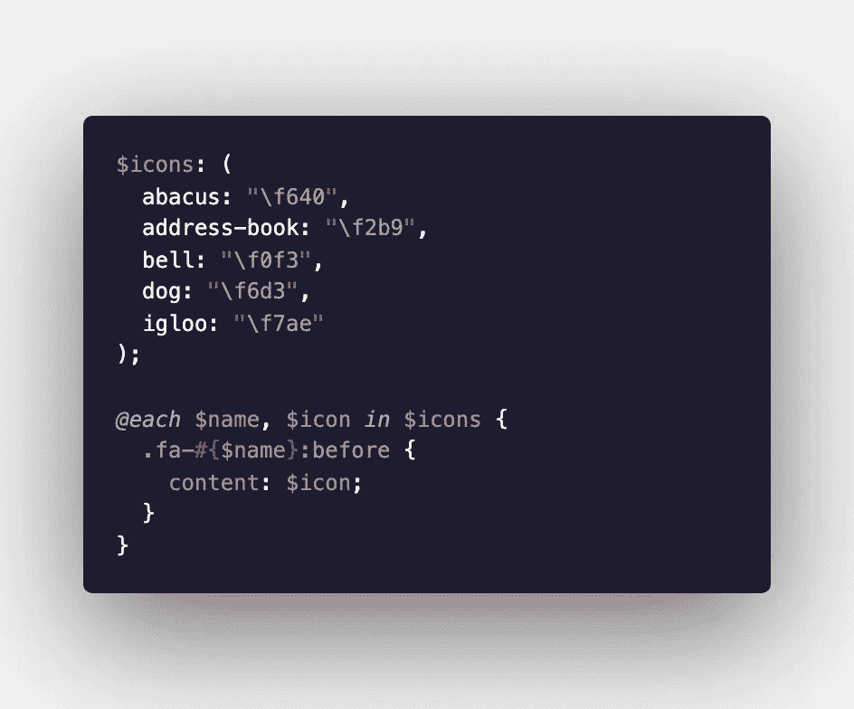
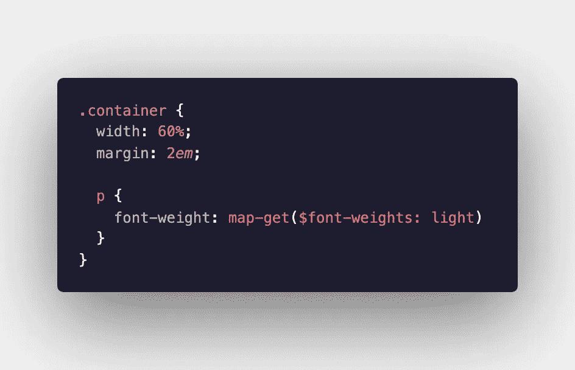
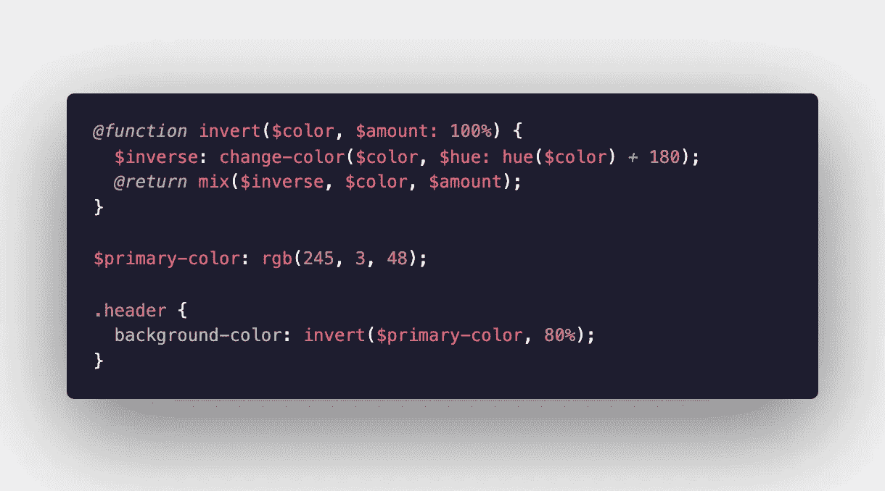
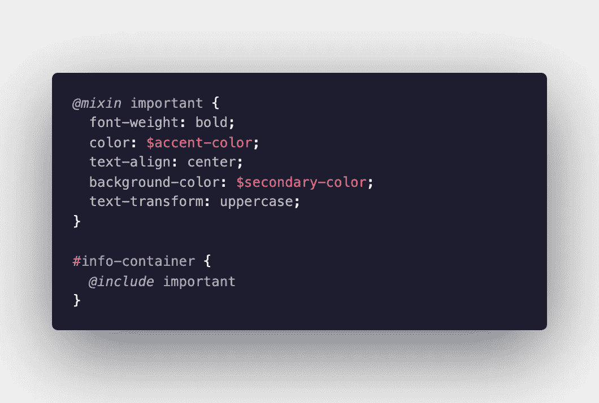
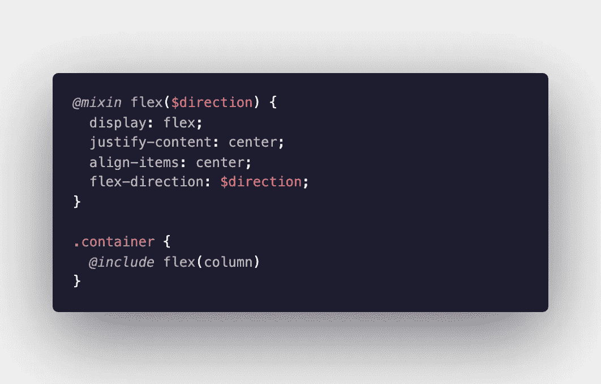

# 萨斯入门指南

> 原文：<https://levelup.gitconnected.com/a-beginners-guide-to-sass-cb53596777dd>

# 什么是萨斯？

sass(**s**yntactically**a**we some**s**style**s**sheets)是一种完全兼容所有 CSS 版本的脚本语言。它是一个 CSS 预处理器，允许你给标准 CSS 增加功能、效率和可用性。

# 我为什么要用它？

如果你已经熟悉 CSS，那么 Sass 很容易学习，它使你能够利用变量、函数、混合和其他内置特性，使设计网页或 web 应用程序变得更容易。

# 如果我阅读本指南，我会学到什么？

我不会试图教你关于 Sass 的所有知识，或者你可以用它做的所有事情。相反，我将向您介绍基本概念，以便您可以立即开始！

在我们开始之前，有一些事情你应该知道:

浏览器不能读取 Sass，所以你的 Sass 文件必须编译成普通的 CSS。这可以用 Node.js 作为编译器或者用 Gulp 来完成。您还可以对 Visual Studio 代码使用实时 Sass 编译器扩展。

Sass 支持两种不同的语法格式:

*   Sass:有时称为“缩进语法”,因为它使用缩进而不是括号。如果您正在编写 Sass，请使用。sass 文件扩展名。它看起来是这样的:

*   Scss (Sassy CSS):如果您正在编写 Scss，请使用。scss 文件扩展名。在本指南中，我将使用 Scss。下面是用 scss 编写的相同代码:

我们开始吧！

# 变量

Sass 变量编译成实际值，而不是 CSS 变量。这里有一个简单的例子来说明如何使用变量来节省时间。这使得一次性改变整个网站的颜色变得非常简单。

# 地图

Sass 中的映射包含键值对。Sass 提供了几个函数，可以与 map 结合使用来访问值、为每个值做一些事情、创建新的键-值对等。

## 访问地图中的值

## 为地图中的每个值做一些事情

# 嵌套

在标准 CSS 中，访问子元素有时效率很低。萨斯也让这变得更容易！

访问容器中的所有段落元素

# 功能

函数允许您构建复杂的操作，并在整个代码中重用它们。要定义一个函数，使用`@function`，后跟函数名和任何变量。函数还必须包含函数调用返回值的指示。

资料来源:sass-lang.com

# 混合食品

mix-in 允许我们将 CSS 值分组在一起，以方便和高效。以下是创建和使用混音的示例:

想象一下，必须一遍又一遍地编写所有这些样式

## 混音可以通过参数传递

如果您想要重用在 mix-in 中编写的代码，但是传递不同的值来创建不同的样式，您可以向 mix-in 传递一个参数。

使用 Sass 还有很多很酷很有趣的方式，所以我希望这能激发你的兴趣！试一试；使用起来简单又好玩！

阿曼达·特劳特勒