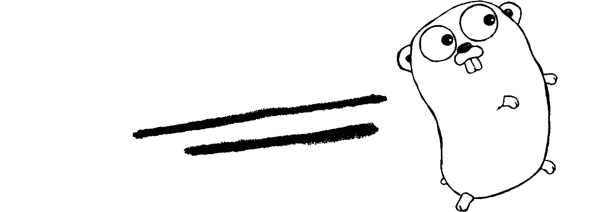
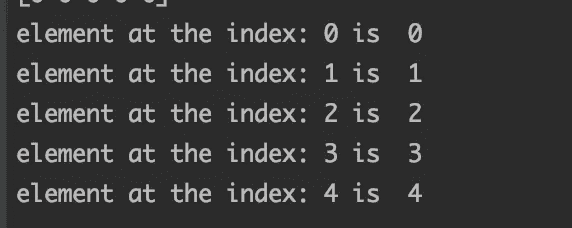
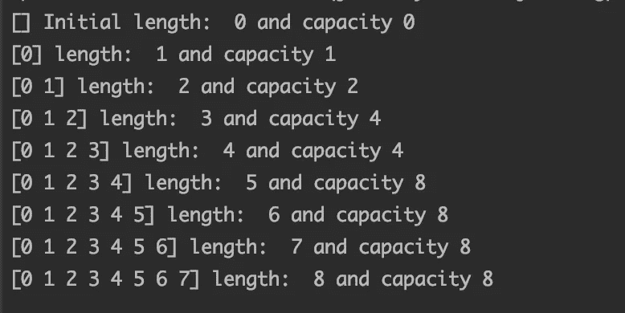
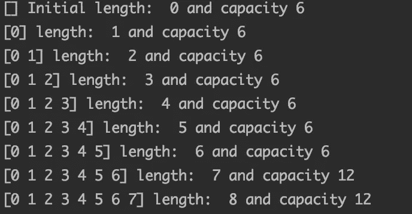

# 围棋切片和数组初学者指南

> 原文：<https://levelup.gitconnected.com/a-beginners-guide-to-slices-and-arrays-in-go-67ed9e54e133>



蕾妮·弗伦奇([http://reneefrench.blogspot.com](http://reneefrench.blogspot.com/))

当我学习 Go 的基础知识时，我惊讶地发现 Go 没有丰富的内置库，比如数组、地图等等..一个原因是，我来自 Java 等传统语言，熟悉数组和映射类型的几种实现。比如有 LinkedLists、ArrayLists、HashMap、LinkedHashMap 等丰富的集合。在 Java 里。很快，我意识到，通过 Go 内置的数组、切片和地图，人们可以轻松完成大部分工作。但是，为了更深入地理解数组、切片和映射的概念，确实需要一个学习过程。在本文中，我将详细介绍数组和切片这两种类型的基本知识和用法。

**数组**

几乎所有的主流语言都有数组。数组是某种*类型*的索引列表。数组有一个固定的大小，我们在初始化的时候提供。数组中元素的索引从零开始。一个字符串数组在下面两个 was 之一中初始化—

要访问和分配一个元素，可以这样做— arr[index]。由于索引从 0 开始，最大可能索引是`length of array-1`。如果我们试图访问一个索引大于数组长度的元素呢？类似于— `array[4]`的东西。它将导致如下错误—

```
invalid array index 4 (out of bounds for 3-element array)
```

这意味着一旦定义了一个数组，就没有办法再添加它了。一个**数组是一个固定的元素列表**。但是在大多数情况下，调整列表大小的特性会派上用场。这就是*切片*进入画面的地方。

**切片**

切片是数组的一部分。切片保存对基础数组的引用。它们是可调整大小的。人们可以添加元素或删除现有的元素。切片不保存数据，它们只保存指向元素数组的指针。切片创建如下—

如上例所示，切片是以这种格式从底层数组创建的— `array[startIndex : endIndex]`。这里有一点需要注意的是，`startIndex`是包容性的，`endIndex`是排他性的。这就是为什么上面代码片段的输出是`[“World”, “!”]`。

简单来说，切片可以理解为如下所示的结构类型

虽然名称、类型、指针引用和长度的含义是可推断的，但容量有点棘手。切片的容量是指从切片的起始位置开始，支撑数组中的元素数量。例如，考虑以下场景—

因为上面的切片从索引 2 开始，到索引 4 结束，所以它的长度是 3。由于支持数组的长度是 10，切片的起始索引是 2，所以切片的容量将是从索引位置 2 到数组末尾 ie 的元素数。10–2 = 8.

上面代码片段的输出是这样的-

```
slice: [3 4 5]  has length:  3 , and capacity: 8
```

注意:切片的长度由内置函数`len()`和通过`cap()`的容量计算得出。

也可以在没有底层数组的情况下创建切片，尽管在内部，Go 将数据保存在数组中。我们可以使用 Go 的内置`make()` 功能—

```
make([]int, 5) 
```

创建一个类型为`int`且长度为 5 的切片。由于`int`类型的零值为 0，上面的切片打印出来看起来像`[0 0 0 0 0]`。

**append()**

实现切片灵活性的一种方法是通过内置的 append 函数。考虑这个场景—

```
slice: [3 4 5]  has length:  3 , and capacity:  4
slice: [3 4 5 9]  array: [1 2 3 4 5 9]
```

最初，从 startIndex 为 2、结束于 4 的数组中切下一个切片。当我们在切片上追加 9，就变成了`[3 4 5 9]`。这里一个有趣的观察是数组的第五个索引是如何从 6 更新到 9 的。这是因为如上所述，切片保存了指向数组的指针。任何添加都会对它支持的数组产生影响。这里有一个奇怪的想法，数组中元素的长度是 5，切片中的最后一个元素现在指向数组中的最后一个元素。当我们试图向切片添加一个元素时会发生什么？

让我们来找出答案。我将下面的代码片段添加到上面的代码中。

```
slice: [3 4 5 9 11]  array: [1 2 3 4 5 9]
```

不出所料，切片中添加了 11。在这一点上没有什么好惊讶的。但有趣的是，数组没有更新。内部发生的情况是，由于数组是一个固定的元素块，并且容量耗尽，Go **将数组的元素复制到一个新数组中，其容量是现有数组的两倍**并且**将切片指向这个新数组**。我们可以通过在切片上调用 **cap()** 来验证这一点。

输出看起来如下—

```
slice: [3 4 5 9]  array: [1 2 3 4 5 9]
capacity of the slice:  4
slice: [3 4 5 9 11]  array: [1 2 3 4 5 9]
capacity of the slice:  8
```

正如预期的那样，容量从 4 个增加到了 8 个。现在对切片的任何更新都不会对它以前指向的旧的`array`产生影响。

**make()**

通过`make()`函数，我们可以创建一个切片，而不必显式初始化一个数组并从中切割一个切片。`make()`所做的是用`length`和可选的`capacity`参数创建一个内部数组。这个内部数组在后台创建，程序员看不到。让我们举个例子——

通过使用`append()`，我们可以增加列表的大小。和以前一样，可以以通常的方式访问特定的元素— `slice[index]`

第二个参数是切片的长度。此外，我们还可以提供容量。让我们看看，随着切片长度的增加，切片的容量是如何变化的。

**迭代**

可以通过循环对切片进行迭代来操作和访问切片。让我们在下面的例子中理解如何用`for`循环来实现——

访问大于切片长度的索引会导致如下所示的错误

```
panic: runtime error: index out of range [7] with length 5
```

可以使用`range`对切片进行迭代

上面代码片段的输出如下-



**长度与容量**

如前所述，在用 make 函数初始化切片时，我们可以提供 capacity 作为可选参数。默认情况下，它与长度参数相同。切片的容量可以看作是 Go 分配给切片的连续存储量。一旦切片长度达到其容量，Go 环境将创建一个容量加倍的新后备数组，并将现有数组中的所有元素复制到新数组中。通过下面的例子，让我们看看容量是如何随着长度的增加而增加的——



看看当长度达到 2 的幂时，容量是如何翻倍的。当切片的长度和容量为 4 时，添加一个数字会触发容量翻倍。

如果我们提供像— make([]int，6，6)这样的自定义容量，容量将遵循 6 的倍数，如下所示—



就这样，对切片内部的基本理解为使用 Go 提供了一个良好的开端。试试这个[https://play.golang.org/](https://play.golang.org/)来写围棋的小片段。

参考 https://blog.golang.org/slices 的官方博客[可以更好地理解切片的概念和特性。](https://blog.golang.org/slices)