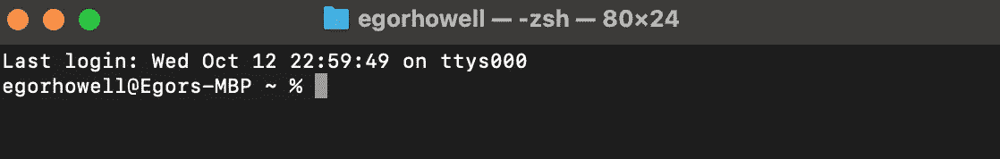
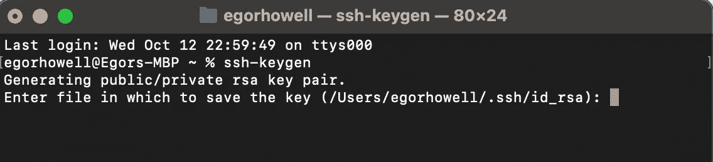
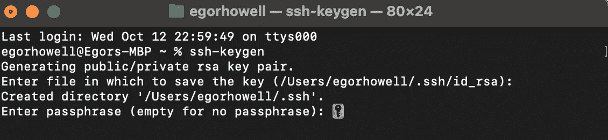
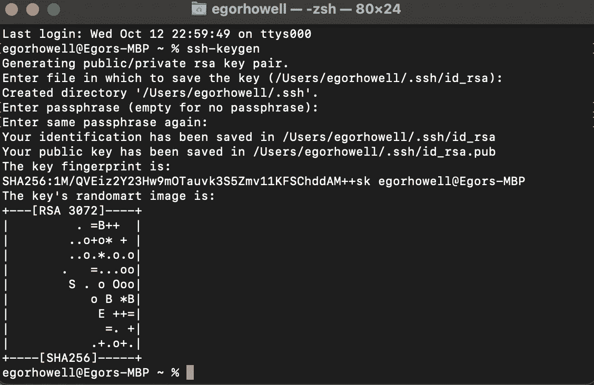
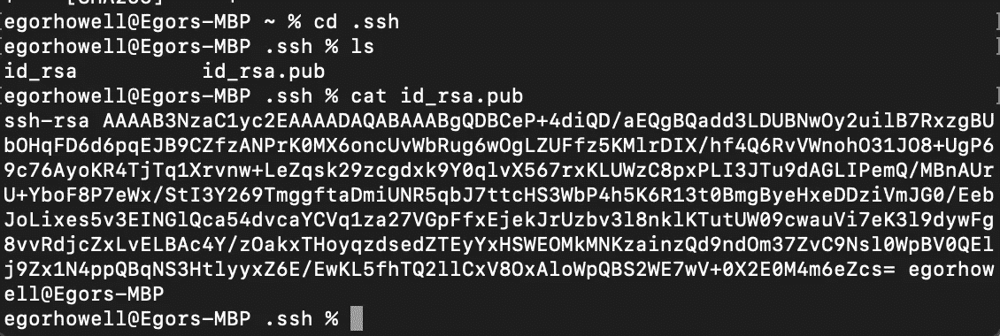
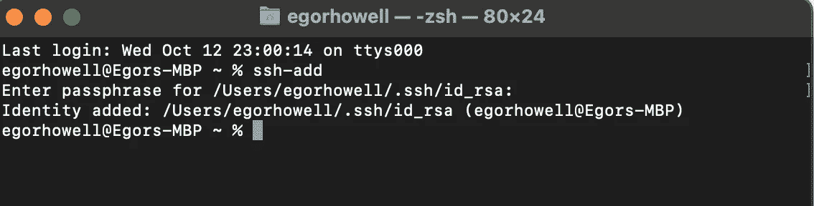
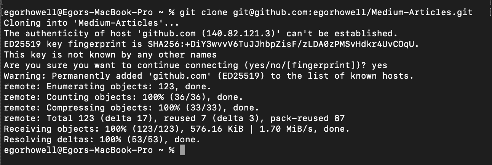

# SSH 初学者指南

> 原文：<https://levelup.gitconnected.com/a-beginners-guide-to-ssh-fb4edbe91233>

解释安全外壳协议的基础和功能


米卡·鲍梅斯特在 [Unsplash](https://unsplash.com?utm_source=medium&utm_medium=referral) 上的照片

# 介绍

如果你在生活中花了一些时间在电脑上，你可能听说过一个叫 [**SSH**](https://en.wikipedia.org/wiki/Secure_Shell) **的东西。**它代表安全外壳协议，基本上是一种在两台服务器或计算机之间进行通信和传输数据的安全方式(使用加密)。

作为一名数据科学家，我经常使用 SSH 来访问数据库，登录 AWS 并获取私人/组织 git repos。

在本文中，我们将回顾 SSH 是如何工作的，并展示它在使用 Git 时的用法。

# SSH 如何工作

经常描述 SSH 的短语是[“客户机-服务器模型”](https://en.wikipedia.org/wiki/Client%E2%80%93server_model)这意味着您，客户端，可以安全地连接到外部计算机，即服务器。一旦你连接上，你就可以执行命令，就像你坐在服务器上一样。

在类似 Unix 的 [**系统上，SSH 的一般命令是**](https://en.wikipedia.org/wiki/Unix-like)

```
ssh username@host
```

*ssh* 是 shell 执行的命令， *username* 是您想要在服务器上访问的帐户， *host* 是指服务器的域/IP。

SSH 中使用了三种不同的加密方法:

*   [**对称加密**](https://en.wikipedia.org/wiki/Symmetric-key_algorithm)
*   [**不对称加密**](https://en.wikipedia.org/wiki/Public-key_cryptography)
*   [**散列**](https://en.wikipedia.org/wiki/Hash_function)

让我们简要概述一下它们以及它们在 SSH 中的用途。

## 对称加密

对于对称加密，客户端和服务器使用相同的密钥来加密和解密消息。在 SSH 期间，客户机和服务器使用某种密钥加密算法就这个“共享密钥”达成一致。

客户端和服务器通常使用[**【AEC】**](https://en.wikipedia.org/wiki/Advanced_Encryption_Standard)和 [**Diffie-Hellman 密钥交换**](https://en.wikipedia.org/wiki/Diffie%E2%80%93Hellman_key_exchange) 算法来生成和商定共享密钥。

## 不对称加密

为了确保客户端有访问服务器的权限，需要一些认证过程。密码是一种选择，但不是最安全的。推荐的认证过程是使用 [**公钥加密**](https://en.wikipedia.org/wiki/Public-key_cryptography) 。

公钥密码的基本过程是有两个密钥，一个公钥和一个私钥。任何人都可以用公钥加密消息，但只有私钥持有者才能解密消息。

最著名的公钥密码系统是[**RSA**(**Rivest–sha mir–ad leman)系统。**用于生成公钥的素数是保密的。只有知道这两个质数(私钥)的人才能解密这些信息。](https://en.wikipedia.org/wiki/RSA_(cryptosystem))

这种方法如此有效的原因是，在当前的计算标准下，找到这两个素数在计算上是不可行的。解决这种加密被称为 [**RSA 问题**](https://en.wikipedia.org/wiki/RSA_problem) 。

## 散列法

[**哈希**](https://en.wikipedia.org/wiki/Hash_function) 就是当你把一些给定的数据变成另一个值的时候，这基本上只是加密。然而，使用散列法，我们实际上从来没有解密过这个值。这是因为散列的输出实际上不可能被去散列。

哈希通常用于身份验证。例如，当您注册一个帐户时，您的密码被散列成另一个值并存储在数据库中。当您尝试登录时，您输入的密码会再次被散列，并与表中的密码进行比较，以验证您的身份。

在 SSH 的情况下，哈希用于验证数据来自应该使用 [**基于哈希的消息认证码(HMAC)**](https://en.wikipedia.org/wiki/HMAC) **。**这只是 SSH 期间的另一个认证步骤。

# SSH 的一般流程

客户端连接到服务器的一般方式如下:

*   客户端发起到服务器的 SSH 连接
*   服务器和客户端使用公钥加密进行身份验证
*   两个系统都同意在相互通信时可以使用的密钥和加密方法
*   客户端现在可以访问服务器了

# 为 GitHub 使用 SSH 密钥

我们现在将通过一个例子来说明如何使用 SSH 来轻松访问 GitHub。

## 生成公钥和私钥

首先打开包含 shell 的终端。您应该会看到类似这样的内容:



图片来自作者。

现在输入命令 **'ssh-keygen'** :



图片来自作者。

这将使用我们上面讨论的 RSA 算法生成一个公钥和私钥。如果您对保存密钥的位置感到满意，请按 enter 键。



图片来自作者。

现在将提示您输入一个密码短语，当您想要访问/使用您的密钥时，您将需要该密码短语。制作一个并按回车键。



图片来自作者。

好了，您已经生成了您的密钥！

要查看您的密钥，请使用'**CD '**进入其隐藏文件夹，并使用' id_rsa.pub '文件上的'**cat '**查看您的公钥:



图片来自作者。

记住您可以与任何人共享的公钥，但永远不要共享您的私钥！

## 向 GitHub 添加公钥

*   通过运行' **pbcopy < id_rsa.pub'** 将您的公钥添加到您的剪贴板
*   打开 GitHub，进入设置，然后进入 SSH 和 GPG 键
*   点击“添加新的 SSH 密钥”并粘贴您的公钥

## SSH 到 GitHub Repo

通过运行**‘ssh-add’**并输入您的密码短语，向您的用户添加您的私钥:



图片来自作者。

现在选择一个 repo 来使用 SSH 版本进行克隆。我将克隆我的[中型商品](https://github.com/egorhowell/Medium-Articles)回购:



图片来自作者。

> 您需要将 GitHub 添加到您的允许/已知主机，如上所示。

现在，您可以推送回购代码，而无需验证您的身份，因为您已经通过您的私钥和公钥完成了这项工作！

如果你想了解更多有用的命令和 shell 的功能，请查看我以前的帖子:

[](https://towardsdatascience.com/an-introduction-to-the-shell-676ee5b899df) [## 外壳介绍

### 解释外壳的用途和基本功能

towardsdatascience.com](https://towardsdatascience.com/an-introduction-to-the-shell-676ee5b899df) 

# 结论

在本文中，我们已经了解了 SSH 是什么以及它是如何工作的。我们还展示了如何使用它来简化 Git 流程，使您能够推送代码，而无需不断验证您的身份。

# 参考资料和进一步阅读

*   [https://www . hosting er . com/tutorials/ssh-tutorial-how-do-ssh-work](https://www.hostinger.com/tutorials/ssh-tutorial-how-does-ssh-work)
*   https://phoenixnap.com/kb/how-does-ssh-work
*   【https://en.wikipedia.org/wiki/Secure_Shell 

# 和我联系！

*   要在媒体上阅读无限的故事，请务必在此注册！ 💜
*   [*当我在这里发布注册邮件通知时获得更新！*](/subscribe/@egorhowell) 😀
*   [*LinkedIn*](https://www.linkedin.com/in/egor-howell-092a721b3/)*👔*
*   *[*碎碎念*](https://twitter.com/EgorHowell) 🖊*
*   *[*github*](https://github.com/egorhowell)*🖥**
*   **[](https://www.kaggle.com/egorphysics)**🏅****

> ***(所有表情符号由 [OpenMoji](https://openmoji.org/) 设计——开源表情符号和图标项目。许可证: [CC BY-SA 4.0](https://creativecommons.org/licenses/by-sa/4.0/#)***