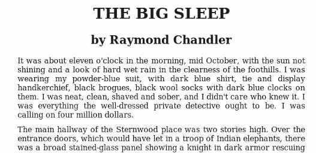
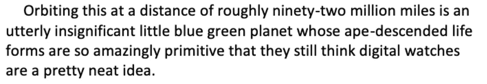
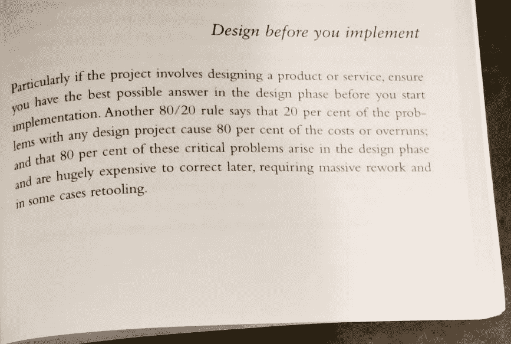

# 使用 Pytesseract 的 Tesseract OCR 初学者指南

> 原文：<https://levelup.gitconnected.com/a-beginners-guide-to-tesseract-ocr-using-pytesseract-23036f5b2211>


照片由[布兰迪·里德](https://unsplash.com/@brandi1?utm_source=medium&utm_medium=referral)在 [Unsplash](https://unsplash.com?utm_source=medium&utm_medium=referral) 拍摄

**光学字符识别**或光学字符阅读器(OCR)是将打字、手写或印刷文本的图像电子或机械转换成机器编码的文本，无论是扫描的文档还是文档的照片。在当今世界，我们不是将数据存储在纸张和书籍上，而是以数字方式存储它们，因为计算机硬件现在可以存储万亿字节的数据，所以我们在 1g 的硬盘上存储数百万本书没有问题。OCR 帮助我们扫描图像、文档或任何纸质文档，并将它们的文本转换为数字文本形式，而不是手写或计算机生成的收据。作为一个过程，OCR 通常由几个子过程组成，以尽可能精确地执行。子流程包括:

*   图像预处理
*   文本本地化
*   字符分割
*   字符电子识别
*   后加工

上面列表中的子过程当然可以不同，但是这些是实现自动字符识别所需的大致步骤。在 OCR 编程语言中，我们有 tesseract API。它被认为是当时最准确的开源 OCR 引擎之一。它最初是由惠普开发的，后来谷歌赞助了他们的开发，并对其进行了大量改进。在本文中，我们将介绍如何使用`Pytesseract`通过 Python 读取各种扫描文档。

# 宇宙魔方

Python-tesseract 是 Python 的光学字符识别(OCR)工具。也就是说，它将识别并“读取”嵌入图像中的文本。

Python-tesseract 是`Google’s Tesseract-OCR Engine`的包装器。它作为 tesseract 的独立调用脚本也很有用，因为它可以读取 Pillow 和 Leptonica 图像库支持的所有图像类型，包括 jpeg、png、gif、bmp、tiff 等。此外，如果用作脚本，Python-tesseract 将打印识别的文本，而不是将其写入文件。

# 安装:

在 windows 上安装宇宙魔方非常简单，只需从[这里](https://digi.bib.uni-mannheim.de/tesseract/)下载最新版本。有关 Mac 和 Linux 安装指南，请访问此处的。安装完成后，通过在终端或 cmd 中键入命令来验证一切正常

`tesseract — version`

之后，您可以使用 pip 为 tesseract 安装 python 包装器。
`pip install pytesseract`

# 图像到文本

在一个目录中创建一个 py 文件，并在你的代码编辑器中打开它，第一步我们将加载 by `pytesseract`模块和 Pillow 模块，然后进行图像到文本部分。

我们已经导入了我们需要的两个主要模块`pytesseract`和`PIL`，接下来，我们在`tesseract_cmd`类对象中设置宇宙魔方文件夹的路径。我们在代码中使用 Pil 模块(Pillow)来读取图像，并将其传递给`pytesseract`来识别文本。Pytesseract 类有一个方法名`image_to_string()`，我们通过`Pil` open 函数传递图像文件名，还有一个语言参数，现在我们不传递任何语言参数，函数将它设置为默认的英语语言，以便从图像中识别文本。下面是我用来提取文本的图片。



## 输出:

```
THE BIG SLEEP
by Raymond Chandler

It was about eleven o'clock in the morning, mid October, with the sun not
shining and a look of hard wet rain in the clearness of the foothills. I was
wearing my powder-blue suit, with dark blue shirt, tie and display
handkerchief, black brogues, black wool socks with dark blue clocks on them. I was neat, clean, shaved and sober, and I didn’t care who knew it. I was everything the well-dressed private detective ought to be. It was calling on four million dollars. ‘The main hallway of the Sternwood place was two stories high. Over the entrance doors, which would have let in a troop of Indian elephants, there ‘was a broad stained-glass panel showing a knight in dark armor rescuing
```

让我们更深入地研究一下 Pytesseract，我们可以绕过 image_to_text 方法中的`lang=`关键字来处理多种语言。

## 在文本周围放置方框

Pytesseract 可以为您提供 OCR 的边界框信息。下面的代码将为您提供一个 tesseract 中边界框检测的每个字符或文本。



## 输出:

```
O 70 201 98 233 0
r 87 192 109 235 0
b 102 201 116 225 0
i 120 201 140 235 0
t 145 201 168 233 0
i 172 201 178 233 0
n 184 201 203 225 0
g 207 192 228 225 0
t 240 201 254 230 0
h 258 201 278 234 0
i 284 201 289 233 0
s 294 201 309 225 0
a 323 201 342 225 0
t 346 201 360 230 0
...
...
...
...
a 409 25 427 58 0
. 419 25 450 49 0
```

## 把盒子放在单词上

如果你想要单词周围的框而不是字符，函数`image_to_data`将会派上用场。您可以使用 image_to_data 函数，其输出类型由`pytesseract`输出指定。我还添加了我们使用`image_to_box`方法的同一个图像 planet.png 的输出。

## 输出:

```
level   page_num        block_num       par_num line_num        word_num        left    top     width   height  conf
        text
1       1       0       0       0       0       0       0       1417    247     -1
2       1       1       0       0       0       17      12      1357    219     -1
3       1       1       1       0       0       17      12      1357    219     -1
4       1       1       1       1       0       70      12      1294    43      -1
5       1       1       1       1       1       70      12      158     43      95      Orbiting
5       1       1       1       1       2       240     13      69      33      96      this
5       1       1       1       1       3       323     17      37      29      96      at
5       1       1       1       1       4       374     22      18      24      96      a
5       1       1       1       1       5       408     13      160    33      96      distance
...
...
...
5       1       1       1       4       3       129     193     116     38      96      pretty
5       1       1       1       4       4       260     193     84      29      95      neat
5       1       1       1       4       5       359     189     91      33      96      idea.
```

# 图像预处理

有时图像有一个通常无法读取的文本，在这种情况下，我们需要使用 Opencv 模块进行图像预处理。Python OpenCV 是用 C++做的计算机视觉库。使用此命令`pip install python-opencv`安装模块，下面是我们将从中提取文本的图像，如果您尝试使用普通的`pytesseract`您将不会得到 100 个结果，因为如果您看到的图像有颜色噪声和一些灯光效果。



在将图像交给 OCR 之前，我们可以做很多操作来改善图像。下面我将会给你一些建议。检查以下几点。

*   将图像转换为灰度
*   将图像转换为黑白
*   消除噪音

我将应用其中的几个。首先，我将调整图像的大小，使其变小，然后我将它转换为灰度，最后，我使用自适应阈值方法将它转换为黑白。

有几种方法可以分析页面，tesseract API 提供了页面分段模式功能，可以分析小区域或不同的页面方向。要使用页面分割模式，只需使用关键字`— psm.`，我们将使用 tesseract 页面分割`psm 3`。而宇宙魔方有 13 页分段模式。

以下是 tesseract 支持的页面分段模式列表。

```
0 =   Orientation and script detection (OSD) only.
1 =   Automatic page segmentation with OSD.
2 =  Automatic page segmentation, but no OSD, or OCR.
3 =   Fully automatic page segmentation, but no OSD. (Default)
4 =   Assume a single column of text of variable sizes.
5 =   Assume a single uniform block of vertically aligned text.
6 =   Assume a single uniform block of text.
7 =   Treat the image as a single text line.
8 =   Treat the image as a single word.
9 =   Treat the image as a single word in a circle.
10 =    Treat the image as a single character.
11 =   Sparse text. Find as much text as possible in no particular order.
12 =   Sparse text with OSD.
13 =   Raw line. Treat the image as a single text line, bypassing hacks that are Tesseract-specific.
```

## 输出:

```
Desgin before you implement
Particularly if the project invols desgning a product or service
ensure you have the best possible answer in the design phase
befe you start implementation~! Another 80/20 rule says that 20 per cent of the prob/lems with any design project cause 80 per cent of the costs
or overruns"! and are hugely expensive to correct later.
requiring massive rework and in sem cases retooling.
```

输出被很好地检测到，很好，但它是一些小错误，就像你看到一些未知的特殊字符。我们可以应用更多的 OpenCV 功能来清除图像的噪声，并增加检测的百分比。

# 最后的想法

到目前为止，我们已经学习了使用 pytessera CT(python tessera CT 包装器模块)进行 tesseract OCR 的基础知识。我们已经看到了如何使用 OpenCV 函数和 tesseract API 页面调优函数从图像中提取简单文本和从图像中提取复杂文本。但有时我们有一个文本图像，像非常困难的手写文本或文本验证码，这是非常难以分析的宇宙魔方，所以我们需要更多的调整，以应用于使用 Opencv 和宇宙魔方函数的图像。因此，请阅读他们的官方文档，进一步探索宇宙魔方。这篇文章只是让你对如何使用 tesseract 和如何使用计算机视觉提高检测百分比有一点基本的了解。希望这篇文章对你以后有所帮助。请随时分享反馈。