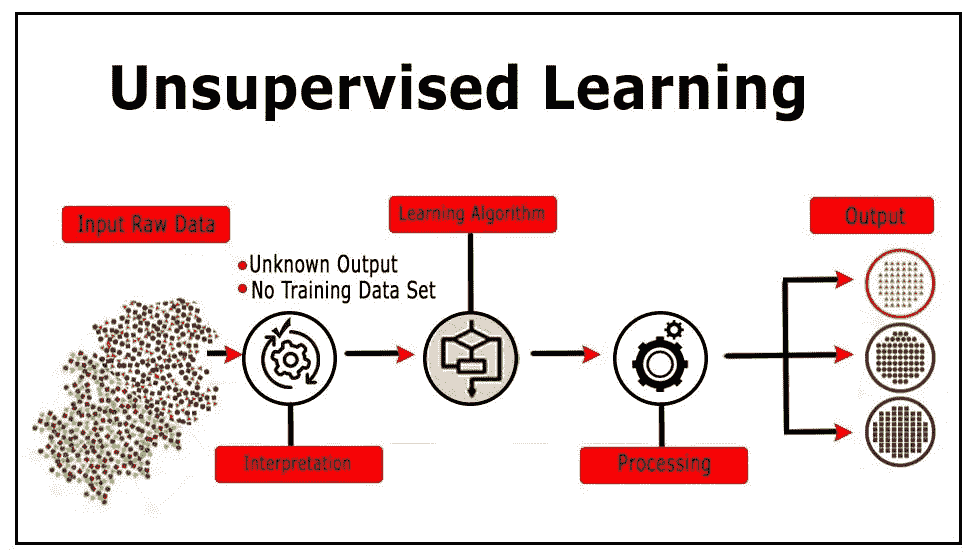
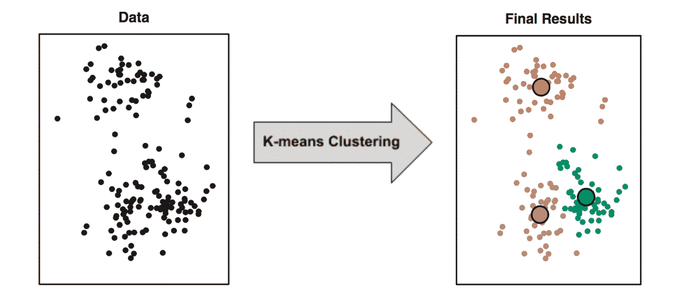
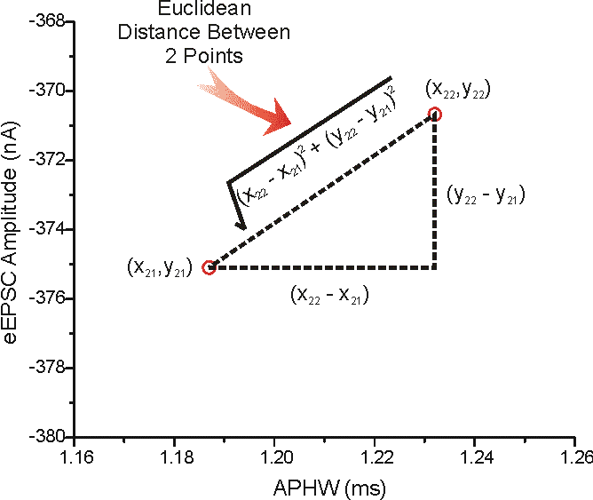
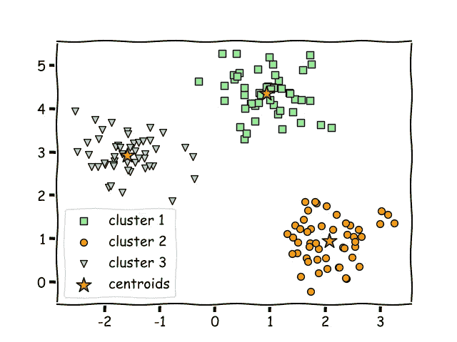
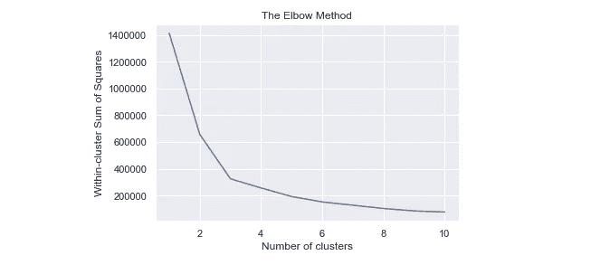
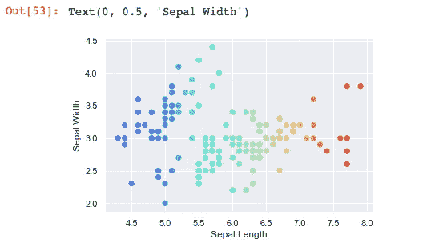
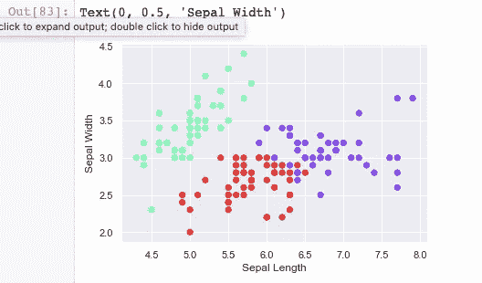
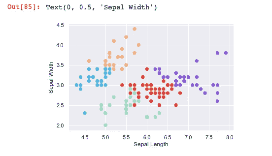

# 初学者实用指南:应用 K-Means 聚类算法

> 原文：<https://levelup.gitconnected.com/a-beginners-practical-guide-apply-k-means-clustering-algorithm-d57295699e61>

这是一个关于如何应用 K-Means 聚类和通过使用无监督机器学习算法从数据集中提取洞察力的实践指南。让我们开始吧！

来源:[https://miro . medium . com/max/1954/1 * iniixlufwhjvlqjlli 7 eq . JPEG](https://miro.medium.com/max/1954/1*iNIixlUFwhJvLQjlilI7eQ.jpeg)

# 你会学到什么

1.  聚类分析工作流
2.  如何执行聚类分析
3.  如何找到最佳的聚类数
4.  如何识别合适的特征
5.  如何解读结果

来源:[https://github . com/Falmouth-Games-Academy/comp 250-wiki/wiki/Unsupervised-Learning](https://github.com/Falmouth-Games-Academy/comp250-wiki/wiki/Unsupervised-Learning)

# K-Means 概述

在我的[的上一篇文章](/k-means-clustering-analysis-machine-learning-c98ed9f85d8a)中，我给出了实际的例子和一个关于如何以及为什么使用集群的完整的例子。你可以在下面或者这个[链接](/k-means-clustering-analysis-machine-learning-c98ed9f85d8a)查看一下。此外，对于任何无监督学习算法，工作流都是从没有标记的模型(输入)开始，然后它们被转换成我们必须自己解释的输出。

聚类是根据数据点之间的相似性和不同点将它们分组在一起。

# 数学先决条件

1.  找出两个数据点之间的欧几里德距离
2.  找到质心

## 欧几里得距离

我不想把你带回几何课，但这是我们可以用勾股定理找到给定直角三角形两条边的第三个刻度的地方。

来源:[https://hlab.stanford.edu/brian/making7.gif](https://hlab.stanford.edu/brian/making7.gif)

**我们需要计算这个有两个原因:**

1.  当执行聚类时，我们将找到聚类之间的距离
2.  这将是一个中心概念，它将把我们带到下面的下一个数学先决条件

## 什么是质心？

*   质心是一组点的平均位置。在物理学中，他们称之为质心。这对于识别数据集中的聚类非常重要。

> 我将用几行代码向您展示如何在我们的代码中满足这两个数学要求！

# 资料组

虹膜数据集在机器学习中非常受欢迎。有 4 个特征:萼片长度、萼片宽度、花瓣长度和花瓣宽度。

加载数据集:[https://www.kaggle.com/uciml/iris](https://www.kaggle.com/uciml/iris)

## 导入依赖项和数据集

## 绘制数据

在这个练习中，试着根据萼片的形状将鸢尾花分组。使用**‘萼片长度’**和**‘萼片宽度’**变量。

## 规范价值观

*   始终[标准化](https://scikit-learn.org/stable/modules/generated/sklearn.preprocessing.StandardScaler.html)数据集中的值，以提高模型的准确性和效率。

# 利用肘法

## WCSS(类内平方和)

*   这种方法既满足了聚类的数学先决条件，又能找到聚类的质心。
*   WCSS 是在[方差分析框架](https://en.wikipedia.org/wiki/Analysis_of_variance)中开发的一种测量方法。
*   所有聚类中每个数据点到各自质心的距离的平方和。想法是最小化总和以达到完美的聚类解决方案..

## 肘法

*   这有助于我们找出数据集的最佳聚类数。

## 了解肘法

构建并比较散点图，以确定在我们的分析中适合进一步使用的聚类数。根据肘部曲线。看起来 2 或 3 个集群的解决方案最适合该数据集。但是，两个群集的解决方案可能不是最理想的，因为从 2 到 3 的跳跃非常大。每个数据集都是不同的，这就是为什么我们每次尝试聚类分析时都需要可视化 elbow 方法。

## 2 个集群

## 3 组

## 5 个集群

> 像聚类这样的无监督学习技术的一个缺点是你需要解释结果。

# 解释结果

原始的鸢尾数据集只有 3 种鸢尾，因为那是原始数据。2-聚类解决方案看起来不错，但在现实生活中，iris 数据集有一个 3 物种聚类解决方案。因此，不能始终信任群集。

有时候看起来 x 集群是一个很好的解决方案，但是在现实生活中，可能有更多(或更少)的 x 集群。这种情况下的最佳解决方案基于您试图解决的指标和问题。在这个特别的教程中，目标是根据物种的数量进行聚类。因此，该数据集的最佳聚类数是 3。

# 结束语

祝贺您学习了如何在数据集上实现 K-Means 聚类算法。

原始数据集具有鸢尾花的 3 个亚种。因此，簇的数量应该是 3。

**这次经历的收获:**

*   肘法并不完美(我们可能会选择 2 甚至 4)。
*   K-means 在我们已经知道聚类数的时候非常有用——在本例中是 3。
*   生物学不能总是被量化(或更好)..用 k 均值量化！其他方法比无监督学习技术(分类)做得更好！

> 您可以尝试使用分类监督学习技术对相同的数据集进行分类。

# 关于集群的更多信息

 [## k 均值聚类分析:机器学习

### 什么是聚类分析？

levelup.gitconnected.com](/k-means-clustering-analysis-machine-learning-c98ed9f85d8a) 

# 来源

 [## sk learn . cluster . k means-sci kit-learn 0 . 22 . 2 文档

### k-均值聚类。了解更多信息。参数 n_clustersint，default=8 要形成的簇的数量以及…

scikit-learn.org](https://scikit-learn.org/stable/modules/generated/sklearn.cluster.KMeans.html)  [## 法尔茅斯-游戏-学院/comp 250-维基

### 无监督学习是机器学习的一个分支，在这个分支中，人工智能算法是使用未分类的…

github.com](https://github.com/Falmouth-Games-Academy/comp250-wiki/wiki/Unsupervised-Learning)  [## 博客

### 365 数据科学博客致力于解释数据科学世界。你会发现数据科学采访…

365datascience.com](https://365datascience.com/blog/) 

# 关于我

 [## Andre Williams -数据分析和数据科学实习生美国电话电报公司| LinkedIn

### 在全球最大的职业社区 LinkedIn 上查看 Andre Williams 的个人资料。Andre 在他们的清单上列出了 5 份工作…

www.linkedin.com](https://www.linkedin.com/in/andrewilliams22/)  [## 安德烈·威廉姆斯-中等

### 用户面试！听说过吗？这是花生酱和果冻三明治里的花生酱。许多人未能…

medium.com](https://medium.com/@andre_williams)  [## Andre-Williams22 -概述

### 在 GitHub 上注册你自己的个人资料，这是托管代码、管理项目和构建软件的最佳地方…

github.com](https://github.com/Andre-Williams22)