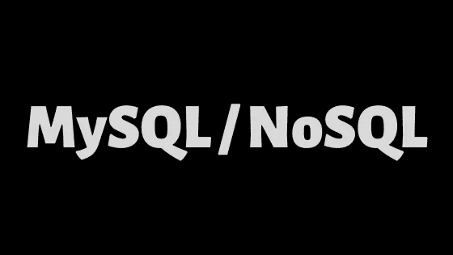
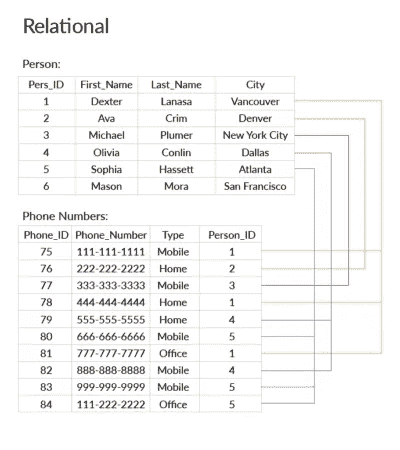
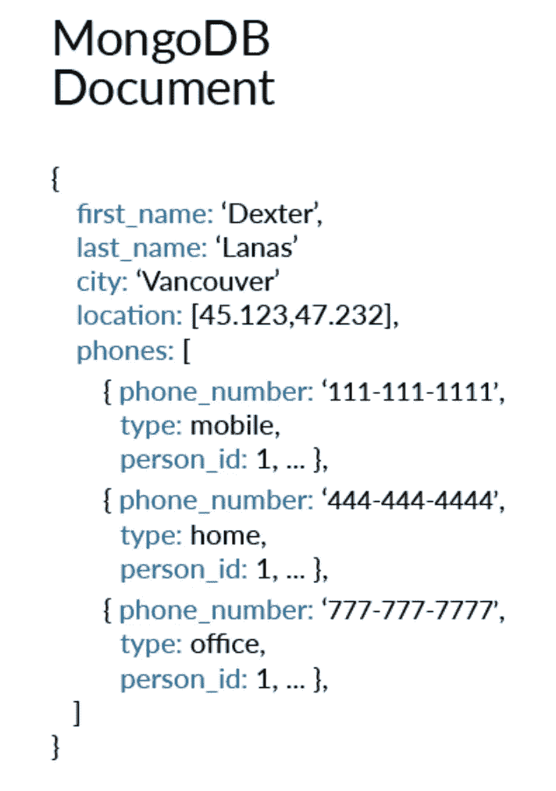

# 关系数据库与非关系数据库的初级入门

> 原文：<https://levelup.gitconnected.com/a-beginners-primer-to-relational-vs-non-relational-databases-20665a83b07c>

快速概述关系型(SQL)和非关系型(NoSQL)数据库，它们是什么，它们有什么不同，以及各自的用例。

在很高的层次上，关系数据库如 MySQL、PostgreSQL 和 SQLite3 在表和行中表示和存储数据。像 MongoDB 这样的非关系数据库在 JSON 文档集合中表示数据。

## **关系数据库和 SQL**

关系数据库由一个或多个表组成，用列和行来组织数据。每一列代表一种特定类型的数据或属性，每一行是一个条目。表和字段类型的映射被称为*模式*。

在输入条目之前，必须清楚地定义模式，而且模式有些僵硬，很难更改。它适用于统一的结构化数据。

结构化查询语言(SQL)最初是由 IBM 在 70 年代早期开发的，是数据库架构师用来设计关系数据库的一种声明式编程语言。一旦设计了数据库，就可以使用 SQL 来查询数据库，更新、添加或删除记录。表可以通过外键互连，查询可以使用 JOIN 语句跨多个表。

SQL 数据库最适用于数据结构一致且不变的情况。如果数据完整性和合规性比灵活性或性能更重要，那么它们也是首选。

## **NoSQL 和非关系数据库**

非关系数据库是面向文档的，这意味着它们将数据存储在单个文档中，这类似于 javascript 对象。

非关系数据库比关系数据库具有更大的灵活性，因为它们不需要预先了解数据的结构或类型，也不要求记录的内容一致。

当存在大量非结构化数据时，或者如果在项目开始时需求不明确，或者如果创建一个明确定义的模式被证明过于复杂，这种类型的数据库非常适用。