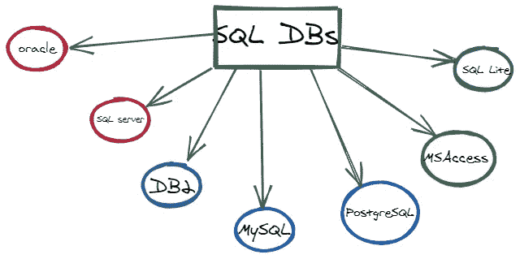
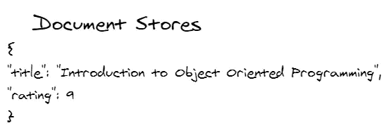

# SQL 与 NoSQL 的初学者参考

> 原文：<https://levelup.gitconnected.com/a-beginners-reference-to-sql-vs-nosql-1793e2a81905>

许多新开发人员想知道`SQL`和`NoSQL`有什么区别。这些主题经常出现在理论讨论和系统设计面试准备中。

在本教程中，我们将基于某些参数来研究 SQL 和 NoSQL 之间的区别。在我们开始之前，让我们单独分析每一个来发展我们对这些对立概念的理解。

*这一课最初发表于 https://algodaily.com***，我在那里开设了一门技术面试课程，并为雄心勃勃的开发人员撰写思考片段。**

# *什么是 SQL？*

*开始时的一些定义:*

*`SQL`代表**结构化查询语言**。顾名思义，它是一种用于执行各种数据操作的查询语言。几乎所有的**关系数据库都支持它。***

**什么是关系数据库？*关系数据库，通常与`SQL`数据库同义，是数据记录的集合，这些数据记录彼此之间可能具有预定义的关联或关系。*

*通过扩展，**关系数据库管理系统(RDMS)** 是管理记录的界面(应用程序或 UI)，通常通过`SQL`的方式。它用于存储、编辑、读取和写入表格形式的数据。它还经常以类似电子表格的形状直观地显示出来。*

**

# *SQL 数据库*

**

*`SQL`数据库，或`Relational Database` s，采用传统的方式存储数据(其中每个数据库可能包含几个表)。然而，值得一提的是，在`RDB` s 中，每个表都包含具有相同属性或“形状”的行。例如，在一个“餐馆”数据库中，您可能有一个针对`customers`的表，一个针对`orders`的表，还有一个针对餐馆`locations`的表。*

*现在列的重要性来了。每一列描述关于记录的一条特定信息。每列将包含的数据类型也是预定义的。例如，在一个`customer`表中，一列可能包含客户`id`(`integer`类型的列)。另一个可能显示客户订单`id`(另一个`integer`)，第三个可能包含关于客户地址的信息(`varchar`)。*

*正确定义表和列是使用数据库的前期工作。然后，日常任务就变成了添加新行。这就是`SQL`语言派上用场的地方。它提供了一种方便的方法来创建表、定义列、添加记录、删除记录等。它还允许我们通过使用`primary`和`foreign`键的概念来“连接”或`associate`(创建关系)多个表。*

**

# *SQL 数据库的类型*

*下面是各种 SQL 数据库的选择。*

**

# *什么是 NoSQL？*

**

*让我们继续讨论`NoSQL`的定义。几个数据库系统在过去几年中迅速普及。它们是非关系型的，支持结构化数据、非结构化数据、半结构化数据、*和*多态数据。*

*在高层次上，NoSQL 不仅仅意味着 SQL。因此，它不是针对单一的数据库产品，而是各种技术的集合。也不要假设数据库在本质上是相似的。*

*如上所述，对于什么构成数据库没有正式的规则。这个术语描述了更多关于他们不是什么的**。***

*NoSQL 数据库:*

*   *通常不使用 SQL*
*   *通常不在表中存储数据*
*   *平时不在乎关系*
*   *通常不提供 ACID 事务*
*   *通常不需要正式的数据模式(使它们更加灵活)*

# *NoSQL 技术的类型*

*让我们浏览一下`NoSQL`风格的数据存储产品列表。*

1.  ***文档数据库/文档存储:**这些都是围绕这样一个思想组织的，即要存储的基本东西是一段自包含的数据(称为`document`)。这样的文档描述了自己的模式——这与定义明确的列中约束的单个数据行相反。使用`document` s，通常在形状或结构上没有限制。它可能是`XML`格式，但通常是`JSON`——一种基于普通旧 Javascript 对象的松散结构。*

***示例:**存储一个简单的数据，包含两条信息:`title`和`rating`。`title`是一个字符串，`rating`是一个整数。*

**

*在下一段数据中，我们有不同的描述并利用了`nesting`信息。*

**

*当我们没有模式时，我们可以简单地在这个数据存储中自由地添加新文档。唯一的约束是每个`document`将被赋予一个唯一的`id`。但是除此之外，你通常有完全的灵活性。不需要提供正式的模式，也不需要定义关系。这样做的一个缺点是数据库需要提供更灵活的方式来查询数据——因此出现了像`CouchDB`和`MongoDB`这样的解决方案。*

*2.**键值数据库**是另一个类别。它的主要重点是让你的数据没有预定义的模式。它所做的只是基于键值对存储和检索一切。在某些方面，它就像一个两列的表格(如果您有一个`key`列和一个`value`列),其他什么也没有执行。它可以是任何数据类型。你可以放进`XML`或`JSON`的小块。*

*此外，值得一提的是，这一类别中的许多产品都专门设计了容错分布式体系结构。简化，这意味着您可以轻松地在多台机器上安装它们。因此，没有一台机器是故障点—数据库可以在机器故障后继续运行。*

**

*3.**图:**又一类`NoSQL`科技。它是一个数据存储，其中的一切都以连接节点的形式保存在一个`graph`结构中。没有一个“主”点。虽然许多其他 NoSQL 数据库管理系统倾向于不强调关系，但是`graph database`都是关于数据节点相互连接，描述它们之间的关系。*

**

***4。面向列的数据库:**在传统的面向行的数据库中，当我们试图检索一个特定的记录时，每一行都会被扫描。为某些列编制索引可能会提高查找速度，但是，为每一列编制索引会降低更新(写入)速度。有时可能需要通过锁定表的某些部分来锁定表——如果不是完全锁定，也可以是部分锁定。*

*这就是面向列的数据库派上用场的地方。它们分别存储各个列，当我们的列数有限时(因为每个表中只有一种数据类型)，可以进行有效的扫描。因此，添加新列是非常高效的。然而，添加整个记录变得更加困难。尽管它们看起来与传统数据库相似，但存储和检索数据的方法才是真正的区别所在。它们最适合分析。面向列的数据库的例子包括但不限于 Cassandra(由脸书作为开源项目发布)、Hypertable、Google BigTable 和 Apache HBase。*

**

# *两者的比较*

*现在我们已经知道了`SQL`和`NoSQL`的基本原理，我们可以深入技术细节，并在某些因素上对它们进行比较。对这些参数进行分析将有助于我们理解它们的差异。*

# *理论差异*

*简而言之，`SQL`数据库主要是`Relational Database Management System`的，而`NoSQL`数据库是非关系分布式数据库和数据存储。*

# *架构:*

*A `schema`是指数据库内记录的*组织和形状。这两种数据库类型的数据存储模型截然不同。**

***SQL 数据库**通常处理以**表格**形式组织的*结构化数据*。另一方面， **NoSQL 数据库**，连同对结构化数据的支持，也提供了存储非结构化、半结构化和多态数据的便利。*

**

*NoSQL 数据库可以以文档存储、键值对、图形数据库和列存储的形式存储信息。这些数据库没有需要遵循的预定义模式。*

*这种区别使它们适用于特定的场景。例如，`RDB`对会计系统来说直观上是有用的，因为它们很好地模拟了会计分类账。在数据类型的灵活性至关重要的“大数据”场景中，NoSQL 是首选。*

**

# *可量测性*

*可伸缩性是指数据库技术如何在不牺牲性能的情况下适应不断增长的数据量。*

*在这方面，单一 SQL 数据库往往是**垂直可伸缩的**，也就是说，可以通过使用更高效、更新的硬件(CPU、RAM 和 SSD)来处理额外的负载。另一方面，NoSQL 数据库倾向于更具水平可伸缩性(它们可以通过在数据库集群中的更多服务器之间分配流量来自动处理更多的流量)。*

*注意，关系数据库也可以通过更多的硬件来扩展——但是，要统一各种数据库实例，还需要做一些额外的工作。这就是为什么当我们的数据以非常高的速度增长时，NoSQL 数据库是首选。*

# *支持*

*从历史上看，SQL 数据库早在`NoSQL`出现之前就已经出现在市场上了。因此，几乎所有的 SQL 数据库供应商都为他们的用户提供了大量的支持，这并不奇怪。此外，一个庞大的独立顾问社区正在帮助 SQL 数据库的大规模部署。*

*当然，NoSQL 数据库也开始出现同样的情况。然而，许多仍然处于萌芽阶段，因此更多地(或者经常是唯一地)依赖于开源社区的支持。此外，在建立和部署大规模 NoSQL 数据库时，独立顾问也更加稀缺。*

# *使用的语言*

***SQL 数据库** `support Structured Query Language (SQL)`它允许我们对数据库执行各种操作。它通过提供不同类型的命令来实现这一点。这些命令可以根据其功能进行分类:*

1.  *数据定义语言 (DDL)*
2.  ***数据操作语言** (DML)*
3.  *数据控制语言(DCL)*
4.  ***交易控制语言** (TCL)*
5.  ***数据查询语言** (DQL)*

*虽然`SQL`是执行数据库操作最稳定和最广泛使用的选项，但它可能有局限性，因为它要求用户预先定义表和记录的结构。还有一个约束是，它存储的所有数据在观察该结构时必须一致。*

*另一方面， **NoSQL 数据库**是*动态灵活的*。它们允许以多种方式存储非结构化数据。根据数据的性质，NoSQL 选项包括文档存储、键值对、图形数据库和面向列的存储。如前所述，您不需要事先想出数据的结构。每个文档都有自己独特的结构。这被称为`Unstructured Query Language (UnQL)`，语法因产品而异。*

# *酸与碱模型:*

*`SQL`数据库从不在`ACID`(原子性、一致性、隔离性、持久性)属性上妥协。另一方面，大多数 NoSQL `DB`遵守布鲁尔斯上限定理(一致性、可用性和分区容差)和`BASE`模型(基本可用性、软状态、最终一致性)。*

**

# *例子*

*最后，我们来提供一些例子。尽管有许多 RDB 和 NoSQL，我们将把这个列表限制为最受欢迎的:*

***SQL 数据库包括** MS-SQL、Oracle、SQLite、MySQL 和 Postgres。*

***NoSQL 数据库包括** CouchDB、MongoDB、BigTable、Cassandra、Redis、RavenDB、HBase、Neo4j。*

**本课最初发表于*[*https://algodaily.com*](https://algodaily.com/lessons/a-beginners-reference-to-sql-vs-nosql)*，我在那里开设了一门技术面试课程，并为雄心勃勃的开发人员撰写思考片段。**