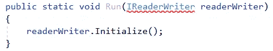
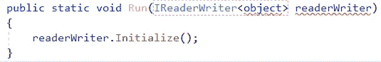
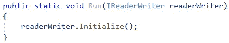
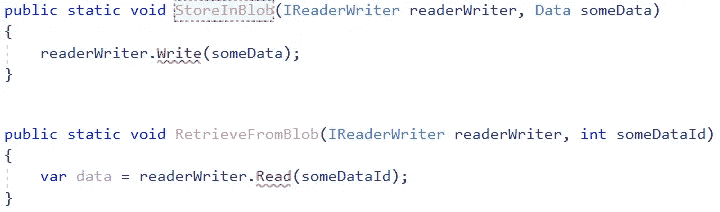
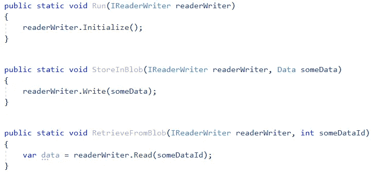
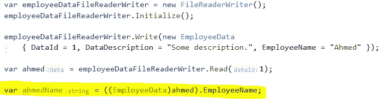
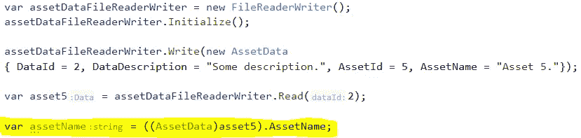
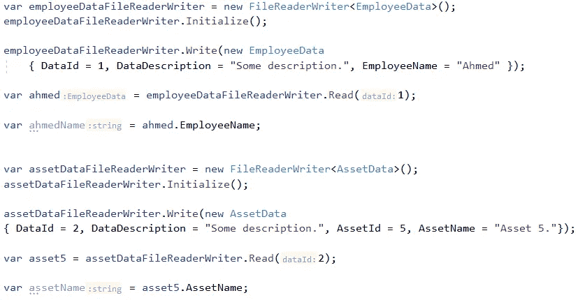
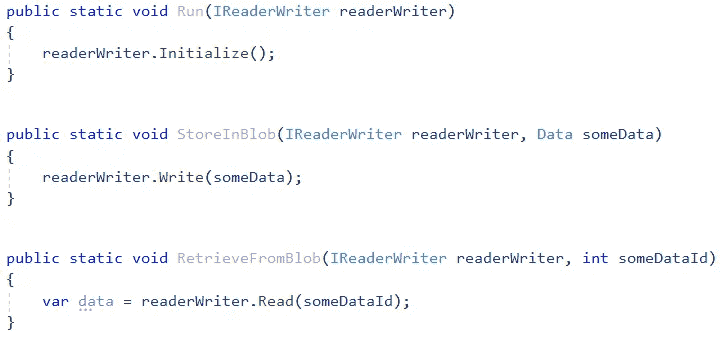

# 中设计界面的最佳实践。NET C#

> 原文：<https://levelup.gitconnected.com/a-best-practice-for-designing-interfaces-in-net-c-2c6ebdb4f1c1>

## 最佳实践

## 是否足以定义 imin interface<t>？我也需要 IMyInterface 吗？</t>

由[凯利·西克玛](https://unsplash.com/@kellysikkema?utm_source=unsplash&utm_medium=referral&utm_content=creditCopyText)在 [Unsplash](https://unsplash.com/?utm_source=unsplash&utm_medium=referral&utm_content=creditCopyText) 上拍摄的照片

在处理您的杰作软件系统时，您定义自己的接口作为不同系统模块之间的契约，并将一些契约暴露给外部世界。对于任何软件开发人员来说，这都不是火箭科学。

然而，作为一名软件工程师，我多年来学到的是，我们应该更加关注如何设计我们的界面。如果你搜索互联网，你会发现大量的资源讨论设计界面时应该遵循的最佳实践，其中一些实际上是很好的资源。

但是，我还有一个最佳实践可以告诉你，除了极少数的巧合之外，我在网上找不到。

 [## 订阅艾哈迈德的时事通讯？

### 订阅艾哈迈德的时事通讯📰直接获得最佳实践、教程、提示、技巧和许多其他很酷的东西…

medium.com](https://medium.com/subscribe/@eng_ahmed.tarek) 

Susan Q Yin 在 [Unsplash](https://unsplash.com/?utm_source=unsplash&utm_medium=referral&utm_content=creditCopyText) 上拍摄的照片

# 定义 imin interface<t>够了吗？我也需要 IMyInterface 吗？</t>

要回答这个问题，让我们一步一步地看下面的例子，所以请耐心等待，不要急于求成。

照片由 [Goh Rhy Yan](https://unsplash.com/@gohrhyyan?utm_source=unsplash&utm_medium=referral&utm_content=creditCopyText) 在 [Unsplash](https://unsplash.com/?utm_source=unsplash&utm_medium=referral&utm_content=creditCopyText) 上拍摄

## 放弃

为了简单起见，我们不会在这里遵循很多最佳实践，而是将主要焦点转移到我们正在讨论的主题上。因此，没有不必要的抽象，没有对不变性的关心，…诸如此类。

## 主要实体类别

这些是我们将要使用的主要实体类。

## 通用接口

这是我们将要使用的通用接口，也是我们应该关注的。

我们在该界面上注意到以下内容:

1.  它是一个通用接口，接受类型为`Data`的通用参数。
2.  它有一个`Initialize`方法。
3.  它有一个`Read(int dataId)`方法，该方法需要一个整数参数并返回一个`TData`。
4.  它的`Write(TData data)`方法需要一个`TData`参数。

## 通用接口实现者

这是实现我们的通用接口的类。该类本身是泛型的。

我们注意到该类的以下内容:

1.  它是一个泛型类。
2.  这些方法会抛出异常，这样做是为了将主要焦点转移到它所属的地方。

## 在员工模块内部

现在，在你的系统中，你有一个专门管理**员工**数据的模块，姑且称这个模块；**员工模块**。

在**雇员模块**中，你可以确定你正在处理的数据的类型，它显然属于`EmployeeData`类型。

这就是为什么你可以像下面这样毫无问题地编写代码。

## 在资产模块内部

现在，在你的系统中，你有一个专门管理**资产**数据的模块，姑且称这个模块；**资产模块**。

在**资产模块**中，您可以确定您正在处理的数据的类型，显然是类型`AssetData`。

这就是为什么你可以像下面这样毫无问题地编写代码。

## 一个公共模块怎么样

现在让我们假设您有一个拥有`Run(IReaderWriter readerWriter)`方法的公共模块。在这个方法中，您希望调用传入的`readerWriter`参数的`Initialize`方法。

你可以试着这样写:

图片由[艾哈迈德·塔里克](https://medium.com/@eng_ahmed.tarek)拍摄

现在很清楚，您不能这样做，因为您没有对`IReaderWriter`接口的非泛型定义。换句话说，我们只有`IReaderWriter<TData>`，没有`IReaderWriter`。

照片由[布雷特·乔丹](https://unsplash.com/@brett_jordan?utm_source=unsplash&utm_medium=referral&utm_content=creditCopyText)在 [Unsplash](https://unsplash.com/?utm_source=unsplash&utm_medium=referral&utm_content=creditCopyText) 上拍摄

## 错误的期望

现在，我能听到有人从远处喊着说:

> 哼，小菜一碟。还是用`IReaderWriter<object>`吧。每个类都是 Object 的子类，对吗？…..天才。

我对他的回答是，他应该做作业，因为这是行不通的。如果你或他不相信我，就试一试，你会看到以下内容:

图片由[艾哈迈德·塔里克](https://medium.com/@eng_ahmed.tarek)拍摄

你需要更多的解释，简单的回答是因为你的接口是不变的；不能调用期望`IReaderWriter<SomeClass>`的方法，传入`IReaderWriter<AnyOtherClass>`的实例。唯一可以接受的叫牌是通过`IReaderWriter<SomeClass>`，没有别的。

如果你想了解更多，你可以查看我的故事 [**中的协变和逆变。NET C#。很难理解吗？我来给你简化一下**。](/covariance-and-contravariance-in-net-c-c2b8576b2155?sk=13f0128f87d2cbfb24f30219796bff31)

 [## 中的协方差和逆变。NET C#

### 很难理解吗？让我为你简化它。

levelup.gitconnected.com](/covariance-and-contravariance-in-net-c-c2b8576b2155) 

布雷特·乔丹在 [Unsplash](https://unsplash.com/?utm_source=unsplash&utm_medium=referral&utm_content=creditCopyText) 上拍摄的照片

## 这是方法

现在你明白了为什么我们需要定义一个非通用的`IReaderWriter`接口。

因此，转到实现，我们可以以下面的代码结束:

现在，我们可以注意到以下情况:

1.  我们定义了一个新的接口，但这次它是一个非通用接口。
2.  这个接口将只定义`Initialize()`方法，因为这是我们在公共模块甚至未来的新模块中实际需要的。
3.  现在，另一个泛型接口可以用`Read`和`Write`方法安全地扩展非泛型接口，而无需改变签名。

## 让我们试驾一下吧

所以，现在让我们回到我们的共同模块，看看它是否会工作。

图片由[艾哈迈德·塔里克](https://medium.com/@eng_ahmed.tarek)拍摄

终于，它开始工作了。让我们庆祝一下，吃点东西，喝点饮料，多好的旅行啊:)

*我不想在这里带来坏消息，但是，我有坏消息……*

Nik Shuliahin 在 [Unsplash](https://unsplash.com/?utm_source=unsplash&utm_medium=referral&utm_content=creditCopyText) 上拍摄的照片

## 为什么这么悲伤

你有**新的需求**进来，公共模块需要一些修改。公共模块现在应该能够**在 Blob 存储器中存储和检索数据**。Blob 存储可以存储任何类型的数据。

因此，根据这些输入，您可以尝试这样做:

图片由[艾哈迈德·塔里克](https://medium.com/@eng_ahmed.tarek)拍摄

现在很清楚，这是行不通的，因为`IReaderWriter`接口没有定义`Read`和`Write`方法。它们在`IReaderWriter<TData>`中定义。然而，在公共模块上，在调用`StoreInBlob`和`RetrieveFromBlob`方法的时候，我们不知道数据的类型。所以，怎么办！！！

照片由 [NeONBRAND](https://unsplash.com/@neonbrand?utm_source=unsplash&utm_medium=referral&utm_content=creditCopyText) 在 [Unsplash](https://unsplash.com/?utm_source=unsplash&utm_medium=referral&utm_content=creditCopyText) 上拍摄

## 走错了路

你现在可能会失去希望，并悲伤地决定放弃整个通用接口的事情。您应该将代码更改为以下内容:

因此，现在公共模块应该如下所示:

图片由[艾哈迈德·塔里克](https://medium.com/@eng_ahmed.tarek)拍摄

但是，您失去了处理强类型对象的优势，如下所示:

图片由[艾哈迈德·塔里克](https://medium.com/@eng_ahmed.tarek)拍摄

现在您必须转换您的 **Employee** 对象，以便您可以访问它的唯一成员，就像图中的`EmployeeName`一样。

图片由[艾哈迈德·塔里克](https://medium.com/@eng_ahmed.tarek)拍摄

类似地，您必须转换您的**资产**对象，以便您可以访问它的唯一成员，就像图中的`AssetName`。

那么，现在怎么办？？？？

迈克尔·卡鲁斯在 [Unsplash](https://unsplash.com/?utm_source=unsplash&utm_medium=referral&utm_content=creditCopyText) 上的照片

## 斗牛中的最后一剑

这里最佳解决方案的关键词是单词`new`。让我给你分析一下。

我们可以注意到以下情况:

1.  `IReaderWriter`接口现在定义了所需的方法。
2.  然而，对于`Read`和`Write`方法，它们现在使用父`Data`实体类型。
3.  `IReaderWriter<TData>`接口现在扩展了`IReaderWriter`接口。
4.  这意味着它也间接定义了我们所知道的三种方法。
5.  但是，在`IReaderWriter<TData>`接口内部，我们需要使用泛型类型`TData`，而不是父类型`Data`。
6.  为此，我们需要向`IReaderWriter<TData>`接口添加`TData Read(int dataId);`和`void Write(TData data);`方法。
7.  对于 read 方法，您不能这样做，因为父接口(非泛型接口)已经在名称和输入参数方面定义了完全相同的方法，只是返回类型不同。
8.  这将使编译器在运行时感到困惑，因为它不知道调用哪个方法，一个返回`Data`或者另一个返回`TData`。
9.  这就是为什么编译器不允许你这样做，除非你像上面的代码一样在方法定义的开头添加`new`关键字。
10.  这指示编译器隐藏从父方法继承的`Read`方法，并用在`new`关键字之后定义的方法替换它。
11.  现在，你可能会问，为什么我们没有用`Write`方法做同样的事情呢？
12.  答案很简单，因为我们不需要这样做。在父接口中，我们已经有了一个名为`Write`的方法，它需要一个类型为`Data`的参数，该参数是可以传递给`Write`方法的所有类型的父类。
13.  这意味着这个方法可以被称为传递任何可能出现的`TData`。
14.  另一件事，如果你尝试使用关键字`new`和`Write`方法，你会得到一个警告，你实际上并没有对父接口隐藏任何东西。这是合乎逻辑的，因为两个`Write`方法有不同的输入参数类型，所以，对编译器来说，它们是两个不同的方法是很清楚的。

我们可以注意到以下情况:

1.  老三的方法是一样的。
2.  现在我们又实现了两个方法。
3.  第一种方法是`Data IReaderWriter.Read(int dataId) { return Read(dataId); }`。
4.  该方法是父`IReaderWriter`接口中定义的`Data Read(int dataId);`方法的**显式实现**。
5.  这意味着无论何时将`FileReaderWriter<TData>`类的对象隐式或显式地转换为非泛型接口`IReaderWriter`，都将使用这个`Read`方法实现。
6.  第二种方法是`void IReaderWriter.Write(Data data) { Write((TData)data); }`。
7.  该方法是父`IReaderWriter`接口中定义的`void Write(Data data);`方法的**显式实现**。
8.  这意味着每当`FileReaderWriter<TData>`类的一个对象被隐式或显式地转换为非泛型接口`IReaderWriter`时，就会使用这个`Write`方法实现。

这导致了以下情况:

图片由[艾哈迈德·塔里克](https://medium.com/@eng_ahmed.tarek)拍摄

和

图片由[艾哈迈德·塔里克](https://medium.com/@eng_ahmed.tarek)拍摄

最后，一切正常:)

照片由[缺口缺口](https://unsplash.com/@jannerboy62?utm_source=unsplash&utm_medium=referral&utm_content=creditCopyText)在[防溅板](https://unsplash.com/?utm_source=unsplash&utm_medium=referral&utm_content=creditCopyText)上拍摄

## 事情就是这样

这种设计技术——甚至害怕称之为模式——已经在。你每天使用的. NET 类。你注意到了吗？净我们有`IEnumerable`和`IEnumerable<T>`？你能想象如果我们没有`IEnumerable`生活会是什么样子吗:)

这意味着你不能编写在可枚举上循环的代码，只能在可枚举上循环。您总是需要首先知道可枚举类型中的项的类型。

你可以争辩说你仍然可以写一个接受`<T>`的方法，然后它会把它传递给`IEnumerable<T>`，但是我的朋友，这将一直持续下去，直到你最终不得不选择一个实体类型。正如我们上面所证明的，这个实体类型并不总是在所有代码层或级别上定义。

因此，我最后给你的建议是，不要拐弯抹角，事情就是这样…

希望你觉得读这篇文章和我写这篇文章一样有趣。

# 希望这些内容对你有用。如果您想支持:

如果您还不是**中的**会员，您可以使用 [**我的推荐链接**](https://medium.com/@eng_ahmed.tarek/membership) ，这样我可以从**中的**中获得您的一部分费用，您无需支付任何额外费用。订阅
[**我的简讯**](https://medium.com/subscribe/@eng_ahmed.tarek) 将最佳实践、教程、提示、技巧和许多其他有趣的东西直接发送到您的收件箱。

[真诚媒体](https://unsplash.com/@sincerelymedia?utm_source=unsplash&utm_medium=referral&utm_content=creditCopyText)在 [Unsplash](https://unsplash.com/?utm_source=unsplash&utm_medium=referral&utm_content=creditCopyText) 上拍摄的照片

## 资源

这些资源可能对你有用

 [## 递归的诅咒。NET C#

### 为什么以及如何在？NET C#

levelup.gitconnected.com](/curse-of-recursion-in-net-c-b017271ddbe6)  [## 如何在单独的请求/命令中取消正在运行的进程。NET C#

### 了解如何在单独的请求中取消已经运行的进程。NET C#

levelup.gitconnected.com](/how-to-cancel-a-running-process-in-a-separate-request-command-in-net-c-2ca8fb733618)  [## 如何为你的媒体故事带来流量

### 如何在媒体上取得成功并为你的故事带来流量的实用指南。

medium.com](https://medium.com/illumination/how-to-drive-traffic-to-your-medium-stories-f82a9f5eb6c7)  [## 中模板方法设计模式的分析。NET C#

### 中学习模板方法设计模式。NET C#并探索不同的可能性。

levelup.gitconnected.com](/template-method-design-pattern-in-net-c-73d0be82571e)