# 处理数据集中缺失值的更好方法:对股票市场数据使用迭代估算器(第二部分)

> 原文：<https://levelup.gitconnected.com/a-better-way-to-handle-missing-values-in-your-dataset-using-iterativeimputer-on-the-stock-market-dbbb5d4ef458>

## [动手教程](https://towardsdatascience.com/tagged/hands-on-tutorials) / [数据清洗](https://towardsdatascience.com/tagged/data-cleaning) / [股市](https://medium.com/tag/stock-market)

## 用多变量估算器处理历史股票市场数据，这是这个两部分系列的第二部分


[Adeolu Eletu](https://unsplash.com/@adeolueletu) 在 [Unsplash](https://unsplash.com/photos/E7RLgUjjazc) 上拍照

# 目录

1.  [**简介**](#5722)
2.  [**股市数据上的迭代估算器**](#2676)
    - [学习你的军事时间](#a2e4)-
    -[操纵](#8331)-
    -[结果在](#8175)-
    -[了解结果](#7f22)
3.  [**结论**](#c10e)
    - [参考文献](#f9bf)-
    -[结束语](#870b)

# 介绍

欢迎阅读这个两部分系列的第二部分。在第一部分，我回顾了几件事情，包括:
-为什么你应该关心缺失数据
-缺失数据的不同类型(MCAR，三月，& MNAR)
-处理缺失数据的不同方法(单变量&多变量插补)

我还通过一个使用 [PIMA Indians 糖尿病数据库](https://www.kaggle.com/uciml/pima-indians-diabetes-database)的示例，讨论了单一插补和多重插补方法如何影响数据分布的形状(偏斜度和峰度)，该示例可在 Kaggle [](#f9bf)上找到。如果你错过了第一部分，我**强烈**鼓励你继续下去，点击[这里](https://gifari.medium.com/a-better-way-to-handle-missing-values-in-your-dataset-using-iterativeimputer-9e6e84857d98)查看！事不宜迟，让我们直接进入第二个例子。

# 股票市场数据的迭代估算

对于这个例子，我将使用股票市场数据向你展示*如何有趣*迭代估算器。我在 Kaggle 上做了一个笔记本，通过使用函数简化了这个过程。读完这篇文章后，我鼓励你尝试一下。您可以通过[点击此处](https://www.kaggle.com/gifarihoque/predict-missing-stock-prices-with-iterativeimputer)查看/编辑笔记本。

> 不幸的是，一个人感兴趣的东西，另一个人可能不感兴趣。Gifari Hoque 的另一个吸引定律。
> 
> 如果你对更多的吸引力法则感兴趣，请在下面留下评论，或者在任何社交媒体平台上联系我。

在我深入这个例子之前，有一点免责声明，因为股票市场更新非常频繁，并且因为我将如何操作数据集(你很快就会看到)，我们可能永远不会得到相同的结果，这完全没问题！

我将使用`yfinance`包获取历史市场数据，用于*操作*(我自己的)。

> yfinance 是一个软件包，用于从雅虎下载股票的历史市场数据。财务。它是由[冉阿让](https://aroussi.com/)开发的，由他和[其他贡献者](https://github.com/ranaroussi/yfinance/graphs/contributors)一起维护。要了解更多关于 yfinance 的信息，[点击这里](https://pypi.org/project/yfinance/)查看 PyPi 上的文档，[点击这里](https://aroussi.com/post/python-yahoo-finance)查看 Ran Aroussi 页面上的文档。你也可以通过[点击这里](https://github.com/ranaroussi/yfinance)在 GitHub 上看到源代码。
> 你可以通过运行`*pip install yfinance*`或者从 [PyPi](https://pypi.org/project/yfinance/#files) 下载，或者从 [GitHub](https://github.com/ranaroussi/yfinance) 克隆/下载来安装 yfinance。

对于本例，这些是必要的导入:

必要的进口。

对于这个例子，我选择使用 Google 的数据。

我将使用的股票代码是$GOOGL (Alphabet 公司 A 类)。我将使用过去 60 个“股市日”(期间)的数据。我将使用每 30 分钟*间隔*的收盘价。

> **注意**:
> 
> -一些有效周期为:1d、5d、1mo、3mo、6mo、1y、2y、5y、10y、ytd、max
> -一些有效间隔为:1m、2m、5m、15m、30m、60m、90m、1h、1d、5d、1wk、1mo、3mo

对于这个例子，我建议你只坚持日内周期(1 米，2 米，5 米，15 米，30 米，60 米，90 米或 1 小时)。
要了解更多信息，请[点击此处](https://aroussi.com/post/python-yahoo-finance)阅读 yfinance 文档。

要下载过去 60 天$GOOGL 的 30 分钟间隔数据，请运行以下代码:

运行上面的代码后，您将得到如下表格:

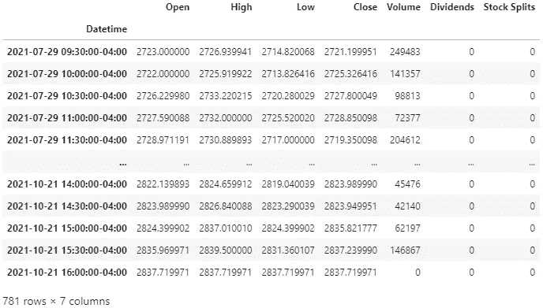

图片由作者提供|该数据是在 2021 年 10 月 21 日下班后检索的。

不需要太多的细节，我将分解它。`Datetime`指数包含过去 60 个交易日(周期)的天数，间隔为 30 分钟。我写这篇文章的 60 天前，也就是 2021 年 7 月 29 日。市场上午 09:30 开门，下午 04:00 关门(东部时区)。如果你还不知道你的服役时间，那就开始吧，士兵。

## 学习你的军事时间

午夜(12:00:00 AM)是 00:00:00。
你一打到 12:59:59 PM，不是下到 01:00:00 PM，而是到 13:00:00。
继续走，直到 23:59:59 也就是晚上 11:59:59，回到午夜，00:00:00。
没错，军用时间就是在不使用 AM 或 PM 的情况下报时。我不得不艰难地学会了这一点🤕。

如果你还不明白，这是我为你做的一张表:

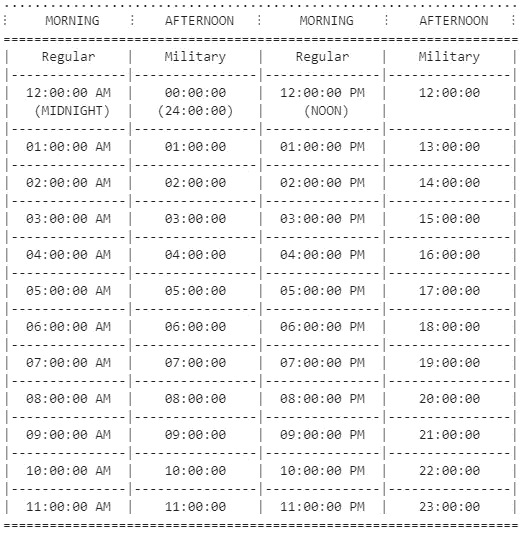

图片由作者提供| Gifari 提供

好的，现在回到数据帧，您可以看到第一行的`Datetime`是 09:30:30–04:00，最后一行是 16:00:00–04:00。市场上午 9:30 开门，下午 4:00 关门。每个`Datetime`的“-04:00”部分表示它是基于纽约州的时间。在我写这篇文章的时候，纽约的时区是“GMT-4”(根据夏令时变化)。

“开盘价”列是该行中指定的时间对应的股票价格。“高”和“低”列是股票在 30 分钟间隔内达到的最高价和最低价。“收盘”栏大约是股票在 30 分钟间隔的最后一秒的价格。“成交量”相当于区间内的交易量。

例如，查看第三行—2021 年 7 月 29 日 10:30:00:

*   10:30:00，$GOOGL 的每股价格约为 2726.23 美元(“开盘价”)。
*   从 10:30:00 到 10:59:59，每股变成的最低价是 2720.28 美元(“低”)。
*   每股在半小时内的最高价格为 2733.22 美元(“高”)。
*   10:59:59，$GOOGL 的每股价格为 2727.80 美元(“收盘”)。

现在，您已经对我们将要使用的数据布局有了一些了解，现在我将更深入地解释我在这个例子中的动机。如前所述，我将使用 30 分钟间隔数据，因此这意味着每 30 分钟，我将有一个$GOOGL 的价格，从 09:30:00 开始直到 16:00:00(下午 4 点)。我还决定使用每个区间的“收盘”价格，而不是“开盘价”(除了每天的第一个“开盘价”——09:30:30 的价格)。我没有理由选择这样做，我只是想这样做。
这意味着，我将得到以下时间的$GOOGL 价格:{09:30:00，09:59:59，10:29:59，10:59:59，11:29:59，11:59:59，12:29:59，12:59:59，13:29:59，13:59:59，14:29:59，14:55 对，一天 14 次。

> 注意:股票市场偶尔会在东部时间下午 4 点前关闭。

我希望能够按日期对数据进行分组，但是，因为日期和时间都聚集在一个数据帧中，所以我决定将这些数据转换成多个单独的数据帧(基于日期)。每一天都是新的一天，但每一天都有相同的时间。因此，每个日期将有 14 个不同的时间列，其中将列出在该指定日期和时间的每股$GOOGL 的价格。我把你弄糊涂了吗？以下是我想要的布局:

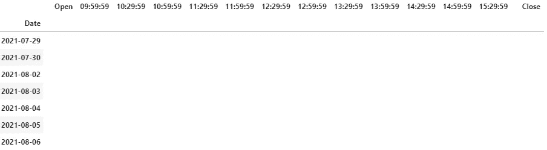

图片作者|你困惑的解药。

当然，[这个布局会用值](https://i.kym-cdn.com/photos/images/newsfeed/000/210/119/9b3.png)填充。为了便于操作，我将用 NaN 替换随机列中的随机值，然后我将使用 IterativeImputer 尝试*猜测*那个数字是什么。听起来有趣吗？

## 操纵

现在，让我们根据日期将表拆分成单独的表，然后从每个表中提取我们想要的值。基本上，每个日期都有自己的数据框架。

列表`dates`是所有日期的列表，列表`data`是每个日期的数据帧的列表。

以下是`dates`的前十个日期:

```
>>> dates[:10]
```

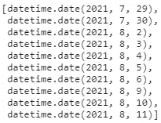

列表中的前十个日期为“日期”。

这是`data`中第五个日期(08/04/2021)的数据:

```
>>> data[4]
```

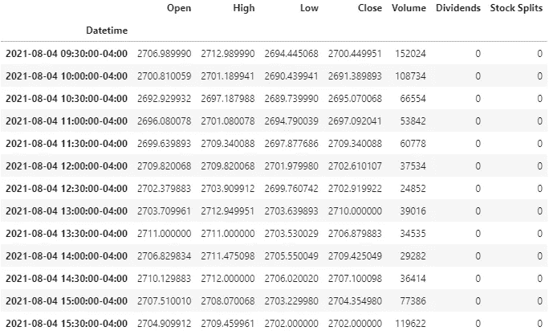

图片作者|这是 2021 年 8 月 4 日$GOOGL 的 30 分钟区间数据。

现在，让我们为我们的列名创建一个字典，追加值(四舍五入)并制作一个数据帧，其中包含每天 09:30:00 的“开盘价”和每天每 30 分钟的“收盘价”。
注意，我使用了“打开”和“关闭”，而不是“09:30:00”和“15:59:59”。

> 注意:Python 的内置函数`*round()*`可能行为不当。例如，`*round(2.675, 2)*`给出了`*2.67*`。这不是一个 bug 或错误，要了解更多信息，[单击此处](https://docs.python.org/3/library/functions.html#round)。对于我的例子来说，[如何对待这些值并不重要。](https://memegenerator.net/img/instances/67036946/it-doesnt-matter-what-your-opinion-is.jpg)

下面是公正的示例代码:

创建一个字典来添加必要的数据，然后制作一个数据框架。

在你显示`adf.head()`之后，你会得到这样的东西:

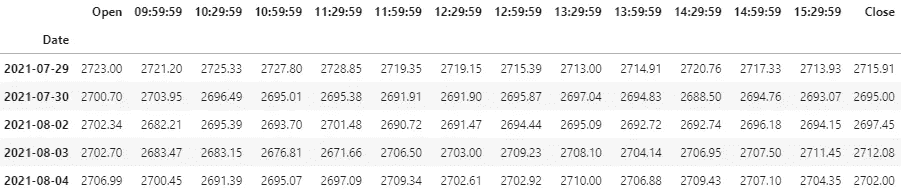

作者图片|新数据帧的前五行

我们的新布局现在在列中列出了所有时间，在索引中列出了所有日期。从这里开始，让我们把这解释为一个(日期，时间)对。例如，`(2021–08–04, 15:29:59) = 2704.35`表示在*日期*“2021–08–04”**的**时间*“15:29:59”，GOOGL 的价格为$2704.35。*

*现在，`len(adf)`将返回 60(天)，而`adf.count().sum()`将返回 840(60 天* 14 次= 840 个值—价格)。*

*现在让我们替换随机值。在这个演示中，我将使用`.sample()`进行随机选择。让我们从 14 个列中随机选择 8 个不同的列，在这 8 个选择的列中，让我们随机选择 20%的值并用 NaN 替换这些值。这意味着:*

*   *8 列中的 12 个不同的行(60 的 20%是 12)将是 NaN*
*   *12 个不同的日子将会有 8 个所选时间的缺失价格*
*   *我们应该预期总共有 12 * 8 = 96 个值被 NaN 替换，这意味着 744 个值将不是 NaN。*
*   *大约 11.4286%的数据集现在是 NaN。*

*这将使 8 个不同列中的 20%的行随机变为 NaN*

*现在，如果我们运行`cdf.count().sum()`，我们将得到 744。
这些是选择的列(运行`cols`查看您的列):*

*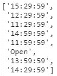*

*作者图片|所选栏目*

*如果我们运行`cdf.info()`，我们可以看到 14 列中的 8 列现在有 48 个(总共 60 个)非空值，而其余的有 60 个(总共 60 个)非空值:*

*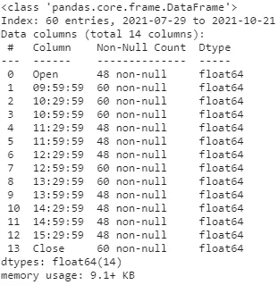*

*作者图片|替换后的非空计数*

*如果您显示`cdf`，您将意识到在一列中选择的行与在另一列中选择的行不同。下面是`cdf.head()`的显示:*

*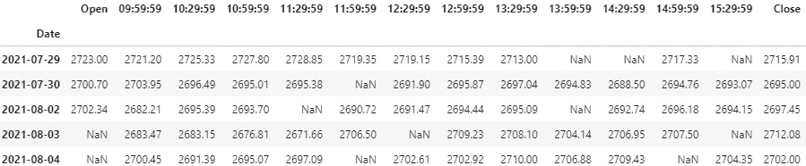*

*作者图片|替换后我们操作的数据帧的前五行*

*现在让我们用迭代估算器来代替 NaNs！在这个例子中，我将使用`IterativeImputer()`而不改变任何参数。请随意在`IterativeImputer()`上尝试自己的修改。*

*使用 IterativeImputer()估算数据帧中缺失的值*

*我已经为转换后的值创建了一个数据框架，并将其命名为`cdft`。如果我们现在检查`cdft`中的任何空值，我们将看到没有任何空值。*

## *结果出来了*

*现在，对于最后一部分，让我们并排比较原始值和估算值，看看估算值与原始值有多接近/多远。下面的代码可能看起来有很多内容，但是在我开始解释我的代码做什么之前，我的图片(在代码下面)每个都值一千个字(我保证)。下面是查看结果的代码:*

*查看结果的代码。*

*在我进一步迷惑你之前，让我的照片向你解释我承诺的一千个字:*

*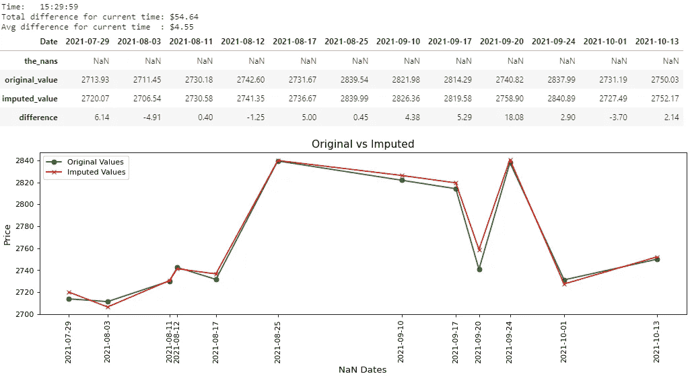*

*图片由作者提供|时间结果:15:29:59*

*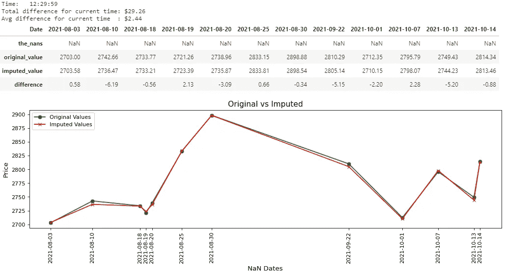*

*图片由作者提供|时间结果:12:29:59*

*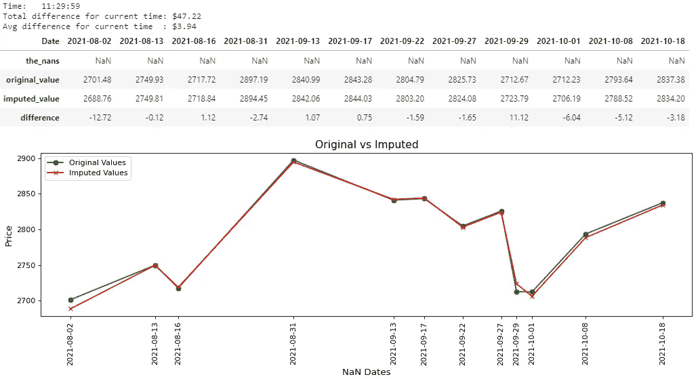*

*图片由作者提供|时间结果:11:29:59*

*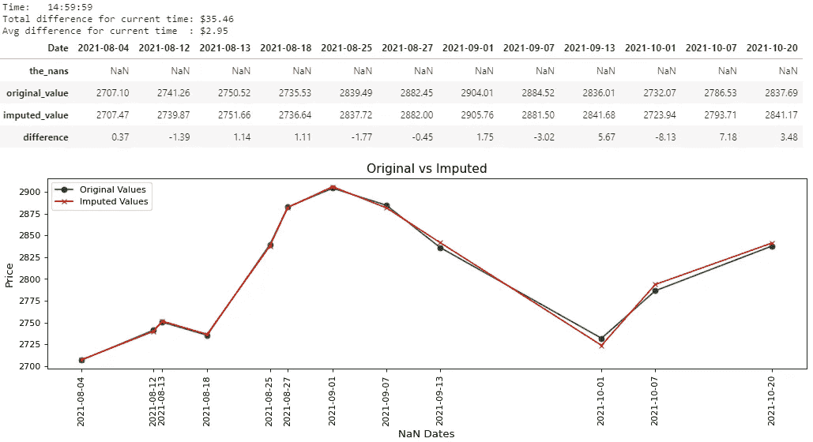*

*图片由作者提供|时间结果:14:59:59*

*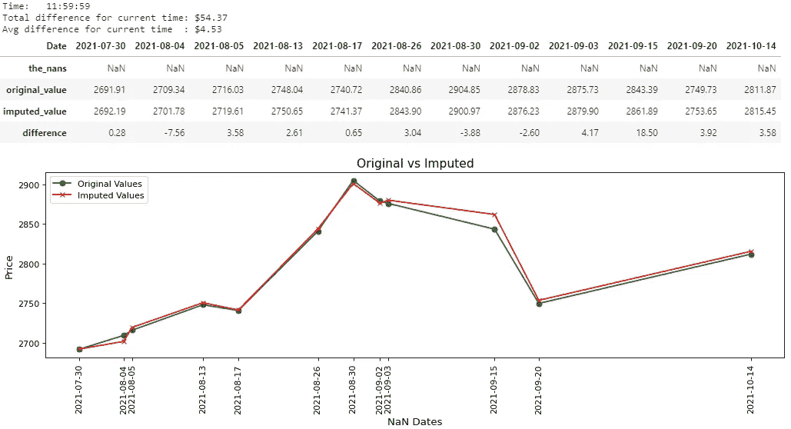*

*图片由作者提供|时间结果:11:59:59*

*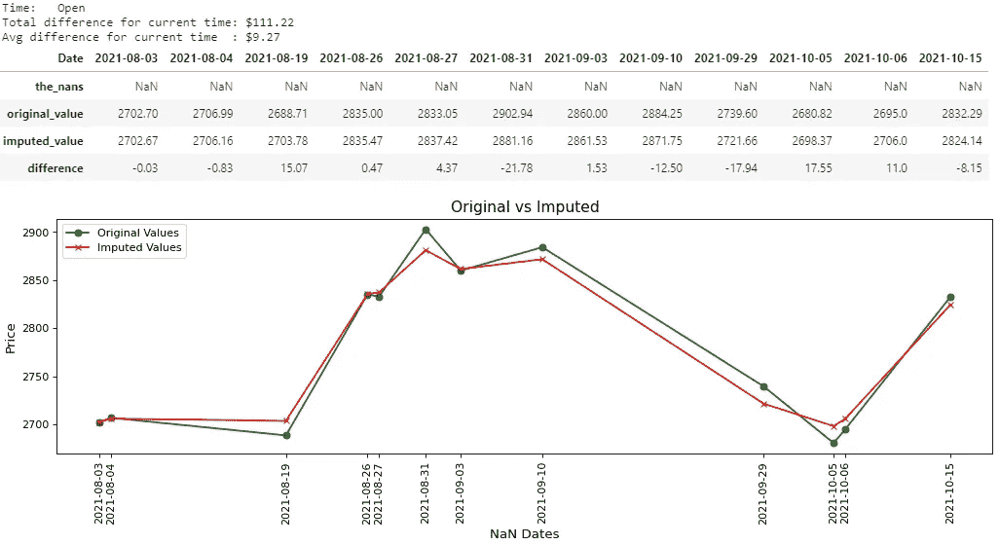*

*图片作者|结果时间:09:30:00(打开)*

*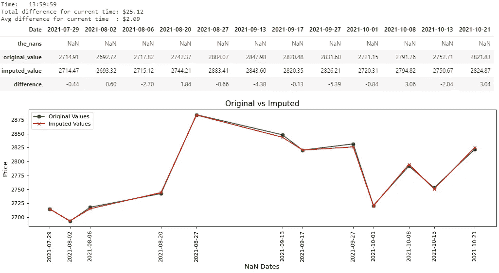*

*图片由作者提供|时间结果:13:59:59*

*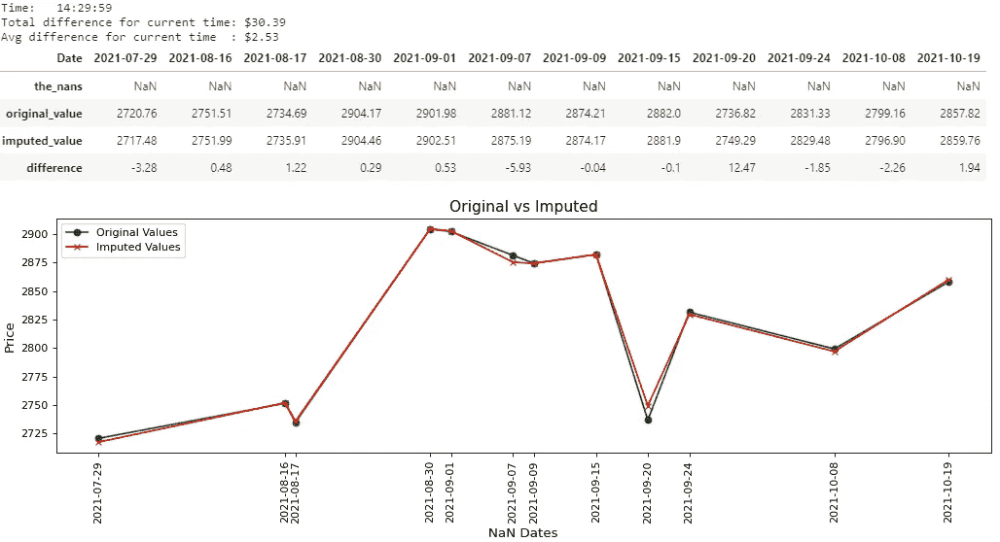*

*图片由作者提供|时间结果:14:29:59*

*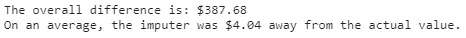*

*图片由作者|总体*

*给你，8 张图片，所以这意味着 8000 字，对不对？大概就是这个笔记本的长度，这还没算上最后一张图。也许如果质量更好的话…不管怎样，玩笑归玩笑，我希望你们能在一定程度上看到上面图片中的价值。我相信你们可以右键单击每张图片，在一个新的标签中打开并放大它，尽管如此，我还是将主要结果写在下面:*

*   *图 1 →( 15:29:59)；差额:54.64 美元；平均值。差价:4.55 美元*
*   *图 2 →( 12:29:59)；差价:29.26 美元；平均值。差价:2.44 美元*
*   *图 3 →( 11:29:59)；差价:47.22 美元；平均值。差价:3.94 美元*
*   *图 4 →( 14:59:59)；差价:35.46 美元；平均值。差价:2.95 美元*
*   *图 5 →( 11:59:59)；差额:54.37 美元；平均值。差价:4.53 美元*
*   *图 6 →(打开)；差额:111.22 美元；平均值。差价:9.27 美元*
*   *图 7 →( 13:59:59)；差价:25.12 美元；平均值。差价:2.09 美元*
*   *图 8 →( 14:29:59)；差价:30.39 美元；平均值。差价:2.53 美元*
*   *图 9 →整体差价:387.68 美元；
    总体平均差额:4.04 美元*

*基本上，为了便于比较，我改变了数据帧的显示。*

*对于`cols`中的每个“时间”,将有一个单独的数据帧，包含 4 行、单独的测量变量`currentDifference`和`currentAvg`,以及一个单独的图形。只有为 NaN 的(日期，时间)对才会显示在结果中(包括图表)。*

*最终还会有两个测量变量(如图 9 所示)显示`overallDifference`和`overallAvg`。*

*包含 4 行的数据帧将有一行用于:*

*   *Dataframe `cdf` (the_nans) →用 NaN 替换的(日期，时间)对。这应该是一排南，没别的。*
*   *Dataframe `adf`(原始值)→该(日期，时间)对的原始值。*
*   *Dataframe `cdft`(估算值)→对(日期，时间)的估算值。*
*   *第 4 行(差异)→该(日期、时间)对的原始值和估算值之间的差异。
    **-** 如果差值为负，则表示估算者低估了显示金额的原始值。
    **-** 如果差值为正，则表示估算者高估了显示金额的原始值。*

*`currentDifference`、`overallDifference`、`currentAvg`和`overallAvg`均用于测量目的:*

*   *`currentDifference` →是数据帧中`difference`行的绝对值总和。每个“时间”分离都会有自己的`currentDifference`。*
*   *`overallDifference` →是把所有的`currentDifference`从每一个“时间”中分离出来，总结出来。最后只会显示一个`overallDifference`。*
*   *`currentAvg` →是当前“时间”差异的平均值。这基本上说明了当前时间 *的“ ***”，平均而言，这是估算值与原始值的差距。*“每一次”分离都会有自己的`currentAvg`。****
*   *`overallAvg` →是差异的整体平均值。这基本上说明了"*总体而言，平均而言，这是估算值与原始值的差距。*“最后只会显示一个`overallAvg`。*

## *了解结果*

*总体平均差额为 4.04 美元。如果我们将这一结果视为“平均而言，估算值与实际值相差 4.04 美元”，这可能看起来很多，但我们不能忘记考虑原始数据框架`adf`中我们的值的平均价格。*

```
*adf.to_numpy().mean()*
```

*运行上面的代码后，我得到大约 2788.45 美元。这意味着在`adf`的 840 个价格中，平均价格为 2788.45 美元。如果我们将总平均差价除以平均价格:*

```
*4.04/2788.45 = 0.001448833581380337*
```

*这还不到 1%。投资者甚至不介意拿他们投资组合的 1%去冒险。*

# *结论*

*我应该再次提到，一般来说，多变量方法比单变量方法更受欢迎，但我个人认为这取决于您自己的需求和您项目的目标。在第一篇文章中，我们看到了使用 PIMA Indians 糖尿病数据库的均值插补和迭代插补之间的差异，在本文中，我们看到了迭代插补值与实际股票价格的接近程度。我不得不说，即使在这个例子中使用了 yfinance 之后，也要使用它，看看还能做些什么。这绝对是获取股票市场数据的一种便捷方式。*

*我知道这是一篇很长的文章，我很抱歉把它分成两个独立的部分，但我真的希望这值得你花时间。这是我在 Medium 上写的第一篇文章，但就我看来，这不会是我的最后一篇。我希望你能使用 IterativeImputer，并且我希望你能发现我的两个例子中至少有一个是有用的。*

*点击下面的链接阅读本文的第一部分:*

*[](https://gifari.medium.com/a-better-way-to-handle-missing-values-in-your-dataset-using-iterativeimputer-9e6e84857d98) [## 处理数据集中缺失值的更好方法:使用迭代估算器(第一部分)

### 如何使用多元估算器处理缺失数据

gifari.medium.com](https://gifari.medium.com/a-better-way-to-handle-missing-values-in-your-dataset-using-iterativeimputer-9e6e84857d98)* 

*此外，请查看我在 Kaggle 上的笔记本，其中包括使用函数进行股票价格估算的脚本。写完这篇文章后，我决定创建这个笔记本。它非常详细，但是如果你使用这篇文章和这个笔记本中的功能，它有希望使你的生活更容易。*

*[](https://www.kaggle.com/gifarihoque/predict-missing-stock-prices-with-iterativeimputer) [## 用迭代估算器预测缺失的股票价格

### 使用 Kaggle 笔记本探索和运行机器学习代码|使用来自无附加数据源的数据

www.kaggle.com](https://www.kaggle.com/gifarihoque/predict-missing-stock-prices-with-iterativeimputer) 

## 参考

[1]: G. Hoque，[处理数据集中缺失值的更好方法:使用 IterativeImputer(第一部分)](https://gifari.medium.com/a-better-way-to-handle-missing-values-in-your-dataset-using-iterativeimputer-9e6e84857d98) (2021)，Medium ( [点击返回](#ca18))

## 最后的话

如果你注意到我的文章中有任何错误，请留下评论并联系我，这样我可以尽快修复它！我不想误导任何人，也不想教任何人错误的东西。对我来说，任何批评都是积极的批评，这是我学习的最好方法之一。我也总是乐于接受提示和建议。

如果你喜欢阅读这篇文章，请关注我的 [***中型***](https://gifari.medium.com/) *和*[***Kaggle***](https://www.kaggle.com/gifarihoque)*我会不时在这里发布更多内容。还有，随时和我联系*[***LinkedIn***](https://www.linkedin.com/in/gifari/)*。如果你认为我的工作值得一杯咖啡，请给我买一杯吧！任何支持都帮助我坚持下去。*

一如既往，再次感谢你的来访。

> **免责声明** :
> 本文包含的任何内容都不应被解释为投资建议。我绝不是一名财务顾问，在可预见的未来我也不打算成为一名财务顾问。如果你认为我应该成为一名财务顾问，请随时联系我。*