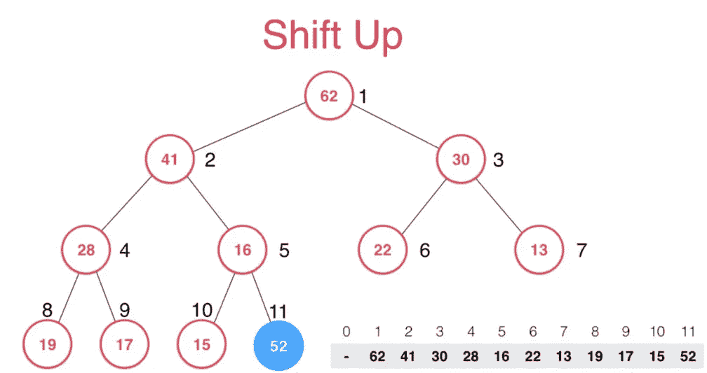
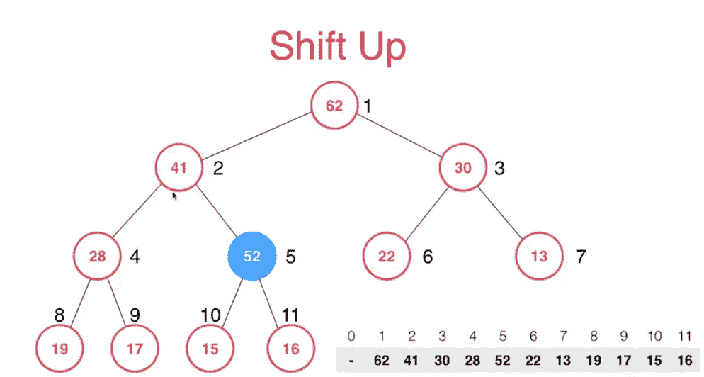
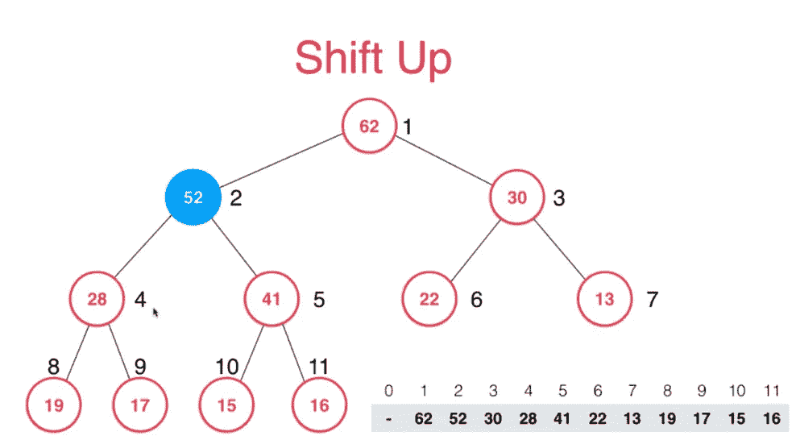
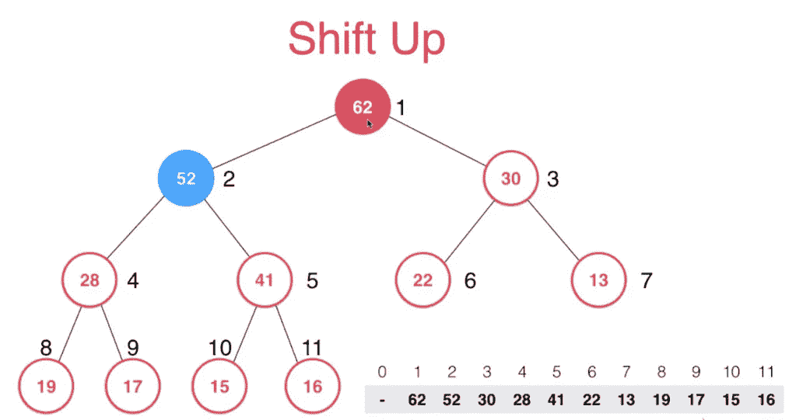
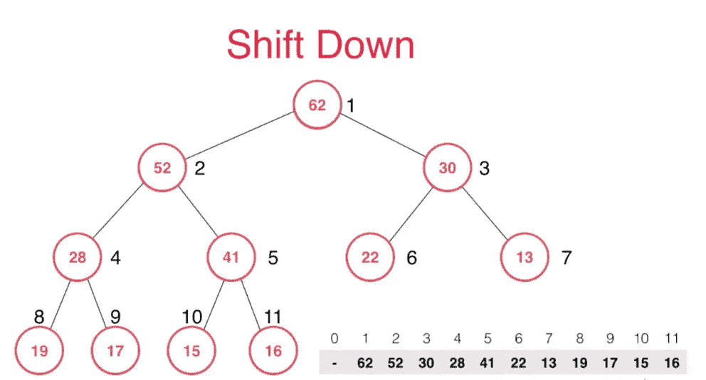
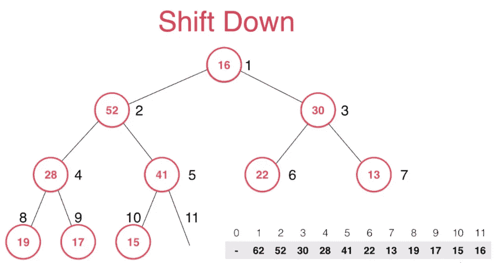
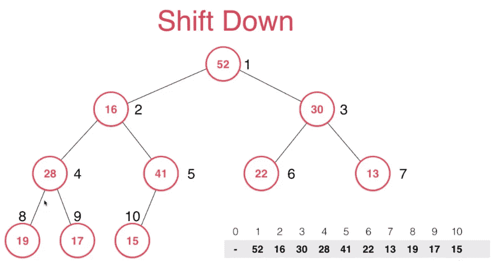
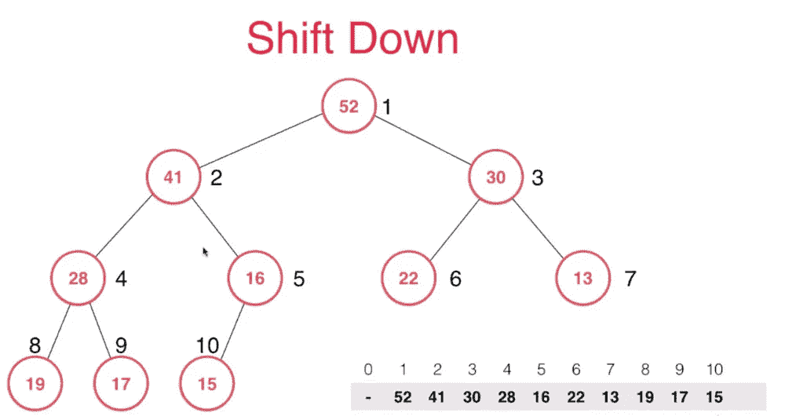
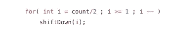

# 达到健康的最简单方法

> 原文：<https://levelup.gitconnected.com/a-better-way-to-understand-heap-data-structure-3c60b74295e8>

## 具有升/降档功能

杰斯温·托马斯在 [Unsplash](https://unsplash.com?utm_source=medium&utm_medium=referral) 上的照片

谈到堆，有些人可能会想到二叉树结构，其中父节点总是比子节点大或小。

实际上，堆是由一个数组来表示的。它只是有一个特殊的方案来操纵项目，以降低时间复杂度。

堆有它的基本操作，如 add()、delete()、size()等。在本文中，我们介绍了一种理解堆及其上移和下移功能的新方法。

# 插入新项目并上移

假设我们有一个最大堆，我们需要添加一个新的项目。如果堆是一个数组，我们把它附加到末尾。之后，我们必须执行升档功能。

形成下图，主要步骤是

> 比较子项目和它的父项目，如果子项目大于父项目，我们交换它们。

由于堆是一个树状结构，我们可以很容易地找到父项，即 **int(k/2)** ，其中 **k** 是当前的子项。其余的可以用同样的方式完成。

时间共谋:O (logn)

一个提示:不要忘记检查 **k** 是否入站。

来源:[coding.imooc.com](https://coding.imooc.com/)

来源:[coding.imooc.com](https://coding.imooc.com/)

# 删除项目并下移

当需要下移时，heap 有它特殊的方法来删除条目。我们不能删除任何我们想要的项目。正如图片所提到的，

> 我们用最下面的一项替换第一项，然后下移

当我们向下移动时，我们可以找到它的子节点，即 **2k(左)**和 **2k + 1(右)。**然后，我们将父项与左右项进行比较，以找到要交换的最大项。如果父项是最大值，我们保持不变。

时间共谋:O (logn)

提示:不要忘记确保 k 是入站的。

来源:[coding.imooc.com](https://coding.imooc.com/)

来源:[coding.imooc.com](https://coding.imooc.com/)

# 摘要和完整代码:

在这个堆构造中，上移和下移是最核心的部分。我们可以很容易地移动它们，因为很容易找到父项和子项。

如果你以前学过 heap，那么 Heapify 是一个比较流行的概念。我们可以找到一个非常复杂的 heapify 函数，如下所示:

在本文中，我们通过定位第一个非叶节点(k/2)并反向调用 shiftDown()来简化堆。

这里我附上了[的完整代码](https://gist.github.com/lee197/7a248462eadc9a5a7dcd0c20f1826cf7)。希望你能从这篇文章中学到一些东西。如果你有兴趣阅读我的其他文章，欢迎查看我的个人资料。祝你的编码面试成功！