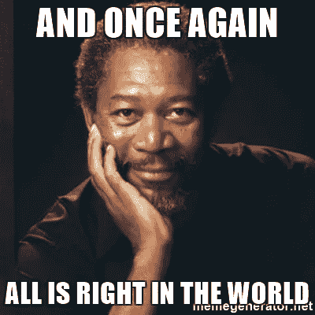
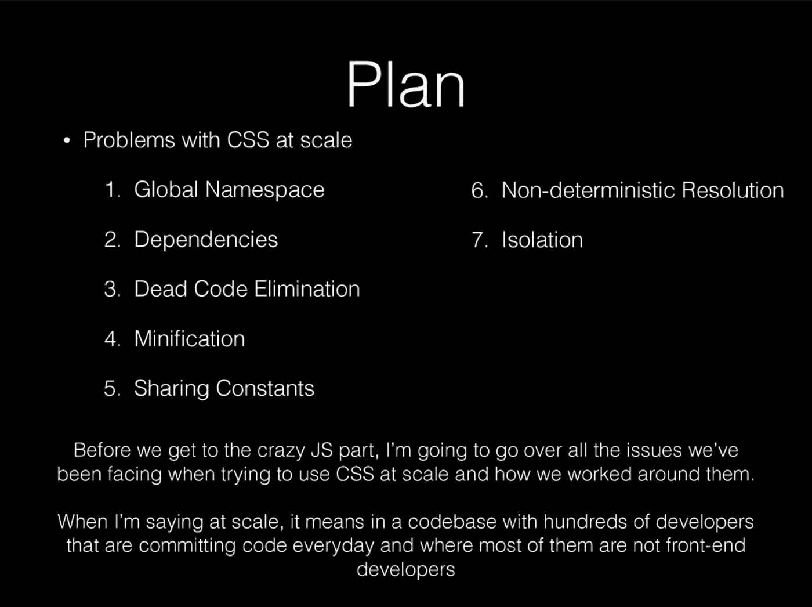
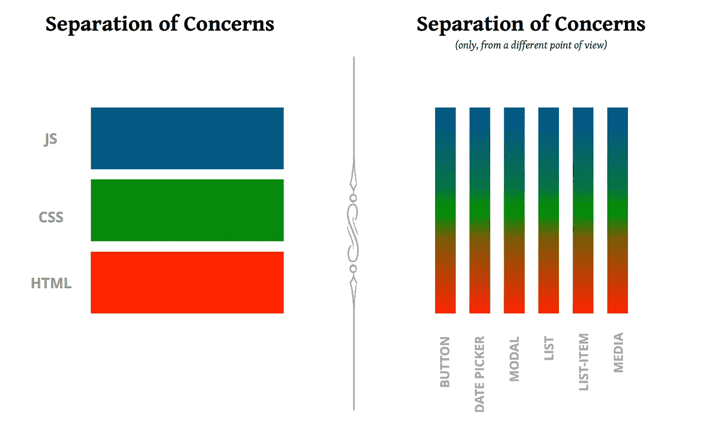

# CSS-in-JS 简史:我们是如何来到这里的，我们将走向何方

> 原文：<https://levelup.gitconnected.com/a-brief-history-of-css-in-js-how-we-got-here-and-where-were-going-ea6261c19f04>

*关于 CSS-in-JS 正在进行的故事的未署名的高水平报道*

https://unsplash.com/@stairhopper

在我的[的上一篇文章](https://medium.com/gitconnected/the-css-holy-war-how-to-think-beyond-dogma-e2c67692d409)中，我提到了目前选择 CSS 方法或框架是多么困难，并解释了为什么避免教条是我们作为一个社区可以做的最重要的事情之一，以获得新的发现并推动 CSS 发展。

**Javascript 做 CSS**

1994 年 10 月，在 CERN 工作时，[第一次提出了](https://www.w3.org/People/howcome/p/cascade.html)级联样式表的概念。后来，Lie 在他 2006 年奥斯陆大学的博士论文中正式提出了 CSS。

2006 年 2 月 16 日，在他论文答辩的前一天，在一次 CSS 讲座后的问答环节中，出现了一点令人惊讶的反复:

> 伊森·曼森:但我认为你已经找到了根本问题所在，那就是，无论你提出什么，都需要一段时间才能进入任何浏览器。我的意思是，你可以提出它，如果你真的想让它成为一个标准，Opera 可能会在标准被认可的时候让它工作，但其他浏览器制造商可能不会，直到你让几乎所有的浏览器运行它不运行的东西。
> 
> HWL:没错。现在有一种替代方案可以工作，那就是将东西提取到 Javascript 库中，你已经很好地编写了可以参考的 Javascript 库，今天你甚至可以在 IE6 中使用它。同样，你不得不捏着鼻子，我们中的一些人不得不捏着鼻子，因为那会发生，但这是可以更容易做到的事情。我认为我们实际上必须双管齐下。我认为我们将不得不在 CSS
> 上投入更多，但不能屏息以待。
> 
> 伊森·曼森:如果你能让这种转变更加平稳会怎么样？如果
> 你可以，这将是丑陋的代码，但是如果你可以将
> 特性添加到你想要的 CSS 中，但是创建一个路径，通过它某人可以
> 使用 Javascript 实现的解析器来识别 CSS 中的
> 代码的存在，并且可以用 Javascript 库来支持它，那会怎么样？

— [*样式表和与动态方面相关的挑战
Web*](http://www.wiumlie.no/2006/phd/transcripts/0216-dynamic.html)

众所周知，CSS 后来成为定义 web 文档样式的方法。它足够强大，可以满足从事各种类型项目的 web 开发人员的需求，对于修补 web 开发爱好者来说也足够容易使用，不需要很长的学习曲线就可以开始工作。

CSS 也为 web 文档的神圣三位一体:HTML、Javascript 和 CSS 的每一部分提供了一个漂亮整洁的关注点分离。HTML 处理结构化内容，JavaScript 提供行为，CSS 决定一切的外观。

多年来，这种设置为发布网页提供了一个优秀的、经过实战检验的解决方案。它很健壮，进入门槛很低，使 web 开发变得触手可及。万维网一切正常。

然而，随着时间的推移，JavaScript 的进步引入了一个全新的开发生态系统。到 2011 年，用于构建[单页面应用](https://en.wikipedia.org/wiki/Single-page_application)的 JavaScript 框架的兴起开始影响开发前景。AngularJS 出现在 2010 年【T10 月[，EmberJS 出现在 2011 年【T12 月](https://github.com/angular/angular.js/releases?after=v0.9.4)[，ReactJS 出现在 2013 年](https://en.wikipedia.org/wiki/Ember.js)[3 月](https://en.wikipedia.org/wiki/React_(JavaScript_library))，VueJS 出现在 2014 年[2 月](https://en.wikipedia.org/wiki/Vue.js)。

从 2011 年到 2014 年，随着这些框架越来越受欢迎，开发前景从 web 文档(主要是静态内容的网站)转向了单页面应用领域。随着 SPAs 在复杂性和行为上的成熟，用户开始期望网站有越来越多的动态的、功能丰富的体验。

2014 年 11 月，脸书工程师 Christopher Chedeau(又名 [Vjeux](https://medium.com/u/46fa99d9bca4?source=post_page-----ea6261c19f04--------------------------------) )做了一个关于他称之为 *CSS-in-JS* 的概念的演讲。他以一张非常著名的幻灯片开始了演讲，概述了他认为 CSS 需要克服的主要问题，以便开发人员能够理智地维护高度动态的 web 应用程序，尤其是在大规模应用时:

Vjeux 关于 CSS 的 7 个问题([https://speakerdeck.com/vjeux/react-css-in-js](https://speakerdeck.com/vjeux/react-css-in-js))

自 2014 年以来，许多开发人员致力于使 CSS-in-JS 成为现实。使用 JavaScript 处理 CSS 为这些问题提供了一个独特的解决方案。如果你想更深入地了解当前的实现，以及使用 CSS-in-JS 方法的利弊，我强烈推荐 [Indrek Lasn](https://medium.com/u/ce572601b7e?source=post_page-----ea6261c19f04--------------------------------) 的伟大文章 [*关于 CSS-in-JS*](https://hackernoon.com/all-you-need-to-know-about-css-in-js-984a72d48ebc) *你需要知道的一切。*

乍一看，使用 Javascript 来应用和操作 CSS 似乎违反了[关注点分离](https://en.wikipedia.org/wiki/Separation_of_concerns)原则。在[克里斯蒂亚诺·拉斯泰利](https://medium.com/u/d17e82adb7e1?source=post_page-----ea6261c19f04--------------------------------)的优秀作品*让 CSS* 上有和平([文章](https://medium.com/@didoo/let-there-be-peace-on-css-8b26829f1be0) / [视频](https://www.youtube.com/watch?v=bb_kb6Q2Kdc) ) 中，他建议 CSS-in-JS 保持关注点的分离。我们只需要以不同的方式来看待我们的问题。考虑一下是否关注点是沿着*元素*线而不是*技术*线划分的。我们最终还是会彻底分开:

从不同的角度分离关注点([让 CSS 保持平静](https://speakerdeck.com/didoo/let-there-be-peace-on-css)

**文档与网络应用**

“任何长期使用 CSS 的人都不得不接受其咄咄逼人的全球性质——这种模型显然是在文档时代设计的，现在正努力为当今的现代 web 应用程序提供一个合理的工作环境。”[ [全球 CSS 的终结](https://medium.com/seek-blog/the-end-of-global-css-90d2a4a06284)

互联网上大致有两种类型的网站:主要由静态内容组成的网站(文档)和主要由交互内容组成的网站(网络应用)。在 Mark Dalgleish 的《T2:全球 CSS 的终结》一书中，他认为 CSS 规范是 90 年代后期创建和批准的规范的直接后代，不能充分满足现代网络应用的需求。

构建文档网站和构建 Web 应用程序各有各的需求。如果传统的(非 CSS-in-JS) CSS 能够满足你的项目需求，那就继续吧！事实上，即使你正在构建一个 Web 应用程序，也有[多个](https://codeburst.io/css-in-js-is-like-replacing-a-broken-screwdriver-with-your-favorite-hammer-c9765c9ee43b) [深思熟虑的](https://medium.com/@ivn_cote/no-kiss-for-css-in-js-a749960b0b6b) [论点](https://medium.com/@ajsharp/please-please-don-t-use-css-in-js-ffeae26f20f)为传统 CSS 优于 CSS-in-JS 辩护。

每个项目都有独特的需求，每个开发人员都有独特的偏好。那么问题就不应该是“CSS-in-JS 还是传统 CSS 会赢得 CSS 之战？”而是“哪个 CSS 解决方案符合我的项目需求？”

我相信克里斯蒂亚诺·拉斯特利[*【让和平降临 CSS*](https://medium.com/@didoo/let-there-be-peace-on-css-8b26829f1be0) 的结束语比我读过的任何东西都更好地表达了这一点:

> 我无法影响像我们这样的整个社区。但是我可以试着让你相信有一个比互相争斗更好的方法。
> 
> 所以，以下是我的建议:
> 
> 1.拥抱网络不断变化的本质。
> 
> 2.小心你的言辞:它们会伤人。
> 
> 3.务实，不教条。但最重要的是，要有好奇心。

如果我们能接受网络不断变化的本质，我们就能更容易地为我们的开发者伙伴找到共鸣。通过仔细选择我们的措辞，我们可以避免不必要的侮辱，并鼓励健康的辩论。通过重视实用主义而不是教条，我们可以对新概念保持开放的心态。通过好奇，我们可以发现值得分享的新事物，同时发展和完善我们的工具集。

*如果您喜欢这篇文章，请点击👏！您可以* [*关注我*](https://medium.com/@warlyware) *获取更多关于 web 开发的文章，或者在 gitconnected.com***加入我们正在成长的开发人员社区。**

**