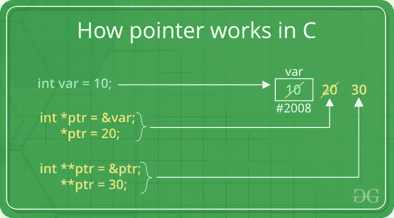

# C++中的指针简介

> 原文：<https://levelup.gitconnected.com/a-brief-introduction-to-pointers-in-c-4526baf52637>



指针的工作原理。参考:[https://www.geeksforgeeks.org/pointers-c-examples/](https://www.geeksforgeeks.org/pointers-c-examples/)

在编程语言中，当你声明一个变量时，你把它的值存储在内存中的一个地方。

这使得事情变得更容易。您不必直接处理创建该变量的内存地址。要访问它的值，您只需使用标识符(变量的名称),存储的值就在那里。

但是有时你想存储这个变量被创建的确切位置。为此，我们使用指针。

> 根据 Josh Lospinoso 的书 [C++速成教程:“指针是用来引用内存地址的基本机制。指针编码了与另一个对象交互所需的两条信息——即对象的地址和对象的类型。”](https://www.amazon.co.uk/Crash-Course-Joshua-Alfred-Lospinoso/dp/1593278888/ref=sr_1_1?crid=T70DHEL5PYYQ&keywords=c%2B%2B+crash+course&qid=1583313734&sprefix=c%2B%2B+crash+cours%2Caps%2C290&sr=8-1)

# 指针的特征

指针有许多优点，可以用于许多情况，但这里我们有它们最重要的特性:

*   它们节省内存空间
*   执行时间更快，因为你将直接处理内存地址。
*   高效访问内存(指针的内存是动态分配的)。
*   它可以用于数据结构。甚至对多维表示也很有用。
*   它可以用来访问数组的内容。
*   指针可以用于文件处理。
*   在 C++中，声明为基类的指针可以访问派生类的对象。但是，指向派生类的指针不能访问基类的对象。

假设你想在内存中存储一个变量的位置。我们应该使用&符号来做到这一点。这个符号被称为“地址-of”运算符。

```
my_pointer = &myvar;
```

按照上面的例子， *my_pointer* 不会存储 *myvar* 的内容，而是在内存中存储他的地址。

尽管只有在运行时才知道这个地址，但让我们假设 myvar 存储在内存中的位置 115。

```
myvar = 20;
my_pointer = &myvar;
newvar = myvar;
```

它将存储这个 115 的值，而不是变量的实际值。

对于更现实的代码示例:

```
int main()
{
    int myvar = 20;
    int* my_ptr = &myvar;
    int newvar = myvar;
    std::cout << "The myvar value is " << myvar << 
    ". \nThe newvar value is " << newvar <<
    ". \nThe my_ptr value is " << my_ptr;
}
```

输出可能类似于:

```
The myvar value is 20\.  
The newvar value is 20\.  
The my_ptr value is 0x7586a3177c2c
```

每次运行代码时，存储变量的值应该是不同的。这是由于地址空间布局随机化造成的。这是一种安全特性，它对重要内存区域的基址进行加密，以防止被利用。

# 取消引用指针

我们也可以反过来工作。如果你有一个存储在某个变量中的内存，你可以把存储在那个空间的信息放到内存中。

我们可以使用解引用操作符(*)和在内存中保存位置的变量来实现。

```
int main()
{
    int myvar = 10;
    int* myvar_address = &myvar;
    printf("Value at myvar_address: %d\n", *myvar_address);
    printf("myvar Address: %p\n", myvar_address);
    *myvar_address = 17325;
    printf("Value at myvar_address: %d\n", *myvar_address);
    printf("myvar Address: %p\n", myvar_address);
}
```

只是我们目前所见的一点点:

*   **&** 是运营商的*地址(*可读作“的地址”)
*   ***** 是*解引用操作符(*可以读作“指向的值”)

在 address-of 操作符旁边使用解引用符号，我们可以给变量赋值，甚至不用直接接触它们:

```
int main()
{
  int firstvalue, secondvalue;
  int * mypointer; mypointer = &firstvalue;
  *mypointer = 10;
  mypointer = &secondvalue;
  *mypointer = 20;
  std::cout << "firstvalue is " << firstvalue << '\n';
  std::cout << "secondvalue is " << secondvalue << '\n';
}
```

# 指针和数组

指针和数组有相似之处。指针编码对象位置。数组对连续对象的位置和长度进行编码。

不同的是，指向数组的指针将返回第一个数组对象。让我们来看第一个例子，摘自前面引用的那本书:

```
struct College {
    char name[256];
};void print_name(College* college_ptr) {
    printf("%s College\n", college_ptr->name);
}
int main() {
    College best_colleges[] = { "Magdalen", "Nuffield", "Kellogg" };
    print_name(best_colleges);
}
```

上面代码的输出将是:*马格达林学院*

我们声明了一个名为 College 的结构，它包含一个 256 字符的字符串。在 main 方法上，我们创建一个字符串数组，并将该数组传递给 print_name 方法。

这个方法有一个指针作为参数(指向学院结构)。这意味着当您调用 print_name 时，best_colleges 数组将衰减为一个指针。

数组总是衰减为指向其第一个元素的指针。变量 college_ptr 指向这个数组的第一个元素。我们使用箭头操作符来访问 college_ptr 指向的元素。

我们可以通过将数组的大小作为另一个参数来处理这种衰减。

```
struct College {
    char name[256];
};void print_names(College* colleges, size_t n_colleges) {
    for (size_t i = 0; i < n_colleges; i++) { 
        printf("%s College\n", colleges[i].name);
    }
};int main() {
    College oxford[] = { "Magdalen", "Nuffield", "Kellogg" };
    print_names(oxford, sizeof(oxford) / sizeof(College));
}
```

输出将正确地为:

*马格达林学院*

纳菲尔德学院

凯洛格学院

虽然使用指针处理数组看起来很傻，但这是大型 C 风格 API 中的一个经常性特性，例如，Windows 和 Linux 这样的操作系统。

# 指针的另一个用途

您可以访问以下链接，在更高级的主题中找到指针的良好用法:

*   为了[通过引用传递参数](https://www.geeksforgeeks.org/passing-by-pointer-vs-passing-by-reference-in-c/)
*   用于[访问数组元素](https://www.geeksforgeeks.org/arrays-in-c-cpp/)
*   到[返回多个值](https://www.geeksforgeeks.org/how-to-return-multiple-values-from-a-function-in-c-or-cpp/)
*   [动态内存分配](https://www.geeksforgeeks.org/dynamic-memory-allocation-in-c-using-malloc-calloc-free-and-realloc/)
*   [实现数据结构](https://www.geeksforgeeks.org/data-structures/)
*   在存储器地址有用的地方进行[系统级编程](https://www.geeksforgeeks.org/tag/system-programming/)。

参考资料:

[](https://www.geeksforgeeks.org/features-and-use-of-pointers-in-c-c/) [## C/C++ - GeeksforGeeks 中指针的特性和使用

### 指针存储变量的地址或内存位置。语法:datatype * var _ name 示例:指针“ptr”保持…

www.geeksforgeeks.org](https://www.geeksforgeeks.org/features-and-use-of-pointers-in-c-c/) [](http://www.cplusplus.com/doc/tutorial/pointers/) [## 两颗北极指极星

### 在前面的章节中，变量被解释为计算机内存中的位置，可以被它们的…

www.cplusplus.com](http://www.cplusplus.com/doc/tutorial/pointers/) 

[《c++速成教程》，作者乔希·洛斯皮诺索(2019)。](https://www.amazon.co.uk/Crash-Course-Joshua-Alfred-Lospinoso/dp/1593278888/)