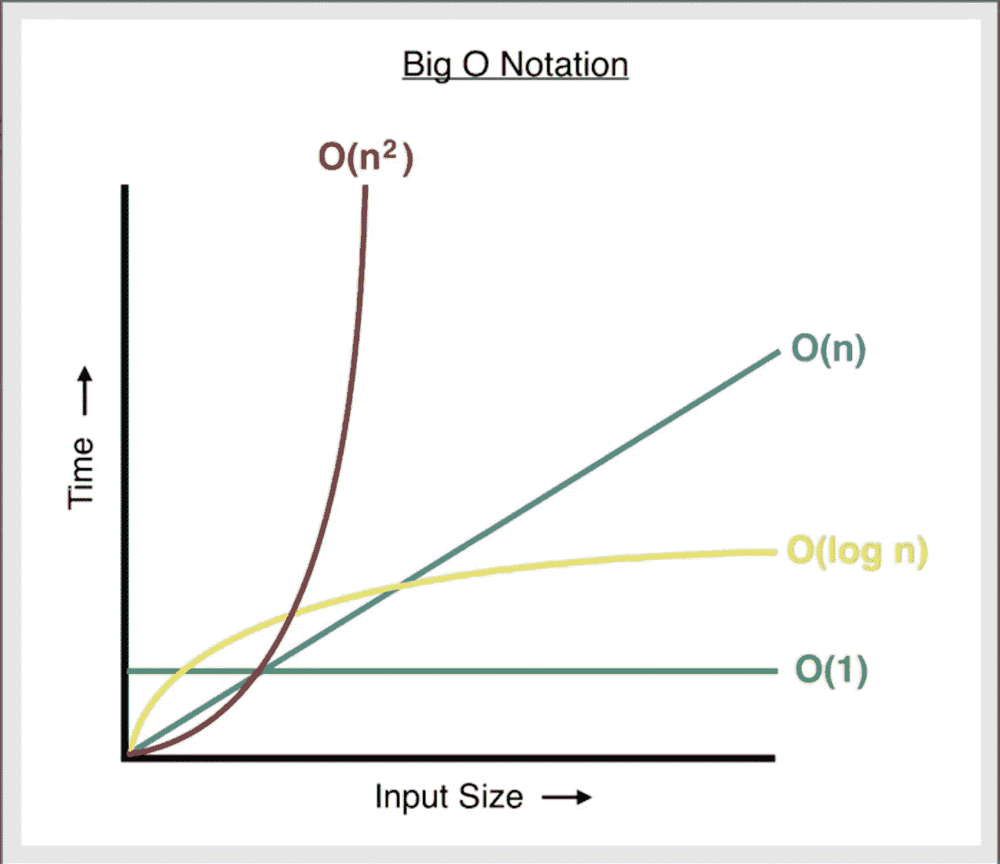

# 编程和计算机科学简介

> 原文：<https://levelup.gitconnected.com/a-brief-introduction-to-programming-and-computer-science-d0195195c2d5>

## 编程和计算机科学原理


编程和计算机科学是包含如此之多的广阔领域。有数十亿美元可以通过不同的方式赚取。从销售软件到创造下一个脸书，甚至用区块链技术构建一个分散的应用程序。天空是极限。

但是在理解的钢铁框架上建立我们的帝国是很重要的。没有比阅读*编程介绍更好的方法了。给你。对你有好处。*

我已经尽了最大努力去掉了大部分的绒毛。让事情尽可能简洁。并提供了一些图表来帮助您理解。

我在这里的目标是拥有一些我们每隔几年就能回来的东西。重温我们用来建立帝国的钢架。或者，帮助有抱负的程序员在这个迷人的世界开始他们的旅程。

不管你的理由是什么，谢谢你。我希望你喜欢这个简短的介绍。我希望这能让你建立你梦想中的帝国。

# 什么是编程？

> 编程是告诉计算机做某事的艺术。

计算机可以完成非常复杂的任务。人类做梦也想不到的事情。但是为了做到这些，我们需要找到方法精确地告诉计算机*做什么和怎么做。*

我想让你想象有一个坚强的朋友。他绝对肌肉发达。你需要他建一座桥，这样你们就能到达另一边。


你和你强壮的朋友。

但是你的朋友有个问题。他不会说英语。他只懂日语。你知道他有足够的体力去建那座桥。你需要准确地告诉他如何用日语建造它。一种你不懂的语言。告诉你的朋友如何建造这座桥的唯一方法是用一个**翻译**。


翻译拯救世界！

你可以把日语想象成计算机代码。叫做二进制的东西。是一系列的 0 和 1。

这些是计算机用来做任何事情的确切指令。计算机**只有**理解二进制代码。我们使用的任何编程语言都是这种语言的简化版本。


想象一下输入二进制代码——哎哟！

解释器是一种编程语言。简单到人们能理解的东西。这些编程语言非常重要，因为编写二进制代码几乎是不可能的。即使你能，也要花很长时间。

有许多编程语言可供选择。它们的不同之处在于它们与二进制代码的相似程度。更类似于二进制代码的语言被称为低级语言。一些例子包括[装配](https://en.wikipedia.org/wiki/Assembly_language)和 [C](https://en.wikipedia.org/wiki/C_(programming_language)) 。这些语言有着陡峭的学习曲线。但是它们提供了更多的控制。

高级语言更容易理解，因为它们不太抽象。更接近人类语言。一些例子包括 [JavaScript](https://en.wikipedia.org/wiki/JavaScript) 和 [Python](https://en.wikipedia.org/wiki/Python_(programming_language)) 。代价是它们提供的控制比低级语言少。


[这是这张图片的来源。](https://www.mrdfinch.com/high-and-low-level-languages.html)

编程语言是以特定的方式编写的。我们称之为语法。

> 语法是一套规则，告诉程序员如何构造语句和表达式。这些规则因编程语言而异。

如果我们把这些编程语言看作是人类语言，那么句法就可以看作是语法。当你开始学习一门特定的编程语言时，你将从语法开始。

Python 中的代码看起来一点也不像 c 语言中的代码。

语法可能会令人困惑。但是在这个过程中有许多工具可以帮助你。其中最强大的是一个集成开发环境，或称为 IDE。这些程序可以帮助您编写、测试和运行代码。其中最流行的是 [Visual Studio 代码](https://en.wikipedia.org/wiki/Visual_Studio_Code)。

这些 ide 通常包括一个[控制台](https://en.wikipedia.org/wiki/System_console)。这是程序员的文本界面，允许你运行你的代码。在这里，您将发现您的代码是否按照您想要的方式工作。作为一名程序员，这是你将花费大部分时间的地方。

# 变量

> 变量存储数据。它们可以被引用和操作。

存储数据有很多不同的方法。但是变量是构建模块。

你可以把变量想象成存储信息的盒子。该变量将有一个名称。想象在盒子上写一个标签。无论你放在盒子里的是什么，都是你想要存储的数据。


创建变量的方式因编程语言而异。但是每种编程语言都有它们。我们来看几个变量的例子。

我们将从用 c 语言创建一个简单的变量开始。

```
int myNumber = 5;
```

**int** —正在创建的变量的种类。整数。我们一会儿将探讨几种不同类型的变量。

**myNumber** —变量的名称。一般来说，你可以随意命名你的变量。但是理想情况下，名字应该有意义。给变量取一个随机的名字会造成混乱。

**5** —这是数字本身。现在，每当我们在程序中使用 *myNumber* 时，计算机就会记住它是 5。

分号告诉计算机这行代码结束了。并非每种编程语言都使用分号。但是 C 有。

让我们用 Python 创建这个相同的变量。

```
myNumber = 5
```

看起来很不一样，对吧？！由此可见编程语言的不同。Python 是一种高级语言，不需要你声明变量的类型。也不需要分号！

你不必担心记住每种编程语言是如何声明变量的。你*只需要*知道你将要使用的语言*是怎样的。*

你只需要知道 5 种变量。

1.  **字符串** —文本、字母或数字的任意组合。这些可以是一个数字，一句话，或者一整段话！
2.  **整数** —整数(无小数位)。
3.  **布尔型** —真或假的值。
4.  **浮点数** —带小数位的数字。
5.  **Char**——保存一个字符。

# If 语句

> If 语句告诉计算机:如果这个条件为真，那么执行这段代码。

If 语句用几个例子更容易理解。我们来看一个 c 中的。

```
int myNumber = 5;
int yourNumber = 3;if (yourNumber < myNumber)
{
printf("My number is larger than yours, noob!")
}
```

所以，这里我们有两个变量叫做*我的号码*和*你的号码*。两者都是整数。 *if 语句*将告诉计算机检查括号内的条件。当计算机看到这个条件为真时，它将执行花括号内的代码。它会将文本“Hello world”打印到控制台。

print()是最常用的命令之一。它在控制台中显示文本。在 C 中，print 后面是字母 *f.* 你不需要知道为什么。但是[如果你想要](https://softwareengineering.stackexchange.com/questions/317462/why-isnt-cs-most-basic-printing-function-named-print-instead-of-printf)就可以。

让我们看一个 Python 中的 if 语句。

```
myNumber = 5yourNumber = 3if yourNumber < myNumber:
    print('My number is larger than yours, noob!')
```

这段代码做了完全相同的事情。唯一的区别是语法。另外，请注意 print 语句上的缩进。Python 代码是按缩进组织的。

## Else if 语句

Else if 语句向代码中添加更多选项。 *If 语句*单独将是限制性的。使用 else if 语句，您可以针对不同的情况执行不同的代码。

*Else if 语句*仅在前面的语句为假时才尝试。

让我们看一个 Python 中的例子。

```
John = 50Billy = 15if John == Billy:
    print('John and Billy are the same age!')
elif John != Billy: print(' John and Billy are different ages.')
```

这个 *if 语句的第一部分*检查变量是否相等。当它意识到它们不是时，它将尝试 *else if 语句*。

==这是我们在 Python 中检查两个值是否相等的方法。

！=是我们检查两个值是否不相等的方法。

在 Pyhon 中，我们也将 else if 写成 elif。

## Else 语句

Else 语句将位于 if 语句链的末尾。这将是一个*捕捉所有其他场景*的场景。

让我们看一个 Python 中的例子。

```
a = 69
b = 420if a < b:
    print("b is a larger number")
elif a == b:
    print("These numbers are equal.")
else:
    print("a is the larger number")
```

*else* *语句*很有用，因为它捕捉到了每一个可能的场景。如果您只使用了 *if* 和 *else if* 语句，您很容易遇到未知输入导致整个程序崩溃的情况。呀！

如果陈述是有力的。但它们会很快变得一团糟。

# Switch 语句

Switch 语句可以将许多 else *if 语句*浓缩成几行代码。根据你有多少 if 语句，这可以使你的代码更加整洁。

让我们看一个 JavaScript 的例子。

```
var king = "Frederick";
switch(king) {
    case "William":
      console.log("William is the king!");
      break;
    case "Frederick":
      console.log("Frederick is the king!");
      break;
  default:
    console.log("There is no king for thee.");
}
```

Console.log()基本上是 JavaScript 中的一个打印语句。由于它在浏览器中运行，您可以将消息记录到控制台，在您的[浏览器](https://brave.com/)中按 F12 可以访问该控制台。

我们可以用 if else 语句来写这个。但是如果有 100 个名字要查呢？然后， *if 语句*很容易失去控制。Switch 语句提供了更高效的代码。

在 JavaScript 中，如果没有匹配，我们会提供一个默认消息。就像前面的 *else* 语句一样。

# 存储数据

变量是存储数据最简单的方式。但是它们可能是限制性的。想象一下，试图将 Google 上的所有信息存储在一个变量中。呀！这就是为什么我们用不同的数据类型来存储信息。

我们将探索一些最受欢迎的。

## 排列

> 数组是变量的列表。每个变量都可以通过索引来访问。

如果变量是盒子，那么数组就是储存建筑。


我们可以通过索引访问数组内部的信息。指数只是一个数字。它总是从 0 开始。

如果你想访问数组中的第一个变量，它将位于索引 0 处。

数组被写成*就像*它们是变量一样。让我们看一个 JavaScript 中数组的例子。

```
var philosophers = ["Plato", "Nietzsche", "Wittgenstein"];
```

在 JavaScript 中，var 用于声明变量。可以是数组的变量。请注意，我们用引号将每一项括起来，每个值之间用逗号隔开。

根据您使用的编程语言，数组的工作方式略有不同。但是它们基本上是普遍相同的。

## 二维阵列

2d 数组是另一个数组内部的数组。

想象一下一个仓库在另一个仓库里面。


让我们看看 JavaScript 中的另一个例子。

```
var philosophers = ["Plato", "Nietzsche", "Wittgenstein"];var thinkers = [philosophers, 96, "guy from internet"];
```

在这个例子中，我们将一个数组存储在另一个数组中。第二个数组里面有三种不同的变量。

## 字典

字典类似于数组。但是，字典不是依靠索引号来查找你的信息，而是对里面的变量使用键值对。基本上，变量的新名字。

让我们看一个 JavaScript 的例子。

```
var theBestDictionary = {
    Location: "Boston",
    number: 1, 1: "something here"
};
```

因此，如果我想访问这个字典中的位置，我可以简单地使用世界*位置。我可以轻松地去波士顿。*

如果这是一个数组，我必须知道我要访问的变量的索引。

数组和字典只是我们存储数据的一些方式。计算机科学的基本[数据结构](https://en.wikipedia.org/wiki/Data_structure)。但是还有很多方法。这很让人困惑。

我们不会学其他的。但是让我们看看确定哪种数据结构最适合我们的代码的最佳方法。

## 大 O 符号

> 大 O 符号是一个决定函数极限行为的方程。

它发现了算法中的缺陷。它测量数据的输入大小，以及它如何改变检索数据的时间。



[学分和大 O 符号上的更多阅读。](https://medium.com/dataseries/how-to-calculate-time-complexity-with-big-o-notation-9afe33aa4c46)

根据你如何使用你的数据，大 O 符号会对你的程序产生很大的影响。在你的程序中使用低效的算法会导致用户很长的加载时间，甚至会使你的整个程序崩溃！

数据结构背后有一整套科学。我们可以花几天时间讨论它和大 O 符号。但你现在只需要知道这些。

# 环

> 循环是多次运行代码的语句。

循环可以让你的代码运行多久就运行多久。它让你不必多次输入相同的内容。你只需要确定它有一个停止点。让我们来看看循环的具体种类。

## 对于每个循环

> for each 循环将对值列表中的每一项运行代码。

让我们看一个 Python 中的例子。

```
for x in "memes":
  print(x)
```

这个循环将打印单词 *memes 中的每个字母。*

## While 循环

> 当条件为真时，while 循环继续运行。

让我们看看 Python 中的另一个例子。

```
count = 0
while count < 3:
    print(count)
    count += 1
```

这个 while 循环打印*计数*变量，直到它变得大于 3。注意最后一行。*计数+= 1*

这行代码将计数加 1。每次 while 循环运行时都会运行。基本上数到 3。

# 功能

> 函数是可以多次运行的代码片段。

如果你计划不止一次地运行任何类型的代码，它应该放在一个函数里面。这将使您不必重新编写代码。函数是程序员避免重复的方式。它通常被称为干原理。

> 不要重复自己。

函数可能是项目中最重要的组成部分之一。他们可以为你节省数千小时。让你的代码*更容易阅读。*

## 4 种功能

函数可以做一些事情。首先，它们可以接受**参数**(有时称为参数)。

想象一个像电话号码一样的论点。功能是投币电话。你把你想打的电话号码输入投币电话。它会打电话。

打电话的过程总是一样的。但是电话号码每次都可以不一样。这就是参数与函数一起工作的方式。该函数每次都会以相同的方式运行。但是论点总是可以不同的。


[这一形象的功劳。](https://pixy.org/4767194/)

但是也有不接受参数的函数。无论如何，这些功能每次都是一样的。现在，我们到了有趣的部分。

**函数可以返回值。**

假设您创建了一个函数，它用 20 个不同的步骤和许多行代码来求解一个复杂的数学方程。这个函数需要把这个值返回给你。

让我们看一个 JavaScript 的例子。

```
function crazyMathStuff(x, y, z) {
  return x * y / z;
}
```

这个函数接受 3 个参数，x、y 和 z，并返回一个答案。

不返回值的函数称为 *void 函数*。这些在实际项目中通常不太常见。但知道他们的存在总是好的。

## 图书馆

> 库是数据和代码的集合，使编程更容易。

一位智者曾经说过:“太阳底下无新事。”这也适用于编程。

如果你遇到一个你想解决的问题或者一个你想开发的应用，很有可能有人已经尝试过做类似的事情。

你不需要知道如何做编程中的每一件小事。您真正需要的是开始使用库的能力。使用已经运行良好的代码。

React 是一个流行的 JavaScript 库，用于在 web 上构建用户界面。它允许您构建特定的组件，有助于保持代码的整洁。

另一个库的例子是 Python 的 TensorFlow。这个库为机器学习和神经网络提供资源。

就像我说的，有一个图书馆可以满足你的任何需求。如果你发现自己想从事某项工作，花时间去寻找最好的库是值得的。

在大多数编程语言中，您需要导入想要使用的库。做到这一点并不难。根据库的不同，您可能需要下载一些资源。

让我们看一个在你的网站上使用 React 的例子。

```
import React from "react";
```

砰。您只用一行代码就将一个最流行的 JavaScript 库导入到您的项目中！

库使编程成为一个真正令人兴奋的领域。我知道我们很多人进入这个领域是为了钱和工作保障。但是我们欠自己去玩[图书馆](https://github.com/vinta/awesome-python)我们[发现有趣的](https://github.com/sindresorhus/awesome)。

# 成为一名优秀的程序员

每个程序员都想尽可能做到最好。但是有几种方法可以让你获得不公平的优势。在我们进入特定于编程的习惯之前，让我们在坐在计算机前建立一些习惯。

## 编码之外的好习惯

1.  8 小时睡眠
2.  保持水分
3.  锻炼
4.  均衡饮食
5.  良好的关系

我知道不是所有这些对我们所有人来说都是可能的。但是拥有这 5 个习惯会让编程变得更加容易。

归根结底，编程是一件极其困难的事情。如果你想做好这件事，那就更是如此。但是编程不会是你生活的全部。你是人类。改变其中一个习惯会让编程变得更加困难。

但是，鉴于这是编程入门，而不是一篇*自助文章*，让我们深入了解一些作为程序员需要养成的习惯。

## 伪代码

这应该在你建立任何项目之前。这可以是流程图的形式，或者只是描述你计划做什么。伪代码允许您在实际编写代码之前仔细考虑代码。

一开始听起来可能很傻。但是一旦你这样做几次，生活会变得容易得多。这里有关于伪代码的[好资源](https://www.geeksforgeeks.org/how-to-write-a-pseudo-code/)。

## 永远学习

编程特别吓人。总是有新的技术出现。而*你*将不得不去学习它。要么这样，要么变得无关紧要。

好消息是你永远不会真正离开编程的学习阶段。你只是学习更复杂的想法。不管你的编程进度有多快，你都应该致力于学习新技术。一直都是。

## 记得为什么吗

记住这一点很重要，同时*永远要学习。*我们很多人花了数百个小时学习技术，而*实际上并没有帮助我们。*那是因为我们看不到我们的*为什么。*

不要只是学习学习。应该学习技术来推进你的职业生涯，建造一些令人敬畏的东西，或者因为你对它感兴趣。这些原因之外的任何事情都可能意味着你在浪费时间。

# 结论

就是这样！

我真诚地希望你在这个领域取得成功。有无数的机会就在那里等着你。

如果你有兴趣成为一名网络开发人员，[这里有一个惊人的资源来查看](https://amzn.to/3MLhuLN)。

更多关于[编程](/17-vs-code-extensions-to-make-programming-easy-e18e22422e46)、[加密货币](https://medium.com/the-capital/the-only-cryptocurrency-project-i-own-9cc88e6c435e)和[区块链](https://medium.com/the-capital/the-blockchain-revolution-will-change-everything-366f3e6c2c18)的文章可以关注我！。但是你不需要。祝你好运，朋友！