# 离散数学简明入门

> 原文：<https://levelup.gitconnected.com/a-brief-primer-on-discrete-mathematics-ff8194c06bbf>

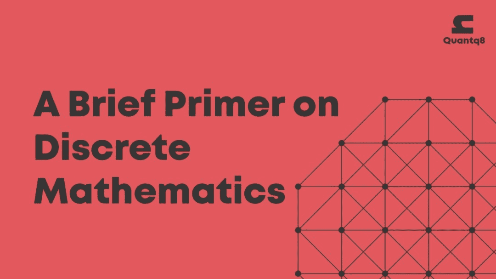

## 关于入门的一句话

这本入门书决不是这个主题的全部。把它当成你在完全接触这个主题之前学到的东西。我希望这本关于离散数学的简明入门书对你有所帮助。这个主题在描述计算机科学中的对象和问题时非常有用，尤其是在这些主题中:算法、编程语言、数据库和密码学。在未来，我打算深入到本初级读本将要讨论的每个主要领域。尽情享受吧！

## 什么是离散数学？

它是数学的一个分支，只处理那些只能假设不同的分离值的对象。

我们将按以下顺序讨论五个主要方面:

*   逻辑
*   集合论
*   关系
*   功能
*   组合学
*   图表

## 逻辑

**什么是逻辑？**

它是对正确推理的研究。我们将关注理想化和形式化。非形式逻辑是自然语言论证的使用。

形式逻辑是纯形式内容的推理研究，例如形式逻辑可以是符号逻辑和三段论逻辑(例如在亚里士多德的著作中)。

让我们从奠定基础开始。以这个自然语言语句为例

“如果我饿了，我就吃”。

让‘饿’作为前提 **A** ，‘吃’作为结论 **B** 。我们会试着这样形式化它，

A = > B (上面写着，A 暗示 B)

注意:前提和结论都是命题。

**逻辑表达式**

我们关心形式而不是内容。真值是由形式的有效性决定的。

例如，10 < 4 is **为假**，而 10 > 4 为真**。**

****逻辑连接词****

**命题 P 是一个可以为真或为假的陈述。**

**让 **P** 值‘1’表示真，让 **P** 值‘0’表示假。**

**也让另一个命题存在；让 **Q** 值‘1’表示真，让 **Q** 值‘0’表示假。**

**以下是位于包含真值的命题之间的逻辑连接词，因此基于命题真值和它们各自的连接词的组合产生它们自己的真值:**

**否认**

**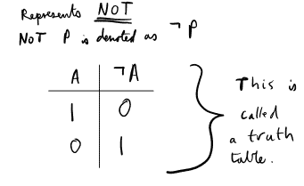**

**运筹学**

**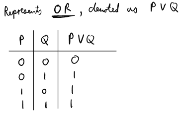**

**和**

**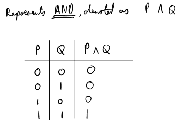**

**相等**

**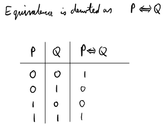**

**含义**

**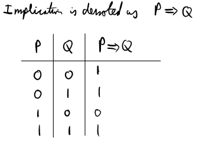**

**异或**

**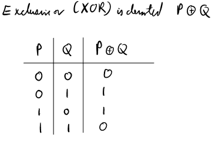**

****三大定律****

**现在我们还引入命题 **R** 它是一个可以为真也可以为假的陈述。**

**让 **R** 值‘1’表示真，让 **R** 值‘0’表示假**

**结合律**

**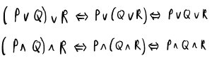**

**分配法则**

**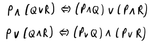**

**德摩根定律**

**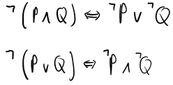**

****逻辑公式****

**由命题、括号和下列连接词组成:**

**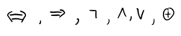****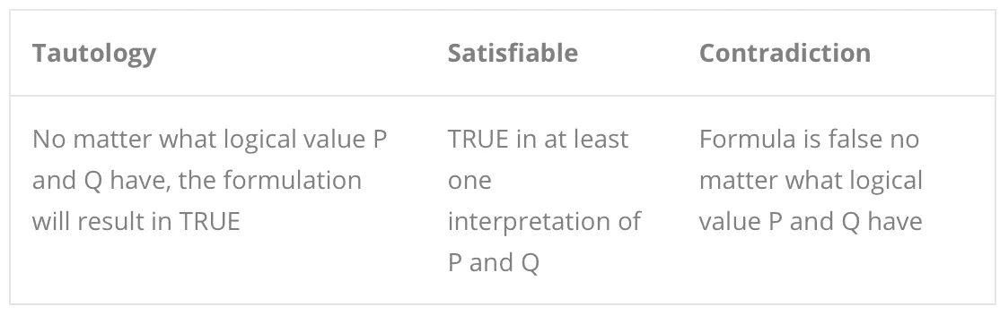**

****量词****

**什么是量词？自然语言中的量词是一个在数量(多少)属性上赋予意义的词。量词的例子有“所有”、“一些”、“许多”、“很少”、“大多数”和“没有”。**

**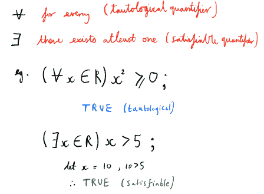**

## **集合论**

****什么是集合？****

**数据的集合。这些数据被称为(集合的)元素。集合中没有重复的元素。一个重要的特征是集合是无序的，这意味着我们显示元素的顺序对它的存在没有影响。**

**如果 A = {1，2，3，4} & B = {2，4，1，3} &没有顺序，那么 A = B**

**有了这种理解，我们可以更简洁地将集合定义为定义明确的不同对象的集合。**

**我们常常想定义一个无限集合。显而易见的问题是，我们无法写下它的所有要素。因此，我们也可以通过它们的特征性质来定义集合。**

**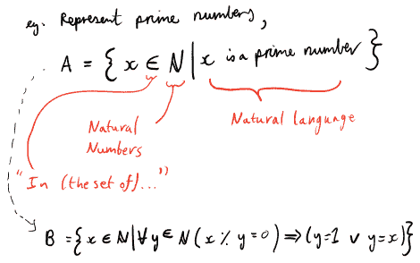**

****设定操作****

**子集**

**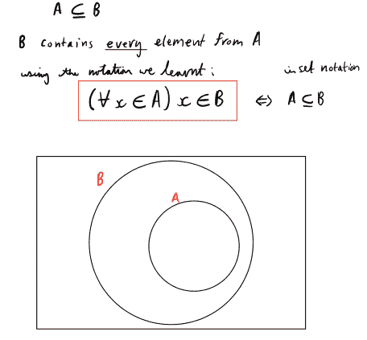**

**基数**

**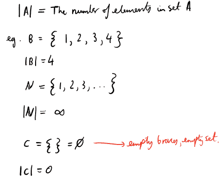**

**联盟**

**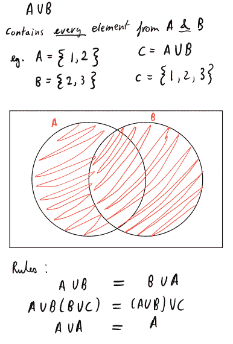**

**交集**

**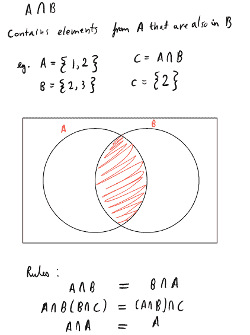**

**补充**

**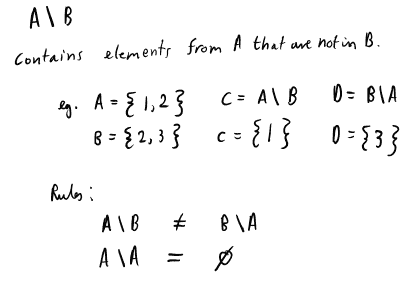**

## **关系**

**关系是对数学对象之间关系的研究。我们可以联系到 n 个元素(n 表示正自然数)。**

**二元关系是指我们有两个相互关联的元素(对象)。表示 x 和 y 之间任何关系的正式方法如下:x ~ y**

**例 4 < 8, or “I am in relation to being the student of my professor”.**

**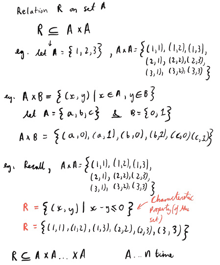**

****二元关系的性质****

**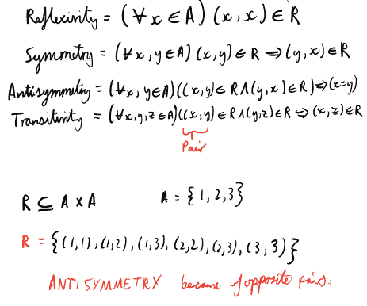**

****号码设置****

**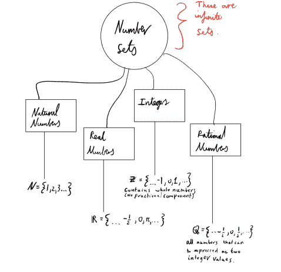****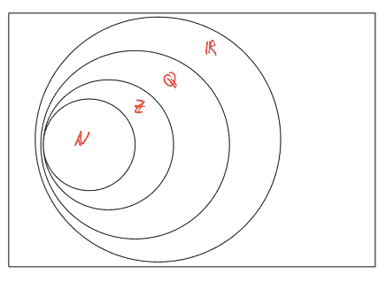**

## **功能**

**函数是将值分配给其他值的关系。换句话说，它是集合 A 和集合 b 之间的关系。**

**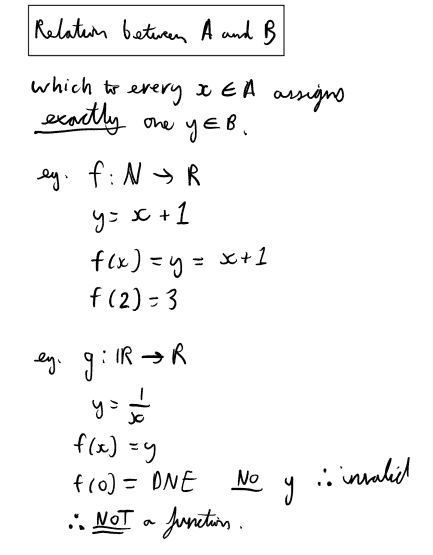****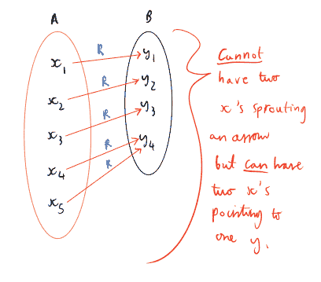**

****属性****

**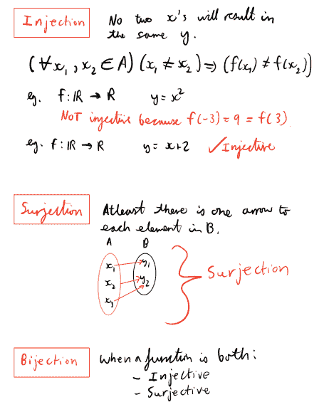**

****功能组成****

**一个函数的逐点应用会产生另一个函数。**

**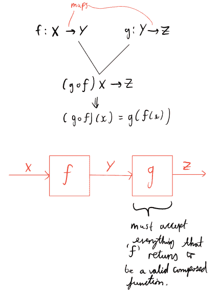****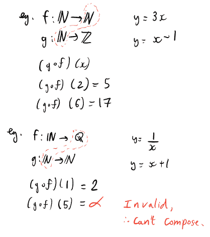**

## **组合数学**

**简单来说就是数数的学问。**

**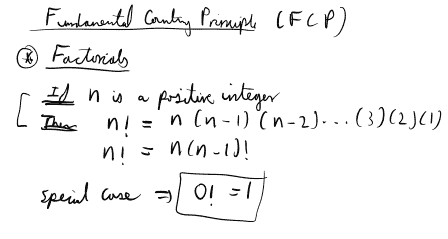**

****排列****

**是没有重复的对象排列，其中顺序很重要。**

**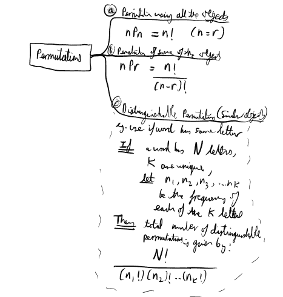**

****组合****

**是没有重复的对象排列，其中顺序不重要**

**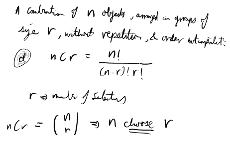**

****计数技术流程图****

**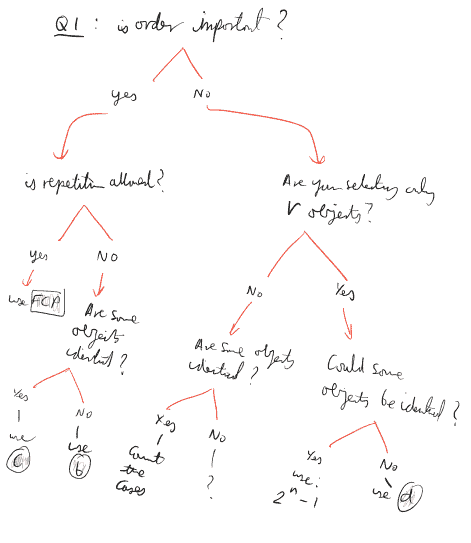**

## **图表**

****什么是图？****

**它是称为节点或顶点的点以及这些点之间称为边的线的集合。一条边恰好连接两个节点。边缘可以被定向；指向一个方向，或者没有方向。**

**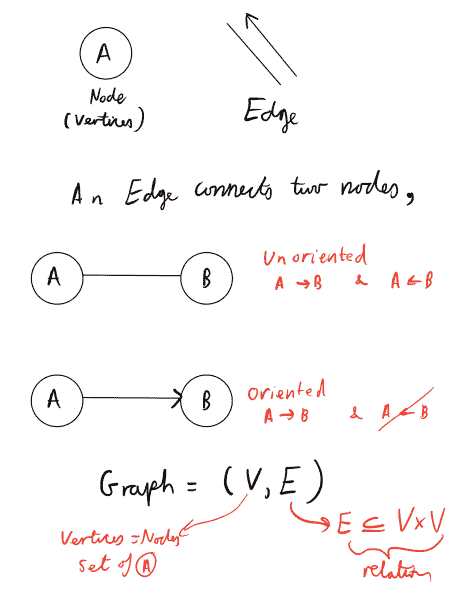**

**如果你喜欢这本书，那么你也会喜欢我的博客，看看吧:**

**[www.quantq8.com](http://www.quantq8.com)**