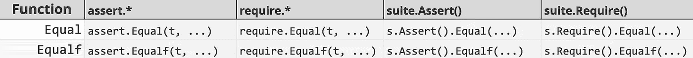

# Go 代码生成的一个例子:证明

> 原文：<https://levelup.gitconnected.com/a-case-for-go-code-generation-testify-73a4b0d46cb1>

如果你使用 Go 已经有一段时间了，你可能对测试库[stretchr/evidence](https://github.com/stretchr/testify)很熟悉。它使编写测试变得容易，并提供了几个断言函数，如`Equal`、`Contains`、`Greater`和[等等](https://pkg.go.dev/github.com/stretchr/testify/assert#pkg-functions)。

断言函数的行为因作用域而异。例如，当从`assert`或`require`包调用时。前者记录错误并继续，而后者立即停止测试。这两个包提供了相同的函数签名。断言也被称为来自封装了`*testing.T`指针的`suite`结构的方法。并且每个断言都有一个带有后缀`*f`和附加(`msg string, params ...interface{}`)参数的格式化副本。

这给我们留下了断言函数的三个维度:静态函数、套件方法和格式化。共有八种不同版本的**每种功能**:



的所有实现的示例。平等的

这是一个有趣的代码生成案例。看起来我们可以将所有函数作为规范断言实现的包装器来实现。它主要是重复的或样板代码，否则手工编写会很乏味。不出所料，这正是该软件包的作用。

这篇文章的其余部分是一个大脑转储，因为我通过代码，试图理解如何作证内部工作，以及他们如何组织他们的代码使用代码生成。

# 例:`Equal`功能

让我们先来看看`Equal`函数，以及`assert`和`require`的行为有何不同:

`.Equal`的底层实现是一样的。在`assert`或`require`实施中，比较两个值并提供文本输出不应改变。这里改变的是测试的流程。它要么停止，要么记录错误并继续前进。

`assert.Equal`函数是`Equal`的规范实现。

> *除了* `*ObjectsAreEqual*` *函数之外，我将不再详述如何进行比较。让我们关注周围的代码，以及在代码库中的其他地方是如何调用它的。*

这里需要注意的重要一点是，`assert.*`函数返回一个`bool`。他们的对手`require.*`利用了这一点。

`require.Equal`看起来和你想象的完全一样:

它包装`assert.Equal`函数，并在断言失败时调用`t.FailNow()`(返回`false`)。

每个断言函数都是如此。与其为每个断言编写样板函数签名，不如让我们看看他们如何使用模板来生成函数体。

# 断言函数模板

**要求打包**

`require`包中的每个函数都有相同的样板代码。它必须(1)调用`assert.*`函数；以及(2)如果断言返回假，则测试失败。

```
{{.Comment}}
func {{.DocInfo.Name}}(t TestingT, {{.Params}}) {
	if h, ok := t.(tHelper); ok { h.Helper() }
	if assert.{{.DocInfo.Name}}(t, {{.ForwardedParams}}) {
                return
        }
        t.FailNow()
}
```

> *注意，这里还调用了一个* `*Helper()*` *函数。它们用于内部测试，所以为了这篇博文的篇幅，我们可以忽略这一点。*

**套件方法**

因为这些断言是 suite 结构中的方法，所以它们需要一个接收者，这个接收者在`.Assert()`和`.Require()`结构上都是`*Assertion`类型。

```
{{.CommentWithoutT "a"}}
func (a *Assertions) {{.DocInfo.Name}}({{.Params}}) {
	if h, ok := a.t.(tHelper); ok { h.Helper() }
	{{.DocInfo.Name}}(a.t, {{.ForwardedParams}})
}
```

**格式功能**

他们只对`assert`包使用格式函数模板。所有其他格式都是基于`assert`包函数生成*，包括带前缀的格式。这就是为什么你只能在`assert`包中找到一个格式化模板。*

```
{{.CommentFormat}}
func {{.DocInfo.Name}}f(t TestingT, {{.ParamsFormat}}) bool {
	if h, ok := t.(tHelper); ok { h.Helper() }
	return {{.DocInfo.Name}}(t, {{.ForwardedParamsFormat}})
}
```

注意函数名声明末尾的`f`后缀。

结合这三个模板，可以生成`testify`提供的所有功能布局:

1.  使用`*f`模板生成基于规范`assert`实现的格式函数。
2.  使用`require`模板生成包装函数`assert`函数。
3.  使用 suite 方法模板生成带有`*Assertions`接收器的函数，该接收器包装对`assert.*`和`require.*`函数的调用。

# 编码发生器

`_codegen`文件夹下有一个单独的生成器文件，所有的函数类型都使用这个文件。使用标志参数从每个包中调用它。例如，用来生成`require.*`函数的命令:

```
//go:generate sh -c "cd ../_codegen && go build && cd - && ../_codegen/_codegen -output-package=require -template=require.go.tmpl -include-format-funcs"
```

代码生成脚本很少是简单的。它们通常需要你在头脑中有一个大的背景来思考它们。通过向生成器提供标志，他们抽象出了为每种格式提供特定生成的问题。每个模板接收相同的数据结构，以确定如何转发参数。这对于保持发电机不可知是很重要的。

关于代码生成脚本如何工作，还有更多内容，但是我认为在这里遍历这个逻辑是没有用的。理解他们的方法最重要的部分是看这个结构:

解析`pkg`输入文件(默认指向`assert`)输出一片`testFunc`。这些元素中的每一个都用于生成一个基于模板的对应函数。该结构提供了一些帮助器函数来构建参数和形参:

根据名字，你可以很容易地猜出他们是做什么的。

代码生成很复杂，但这是一种隐藏的复杂性，不会蔓延到库代码的其他部分。一旦构建了解析代码，就不太可能需要修改。

# 另一种方法

代码生成很有趣，但是当我问自己是否真的需要时，答案往往是否定的。但是它留下了一个复杂的生成器函数，通常未经测试，使用混乱的逻辑。

每当我觉得需要使用代码生成时，我会问自己，我试图解决的问题是不是人为的问题。如果是现实问题，可以用其他方式解决吗？让我们将这一推理应用于作证包:

这里使用代码生成有三个主要原因。相同的断言函数可以提供不同的风格:

1.  **静态函数 vs 方法:**在包装`*testing.T`的 struct 上提供函数或方法是一个人为的问题。固执己见的方法是只提供方法。
2.  **带格式和不带格式:**这似乎是一个合理的问题，但是除了提供不同的函数后缀之外，还有其他的解决方案。
3.  **Fail fast:** 也是一个合法的特性，但是可以用比提供不同的包作用域函数更简单的构造来解决。

> 添加格式化函数(2)的原因似乎是源于在作证消息[https://github.com/stretchr/testify/issues/339](https://github.com/stretchr/testify/issues/339)中使用格式化参数的代码基中的`go vet`错误。

作为一个思考练习，这里有一个不需要代码生成就可以构建的替代方案:

如果我们接受(1)是一个人为的问题，并且只提供方法，那么您可以使用构建器模式来设计断言。断言属于一个`assertion`结构，该结构具有配置控制流行为的功能。

下面是一个断言结构的原型，它符合该接口，并将格式和流属性作为测试上下文的一部分:

> *值得一提的是，这并不是一个严肃的实现，这更像是一个关于如何构建*的思考练习。这里缺少一些功能，比如提供对 `**testing.B*` *调用的支持，以及其他我现在看不到的用例。*

# 权衡取舍

我认为这里最大的权衡是:复杂性从`testify`包转移到了客户端测试代码。使用 evidence 编写测试极其简单。在我写了几次测试之后，我很少打开他们的文档。与其他测试库相比，这是一种独特的体验。例如 JavaScript 的 chai，我经常忘记我应该写断言的顺序和惯用方式。

这是作证的一大特点。好的库是那些你不需要考虑太多的库，它们就是工作。

代码生成路径给库开发人员留下了维护负担，但它可能会简化包 API，从而使采用更快。我认为`testify`开发人员可能做出了正确的决定，为用户简化了这一点，即使这冒着使他们工具的可维护性复杂化的风险。

毕竟，在一个地方拥有所有的复杂性总比到处都有一点复杂性要好。