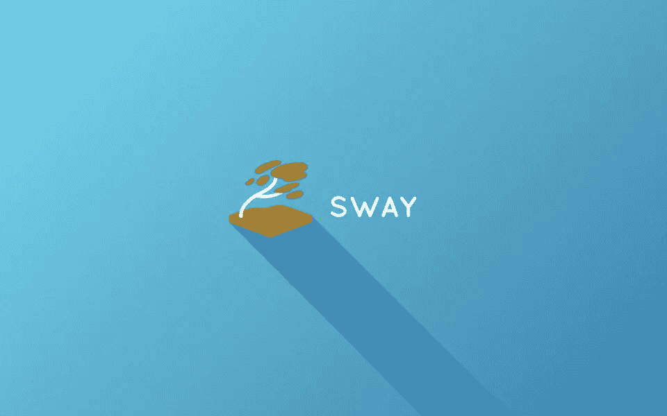
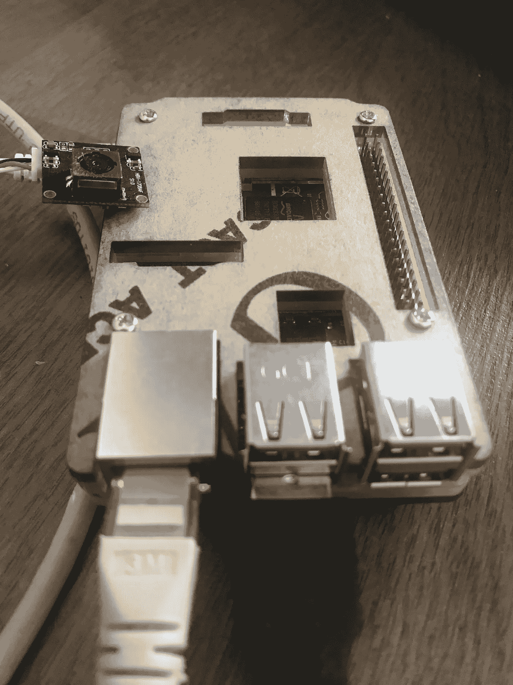

# Yocto 项目案例研究

> 原文：<https://levelup.gitconnected.com/a-case-study-on-the-yocto-project-947bfe58eb0c>


在这篇文章中，我们将通过构建一个真实的例子来解释什么是 Yocto 项目——条形码阅读器。所以我们开始吧！

# 介绍

以下摘录摘自维基百科关于 Yocto 项目的文章。

> Yocto 项目是一个 Linux 基金会合作开源项目，其目标是开发工具和流程，为独立于嵌入式硬件底层架构的嵌入式和物联网软件创建 Linux 发行版。该项目由 Linux 基金会在 2010 年宣布，并于 2011 年 3 月与包括 OpenEmbedded 在内的 22 个组织合作启动。

这直接将我们引向 OpenEmbedded 构建系统。那么什么是 OpenEmbedded 和 OpenEmbedded build system 呢？以下摘录摘自 OpenEmbedded 上的维基百科文章。

> *OpenEmbedded 是一个构建自动化框架和交叉编译环境，用于为嵌入式设备创建 Linux 发行版。OpenEmbedded 框架由 OpenEmbedded 社区开发，该社区于 2003 年正式成立。OpenEmbedded 是 Yocto 项目的推荐构建系统，yo CTO 项目是一个 Linux 基金会工作组，帮助商业公司为嵌入式产品开发基于 Linux 的系统。*
> 
> *构建系统是基于 BitBake“食谱”的，它指定了如何构建一个特定的包，但也包括依赖项和源代码位置的列表，以及如何安装和删除编译后的包的说明。OpenEmbedded 工具使用这些方法来获取和修补源代码、编译和链接二进制文件、生成二进制文件包(ipk、deb、rpm)以及创建可引导映像。*

从上面关于 Yocto 项目和 OpenEmbedded 的引用可以看出，两者是有区别的。然而，它们经常互换使用。简而言之；

> Yocto 是一个伞式项目，用于构建你自己的 Linux 嵌入式发行版
> 
> ***OpenEmbedded 是 Yocto*** 的构建系统

OpenEmbedded 利用工具 **BitBake** 来做任何事情，从上面的摘录中可以看出。在下一节中，将尝试解释如何获得 open embedded build system**bit bake**。

# 如何准备主机系统

由于目标系统是 Linux 操作系统， **BitBake** 需要一个 Linux 操作系统作为主机，尤其是 Debian/Ubuntu。Windows 或 MacOS 上的 Linux VM 或 Windows 上的 WSL 可以用作构建机器，但由于性能问题和对磁盘空间的高需求，不推荐使用。在任何情况下，都需要一台 Linux 机器，即使是虚拟的或本地的。从现在开始，我们有两个选项来在宿主 Linux 机器上安装构建系统。

*   直接在主机上安装工具。
*   使用 Docker 获取整个构建系统。

本教程中使用了后一种方法，因为第一种方法扰乱了主机系统，而第二种方法提供了一个隔离的系统。在 Linux 上，这两种方法的工作性能相同，因为 Docker 没有添加额外的工作层。但是在 Window 和 MacOS 上，Docker 需要额外的 Linux 虚拟机，因此性能会降低。

从现在开始，我们假设我们有一台 Debian/Ubuntu Linux 机器(本地的或虚拟的),并且我们可以通过 SSH 控制台访问这台机器。如果你对控制台感到不舒服，你可以使用 teh VS Code 远程 SSH 插件。

对于第一种方法，您可以遵循文档 Yocto 项目快速构建。

对于第二种方法，首先需要安装 Docker 引擎。为此，你可以按照 Debian 上的文档安装 Docker 引擎。我们还需要 **git** 版本控制工具。它可以按如下方式安装

```
$ sudo apt-get update $ sudo apt-get install git
```

# 如何获得 OpenEmbedded 构建系统

现在我们在主机上已经有了所有需要的基础工具，我们可以从 **Poky** 项目中获得 **BitBake** 如下

```
# Create a working directory
$ mkdir -p /mnt/Work/PROJs/rpi/yocto/src
$ cd /mnt/Work/PROJs/rpi/yocto/src

# getting latest stable build system branch kirkstone from yocto project repos
$ git clone https://git.yoctoproject.org/poky -b kirkstone

# return to yocto directory and run docker
$ cd ..
$ docker run --rm -it -v $(pwd):/workspace --workdir /workspace crops/poky:latest

# exit to return host command prompt
$ exit
```

发出最后一个命令后，如果在本地找不到容器映像，它将自动从 **Docker Hub** 下载并运行容器，然后进入容器命令行提示符。现在我们有了一个完整的构建系统，但是没有要构建的源代码。我们将在下一节中获取资源。

# 如何获得 BitBake 图层

在 **BitBake** 概念中，每组提供相同功能的源称为**层**或**元层**。事实上，它们不是一个可以构建的常规源代码。它们是用 **BitBake** 语言编写的脚本，定义了如何获取源代码、修补源代码、构建源代码、依赖源代码以及集成到最终的目标映像中。我们需要为我们的项目以下几层。

*   **meta-extra**——添加一个普通 sudo 用户的自定义层
*   **meta-raspberrypi**—RPI 板支持包
*   **meta-openembedded** —附加的 Linux 工具
*   **元虚拟化**—Docker 支持包

这些源代码可以从以下相关位置下载

```
# goto source folder
$ cd /mnt/Work/PROJs/rpi/yocto/src

# meta-extra
$ git clone https://github.com/ierturk/yocto-meta-extra.git -b kirkstone meta-extra

# meta-raspberrypi
$ git clone https://git.yoctoproject.org/meta-raspberrypi -b kirkstone

# meta-openembedded
$ git clone https://git.openembedded.org/meta-openembedded -b kirkstone

# meta-virtualization
$ git clone https://git.yoctoproject.org/meta-virtualization -b kirkstoneNow we have all the source to build the target image.
```

# 配置和构建目标映像

我们的目标图像将用于开发，它将有很多工具，不会有生产图像，因此它会比生产图像大。然而，我们将遵循不同的方法来开发应用程序。我们将为应用程序使用 Docker，所有未包含在基本映像中的必需包都将包含在 Docker 容器中。

现在我们可以开始配置和构建映像了

```
# goto yocto directory and run Docker
$ cd /mnt/Work/PROJs/rpi/yocto/src
$ docker run --rm -it -v $(pwd):/workspace --workdir /workspace crops/poky:latest

# We will drop into container command promt.
# Now the directory /mnt/Work/PROJs/rpi/yocto/src will be mounted
# as /workspace within the container, and we are in this directory.

# Following command start a new build directory,
# and automatically drop into build directory
$ . src/poky/oe-init-build-env
### Shell environment set up for builds. ###

You can now run 'bitbake <target>'

Common targets are:
    core-image-minimal
    core-image-full-cmdline
    core-image-sato
    core-image-weston
    meta-toolchain
    meta-ide-support

You can also run generated qemu images with a command like 'runqemu qemux86'

Other commonly useful commands are:
 - 'devtool' and 'recipetool' handle common recipe tasks
 - 'bitbake-layers' handles common layer tasks
 - 'oe-pkgdata-util' handles common target package tasks
```

那么在目录 **yocto** 下应该有一个如下的目录树。

```
|-- build
|   |-- conf
|   |   |-- bblayers.conf
|   |   |-- local.conf
|   |   `-- templateconf.cfg
`-- src
    |-- meta-extra
    |-- meta-openembedded
    |-- meta-raspberrypi
    |-- meta-virtualization
    `-- poky
```

现在我们需要编辑文件 **bblayers.conf** 和 **local.conf** 。它们是用内容创建的，需要在修补后应用。

**bblayers.conf** 的补丁

```
diff initial/bblayers.conf final/bblayers.conf 
11a12,19
>   ${TOPDIR}/../src/meta-raspberrypi \
>   ${TOPDIR}/../src/meta-openembedded/meta-oe \
>   ${TOPDIR}/../src/meta-openembedded/meta-multimedia \
>   ${TOPDIR}/../src/meta-openembedded/meta-networking \
>   ${TOPDIR}/../src/meta-openembedded/meta-python \
>   ${TOPDIR}/../src/meta-openembedded/meta-filesystems \
>   ${TOPDIR}/../src/meta-virtualization \
>   ${TOPDIR}/../src/meta-extra \
```

**local.conf** 的补丁

```
diff initial/local.conf final/local.conf 
36a37,38
> MACHINE ?= "raspberrypi3-64"
> #
108c110
< PACKAGE_CLASSES ?= "package_rpm"
---
> PACKAGE_CLASSES ?= "package_ipk"
276a279,344
> 
> # IMAGE_ROOTFS_EXTRA_SPACE = "16777216"
> 
> # Systemd enable
> DISTRO_FEATURES:append = " systemd"
> VIRTUAL-RUNTIME_init_manager = "systemd"
> DISTRO_FEATURES_BACKFILL_CONSIDERED = "sysvinit"
> VIRTUAL-RUNTIME_initscripts = ""
> 
> # Extra Users
> DISTRO_FEATURES:append = " pam"
> IMAGE_INSTALL:append = " extra-sudo"
> IMAGE_INSTALL:append = " extra-user"
> 
> # Image features
> IMAGE_FEATURES:append = " hwcodecs bash-completion-pkgs"
> 
> # Kernel Modules All
> # IMAGE_INSTALL:append = " kernel-modules"
> # IMAGE_INSTALL:append = " linux-firmware"
> 
> # OpenGL
> DISTRO_FEATURES:append = " opengl"
> 
> # Dev Tools
> IMAGE_FEATURES:append = " tools-debug"
> EXTRA_IMAGE_FEATURES:append = " ssh-server-openssh"
> 
> # Virtualization
> DISTRO_FEATURES:append = " virtualization"
> IMAGE_INSTALL:append = " docker-ce"
> IMAGE_INSTALL:append = " python3-docker-compose"
> IMAGE_INSTALL:append = " python3-distutils"
> 
> # Network manager
> IMAGE_INSTALL:append = " wpa-supplicant"
> IMAGE_INSTALL:append = " networkmanager" 
> IMAGE_INSTALL:append = " modemmanager"
> IMAGE_INSTALL:append = " networkmanager-nmcli"
> IMAGE_INSTALL:append = " networkmanager-nmtui"
> 
> # USB Camera
> IMAGE_INSTALL:append = " kernel-module-uvcvideo"
> IMAGE_INSTALL:append = " v4l-utils"
> 
> # RPi
> ENABLE_UART = "1"
> 
> # Date Time Daemon
> # IMAGE_INSTALL:append = " ntpdate"
> 
> # Tools
> IMAGE_INSTALL:append = " git"
> IMAGE_INSTALL:append = " curl"
> IMAGE_INSTALL:append = " wget"
> IMAGE_INSTALL:append = " rsync"
> IMAGE_INSTALL:append = " sudo"
> IMAGE_INSTALL:append = " nano"
> IMAGE_INSTALL:append = " socat"
> IMAGE_INSTALL:append = " tzdata"
> IMAGE_INSTALL:append = " e2fsprogs-resize2fs gptfdisk parted util-linux udev"
> 
> # VS Code reqs
> IMAGE_INSTALL:append = " ldd"
> IMAGE_INSTALL:append = " glibc"
> IMAGE_INSTALL:append = " libstdc++"
```

现在只需键入以下命令，然后你需要等待相当长的时间来获得目标图像。

```
$ bitbake core-image-base
```

# 闪烁图像

您会发现该映像的名称为**build/tmp/deploy/images/raspberrypi 3–64/core-image-base-raspberrypi 3–64 . wic . bz2**。在 **Unix** 系统中，镜像可以按如下方式刷新。

```
# Unzip image
$ bzip2 -d -f ./core-image-base-raspberrypi3-64.wic.bz2

# Flash to SD Card
# Here you need to change sdX with your SD Card reader device.
$ sudo dd if=./core-image-base-raspberrypi3.wic of=/dev/sdX bs=1m
```

# 第一轮

最后，你有一个 SD 卡有**rpi 3–64 位操作系统**图像。只需插入您的 **RPI3** ，然后通电。如果您已经知道您的 RPI IP 地址，您可以通过 SSH 控制台以 root 用户身份登录，无需密码，或者使用默认密码 **1200** 与用户 **ierturk** 登录。首次登录时，系统请求更改用户**伊尔图尔克**的密码。这个用户也是一个 sudo 用户。

# 额外调整

为了保持图像尺寸更小并适合任何 SD 卡，根文件系统被保持得尽可能小。现在它需要扩展如下。

```
# login as root user over SSH
$ ssh root@ip_address_of_the_rpi

# following command list your memory blocks
$ lsblk
NAME        MAJ:MIN RM  SIZE RO TYPE MOUNTPOINTS
mmcblk0     179:0    0  XXXG  0 disk 
|-mmcblk0p1 179:1    0 69.1M  0 part /boot
`-mmcblk0p2 179:2    0   XXG  0 part /

# here mmcblk0p2 needs to be expanded to its max
$ parted /dev/mmcblk0 resizepart 2 100%
$ resize2fs /dev/mmcblk0p2

# then it looks like as follow
$ lsblk
NAME        MAJ:MIN RM  SIZE RO TYPE MOUNTPOINTS
mmcblk0     179:0    0 29.1G  0 disk 
|-mmcblk0p1 179:1    0 69.1M  0 part /boot
`-mmcblk0p2 179:2    0   29G  0 part /
```

最后一切都好了。现在输入下面的命令来测试你的 Docker 安装

```
$ docker info
Client:
 Context:    default
 Debug Mode: false

Server:
 Containers: 0
  Running: 0
  Paused: 0
  Stopped: 0
 Images: 2
 Server Version: 20.10.12-ce
 Storage Driver: overlay2
  Backing Filesystem: extfs
  Supports d_type: true
  Native Overlay Diff: true
  userxattr: false
 Logging Driver: json-file
 Cgroup Driver: cgroupfs
 Cgroup Version: 1
 Plugins:
  Volume: local
  Network: bridge host ipvlan macvlan null overlay
  Log: awslogs fluentd gcplogs gelf journald json-file local logentries splunk syslog
 Swarm: inactive
 Runtimes: io.containerd.runc.v2 io.containerd.runtime.v1.linux runc
 Default Runtime: runc
 Init Binary: docker-init
 containerd version: d12516713c315ea9e651eb1df89cf32ff7c8137c.m
 runc version: v1.1.2-9-gb507e2da-dirty
 init version: b9f42a0-dirty
 Kernel Version: 5.15.34-v8
 Operating System: Poky (Yocto Project Reference Distro) 4.0.2 (kirkstone)
 OSType: linux
 Architecture: aarch64
 CPUs: 4
 Total Memory: 909MiB
 Name: raspberrypi3-64
 ID: SKCZ:5JOV:CLCE:ECSC:UJ46:VGCH:YAFW:TNOF:J3FN:WO26:FHIO:BHRR
 Docker Root Dir: /var/lib/docker
 Debug Mode: false
 Registry: https://index.docker.io/v1/
 Labels:
 Experimental: false
 Insecure Registries:
  127.0.0.0/8
 Live Restore Enabled: false

WARNING: No memory limit support
WARNING: No swap limit support
WARNING: No kernel memory TCP limit support
WARNING: No oom kill disable support
WARNING: No blkio throttle.read_bps_device support
WARNING: No blkio throttle.write_bps_device support
WARNING: No blkio throttle.read_iops_device support
WARNING: No blkio throttle.write_iops_device support
```

现在我们有了一个没有任何**桌面**的基础系统来使用 **Docker** 开发应用。

# 使用 Docker 容器和 Docker Compose 开发一个简单的条形码阅读器应用程序，无需修改基础系统

我们将使用两个 Docker 容器，如下所示

*   VNC 支持的窗口管理器作为 wayland 服务器
*   作为 wayland 客户端的应用服务器

现在我们需要建造它们。为此，可以使用 **Docker build** 在本地构建容器映像，或者使用**Docker buildx**构建多个架构。

在本教程中，我们将遵循另一种构建容器的方法。我们将使用 **GitHub** 动作来构建容器并将它们作为 CI/CD 自动推送到 HubDocker。我们需要一个名为 **Dockerfile** 的配方文件来构建容器映像。这里的 **Alpine Linux** 用于容器以获得更小的容器映像。下面的 docker 文件用于包含支持 VNC 的 windows manager SwayWm(一个 wayland 合成器)的容器。它看起来就像一个 bash 脚本。

```
# Dockerfile SwayWM
ARG ALPINE_VERSION=3.16
FROM alpine:${ALPINE_VERSION}

ENV USER="vnc-user" \
    APK_ADD="mesa-dri-swrast openssl socat sway xkeyboard-config" \
    APK_DEL="bash curl" \
    VNC_LISTEN_ADDRESS="0.0.0.0" \
    VNC_AUTH_ENABLE="false" \
    VNC_KEYFILE="key.pem" \
    VNC_CERT="cert.pem" \
    VNC_PASS="$(pwgen -yns 8 1)"

RUN apk update \
    && apk upgrade

# Add packages
RUN apk add --no-cache $APK_ADD

# Add fonts
RUN apk add --no-cache msttcorefonts-installer fontconfig \
    && update-ms-fonts

# Add application user
RUN addgroup -g 1000 $USER && adduser -u 1000 -G $USER -h /home/$USER -D $USER

# Iinstall vnc packages
RUN apk add --no-cache wayvnc neatvnc

# Copy sway config
COPY assets/swayvnc/config /etc/sway/config
COPY assets/swayvnc/kms.conf /etc/kms.conf

# Add wayvnc to compositor startup and put IPC on the network
RUN mkdir /etc/sway/config.d \
    && echo "exec wayvnc 0.0.0.0 5900" >> /etc/sway/config.d/exec \
    && echo "exec \"socat TCP-LISTEN:7023,fork UNIX-CONNECT:/run/user/1000/sway-ipc.sock\"" >> /etc/sway/config.d/exec \
    && mkdir -p /home/$USER/.config/wayvnc/ \
    && printf "\
address=$VNC_LISTEN_ADDRESS\n\
enable_auth=$VNC_AUTH_ENABLE\n\
username=$USER\n\
password=$VNC_PASS\n\
private_key_file=/home/$USER/$VNC_KEYFILE\n\
certificate_file=/home/$USER/$VNC_CERT" > /home/$USER/.config/wayvnc/config

# Generate certificates vor VNC
RUN openssl req -x509 -newkey rsa:4096 -sha256 -days 3650 -nodes \
	-keyout key.pem -out cert.pem -subj /CN=localhost \
	-addext subjectAltName=DNS:localhost,DNS:localhost,IP:127.0.0.1

# Add entrypoint
USER $USER
COPY assets/swayvnc/entrypoint.sh /
ENTRYPOINT ["/entrypoint.sh"]
```

以下 YML 文件用于 Github 操作。有了这些文件，你就可以在 DockerHub 上得到三种架构(linux/amd64，linux/arm64，linux/arm/v7)的 Dockar 容器镜像。

```
name: Alpine SwayVnc

on:
  push:
    branches:
      - master

jobs:
  docker:
    runs-on: ubuntu-latest
    steps:
      -
        name: Checkout
        uses: actions/checkout@v3
      -
        name: Docker meta
        id: meta
        uses: docker/metadata-action@v4
        with:
          images: |
            ierturk/alpine-swayvnc
          tags: |
            type=raw,value={{date 'YYYYMMDD-hhmm'}}
      -
        name: Set up QEMU
        uses: docker/setup-qemu-action@v2
      -
        name: Set up Docker Buildx
        uses: docker/setup-buildx-action@v2
      -
        name: Login to DockerHub
        uses: docker/login-action@v2
        with:
          username: ${{ secrets.DOCKER_HUB_USERNAME }}
          password: ${{ secrets.DOCKER_HUB_ACCESS_TOKEN }}
      -
        name: Build and push
        uses: docker/build-push-action@v3
        with:
          context: ./Alpine
          file: ./Alpine/swayvnc.Dockerfile
          platforms: linux/amd64, linux/arm64, linux/arm/v7
          push: true
          tags: ${{ steps.meta.outputs.tags }}, ierturk/alpine-swayvnc:latest
          labels: ${{ steps.meta.outputs.labels }}
          cache-from: type=registry,ref=ierturk/alpine-swayvnc:latest
          cache-to: type=inline
      -
        name: Image digest
        run: echo ${{ steps.docker_build.outputs.digest }}
```

所有资料都可以在相关的 GitHub repo 上找到。所有需要的容器也将被构建，然后由这个 repo 使用 GitHub 动作来推送。现在，集装箱已准备好在**码头**上使用。现在可以输入下面的代码来运行容器，并且可以通过一个 **VNC 浏览器**连接到**桌面 SwayWM** 。

```
$ export LISTEN_ADDRESS="0.0.0.0"; docker run -e XDG_RUNTIME_DIR=/tmp \
             -e WLR_BACKENDS=headless \
             -e WLR_LIBINPUT_NO_DEVICES=1 \
             -e SWAYSOCK=/tmp/sway-ipc.sock
             -p${LISTEN_ADDRESS}:5900:5900 \
             -p${LISTEN_ADDRESS}:7023:7023 ierturk/alpine-swayvnc
```

然后你会第一次看到你的桌面。这不是一个普通的桌面，而是一个轻量级的。



然而，通过键入一个长命令行来启动容器并不是一种正确的方式。幸运的是，有另一个工具可以更方便地做到这一点。我们将通过使用工具 **Docker-Compose** 来运行容器。Docker-Compose 使用一个 YML 文件来运行容器。这是一次运行多个容器的另一个方法。它看起来像如下

```
version: '2.4'

services:
  swayvnc:
    image: ierturk/alpine-swayvnc:latest
    volumes:
      - type: bind
        source: /tmp
        target: /tmp
      - type: bind
        source: /run/user/1000
        target: /run/user/1000
      - type: bind
        source: /dev
        target: /dev
      - type: bind
        source: /run/udev
        target: /run/udev
      - type: bind
        source: ../..
        target: /workspace
    cap_add:
      - CAP_SYS_TTY_CONFIG
    # Add device access rights through cgroup...
    device_cgroup_rules:
      # ... for tty0
      - 'c 4:0 rmw'
      # ... for tty7
      - 'c 4:7 rmw'
      # ... for /dev/input devices
      - 'c 13:* rmw'
      - 'c 199:* rmw'
      # ... for /dev/dri devices
      - 'c 226:* rmw'
      - 'c 81:* rmw'
    entrypoint: /entrypoint.sh
    network_mode: host
    privileged: true
    environment:
      - XDG_RUNTIME_DIR=/run/user/1000
      - WLR_BACKENDS=headless
      - WLR_LIBINPUT_NO_DEVICES=1
      - SWAYSOCK=/run/user/1000/sway-ipc.sock

  app:
    image: ierturk/alpine-dev-qt:latest
    security_opt:
      - seccomp:unconfined
    shm_size: '256mb'
    volumes:
      - type: bind
        source: /tmp
        target: /tmp
      - type: bind
        source: /run/user/1000
        target: /run/user/1000
      - type: bind
        source: /dev
        target: /dev
      - type: bind
        source: /run/udev
        target: /run/udev
      - type: bind
        source: ../..
        target: /workspace
      # - type: bind
      #   source: ~/.ssh
      #   target: /home/ierturk/.ssh
      #   read_only: true
    cap_add:
      - CAP_SYS_TTY_CONFIG
      - SYS_PTRACE
    # Add device access rights through cgroup...
    device_cgroup_rules:
      # ... for tty0
      - 'c 4:0 rmw'
      # ... for tty7
      - 'c 4:7 rmw'
      # ... for /dev/input devices
      - 'c 13:* rmw'
      - 'c 199:* rmw'
      # ... for /dev/dri devices
      - 'c 226:* rmw'
      - 'c 81:* rmw'
    stdin_open: true
    tty: true
    network_mode: host
    privileged: true
    environment:
      - WAYLAND_USER=ierturk
      - XDG_RUNTIME_DIR=/run/user/1000
      - WAYLAND_DISPLAY=wayland-1
      - DISPLAY=:0
      - QT_QPA_PLATFORM=wayland
      - QT_QPA_EGLFS_INTEGRATION="eglfs_kms"
      - QT_QPA_EGLFS_KMS_ATOMIC="1"
      - QT_QPA_EGLFS_KMS_CONFIG="/etc/kms.conf"      
      - IGNORE_X_LOCKS=1
      - QT_IM_MODULE=qtvirtualkeyboard
    user: ierturk
    working_dir: /workspace
    depends_on:
      - swayvnc
```

这里有两个服务定义。其中一个用于显示管理器，另一个用于应用程序。现在，它可以只是键入如下的一切 ups 和运行。

```
$ docker-compose -f Alpine/swayvnc-dc.yml up -d
Creating alpine_swayvnc_1 ... done
Creating alpine_app_1 ... done
```

现在它们都已启动并运行，相互连接并连接到基础系统资源。从现在开始，我们可以登录到应用程序容器如下

```
$ docker exec -it alpine_app_1 ash
```

我们可以在这里运行任何任意应用程序，我们将尝试一个条形码阅读器— ZXing-C++。对于示例 UI，我们将使用 **OpenCV** 和 **Qt5 — QuickControl 2** (QML 类型)和一个 **USB 摄像头**。条形码阅读器库源代码可通过 **CMake** 下载并构建，如下所示

```
$ git clone https://github.com/nu-book/zxing-cpp.git 
# then go into zxing-cpp directory and craete a build folder 
$ cd zxing-cpp 
$ mkdir build 
$ cd build 
$ cmake .. 
$ make# then run the application 
$ ./example/ZXingOpenCV
```

您可能会看到一些类似以下图像的屏幕


如果一切顺利，我们可以退出容器命令行，关闭所有容器，如下所示

```
# close app application 
# just press CTRL-C 
$ exit 
$ docker-compose -f Alpine/swayvnc-dc.yml down 
Stopping alpine_app_1 ... done 
Stopping alpine_swayvnc_1 ... done 
Removing alpine_app_1 ... done 
Removing alpine_swayvnc_1 ... done
```

因此，不会留下任何东西，容器将被停止和删除。

最后这是我的 **RPI3** 带 **USB 摄像头**。



# 结论

直到现在，我们从零开始开发了整个系统。你可以看到它在工作。你可以在这方面下功夫，根据你的要求修改一些部分。

希望你喜欢这个教程，觉得有用。感谢您的阅读。

发布于:2022 年 8 月 20 日长度:16 分钟阅读，3206 字类别:[编程](https://erturk.me/categories/programming) [工程](https://erturk.me/categories/engineering)系列:[入门](https://erturk.me/series/getting-started)标签:[qt](https://erturk.me/tags/qt)yoctoopen embedded[rpi](https://erturk.me/tags/rpi)[docker](https://erturk.me/tags/docker)[github](https://erturk.me/tags/github)参见:[入门使用 VS 代码开发容器开发 Qt 尽可能简单的](https://erturk.me/blog/getting-started-qt-with-vs-code/)

*原载于 2022 年 8 月 19 日*[*https://er Turk . me*](https://erturk.me/blog/a-case-study-on-the-yocto-project/)*。*

# 分级编码

感谢您成为我们社区的一员！在你离开之前:

*   👏为故事鼓掌，跟着作者走👉
*   📰查看[升级编码出版物](https://levelup.gitconnected.com/?utm_source=pub&utm_medium=post)中的更多内容
*   🔔关注我们:[Twitter](https://twitter.com/gitconnected)|[LinkedIn](https://www.linkedin.com/company/gitconnected)|[时事通讯](https://newsletter.levelup.dev)

🚀👉 [**加入升级人才集体，找到一份惊艳的工作**](https://jobs.levelup.dev/talent/welcome?referral=true)