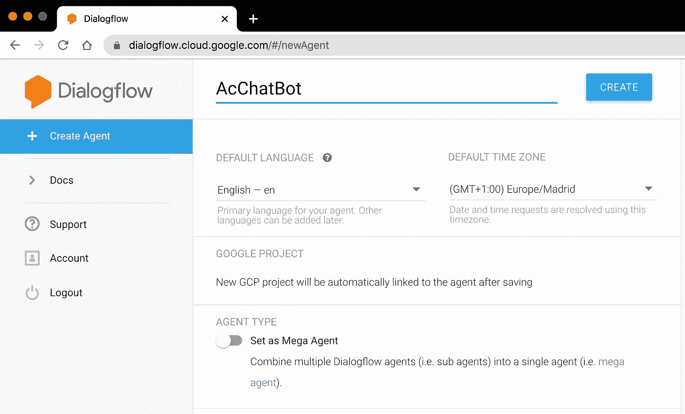
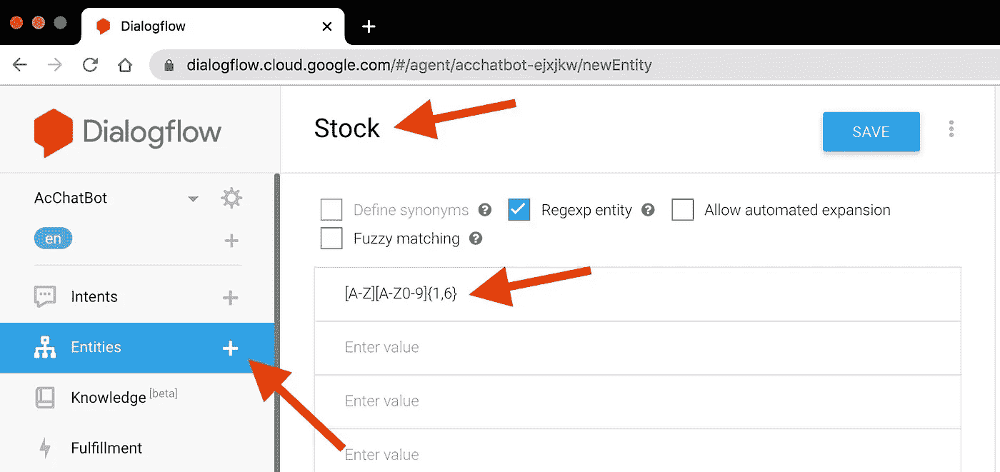
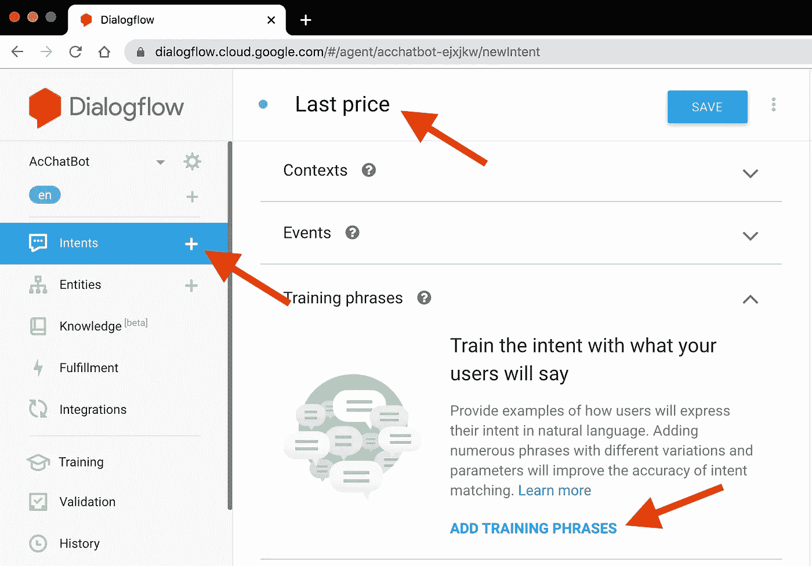
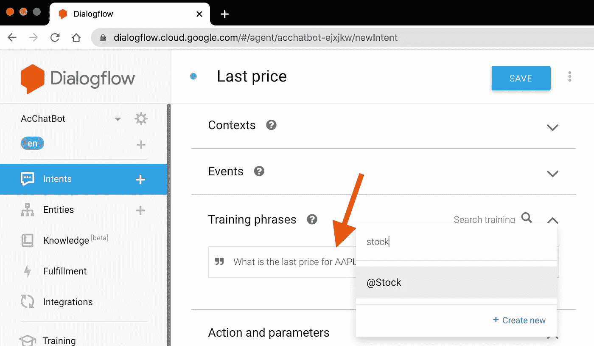
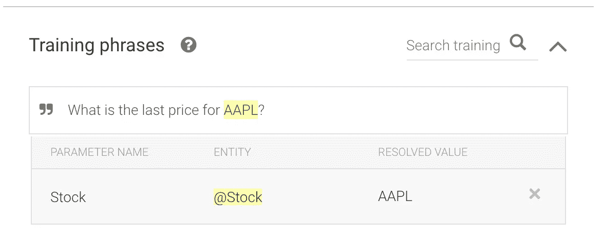
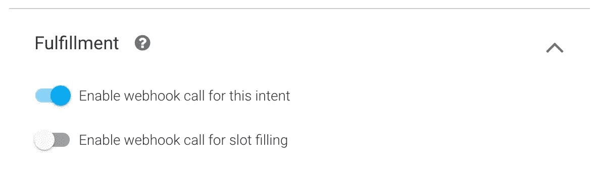
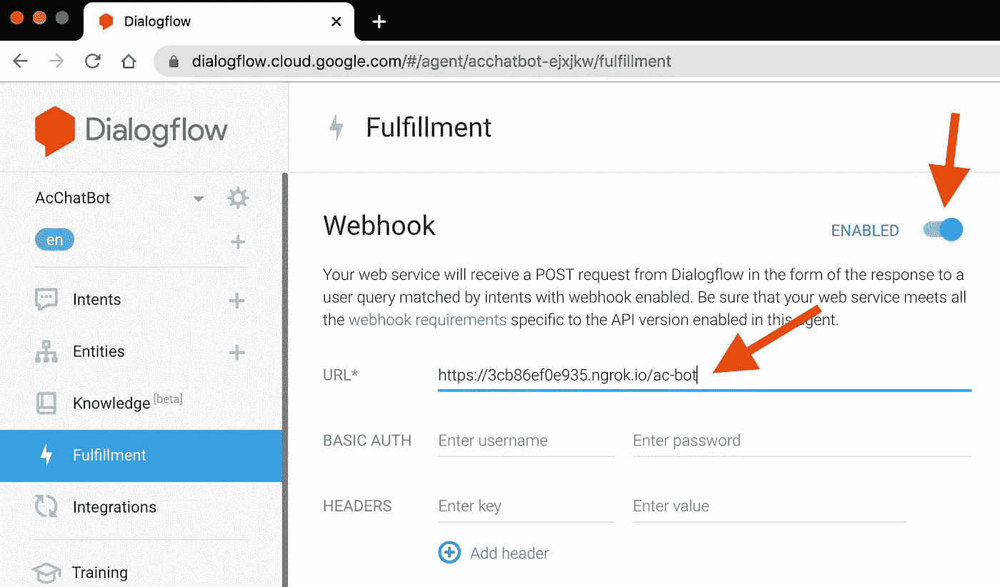
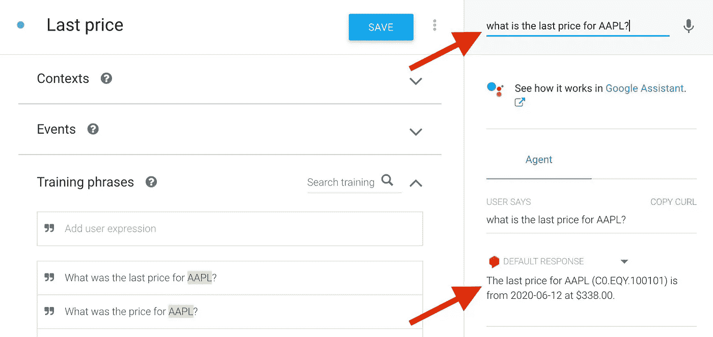
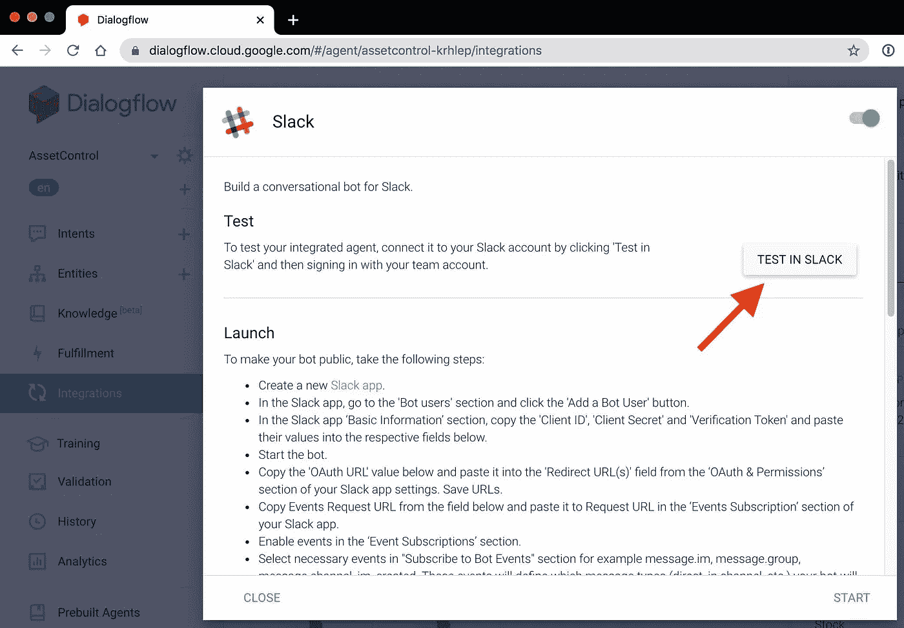
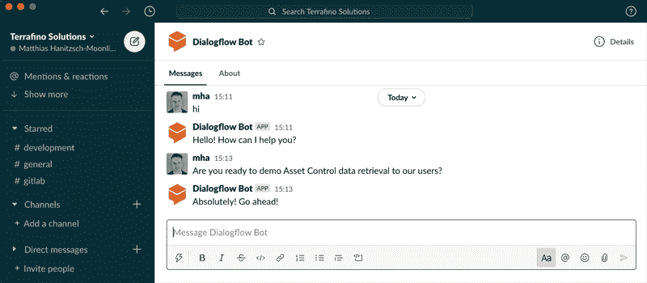

# 用于资产控制的聊天机器人

> 原文：<https://levelup.gitconnected.com/a-chatbot-for-asset-control-19e6606b7d9c>

在这篇文章中，我将为资产控制构建一个聊天机器人，作为一个有趣的小项目。为什么？因为我早就想实现一个聊天机器人了——如果只是为了理解如何实现的话——而且在 AC 领域这样做似乎很自然。我还将把它与 Slack 集成在一起，看看它如何与我现有的工具和工作流程相适应。

# 聊天机器人做什么？

到现在为止，你应该已经在很多地方遇到过聊天机器人了。它们可能在公司网站上，帮助你得到常见问题的答案，允许你预订等等。

在这种情况下，我想实现一个聊天机器人的原型来与 Slack 集成，这允许我与资产控制进行通信。我可能想向它询问我的 AC env 的状态信息或请求数据。

为了指导实现，我使用了机器人应该能够回答的以下问题:

*   到 XYZ 的最后价格是多少？
*   XYZ 这个月的高点是多少？
*   今天有多少嫌疑犯？
*   复制是否是最新的？

我们会看到，一旦我们有了第一个问题，其他问题只是同一模式的变体。

那么，我们是从零开始实现这个机器人吗？当然不是。有很多解决方案，我很快就选择了 Google Dialogflow。让我们看看这是如何工作的。

# 在 Dialogflow 中构建 bot

为了在 [Google Dialogflow](https://dialogflow.com/) 中构建我们的机器人，我们需要理解几个概念:

*   意图
*   实体
*   完成

我们将回到第一个问题*“XYZ 的最终价格是多少？”*来解释这些。

意图捆绑了属于机器人应该处理的某个狭义定义的主题的所有内容。在我们的例子中，这是从我们的系统中检索一只股票最近的价格。我们将使用 Dialogflow 通过给机器人训练短语来训练它理解什么时候对话是关于这样一个意图的。我们一会儿就能看到。

那么实体就是构成我们对话的构件，并且是我们特别感兴趣的，所以我们想把它们作为参数来捕捉。现在，在我们的例子中，当我们问问题*“AAPL 的最后价格是多少？”时，这将是股票代码 AAPL*

最后，履行概念允许我们通过 webhooks 来访问聊天机器人背后的服务。也就是说，我们将与资产控制进行通信，以查询给定的股票并检索最近的可用价格。

现在让我们来建造我们的机器人。

# 第一步:设置你的机器人。

前往 https://dialogflow.cloud.google.com/#/login 并签到。然后创建一个代理 AcChatBot:

# 步骤 2:创建股票实体

从左边的菜单中，单击 Entities 旁边的加号，将其命名为 Stock，并输入`[A-Z][A-Z0-9]{1,6}`作为正则表达式。虽然不完全匹配 ticker 符号，但对于我们的示例来说已经足够了，并且可以与 Dialogflow 本身执行的正则表达式检查一起工作(例如，不要太宽泛等等。).那就省省吧。

# 步骤 3:创建最后的价格意向

是我们最后一次价格意向的时候了。同样，从左侧菜单中选择 Intents 旁边的加号，将其命名为`Last price`,然后单击 ADD TRAINING PHRASES:

输入`What is the last price for AAPL?`。然后用鼠标高亮显示`AAPL`。这将弹出一个弹出窗口。搜索`Stock`，然后选择显示的选项:

如果操作正确，结果将如下所示，以确保 Dialogflow 正确捕获股票实体:

**重要！**然后向下滚动，打开履行部分，点击启用履行，然后切换到`Enable webhook call for this intent`，如下所示:

这允许我们调用自己的后端功能，并与资产控制进行通信。

确保在继续之前保存意图。

# 步骤 4:实现 REST 服务来检索资产控制数据

同样，有许多方法可以做到这一点。我们将使用 Spring Boot，因为它为我们做了所有繁重的工作，我们留在 Java 中，因此可以立即使用与 Adetta 使用的相同的资产控制 Java API。

如果你还不知道，Adetta 是我们用于资产控制的测试自动化软件。请务必在这里看一下[Adetta 简介。](https://terrafino-solutions.com/blog/adetta/adetta-introduction/)

有趣的是一个类`AcBotController`和它的`handleIntent`方法，如下所示:

您可以看到用于 Dialogflow 实现的 webhook 正在处理 POST 请求。它的输入和输出都是 JSON。我们使用`GoogleCloudDialogflowV2Webhook*`类来处理 JSON 的请求和响应。

意图的实际处理被传递给我们通过调用`AcBotIntents.getHandlerFor(request)`获得的 AcBotIntentHandler。让我们来看看这个类:

我们建立了意图到处理程序的映射(还记得我们的`Last price`意图吗？)并实现一个方法，在给定编码在请求对象中的意图的情况下检索合适的处理程序。我们还定义了一个默认的处理程序，以防我们找不到实际的处理程序:

现在，为了得到给定股票的最后价格，让我们看看`AcBotLastPriceIntentHandler`:

您可以看到我们如何使用`request.getQueryResult().getParameters().getOrDefault("Stock", "")`从请求对象中检索股票实体参数，然后调用`getLastPriceMessageForStock`，如下所示:

我们防止存货价值的丢失。否则，我们浏览我们的资产控制系统，寻找给定代码的股票。如果我们没有任何这样的 ADO，我们显示相应的消息。否则，我们将继续检索我们找到的每个 ADO 的价格数据(虽然这应该只是单个 ADO，但如果需要的话，实现将只返回多条消息。)

下面是我们如何找到最后的价格:

我们加载 ADO 的时间序列，获取最后一条记录，如果存在的话，创建一条消息，读为`The last price for AAPL (C0.EQY.100101) is from 2020-06-12 at $338.00`。我们再次警惕那些找不到价格的情况。

使用 Spring Boot，我们可以启动它，让我们的 REST 服务在 localhost:8080/ac-bot 上运行。接下来呢？

很明显，我们有一点欺骗，因为我们没有在任何地方部署这个服务，所以为了让它从外部可用，我们将使用 [ngrok](https://ngrok.com/) 为我们建立一个隧道:

# 第五步:建立我们自己的履行网钩

接下来，我们必须让 Dialogflow 知道我们的 REST 服务在哪里，所以回到那里，从左边的菜单中单击 Fulfillment:

然后输入 ngrok 给出的`https://...`地址，并确保在末尾加上`/ac-bot`。

好了，关键时刻到了。在右上角显示`Try it now`的地方，我们可以键入`What is the last price for AAPL?`，如果一切正常，我们应该会得到以下答案:

这太令人兴奋了！

# 步骤 6:将我们的聊天机器人与 Slack 整合

现在，我们不打算继续使用 Dialogflow 控制台来玩我们的 bot。相反，我们将把它与 Slack 整合。因此，从左边的菜单中选择 Integrations，找到 Slack 并启动一个测试机器人:

然后前往 Slack 并开始与机器人聊天:

然后，我们可以重复这个循环来实现文章开头列出的其他问题/意图。

# 结束语

我觉得这样做很有趣。也比我想象的容易。当然，我走了很多捷径:

*   仅在本地运行服务。
*   没有考虑安全性、访问控制和资产控制环境的选择。
*   对机器人的使用非常有限。

但是它显示了基本的概念，可以很容易地扩展。实际上，我很想尽快研究一个更强大的资产控制 Slack 集成。

我希望你喜欢这篇文章。保持联系，分享您的想法，提出问题等。我们是来帮忙的。