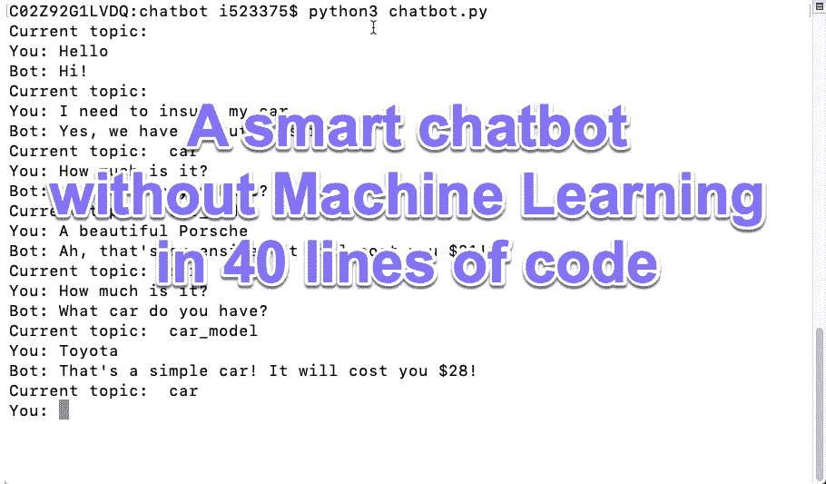
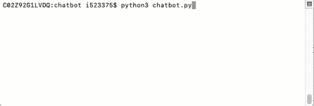

# 如何不用 ML 用 40 行写一个智能聊天机器人

> 原文：<https://levelup.gitconnected.com/a-chatbot-without-machine-learning-b76ad00e30c1>

你可以为任何目的编写聊天机器人



## 介绍

在这里，我们将尝试在不使用任何库的情况下编写一个简单而智能的聊天机器人。有了这个，用 Django 在自己的网站上运行电报机器人或聊天机器人就不难了。

我们将首先编写一个愚蠢的聊天机器人，它在其库中搜索答案，然后用相应的输出进行响应。

目标是为一家保险公司编写一个聊天机器人，如下所示:



## 上下文无关聊天机器人

正如你可能从标题中猜到的，我们的第一个版本没有上下文，所以我们有一个问题和答案的列表，我们寻找一个问题并回复一个答案:

```
oracle = [
    {"question": "hello", "answer": "Hi!"},
    {"question": "life", "answer": "Yes, we insure lives!"},
    {"question": "car", "answer": "Yes, we have an auto insurance!"},
    {"question": "auto", "answer": "Yes, we have an auto insurance!"},
    {"question": "vehicle", "answer": "Yes, we have an auto insurance!"},
    {"question": "accident", "answer": "Oh, we are sorry! Is anyone injured?"},
    {"question": "how much", "answer": "Hmm... how much is what?"},
]**while True**:
    question = input(**"You: "**)
    got_answer = **False
    for** el **in** oracle:
        match = **True
        for** word **in** el[**"question"**].split():
            **if** word **not in** question.lower():
                match = **False
        if** match:
            print(**"Bot:"**, el[**"answer"**])
            got_answer = **True
            break

    if not** got_answer:
        print(**"Bot:"**, **"Sorry, I didn't get it."**)
```

因此，我们仔细检查列表，并检查数据库中的任何问题，每个单词是否都在用户提出的问题中。如果是，我们回复并停止扫描。简单。

但是让我们现在运行它:

```
**You**: Hello
**Bot**: Hi!**You**: Do you have a car insurance?
**Bot**: Yes, we have an auto insurance!**You**: How much is it?
**Bot**: Hmm... how much is what?**You**: _
```

你看，我们现在有麻烦了。理论上，它应该给我们汽车保险的价格列表，但在我们的情况下，我们不确定之前的问题是什么。

## 语境的定义？一点点理论…

假设我们有一个人，呼叫中心代理，他有一个问题和答案的列表。如果有人打电话给他，问了一个问题，这个人会浏览列表并回答问题，就像上面我们的 bot 一样。所以，这个人有点傻，他不记得前面的问题了。

但是……我们还有其他代理，他们都被允许将客户重定向到彼此。

好了，现在如果用户打电话给代理 1，说他需要汽车保险，代理 1 说“好的，当然”，把用户重定向到代理 2，代理 2 的名字是“汽车”。

客户提出的下一个问题现在将由负责汽车保险的代理 2 处理。而如果问题是“多少钱”，那么代理 2 询问汽车制造商，并立即将客户重定向到代理 3，代理 3 的名称是“car_model”。当客户回答问题时，代理 3 可以很容易地告诉他(她)价格，并重定向回代理 2“汽车”。

***所以，这些代理人就是上下文。***

再比如。比方说，我们有一家比萨饼店，我们想订购一份比萨饼。一位顾客打电话给代理 1，点了“玛格丽塔”。代理商 1 说“当然，我们有玛格丽塔酒，你要加西红柿吗？”并重定向到代理，代理只管玛格丽塔，负责西红柿，名字叫“order _ margarita _ ask _ tomatoes”。当顾客说“是”或“不是”时，我们肯定知道这是关于西红柿的，因为我们当前的上下文是“订单 _ 玛格丽塔 _ 询问 _ 西红柿”。

因此，每个代理所做的是，根据问题，从列表中回复，并重定向到同一个或另一个代理。

数学上，这是一个函数:

`(context, question)->(reply, new_context)`

这个奇妙的模型叫做**有限状态自动机**。

## 基于上下文的聊天机器人

现在，我们能做些什么呢？

如果我们推广这个想法，那么我们简单地为每种情况创建许多不同的聊天机器人，并在需要时在它们之间切换。

从现在开始，我们不仅打印一些东西，我们还会切换到另一个(或同一个)聊天机器人。这非常简单:我们向 oracle 添加两个字段，即:“context”和“new context”:

```
oracle = [
    {"context": "", "question": "hello", "answer": "Hi!", "new_context": ""},
    {"context": "", "question": "life", "answer": "Yes, we insure lives!", "new_context": "life"},
    {"context": "", "question": "car", "answer": "Yes, we have an auto insurance!", ***"new_context": "car"***},
    {"context": "", "question": "auto", "answer": "Yes, we have an auto insurance!", "new_context": "car"},
    {"context": "", "question": "vehicle", "answer": "Yes, we have an auto insurance!", "new_context": "car"},
    {"context": "", "question": "accident", "answer": "Oh, we are sorry! Is anyone injured?", "new_context": "accident"},
    {***"context": "car", "question": "how much", "answer": "$20", "new_context": "car"***},
    {"context": "life", "question": "how much", "answer": "$10", "new_context": "life"},
]
```

我们也改编了这个程序:

```
while True:
    question = input("You: ")
    got_answer = False
    context = ""
    for el in oracle:
        ***if el["context"] == context or el["context"] == "":***
            match = True
            for word in el["question"].split():
                if word not in question.lower():
                    match = False
            if match:
                print("Bot:", el["answer"])
                got_answer = True
                ***context = el["context"]***
                break

    if not got_answer:
        print("Bot:", "Sorry, I didn't get it.")
```

现在我们的机器人聪明多了:

```
Current topic:  
**You**: Hello
**Bot**: Hi!Current topic:  
**You**: Do you have a car insurance?
**Bot**: Yes, we have an auto insurance!Current topic:  car
**You**: I need one. How much is it?
**Bot**: $20Current topic:  car
**You**: And what about life insurance?
**Bot**: Yes, we insure lives!Current topic:  life
**You**: And how much is that?
**Bot**: $10Current topic:  life
**You**: _
```

你看，根据“我们在哪里”,“多少”这个问题会有不同的回答。

但是它有多强大呢？比方说，投保“保时捷”比投保其他任何东西都贵。然后我们这样改变我们的预言:

```
...
{"context": "car", "question": "how much", "answer": "What car do you have?", "new_context": "**car_model**"},
{"context": "**car_model**", "question": "porsche", "answer": "Ah, that's expensive! It will cost you $31!", "new_context": "car"},
{"context": "**car_model**", "question": "", "answer": "That's a simple car! It will cost you $28!", "new_context": "car"},
...
```

现在，运行一辆“普通”汽车:

```
Current topic:  
**You**: I need to insure my car
**Bot**: Yes, we have an auto insurance!Current topic:  car
**You**: How much would it cost me?
**Bot**: What car do you have?Current topic:  car_model
**You**: Mazda
**Bot**: That's a simple car! It will cost you $28!Current topic:  car
**You**: _
```

对于“保时捷”来说:

```
Current topic:  
**You**: I need to insure my super car!
**Bot**: Yes, we have an auto insurance!Current topic:  car
**You**: How much is it?
**Bot**: What car do you have?Current topic:  car_model
**You**: I have a beautiful Porsche
**Bot**: Ah, that's expensive! It will cost you $31!Current topic:  car
**You**: _
```

而且我们连节目都没改！只有数据库！

让我们多玩玩吧。比如，在交通事故中，如果有人受伤，我们应该拨打 112，否则，我们会要求客户提供地址:

```
{"context": "", "question": "accident", "answer": "Oh, we are sorry! Is anyone injured?", "new_context": "accident_injured?"},
{"context": "accident_injured?", "question": "yes", "answer": "Call 112! This is serious!", "new_context": "accident"},
{"context": "accident_injured?", "question": "no", "answer": "Please give us the address...", "new_context": "accident_address"},
{"context": "accident", "question": "help", "answer": "Please give us the address...", "new_context": "accident_address"},
```

运行:

```
Current topic:  
**You**: I am in a traffic accident...
**Bot**: Oh, we are sorry! Is anyone injured?Current topic:  accident_injured?
**You**: yes
**Bot**: Call 112! This is serious!Current topic:  accident
**You**: help
**Bot**: Please give us the address...Current topic:  accident_address
**You**:
```

## 特殊情况

如果您需要保存地址或汽车型号，您也可以使用上下文:

```
context = ""
while True:
    print("Current topic: ", context)
    question = input("You: ")
    got_answer = False

 **if context == "accident_address":
        address = question**

    for el in oracle:
       ...
```

或者

```
context = ""
while True:
    print("Current topic: ", context)
    question = input("You: ")
    got_answer = False

 **if context == "car_model":
        car_model = question**

    for el in oracle:
       ...
```

这样，任何信息都可以存储:姓名、电话号码、地址、汽车型号等等。如何使用由你自己决定。

给这个聊天机器人添加正则表达式会很棒，但在这种情况下，只有程序员或数学家可能会填满数据库。

完整的代码在这里:

包括神谕在内共有 40 行代码！它是一个智能聊天机器人，可以处理上下文！