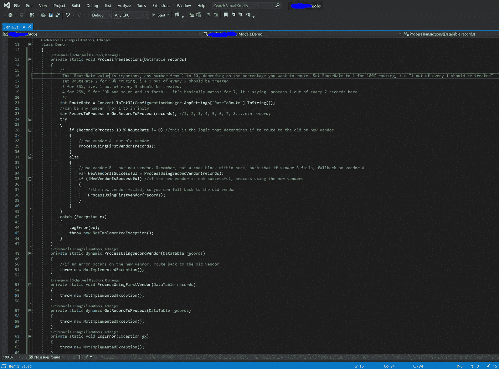

# 用特性标志改进部署的廉价而快速的方法

> 原文：<https://levelup.gitconnected.com/a-cheap-fast-hack-to-improving-deployments-with-feature-flags-5bdbf18362cc>

跌倒了，但爬得很快

我们以前都去过那里，或者至少，你会很快到达那里；您已经在测试环境中测试了您的代码，一切看起来都很完美，事实上，团队中的每个人都感谢您在集成第三方服务提供商方面所做的出色工作。你很自豪，这是一个星期五的晚上，部署团队将在用户流量相对较低的晚上进行部署。

所以你离😎“TGIF venue”(因为你计划在今晚的游戏之夜和一些朋友出去玩)，然后电话来了，“我们有一个问题”。是的，[墨菲定律](https://en.wikipedia.org/wiki/Murphy%27s_law)再次发挥作用。

你感到震惊，但并不震惊，这不是你第一次在生产中搞砸事情，是吗？(不错..欢迎加入俱乐部🎉🎉🎉).

无论如何，你花了接下来的两个小时试图找出你的生活和测试环境之间出了什么问题，毕竟，它在测试中一切正常，QA 甚至批准了这个推送。好吧，你最终发现了问题，解决了问题，好吧，每个人又都开心了，但是你只是厌倦了你的周五之夜被毁了。或者至少，用完了😥😥哦，是的，你们的人也已经结束了游戏之夜。

T 这就是这篇文章的来源，已经有过几次这样的问题，我总是最终感觉自己像一个糟糕的工程师，总是不能第一次就让一些东西工作。我的意思是，我也有我的好时光，但我希望那是永远的(我也想成为 10 倍的工程师😂).

无论如何，本文描述的是一种构建软件的方法，这种方法可以让您在部署现有应用程序的更新和修复时“高枕无忧”，尤其是那些不能承受任何停机时间的敏感应用程序。这种方法的总结就是确保当你对你的代码做了一个改变，而它在生产环境中失败了，你可以安全地立即**“回退”**，而不需要回滚或推出新的代码来修补失败。从而使你的应用具有所有好软件的品质: [**容错**](https://searchdisasterrecovery.techtarget.com/definition/fault-tolerant) **。**

***我这样做的软件的背景..***

我从事金融服务软件的工作，大多数时候，客户需要获得对其交易状态的即时响应。例如，当用户试图在银行账户上进行跨行转账或购买通话时间时，我们无法承受停机时间，即使是 5 分钟，用户的体验也会被中断，有时甚至会被破坏。此外，我们不能只给用户失败的回应(由于失败的功能更新)，因为我们也会给我们的客户一个坏的品牌形象。

现在，考虑到这些限制，以及上面那个被毁掉的周五游戏之夜的故事，很明显我们需要一种方法来尽可能无缝地对我们的应用程序进行**软件更新和功能添加**。由于我们根本不能让我们的用户失败或延迟，所以 [**特性标志**](https://docs.microsoft.com/en-us/azure/devops/migrate/phase-features-with-feature-flags?view=azure-devops) **(以及【选择性路由】**来救驾💪💪。

现在，功能标志已经存在了好几年了，然而下面的推文让我第一次知道(“发现”)了它们。LOL，如果你一直在用功能标志，不要笑我。我真的很惊讶地发现如此简单的东西如何能够解决我的部署问题，并大大提高我部署软件更新的信心。

让我了解功能标志的推文

***让我们来看看到底发生了什么*** :我们需要在目前使用的服务提供商之外添加一个新的第三方服务提供商。现有的供应商有稳定和工作的 API，为我们提供了很好的服务，但是，我们需要开始与新的家伙做生意，并随后用旧的供应商取代他们。

> **旧方法:**通过删除旧供应商并为新供应商实现 API 来更新基于代码的方法，在部署时，如果有任何失败，我们会快速回滚到旧代码库并使用旧供应商，直到新供应商的问题得到解决。嗯，在两周前，这是我的标准😄，但再也不会了。
> 
> **新方法:**保留旧供应商的实现，并使用条件语句(if-else)来重新构建代码，这些条件语句可以动态配置，以确定您是希望将请求仅路由到**旧供应商**还是仅路由到**新供应商**，甚至在某些情况下，您可以执行部分或“百分比路由”，这样您只能将 20%的流量路由到新供应商，在将 100%的流量路由到新供应商之前监控成功情况。如果可能的话，提示一些原始的负载平衡器或[金丝雀释放](https://www.modernanalyst.com/Careers/InterviewQuestions/tabid/128/ID/5041/What-is-a-canary-release-and-what-are-some-of-the-benefits.aspx)。
> 
> **全部不部署或回滚**
> 
> **您会同意，这是旧方法的一大改进，因为我们不再需要担心让所有客户失望或停机，因为我们确信，只有一小部分请求会发送到新供应商，如果新供应商完全失败，我们可以立即切换功能标志，将请求发送到旧供应商。**

# 它到底是如何工作的？

因为这是我自己刚刚弄明白的事情，它可能不是那么“标准”，但是它肯定会引导你的思维，让你明白如何接近它。实际上，这一部分的目的是**给你如何工作的指导，所以实现它完全取决于你，因为你的软件架构和需求可能与我的不同。**

我这样说是因为在未来，我的方法很可能变得效率更低，然而，基本的思维过程(容错)将总是相关的。

> 现在，对于我自己的使用案例:我们希望在新供应商和旧供应商之间分割广播时间的处理，我们将 20%的流量路由到新供应商，80%路由到旧供应商。如果新的供应商失败，所有的交易都被路由到旧的供应商，因此**没有交易失败**。

在处理事务的“演示”类中，我初始化了一个名为“ **RouteRate** 的变量和另一个“ **RecordToProcess** ”的变量。

演示代码截图(*这是用 C#写的)

**RouteRate (RR)** 是一个很容易配置的数字(最好是在一个可以很容易更改的配置文件中)，这个数字的作用只是确定通过新供应商处理的交易的百分比。例如，如果 RR 是 1，它简单地意味着路由每一个**1/1 个**记录(即 100%)，如果 RR 是 2，那么它意味着路由每一个**1/2 个**记录(50%)；3 表示 3 条记录中的路线 1(33%)，而 4 表示每 4 笔交易中的路线 1(25%)..以此类推，直到 10 (10%)。

另一个变量， **RecordToProcess。ID** 是一个唯一的递增数字，用于标识正在处理的记录，通常每个批处理作业都有这个唯一的 ID。

决定使用哪家供应商的逻辑是图像中的第 26 行，这是一个简单的数学运算，称为“ [**【模运算】**](https://en.wikipedia.org/wiki/Modulo_operation) ”，模运算(用%**符号表示)**只是返回两个正数相除的余数。例如 3 mod 2 = 1；4 mod 2 = 0；

所以，既然 RR 是固定的，而 **RecordToProcess。ID(待处理交易的编号标识符)**总是在变化/增加，形成一种模式。例如，如果 RR= 5，则在每 5 次交易后，模运算将仅等于 0，这等于 1/5，即 20%的记录。如前所述，这意味着只有 20%的交易将被路由到新的供应商..

因此，基于这一行，为每个事务执行的代码块由以下数学计算确定:

> **记录流程。ID % RouteRate！= 0**

总之，如果评估值为零，它将路由到新供应商，否则，它将路由到旧供应商的代码块的逻辑路由。

你可以再次参考上面的代码截图来理解这是如何工作的，以防有点混乱。

# 最后步骤:

在监控应用程序日志一段时间后，您现在将检查新供应商是否成功处理了发送给它的所有交易？如果是的话，那么您可以将 **RouteRate 的值编辑为 1，这只是将 100%的事务路由到新的供应商，否则，如果新的供应商失败，您可以将记录更新为一个非常大的随机数(例如 123902300 ),这样新的供应商新代码块就不会将任何事务路由到它。**

或者您实际上可以离开它，因为从我们的实现来看，当新供应商失败时，它会转到旧供应商来执行事务。因此，在你解决与新供应商相关的问题时，你可以不去管它。(不过，我不建议这样做🙃因为您将不必要地耗尽计算机资源)。

# 赞成者:

*   部署到生产环境后，无论何时出现问题，您都不必回滚，即更高的稳定性和更少的停机时间。
*   您节省了时间，并获得了某种“心灵的平静”，因为您知道即使当一个新的服务提供者失败时，您的代码也总能动态地将更多的事务路由到旧的服务提供者。
*   你现在是一个 10 倍的工程师，不会破坏生产😅

# **缺点:**

*   你要写更多的代码，这会花更多的时间。(注:在确定新供应商的稳定性后，您可以随时重组并删除旧供应商的代码🤞

# **总结**

> -“如果任何事情都可能出错，它肯定会出错”。
> 
> -你要为出错做好准备。
> 
> -构建代码以将部分流量路由到新更新是一种准备方式。
> 
> -这种实现不是一成不变的，它会随着您的架构而变化。有创造力

我很想听听你们在应用程序中增加容错的其他方法。

感谢阅读

标题图片来源:[此处](https://cybersecurityglossary.com/fault-tolerance/)