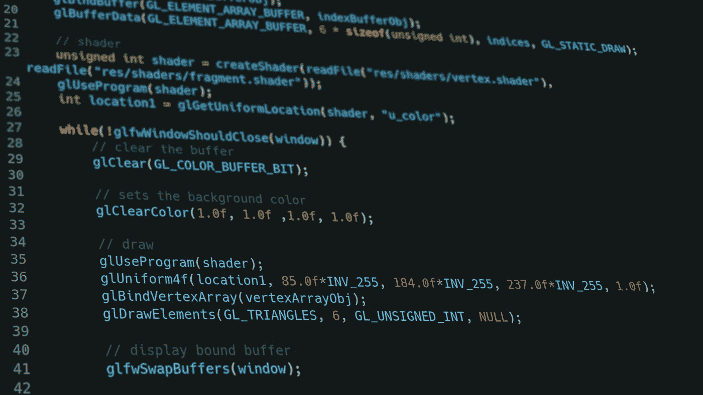

# 针对 Flutter/Dart 开发人员的 6 种 JsonToDart 工具的比较

> 原文：<https://levelup.gitconnected.com/a-comparison-of-6-jsontodart-tools-for-flutter-dart-developers-74cf687ea8e2>

## 使用代码生成器节省时间

## 您可以使用生成器从 JSON 创建 Dart 模型类，而不是自己编写代码。以下是我对一些免费工具的评测结果。

由[克里希纳·潘迪](https://unsplash.com/@krishna2803)在 [Unsplash](https://unsplash.com/photos/KNZHyTpre18) 上拍摄的照片

对于这个测试，我创建了一个所有工具都需要处理的样本 JSON 结构。您可以在下面找到它:

每个转换器将接收相同的输入，我将检查创建的输出。它可以运行吗？是否支持空安全？代码是否高效？丢了什么东西吗？看看下面的结果。

我开始在网上搜索，找到了第一批结果。与会者名单如下

🔹 [Quicktype](https://app.quicktype.io/)
🔹 [JSON 到 Dart 转换器](https://jsontodart.com/)🔹 [JSON 格式化程序](https://jsonformatter.org/json-to-dart)
🔹 [JSON 转 Dart 模型](https://ashamp.github.io/jsonToDartModel/)🔹[飞镖快速型](https://dart-quicktype.netlify.app/)
🔹 [JSON 到 Dart 在线转换器空安全](https://www.jsontodart.in/)

## TLDR

🔔用[镖快速型](https://dart-quicktype.netlify.app/)走。它从 JSON 对象中生成最好的 Dart 代码。

## Quicktype

Quicktype 是 JSON 对象的多语言转换器，它也支持 Dart。有一些选项可以定制生成的类。还有一个 Visual Studio 代码的扩展。

结果包含了一切，但也有问题:

*   Quicktype 不使用`required`关键字，而是使用旧的`@required`注释
*   Quicktype 不支持空安全

这使得代码在没有手动更改的情况下不可用。Dart 语言还有 77 个未解决的问题，官方源代码已经几个月没有更新了。我不期望在这方面有任何进展，但是尽管有必要的手动更改，该工具仍然节省了开发时间。

> 坚实，但不完美。比自己写还快。😒

## JSON 到 Dart 转换器

JSON 到 Dart 转换器是一个免费的在线 Dart 模型类生成器。唯一可用的选项是将字段设为私有。在这种情况下，会生成 getters 和 setters。

JSON 可以转换成 Dart 类，但是有一些主要问题:

*   无无效安全
*   当字段是私有的时，为字段生成 Getters 和 setters
*   数组未被识别为`List<int>`，而是被识别为`Object<int>`
*   无法识别类型为`Object`的列表

总的来说，这些代码几乎没有用，因为你需要花很多时间来修复错误，如果你自己写的话会更快。没有 GitHub 存储库或任何类似的东西，只有一个联系的邮件地址。网站看起来像是昨天开始的，除了这个转换器之外没有任何内容。

> *不用，浪费时间！⛔*

## JSON 格式化程序

JSON formatter 是另一个免费的在线 Dart 模型类生成器。没有选项可供选择，您只需输入 JSON，工具就会将其转换成 Dart 类。

输出是无用的，甚至没有包括`fromJson`和`toJson`方法。没有 null-safety，没有 final 字段，但是至少对象结构被正确地转换了。

> *绝对不值得！⛔*

## JSON 到 Dart 模型

[JSON to Dart Model](https://ashamp.github.io/jsonToDartModel/) 为输出提供了许多定制选项。[代码是开源的](https://github.com/ashamp/jsonToDartModel)，目前有 3 个开放的问题。该项目似乎不像 quicktype 那样出名，但生成的代码将与当前的 Dart 版本一起开箱即用。

转换后的 JSON 片段作为注释包含在代码中，有点烦人。此外，数组的转换似乎非常麻烦。可悲的是，转换器创建了两个名称不同的相同对象。但除此之外，看起来还不错。然而，我不会使用这个结果，因为代码风格非常奇怪，我必须进行大量的重构。

> *工作且可用，但代码风格古怪。🙄*

## Dart 快速类型

Dart QuickType 是 QuickType 的一个分支，具有更新的代码库。所有提到的 Quicktype 的缺陷都在这里得到了修复。没有[未解决的问题](https://github.com/chunlee-thong/dart-quicktype)，创建的 Dart 代码看起来简单明了。

默认值、空安全、最终字段…您需要的一切！我想补充的唯一一点是[等同于](https://pub.dev/packages/equatable)，因为我一直在使用它。但我可以忍受这一个手动步骤。也许作者会在我的[提案](https://github.com/chunlee-thong/dart-quicktype/issues/4)中为将来的版本工作。😊

**更新** : equatable 在最近的一个版本中加入了！

> *明确的赢家，无异议，最佳代码生成！✔*

## JSON 到 Dart 在线转换器空安全

[JSON 到 Dart 在线转换器 Null Safety](https://www.jsontodart.in/) 除了设置类名之外没有其他选项，生成的代码不能开箱即用。

这段代码的一些缺陷:

*   使用`required`时不必要的`late`关键字
*   变量可以像关键字一样命名→编译器错误
*   创建两个相同的类`Object`和`List`
*   在`fromJson`方法中没有回退值
*   创建的类的其他编译器错误

> *需要太多有用的手动校正。⛔*

## 结论

[Dart QuickType](https://dart-quicktype.netlify.app/) 生成最佳代码，是此次比较的赢家。某种程度上，如果不介意代码风格，也可以使用 [JSON 来 Dart Model](https://ashamp.github.io/jsonToDartModel/) 。所有其他转换器都不值得花时间，所以跳过它们。

我错过了一个好的转换器吗？如果你认为我应该试一试，那就告诉我吧😉

[***用我的推荐链接加入成千上万的中会员，想看多少文章就看多少***](https://medium.com/@xeladu/membership) ！

 [## 通过我的推荐链接加入 Medium-xela du

### 成为会员，获得 xeladu 和所有媒体作家的全部内容！您的会员资格只需 5 美元一张…

medium.com](https://medium.com/@xeladu/membership) 

点击 [**这里**](https://xeladu.medium.com/subscribe) 把我所有的新文章发到你的邮箱里🔔如果你浏览[我的口香糖商店](https://xeladu.gumroad.com/)，你可能会找到你喜欢的东西([甚至是免费的](https://xeladu.gumroad.com/l/scratch))🏬

xeladu

## 软件工具和技术指南

[View list](https://xeladu.medium.com/list/software-tools-and-tech-guides-1ab2ca04969b?source=post_page-----74cf687ea8e2--------------------------------)9 stories

[塞拉多](https://xeladu.medium.com/?source=post_page-----74cf687ea8e2--------------------------------)

## 软件工程师的高级颤振文章

[View list](https://xeladu.medium.com/list/advanced-flutter-articles-for-software-engineers-f074879fdef3?source=post_page-----74cf687ea8e2--------------------------------)9 stories

感谢您成为我们社区的一员！在你离开之前:

*   👏为故事鼓掌，跟着作者走👉
*   📰查看更多内容请参见[升级编码刊物](https://levelup.gitconnected.com/?utm_source=pub&utm_medium=post)
*   🔔关注我们:[Twitter](https://twitter.com/gitconnected)|[LinkedIn](https://www.linkedin.com/company/gitconnected)|[时事通讯](https://newsletter.levelup.dev)

🚀👉 [**加入升级人才集体，找到一份神奇的工作**](https://jobs.levelup.dev/talent/welcome?referral=true)