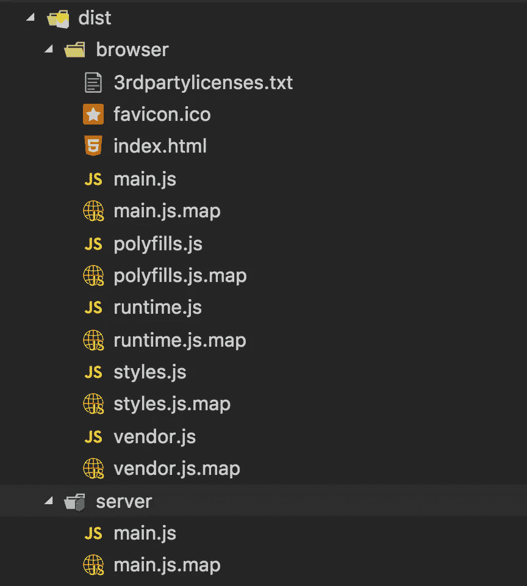
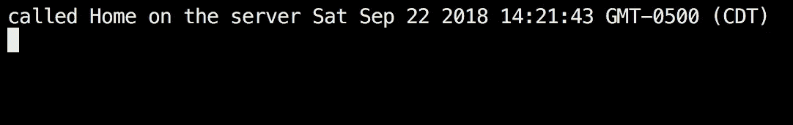
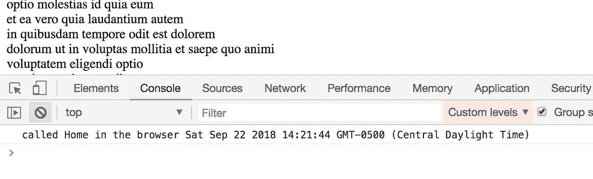
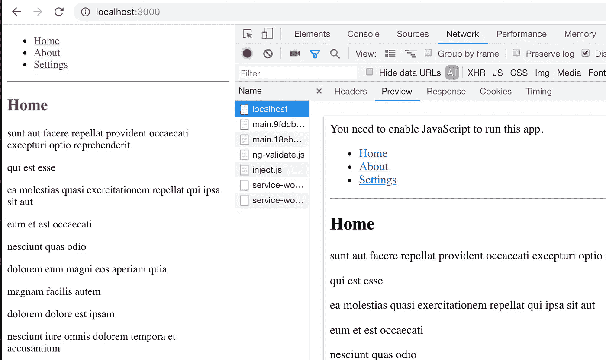
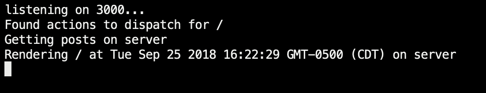

# React 和 Angular 应用程序中服务器端渲染的比较

> 原文：<https://levelup.gitconnected.com/a-comparison-of-server-side-rendering-in-react-and-angular-applications-fb95285fb716>


在本文中，我们将讨论什么是服务器端渲染(SSR ),并讨论如何在 React 和 Angular 应用程序中实现服务器端渲染(SSR)。最后，我们还将简单比较一下启用 SSR 的容易程度和我们需要采取的方法。

为了理解这两个框架中的 SSR，我们将创建一个包含一些基本路由的示例应用程序，并进行一个 API 调用来模拟一个真实的场景。然后，我们将为每个示例应用程序启用 SSR，同时讨论实现我们的预期结果所需的任何变通方法。

本文不比较框架本身，而是比较实现一个结果所需的更改，在本例中是服务器端呈现。

# 什么是服务器端渲染(SSR)？

随着单页应用程序(spa)的出现，硬编码到模板上的内容数量已经很少，一个网页被分割成许多不同的组件和/或模板。这些组件是使用所有主流框架中都有的定制`routers`来路由和加载的。

搜索引擎(也称为网络爬虫)有时会尝试访问我们应用程序中的嵌套路由，但有时并不成功，因为爬虫无法在不下载和执行 JavaScript 包(它理解并执行我们的路由逻辑)的情况下访问路由。虽然一些爬虫可以下载和执行 JavaScript，但是更好的是更好地控制我们所提供的服务。

另一个用例是当我们希望尽可能完整地呈现页面以适应较慢的互联网速度时(即下载预呈现的`index.html`文件，而不是下载 CSS 和 JS 以在客户端呈现它)，或者只是在 fold 之上加载更快的[，以在我们的应用程序中获得更好的交互时间。](https://www.optimizely.com/optimization-glossary/above-the-fold/)

服务器端呈现帮助我们将部分极其动态的 web 应用程序转换成静态的 web 应用程序，我们在服务器端创建并呈现所请求的`route`的内容。这个静态页面作为一个占位符，而应用程序的其余部分(CSS，JS 等。)下载并在后台引导。

因此，当客户端在后台下载和呈现实际的应用程序时，SSR'ed 页面充当我们的应用程序的“闪屏”。因此，有时我们可以看到页面，但无法与之交互，因为页面仍在后台加载。

# 何时使用 SSR？

了解 SSR 什么时候有价值，什么时候没有价值是有好处的。

如果我们同意随着项目的进展进行更改以支持 SSR，那么从项目的第一天开始实施 SSR 是非常容易的(正如我们将在下面的示例中看到的)，但是如果现有的应用程序非常复杂，请在实施之前评估对 SSR 的需求。以下是我通常使用的一些快速规则:

1.  整个应用程序隐藏在身份验证之后吗？如果是的话，为了搜索引擎优化(SEO)而做 SSR 是没有意义的。然而，为了使应用程序加载更快，一些人仍然选择进行 SSR，但我更喜欢依靠服务人员(取决于用例)来缓存和增强页面加载。
2.  内容可以静态化吗？例如，如果我们有一个演示页面，我们希望由网络爬虫索引，内容可以硬编码到模板中吗？可以不使用路由器直接访问这些模板吗？我们能试着预加载这些资源吗？
3.  还有一些缺点需要考虑，例如应用程序的复杂性增加、初始页面大小增加、服务器响应变慢(因为它不再返回在客户端构建的精简 HTML 页面)。

一旦我们讨论了上面列出的一些(或更多)场景，我们就可以更好地理解我们希望用户如何与我们的应用程序交互，SEO 将有多重要，以及我们如何使用 SSR 来增强整体体验。

# 角度应用中的 SSR

在角度应用中，可以使用[角度通用](https://github.com/angular/universal)启用服务器端渲染。

在开始编写代码之前，让我们快速地看一下常规应用程序结构中需要改变的地方，以及当我们试图在 Angular 应用程序中使用 SSR 时需要注意的地方。

1.  我们现在需要一个服务器——我们现在将使用一个服务器(本例中为 NodeJS/Express)来启用 SSR，而不是使用类似 NGINX 的东西来服务我们的`dist`文件夹。
2.  我们需要两个主要模块—一个用于客户端，一个用于服务器
3.  我们需要用绝对 URL 而不是相对 URL 进行 API 调用
4.  缓存 API 调用以避免在 SSR 期间重新加载数据
5.  这里还有一些其他的问题。

这样一来，我们现在就可以动手了。

## **基本应用程序设置**

首先，使用`@angular/cli` `npm`包创建一个角度应用程序。

```
ng new ng-ssrcd ng-ssr
```

接下来，创建一些我们将在应用程序中路由到的基本组件:

```
ng generate component home
ng generate component about
ng generate component settings
```

然后，在`src/app`文件夹中创建一个名为`app.routing.ts`的文件，并设置到达这些组件所需的基本路由，如下所示:

最后，将新创建的`AppRoutingModule`包含在`BrowserModule`之后的`imports`部分下的`app.module.ts`中找到的主应用模块中。还可以在我们的`app.component.html`中添加链接，根据路线定义导航到这些组件。

有了中的这些变化，我们的基本应用程序就可以启动了。从项目的根目录运行命令`npm start`并导航到 [http://localhost:4200](http://localhost:4200) 来查看您的应用程序运行情况。

## **服务器端渲染设置**

SSR 设置可以分为 3 个高级阶段:

1.  使应用程序 SSR 兼容
2.  生成可以在 SSR 和非 SSR 模式下工作的应用程序包
3.  服务器端逻辑提供 SSR 模板。

**使应用程序 SSR 兼容**

在第一阶段，我们需要安装所有必要的依赖项来启用 SSR，如下所示:

```
npm i -S @angular/platform-server @nguniversal/express-engine @nguniversal/module-map-ngfactory-loader 
```

接下来，让我们创建服务器模块，它是应用程序模块的包装器。到目前为止，我们仅使用 AppModule 在客户端引导我们的应用程序:

在这个阶段，我们只导入`ServerModule`和`ModuleMapLoaderModule`并定义引导哪个组件。当我们试图在服务器上访问和呈现应用程序时，这两个导入的模块都很有用。

因为我们已经导入了`AppModule`，其中`imports` / `declares` / `exports` / `provides`是我们的应用程序需要的所有其他东西，所以我们只`provide`了这个模块中的服务，基于它们对服务器端渲染的需要。

当我们的应用程序在客户端启动时，它通常会经历下面的初始化步骤，如`main.ts`中所定义的

```
platformBrowserDynamic().bootstrapModule(AppModule).catch(err => console.error(err));
```

因为我们希望事情的处理方式有所不同，所以在服务器上进行渲染时，我们需要执行我们的服务器模块。为了方便起见，我们在`main.ts`旁边创建一个`main.server.ts`，然后从中导出我们的新`AppServerModule`。这主要是为了使 SSR 的更改尽可能与客户端保持一致。

接下来，我们需要一种方法来告诉 Angular 如何编译和使用这些更改。我们可以通过扩展现有的`tsconfig.json`文件并只覆盖`entryModule`来指向我们新的服务器模块。

最后但同样重要的是，我们需要告诉客户端主模块，它必须使用`AppModule`中的以下更改从服务器端呈现的应用程序转换到客户端呈现的应用程序:

```
BrowserModule.withServerTransition({ appId: ‘ng-ssr’ }),
```

我们现在不像以前那样只提供`BrowserModule`，而是称它为`withServerTransition`，并传递一个唯一的应用程序 id 来指示它是什么应用程序(这需要与下面列出的`angular.json`文件中的项目名称相匹配)。一旦客户端启动应用程序，这将从页面中删除在服务器端呈现期间应用的所有 CSS。

通过中的这些更改，我们的代码现在可以用于客户端和服务器端设置。现在，我们已经准备好编译并生成合适的发行包，这些发行包可以从我们的新服务器上提供。

**生成应用捆绑包**

在下一阶段，我们将不得不对当前的应用程序配置进行一点调整，以适应我们在前一阶段创建的新文件。目前，当我们运行 build 命令时，所有打包的文件都直接放在`dist`文件夹中。

但是，我们现在需要为客户端和服务器端入口模块分别持久化最终的应用程序包。我们这样做是因为我们的服务器端捆绑包有一个不同的入口点，并且比客户端更精简，因为与客户端相比，它只需要一小部分功能。

为了进行这一更改，我们需要查看我们的`angular.json`文件，该文件包含应用程序的所有配置模式。在`angular.json`中，我们有一个名为`projects`的条目(是的，Angular 6+支持同一个存储库中的多个项目)，其中包含一个针对`ng-ssr`项目的条目。

在我们的`ng-ssr`项目中，我们可以理所当然地看到，基于我们可以执行的操作，有不同的目标可用。其中之一是`build`，我们将首先修改它，以确保生成的分发代码位于`/dist/browser`下，而不是它的默认位置。要进行此更改，请更新`build.options`下的`outputPath`。

```
"architect": { "build": { … "options": { "outputPath": "dist/browser", …
```

这确保了当我们运行常规的`ng build`命令时，生成的包在`dist/browser`文件夹下。

为了在服务器上运行支持 SSR 的代码，我们需要用我们的服务器模块作为入口点来生成我们的分发包。为此，我们需要在`ng-ssr`项目中列出的其他目标旁边添加一个名为`server`的新目标。

在选项下，我们列出了指向我们之前创建的文件的`tsConfig`和我们希望编译后的代码驻留的新的`outputPath`。我们还用`main`属性列出了需要在服务器端执行的主文件的路径。

要生成特定于客户端的`dist`文件夹，我们可以简单地运行`ng build --prod`命令，该命令现在将放在我们定义的新路径下。为了编译在服务器上执行的代码，我们需要使用我们希望它使用的特定目标来运行`ng run`命令。在这种情况下，它将是`ng run ng-ssr:server`。

> 需要注意的一点是，由于 Angular 6.x 的所有内容都是基于 Angular 的原理图，Angular CLI 运行这些原理图，除了一些默认原理图，如`build`、`test`、`serve`等。所有的原理图都需要通过传递额外的参数来调用 ng run 命令，如上所示。而这就是@angular-devkit/build-angular 在上面指定的构建器中的作用。

为客户端构建生成的代码与为服务器构建生成的代码之间的一个重要区别是，不再需要大量特定于客户端的代码例如，基本 index.html 文件、聚合填充都可以忽略，因为现在我们只在服务器上直接呈现应用程序，然后在返回之前将其修补到视图上。



为了简化，我们可以用一个新的脚本更新我们的`package.json`文件，以便在必要时生成`dist`文件:

```
"build:ssr": "npm run build:client && npm run build:server","build:client": "ng build --prod","build:server": "ng run ng-ssr:server",
```

**服务器端逻辑**

最后一个阶段，阶段 3，是我们编写我们的`Express`服务器来呈现和提供来自我们的发行包的文件的阶段。我们也将使用`TypeScript`对这个文件进行编码，因此为了编译它，我们需要一个单独的迷你 webpack 配置文件，为了简洁起见，我将跳过这个文件。我们服务器的第一次迭代与通用渲染相关的[角度文档](https://angular.io/guide/universal#universal-web-server)相似。将此文件放在项目的根目录下。

该文件最重要的部分是在第 27–32 行设置应用程序引擎。以下是 Angular 文档的摘录，解释了相同的内容:

> `ngExpressEngine`是通用的`[renderModuleFactory](https://angular.io/api/platform-server/renderModuleFactory)`函数的包装器，它将客户机的请求转换成服务器呈现的 HTML 页面。您将在适合您的服务器堆栈的*模板引擎*中调用该函数。
> 
> 第一个参数是`AppServerModule`。它是通用服务器端呈现器和您的应用程序之间的桥梁。
> 
> 第二个参数是`extraProviders`。它是一个可选的角度依赖注入提供程序，适用于在此服务器上运行时。
> 
> 当您的应用程序需要只能由当前运行的服务器实例决定的信息时，您提供`extraProviders`。

我们在服务器模块中包含的两个模块有助于提供`AppServerModuleNgFactory`——这是我们模块的机器可理解的翻译，以及`LAZY_MODULE_MAP`——这实质上是在初始化时而不是运行时提供所有懒惰加载的模块。点击查看更多详情[。](https://github.com/angular/universal/tree/master/modules/module-map-ngfactory-loader#module-map-ngfactory-loader)

现在，我们已经准备好编译和提供我们的应用程序中的更改，并提供完整的服务器端渲染支持。但在此之前，让我们也添加一个 API 调用，从 API 服务器获取数据并呈现到我们的模板上。

## 用 SSR 处理 API 调用

由于没有 api 调用的应用程序是不完整的，我们也将实现一个示例 API 调用来从[https://jsonplaceholder.typicode.com/posts](https://jsonplaceholder.typicode.com/posts)获取数据并在 UI 上显示它。这也有助于我们理解如何在服务器端进行 API 调用，并在将响应返回给客户端之前将它们呈现给模板。

为了启用 HTTP 调用，我们首先需要在`AppModule`中导入`HttpClientModule`，这样我们就可以进行 API 调用。然后，我们将`HttpClient`包含在我们选择的组件中，以分派实际的 API 请求。

**非 SSR 模式下的 Http 调用**

这在本地开发期间尤其有用。因为我们是向第三方服务器发出请求，所以我们可以通过代理很容易地做到这一点，只需添加一个代理配置就可以在 Angular 中启用代理。由于 api 服务器的调用没有前缀`/api`，我们将临时添加它，并在代理之前删除它，这样我们就可以区分 API 调用和 UI 状态变化(为了 SSR 和非 SSR 模式之间的一致性)。

对于代理配置，我们在项目的根目录下创建一个 JSON 文件，如下所示:

请注意上面的`pathRewrite`选项，它表明我们正在去掉添加到请求中的前缀`/api`。

为了启用代理，我们需要将`package.json`中的`start`脚本修改为:

```
"start": "ng serve --proxy-config proxy.conf.json",
```

我们现在可以在任何组件中添加我们的逻辑来获取数据，下面是`HomeComponent`的一个例子:

要在模板上显示这些帖子:

**SSR 模式下的 Http 调用**

在 SSR 模式下，API 调用以两种方式触发:

1.  当模板最初在服务器上呈现时，即组件被加载时
2.  当模板在客户机上呈现时(即，当从服务器呈现的模板中转移出来时)

上面列出的两种方法之间的唯一区别是如何触发和处理 API 调用。

因为我们直接从服务器上的模板进行 API 调用，所以我们需要在发出请求时提供一个绝对 URL。

在下一阶段，由于我们的模板从客户端进行 API 调用，我们可以在 web 服务器上捕获请求，并将其代理到 API 服务器，从而绕过 CORS 限制。

对于#1，直接从服务器进行 API 调用，我们需要更新应用程序以能够直接与 API 服务器通信，我们可以通过在服务器模块中传递一个新的提供者`APP_BASE_HREF`来实现，该提供者具有我们的 API 服务器的基本 URL 值，然后在我们的 API 调用中使用它，如下所示:

然后我们可以在我们的`HomeComponent`中注入和使用它，如下所示:

我们正在检查我们是否有一个仅用于日志语句的`PLATFORM_ID`,如果需要的话，可以删除它。

上面的 URL 结构就是奇迹发生的地方。在服务器上，当我们直接从模板中发出请求时，我们跳过`/api`前缀，当我们从客户端发出请求时，我们添加它，并让我们的`Express`服务器为我们捕获、修改和代理请求。

> 由于 API 调用将在客户机和服务器上间隔几秒钟进行，所以强烈建议您实现某种形式的缓存以使 API 加载更快，或者使用状态存储，如 [ngrx](https://ngrx.github.io/) 。

对于#2，当服务器端呈现的模板被客户端版本转换出来时，我们需要更新服务器的工作方式。我们现在需要将请求从 web 服务器代理到外部 API 服务器。为了实现这一点，我们可以`pipe`那些`Express`允许的请求。我们可以使用任何 HTTP 请求库(比如本例中的`request`)来简化管道:

```
npm i -S request
```

然后我们替换现有的 API 逻辑，如下面的`server.ts`文件所示:

这将捕获所有以前缀`/api`开头的请求，然后在将请求转发到我们的 API 服务器之前将其从 URL 中删除。

## 构建并运行

在启动我们的服务器之前，最后要做的事情是编译它(因为我们已经用 typescript 编写了它)。所有更改合并后，`package.json`文件的`scripts`部分的最终状态如下:

要立即构建和服务项目，请运行以下命令:

```
npm run build:ssrnpm run serve:ssr
```

由于我们已经添加了日志语句，我们应该能够在服务器上看到如下所示的日志:



在浏览器上:



我们可以看到，在模板呈现并返回给客户端一秒钟后，客户端从 SSR 提供的模板转换到常规应用程序，并重新呈现路线。

路线之间的任何和所有后续导航都将在客户端中执行，并且只有在执行完整页面重新加载时才会在服务器上呈现。

该项目的全部代码可以在[这里](https://github.com/40x/ng-ssr)找到，具体到 SSR 的变化可以在[这里](https://github.com/40x/ng-ssr/commit/7e9c0b145b906e05cae194969040413b2a569b37)找到。

# React 应用中的 SSR

在 React 应用程序中，对于简单的项目，设置非常简单。然而，棘手的部分是处理我们可能在项目中最终使用的多个库。如果我们希望在服务器端呈现一个使用不兼容库的路由，我们可能会遇到潜在的问题。幸运的是，大多数常见和常用的库都提供了 SSR 功能，所以在大多数情况下我们应该没问题。为了简单起见，我们不会在下面的示例应用程序中包含很多库。

类似于角度部分，让我们列出我们必须引入的更改，以便我们的应用程序与 SSR 兼容:

1.  我们现在需要一个服务器——我们现在将使用一个服务器(本例中为 NodeJS/Express)来启用 SSR，而不是使用类似 NGINX 的东西来服务我们的`build`文件夹。
2.  如果我们想显示经过 SSR 的 API 数据，必须使用 Redux(或类似的东西)
3.  条件检查以避免重新加载在 SSR 期间在服务器上加载并在存储中更新的数据
4.  组件上 API 调用的静态声明有助于 SSR

## 基本应用程序设置

与 Angular 应用程序类似，我们首先使用由几条基本路线组成的`create-react-app`创建 react 应用程序。

我们将使用 create-react-app 来创建应用程序。让我们开始吧:

```
create-react-app react-ssr
cd react-ssr
```

让我们添加必要的库来启用路由

```
npm i -S react-router react-router-dom
```

接下来，让我们设置我们希望每条路线加载的基本组件，在此阶段，它们看起来都很相似，如下所示:

让我们也创建一个路由文件，我们可以在位于`App.js`的基础组件上读取和显示。这个文件也可以是我们提供额外信息的地方，以防我们使用像 [react-helmet](https://github.com/nfl/react-helmet#readme) 这样的东西。

更新`App.js`以显示上面列出的路线:

现在可以启动应用程序，我们可以导航到上面定义的所有路线。

## 服务器端渲染设置

与 Angular 相比，使应用程序 SSR 就绪所需的设置在 React 中相当简单(至少在没有 API 调用时)。让应用程序在服务器上呈现不需要额外的代码或任何特殊的技巧。

我们真正需要的是一个服务器(本例中为`Express`)，它可以提供静态文件并理解用户试图访问的路径，将该路径设置为应用程序位置，然后呈现应用程序。我们也可以以静态上下文的形式传递[附加上下文](https://reacttraining.com/react-router/web/example/static-router)以备不时之需。所有这些都是由`react-router`库以`StaticRouter`的形式提供的，而不是通常在客户端使用的`BrowserRouter`。

让我们创建文件夹`server`并将下面的`server.js`文件添加到其中，该文件包含 3 个不同的中间件，用于加载静态资源和处理我们的路由逻辑:

由于涉及到一些 JSX，我们将安装并使用`@babel/core`、`@babel/cli`、`@babel/preset-env`和`@babel/preset-react`，以便节点能够理解我们的`server.js`文件:

```
npm i -S express @babel/core @babel/cli @babel/preset-env @babel/preset-react
```

然后为了编译这个`server.js`文件，我们可以调用一个小的内联 babel 脚本，如下所示:

```
babel server/server.js --out-file server/index.js --presets=@babel/env,@babel/react
```

一旦服务器编译成功，我们就可以运行我们的应用程序了。但是在我们这样做之前，当在服务器端呈现我们的模板时，我们需要忽略组件的样式，但是样式将从生成的`main.css`文件中应用，并作为我们创建的最终发行版的一部分放在`build`文件夹中。要忽略这些风格，我们可以使用`ignore-styles` npm 插件。

> 忽略样式将意味着当服务器最初返回我们的模板时，它将不会被样式化，这将导致页面在客户端呈现时闪烁，现在，我们将忽略这个问题，但它可以通过使用 webpack 和[同构样式加载器](https://github.com/kriasoft/isomorphic-style-loader)来解决，这可以从这个非常简单的[示例](https://github.com/kriasoft/isomorphic-style-loader#react-component-example)中看出。

由于我们编译的服务器文件仍在尝试访问应用程序模块，我们需要编译可以使用`@babel/register`插件的代码，并提供必要的预置以在运行时编译。

将这些放在一起，启动服务器。我们可以在项目的根目录下使用下面标有`start.js`的脚本。

我们现在可以将这个调用添加到脚本下的`package.json`中，这样对我们来说就更容易了。

## 用 SSR 处理 API 调用

在我们运行和测试我们的更改之前，让我们也添加一个简单的 API 调用，它从[http://jsonplaceholder.typicode.com/posts](http://jsonplaceholder.typicode.com/posts)中检索数据，就像我们之前在 Angular 示例中所做的那样。

为了进行 API 调用，我们将使用`Axios` npm 包。通常，在 UI 上呈现 API 响应。一旦使用`componentDidMount`生命周期钩子挂载了组件，我们将进行 API 调用，然后调用`setState`将 API 调用的响应存储到组件状态中。这个`setState`调用再次触发 render 方法，该方法现在可以访问更新后的状态。

因为我们在服务器上编译我们的组件，而不是真正把它挂载到一个实际的 DOM，我们不能使用前面讨论的方法，因为它不会触发服务器端的`componentDidMount`生命周期。然而，`componentWillMount`在服务器端和客户端都会被触发。不幸的是，这不能使用，因为它是一个反模式，不会在`componentWillMount`生命周期挂钩中引起任何副作用。

这个问题最简单的解决方案是使用像 Redux 这样的状态存储。

让我们先来谈谈它在客户端是如何工作的:

1.  组件加载和调用`componentDidMount`
2.  我们检查数据是否已经存在于存储中，如果不存在，则进行 API 调用并更新存储
3.  渲染组件

服务器端的相同流程会有所不同:

1.  确定用户正在加载的路线
2.  确定与此路线相关联的组件
3.  如果有附加的静态数据获取方法来检索数据，那么就这样做。
4.  用检索到的数据更新存储
5.  用商店数据呈现模板
6.  返回模板和已经在服务器上创建的存储。

在我们进行任何代码更改之前，让我们添加所有必要的库。

```
npm i -S axios redux redux-thunk request
```

**非 SSR 模式下的 Http 调用**

因为我们希望我们的应用程序既可以在 SSR 模式(生产)下运行，也可以在非 SSR 模式(本地开发)下运行。我们可以简单地向我们的`package.json`文件添加一个代理来代理我们的请求(类似于 Angular 应用程序)，如下所示:

我们现在可以在`componentDidMount`生命周期钩子中为我们选择的任何组件进行 API 调用。

这在仅客户端模式下运行良好。因为我们还需要考虑 SSR 模式，所以我们必须修改组件以使用 Redux store 来保存可以在服务器和浏览器上使用的`posts`。

为了方便起见，我们需要首先创建我们的 Redux 存储，在本例中它非常精简，如下所示:

在上面的例子中，为了可读性，动作、reducers 和 API 调用都在同一个文件中，但是你可能希望在你的项目中把它们分开。

我们现在可以从`Home`组件中调用`fetchPosts`方法。

这个文件中唯一奇特的地方是 API 方法对类的静态声明，我们将在下一节讨论这一点的必要性。

> 另一个奇怪的地方是，我们不能像往常一样在根元素定义`state`:

```
state = {
    something: ''
};
```

> 这给出了一个运行时错误，要求我们安装`@babel/plugin-proposal-class-properties`。相反，我们需要将它包装在我们的构造函数中，如下所示:

```
constructor(props) {
    super(props);
    this.state = {
        something: ''
    };
}
```

将所有这些联系在一起的最后一项更改是当应用程序在浏览器上呈现时创建商店:

**SSR 模式下的 Http 调用**

为了在服务器上启用 API 调用，我们可以很容易地在为客户端设置的更改的基础上进行构建。唯一需要的修改是当应用程序在客户机上呈现时，将有效的默认状态(即加载到服务器上的数据)传递给存储。

为了计算服务器端存储的准确状态，我们需要首先确定需要调度的操作(可以用必要的数据更新我们的存储)。更改后的服务器将如下所示:

在我们的例子中，我们用一个 API 调用来水合我们的主模板。如果我们有多个，我们可以简单地将所有请求添加到`serverSideFetch`方法中，这将确保在呈现模板之前所有数据都被加载到存储中。

还有一点需要注意的是，在最后，当我们渲染模板时，我们也将商店的当前状态添加到`window.REDUX_DATA`。这样，当应用程序在客户端初始化时，我们可以简单地读取`window`对象上的值，并将其传递到我们的存储创建中。这样，我们可以避免对服务器上呈现的相同数据重复调用`client`。

此外，我们需要修改 public 文件夹中的基本`index.html`文件，为我们将在服务器上替换的`REDUX_DATA`添加占位符:

## 构建并运行

有了这些变化，我们现在可以使用`package.json`中定义的脚本运行我们的应用程序了。

```
npm run build:ssrnpm run serve:ssr
```



在客户机上，我们可以看到我们触发的初始请求与加载到服务器上的数据一起返回。在服务器上，我们看到日志语句按预期打印出来。



以上示例的完整代码可在[这里](https://github.com/40x/react-ssr)获得。

# 比较和结论

尽管 React 和 Angular 在核心原则和构建块方面有很大的不同，但它们之间有一个共同点，那就是启用 SSR 是一项简单的任务。

与 React 相比，Angular 应用程序中要添加的 boiler plate 代码量更多，因为添加封装浏览器主模块的服务器特定模块来自几个不同的文件。

SSR 的服务器端逻辑在 Angular 和 React 上都非常相似，这要感谢 Angular 包装了`Express`并为我们提供了`ExpressEngine`，它公开了易于使用的方法(至少对于基于 NodeJS 的后端是如此)。

在 Angular 和 React 应用程序中，我们都需要在服务器端进行编译，虽然如果我们使用普通 JavaScript 而不是 TypeScript，在 Angular 中可以绕过这一步，但对于 React 应用程序，我们最终使用了`babel`，因为我们在服务器端代码中引入了 JSX。

因为 React 中的许多功能来自附加库(`router`、`redux`等)。)，我们需要在服务器端显式地集成它们，而 Angular 应用程序只需要访问编译好的主模块工厂。

在 Angular 和 React 应用程序中，进行 API 调用的复杂性几乎相同。但是，只有在我们的 React 应用程序非常简单的情况下才是正确的，大多数项目最终都需要某种形式的状态存储，并且复杂性不断增加，因此在这种情况下使用 Redux 绝对不是一个缺点。

上面显示的两个例子的代码库都可以在这里找到: [Angular](https://github.com/40x/ng-ssr) ， [React](https://github.com/40x/react-ssr)

*如果你喜欢这个博客，一定要为它鼓掌，* [*阅读更多*](https://medium.com/@kashyap.mukkamala) *或者关注我的*[*LinkedIn*](https://www.linkedin.com/in/kashyap-mukkamala/)*。*

[](https://levelup.gitconnected.com)[](https://gitconnected.com/learn/angular) [## 学习角度-最佳角度教程(2019) | gitconnected

### 47 大角度教程。课程由开发人员提交并投票，使您能够找到最佳角度…

gitconnected.com](https://gitconnected.com/learn/angular) [](https://gitconnected.com/learn/react) [## 学习 React -最佳 React 教程(2019) | gitconnected

### 前 45 名 React 教程。课程由开发人员提交并投票，使您能够找到最佳反应…

gitconnected.com](https://gitconnected.com/learn/react)