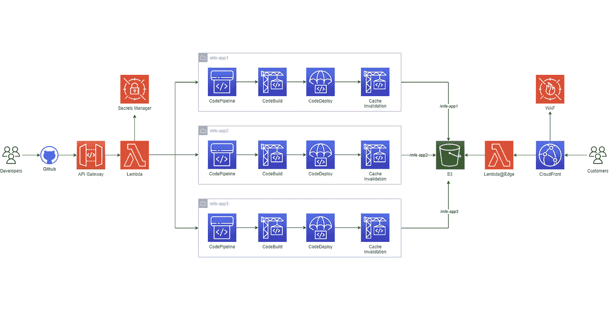
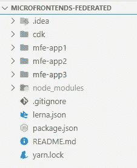
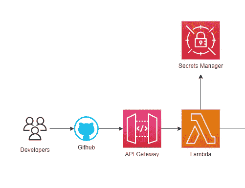
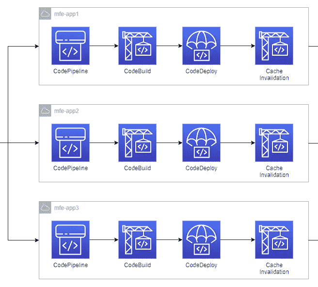
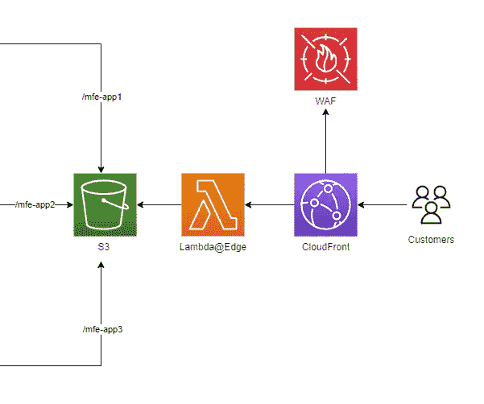

# 用于模块联合微前端的完整 AWS 架构

> 原文：<https://levelup.gitconnected.com/a-complete-aws-architecture-for-module-federated-micro-frontends-a0306ba466e3>

我的下一系列文章将介绍一个完整的无服务器架构，旨在基于 [Webpack Module Federation](https://webpack.js.org/concepts/module-federation/) 插件和 [Lerna](https://github.com/lerna/lerna) 在 AWS 上部署和托管客户端 mono-repo 微前端。

所有 AWS 资源都将通过 CDK 提供，这意味着在几分钟内，您将获得部署到您的 AWS 帐户的生产就绪、可靠且可扩展的基础架构，允许您的团队独立扩展，并通过其独立的微前端交付快速业务迭代。

# 建筑

该架构由 3 个主要部分组成:

1.  Mono-repo 代码更改触发特定的部署管道。
2.  部署管道为目标 AWS 资源构建和部署捆绑包工件。
3.  为客户端微前端定制的全球可扩展托管基础设施。

# 关于单一回购设置的一点

微前端是 mono-repo 设置的一部分，也就是一个包含独立 web 应用程序的子文件夹的单一存储库，通过 Webpack 模块联盟插件和 Lerna 粘合在一起。回购结构如下图所示:

如果你不耐烦，你可以在下面的要点中看到微前端是如何通过模块联合系统来表示的，这将在不久的将来详细讨论。

简而言之，上面的代码允许我们将微前端建模为系统，这些系统可以作为 Web 组件惰性地加载到您的应用程序中。诀窍是在应用程序页面中动态注入每个微前端脚本，以便主机/外壳应用程序可以远程加载它们。如前所述，更多内容将在下一篇文章中介绍。现在，我们将看看前面提到的 3 个子体系结构。

# 单一回购触发器

第一步的目标是捕获单个微前端 repos 更改，并触发它们供无服务器组件稍后使用。

开发人员通过 Github 将更改推送到他们所属的微前端，尽管对于其他众所周知的版本控制源平台(如 BitBucket)也可以完成相同的操作。通过一个 [Github webhook](https://docs.github.com/en/developers/webhooks-and-events/webhooks/about-webhooks) ，通过 ApiGateway 暴露为 Restful api 的 Lambda 函数处理变更。Lambda 的主要目标是将微前端代码变更与它们的目标管道相关联。这种方法的手动演练可以在这里[欣赏](/a-server-less-ci-cd-approach-for-mono-rep-micro-frontends-e91261bbdf69)，而它的 CDK 实现将是下一篇文章的一部分。

# 部署管道

第二步的目标是确保单个微前端回购变更触发单个代码管道。这鼓励团队独立性，就好像只有一个微前端被修改(例如:mfe-app1)，我们只想触发它的相关管道，而不是所有其他的。

一旦关联了代码变更，AWS 代码管道就会启动。这包括四个主要步骤:

*   *代码管道*本身，它管理 GitHub 连接并获取相关的 GitHub 源代码
*   *代码构建*，它将接收源代码构建到构建工件中。由于微前端是基于 JavaScript 的，它们将利用 yarn 将它们构建成一组包，供下一步使用。
*   *代码展开*。这一步采用前面步骤中构建的捆绑文件，并将它们部署到一个简单的存储服务(S3)中。每个微前端都将存储在一个独立的“文件夹”(或密钥)中，这样它们就可以单独部署。
*   *代码构建缓存失效*。最后一步是另一个代码构建步骤，它确保每次我们在 S3 上发布和部署新的工件时，CloudFront 缓存都会失效。

# 托管基础设施

最后但同样重要的是，需要调配基础 AWS 资源。这最后一步的目标是确保通过可扩展、简单、智能且可靠的架构实现这一点。

有了上述子架构，终端用户将通过受 WAF 保护的 CloudFront 发行版[访问 web 应用，因为微前端是面向客户的优化应用。CloudFront 通过一个](https://aws.amazon.com/waf/) [OAI](https://docs.aws.amazon.com/AmazonCloudFront/latest/DeveloperGuide/private-content-restricting-access-to-s3.html) 身份连接到私有的 S3 桶，确保数据只能通过 CDN 公开访问，而不能直接从桶中访问。CloudFront 使用一个 [Lambda@Edge](https://aws.amazon.com/lambda/edge/) 函数对来自单个存储桶的不同来源进行适当的调度。

# CDK 统治他们所有人

所有上述内容都将通过包含一个堆栈的 CDK 应用程序来提供。

微前端堆栈包括三个构造，提供用于托管应用的基础 AWS 资源和所有部署相关资源，包括代码管道、S3 桶、Lambda@Edge 函数、CloudFront 分发和各种 IAM 策略、角色和 OAI，以支持连接到 GitHub 的正确隐私和安全性。

只有在将您的基础设施部署到非 us-east-1 的区域时，另一个堆栈才是隐式堆栈，因为它是在通过 CDK 实验性 CloudFront API 提供 Lambda@Edge 功能时创建的，因为它必须在特定的 AWS 区域上部署 Lambda@Edge(所有 Edge 功能默认使用 us-east-1)。

# 摘要

这篇文章故意给人一种悬而未决的感觉，因为涉及的内容太多了。它给出了一个事实上的无服务器 AWS 架构的高层次概述，该架构用于托管和部署基于模块联合 Webpack 插件的 mono-repo 微前端。接下来的文章将深入探讨这是如何实现的，所以请继续关注；)