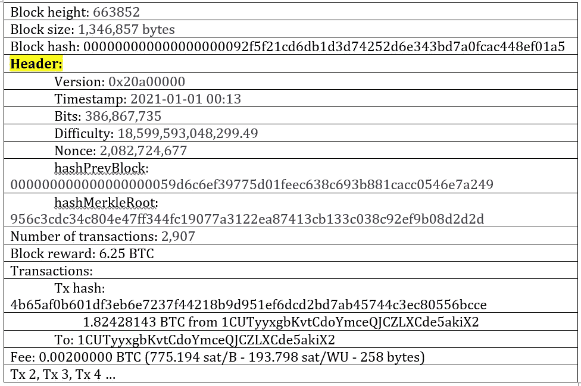
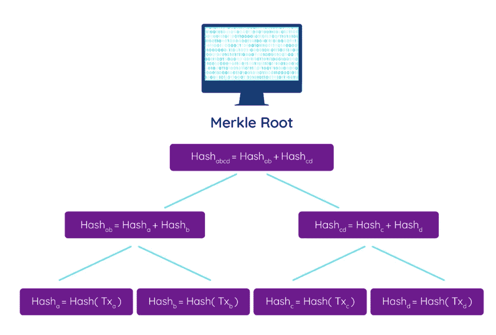
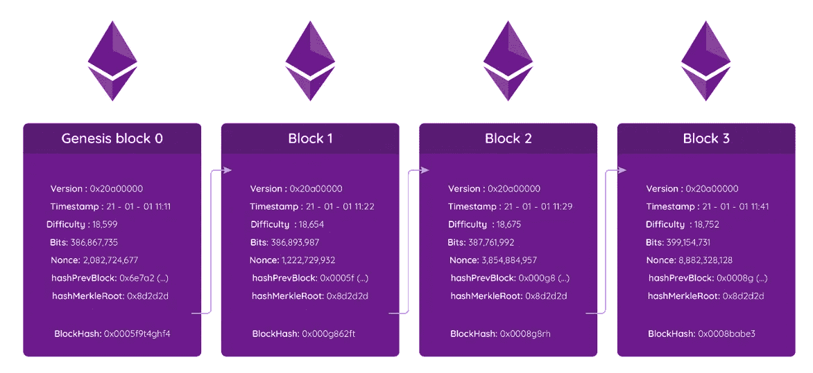
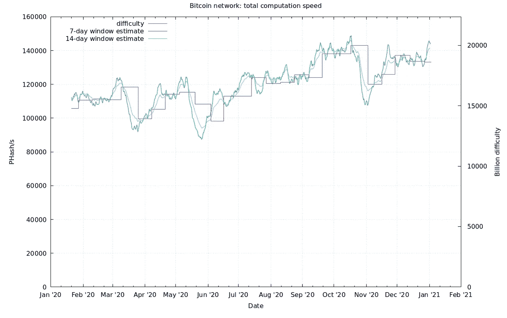

# 比特币区块的完整解码

> 原文：<https://levelup.gitconnected.com/a-complete-decoding-of-the-bitcoin-block-578904267142>

## 还有积木的难度！

比特币区块所有那些字段的背后是什么？您可能已经使用过[块浏览器](https://www.blockchain.com/explorer?view=btc)来检查交易状态或钱包交易或余额(是的，在区块链一切都是超级透明的)，但是这些字段和长数字是什么，对吗？

你真的不需要知道那些字段和长数字是什么。就像电子邮件用户不需要从技术角度了解互联网和电子邮件协议的工作原理一样，区块链或比特币用户也不需要知道如何发送交易。尽管如此，了解区块链卡车引擎盖下发生的事情还是很酷的！

首先，让我们看看区块链中的块是如何构成的，然后，我们深入了解块的一些组件。

这是 2021 年开采的第一块比特币。它是在新年前夜 13 分钟后被开采的。虽然我们将看到一个比特币区块，但大多数区块链遵循非常相似的原则，在它们的区块中有非常相似的数据和字段。比特币区块是开始研究区块架构的绝佳场所。其他[工作证明](/bitcoin-proof-of-work-the-only-article-you-will-ever-have-to-read-4a1fcd76a294)区块链像 [Dogecoin](https://www.udemy.com/course/-dogecoin-course-the-first-complete-dogecoin-course/?referralCode=9416B1408224CE309DD8) 会用几乎一样的块结构(基本上比特币就是 Doge 的爷爷)。

你也可以在块浏览器中检查这个块:[https://www.blockchain.com/btc/block/663852](https://www.blockchain.com/btc/block/663852)

您也可以通过访问在线提供的众多块浏览器之一来检查该块或任何其他块。

## 比特币区块结构中所有字段背后的含义是什么？

**块高**:也称为块号，基本上是区块链链中到这个块为止的块，意味着到这个块为止已经开采了 663852 个块。在比特币方面，每天大约有 144 个新的比特币区块被挖掘出来。

**块大小**:嗯，块大小就是块大小。在这种情况下，块大约为 1.34 MB，它包括块头和事务信息。每个数据块都有大小限制，例如 1MB、1.3MB 或 8MB，具体取决于区块链，并且数据块可以包含的事务数量是对数据块大小的限制。

**块哈希**:块哈希是通过 [SHA-256 函数](/the-heart-of-blockchains-hash-functions-501d0b32762b)哈希后的块头数据的输出。

**版本**:给出了区块链的版本信息。

你可能听说过 Merkle 根和 Merkle 树。但是这个 Merkle 是什么东西？Merkle 根就像块中所有事务的指纹。它来自梅克尔树。它们在密码学中被广泛使用，在区块链发明之前就已经被使用了。1979 年，这些树以拉尔夫·默克尔的名字命名。它们是验证共享数据未被更改、破坏或篡改的基本方法。

Merkle 树也是一种验证区块链中数据有效性的轻量级方法。例如，如果你在手机上使用比特币钱包，你的钱包不需要下载所有的区块链交易来验证它们。带有 Merkle 根的 Merkle 树将验证所有以前的事务。

Merkle 树的结构:Merkle 树结果或 Merkle 根是递归构建的，即它是由 Merkle 树中的叶子的散列产生的，这些叶子又对应于事务。

Merkle 根是通过散列单个事务来求解的，这些事务被称为树叶。附加的叶对被散列以创建对应于区块链网络中的事务的附加叶节点。

尽管 Merkle 树可以由大量事务创建，但 Merkle 根总是对应于 32 字节的字符串或 256 位(例如，SHA256 哈希算法总是输出 32 字节的固定长度，而不管输入的大小)。通过这种方式，我们可以使用小到 32 字节的东西来验证一些事务——可能是数千个——是不可变的。

**交易数量**:交易数量因块而异。这可能取决于块的最大容量，即大小、事务有多大(不是值而是多少字节)以及用户发出的实际事务量。例如，一个比特币块可以容纳高达 1.3MB 的数据，交易大小平均为 500 字节。

**区块奖励:**比特币区块奖励目前为 6.25 BTC。这是矿工的奖励，作为对他们为网络做出贡献和创造区块的激励。街区奖励从 50 开始。2009 年每个数据块的 BTC，每四年减半，或者更准确地说，每 210，000 个数据块减半。由于减半，区块奖励将在 2140 年为零。

奖励包含在每个区块的比特币基地交易中，这是为支付区块奖励而创建的独特交易。对于本例中的区块，按照 2021 年 6 月的汇率，6.25 BTC 奖励将相当于约 200 000 00 美元。不错吧。！

有趣的事实(特别是对那些做过的人):回到 2009 年，你可以用你的个人电脑挖掘比特币区块。如果你开采了一个区块，2021 年的 50 BTC 奖励将价值 230 万美元。

**时间戳:**时间戳是块散列发生的准确时间。通常，块管理器以人类可读的格式显示时间戳，但是块的时间戳实际上是以 Unix 时间格式编写的。

**交易:**根据协议，交易可以是价值转移或任何事件，即不一定是支付。相反，它可以仅仅是数据传输。顺便问一下，你知道有些事务，比如第一块的 [coinbase 事务，包含一个隐藏的消息吗？](https://medium.com/geekculture/decoding-bitcoins-first-block-coinbase-transaction-aeefe87ceec0)

**hashPrevBlock，又名前一个块 hash** :每个块都包含前一个块的 hash。这是块以不可变的方式互连的方式。每个块都有前一个块的散列。不能改变先前块中的数据，因为这将改变已经记录的块散列。

**Bits:** 它代表了方块的难度。它用十六进制符号表示，它表示该块难度的当前目标。

**难度:**难度由哈希过程发生时哈希需要开始的零的数量决定。创世纪区块(第一个区块)难度=1。本章开头我们看到的那块，难度是 18，599，593，048，299.49。困难总是与网络中矿工的数量(即散列能力)成比例。当更多的矿工加入网络时，它增加，当矿工离开网络时，它减少。矿工可能根据采矿盈利能力加入或离开网络，这通常与比特币价格有关。

比特币的挖矿难度其实和黄金的挖矿难度很像。当黄金价格上涨时，更多的人和公司通常会开始开采黄金，增加了竞争，增加了寻找黄金的难度。一个很好的例子是加利福尼亚淘金热。旧金山的勘探者从 1846 年的 100 人增加到 1852 年的 3 万多人，同时黄金价格也在上涨。大多数勘探者都不太幸运地找到了黄金，因为竞争使它变得非常困难。在这期间，赚了大部分钱的人实际上是在卖采矿设备。一把铲子过去卖 36 美元，相当于现在的 1500 多美元。

在这种情况下，现代采矿者，即加密采矿者，加入采矿池，以便分担工作和增加利润。

让我们回到当下，更深入地挖掘难点，好吗，亲爱的读者？

您可能已经注意到，块散列以几个零开始。在我们的块中，它以 19 个零开始，但是…为什么呢？为什么需要以 19 个零开头？这是从哪里来的？嗯，它来自于比特域和难度。让我们来看看如何用一种简化的方式来计算这个。

D =预期/实际

困难就在这里。什么是“预期”值？比特币协议预计在 20160 分钟内增加 2016 个新块。这是平均每 10 分钟一个街区。

难度重评每 20160 分钟(约 2 周)进行一次，期望值为 20160 分钟。实际=开采最后 2016 个区块所用的时间。

d = 20160/实际

如果 D > 1，则耗时不到 20160 分钟。对于矿工来说，开采 2016 区块，难度会增加。如果 D < 1, it means that it took more than 20160 to mine 2016 blocks, meaning that the difficulty needs to decrease because it’s a bit too difficult.

If D > 1

难度增加(0.25，4)

如果 D < 1

Difficulty decrease (0.25, 4)

The difficulty increases/decreases at least 0.25 or a maximum of 4, depending on how the difficulty is adjusted.

Now the new difficulty that is going to be calculated every two weeks will be:

newDiff = oldDiff x 20160/actual

Bitcoin total hash rate and difficulty. Source: [http://bitcoin.sipa.be](http://bitcoin.sipa.be)

挖掘难度根据网络中的哈希功率增加，以保持平均 10 分钟挖掘一个块的时间。如图所示，根据添加区块的平均时间，难度将每两周增加或减少一次，这与网络中的采矿能力密切相关(左侧 y 轴)。

好吧。我希望它是有用的！如果你有任何问题，请在评论区告诉我！

**🚀关注我，也请查看我的🧱区块链课程:**

**🐶** [**有史以来第一次 Dogecoin 课程**](https://www.udemy.com/course/-dogecoin-course-the-first-complete-dogecoin-course/?referralCode=9416B1408224CE309DD8)

**👨‍🎓** [**Fintech、云和网络安全课程**](https://www.udemy.com/course/fintech-technologies-cloud-and-cybersecurity/?referralCode=F1D4EA005A2881735A36)

**📖****[**完整的 NFTs 教程**](https://www.udemy.com/course/the-complete-nft-course-learn-everything-about-nfts/?referralCode=AAEE908D13D0E2276B19)**

****👨‍🎓** [**Unblockchain 课程**](https://www.udemy.com/course/blockchain-deep-dive-from-bitcoin-to-ethereum-to-crypto/?referralCode=B8463EE382E6D313304B) **—脑洞大开的区块链课程****