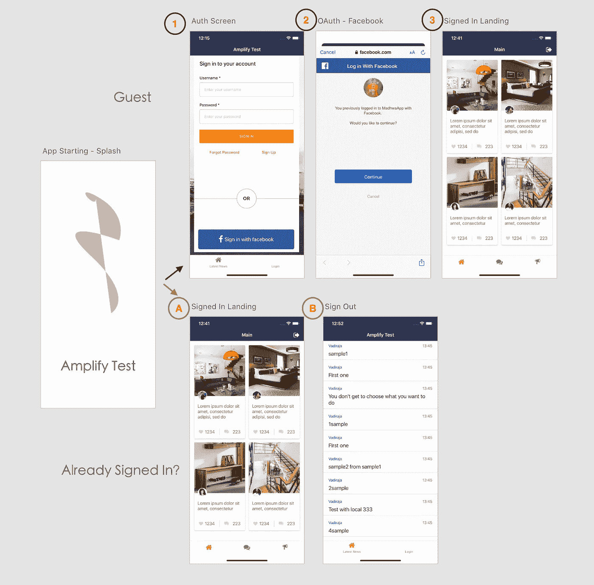
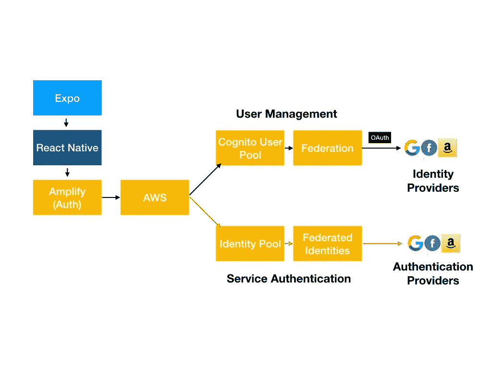
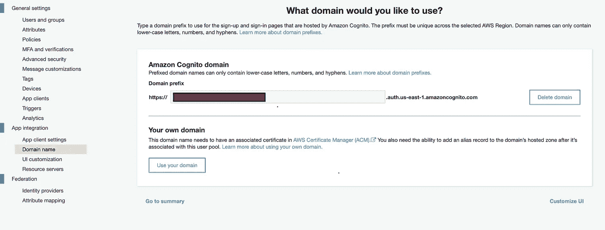
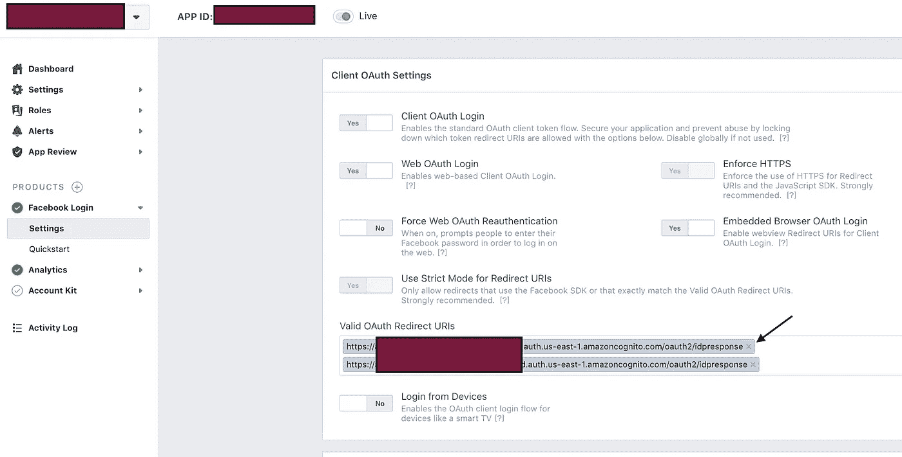

# React Native、Expo 和 Amplify 社交登录的完整流程

> 原文：<https://levelup.gitconnected.com/a-complete-flow-for-social-login-with-react-native-expo-and-amplify-2c9eacc501fe>


在 [Unsplash](https://unsplash.com/s/photos/computer-puzzle?utm_source=unsplash&utm_medium=referral&utm_content=creditCopyText) 上由 [Brad Neathery](https://unsplash.com/@bradneathery?utm_source=unsplash&utm_medium=referral&utm_content=creditCopyText) 拍摄的照片

让我们超越“Hello World ”,看看现实世界中的一个场景。我在 AWS 上的一个社区移动应用中一直使用 Amplify，这是需要克服的障碍之一。

这是我想要建立的流程。Guest: 1->2->3(登录登陆)，如果用户返回并已经登录，立即向他们显示登陆。



将原生应用与认知和社交登录流程相结合

移动应用程序应该同时包含访客内容和会员专用内容。我不喜欢那些只有在你注册后才允许你进入的应用程序。

将所有 AWS 服务捆绑在一起是一项艰巨的任务，更不用说将社交登录融入其中了。

让我们看看如何通过 Expo for tooling、React Native 作为框架以及 AWS 作为移动后端来实现这一点。一张图胜过千言万语。该图是不言自明的，放大文件是[这里](https://aws-amplify.github.io/docs/js/authentication#authentication)。



扩大认知用户池与身份池

复杂性来自于怪异的 AWS 命名法。他们用相似的名字来称呼这两个服务。例如，联合和联合身份。起初，我将“联合身份”视为联合的一个自然组成部分。但它们是两条不同路径的一部分。

对于这个例子，我们将采用用户管理的第一个流程，其中我们将使用 Cognito 用户池来维护我们的用户信息，并使用 Federation 来连接脸书。这样，就为每个社交登录用户创建了一个 cognito 用户。

我假设读者很了解 node.js 和 React Native 生态系统。如果没有，这不是你应该读的文章。开玩笑！

好吧，为了让生活更容易，让我们利用世博会，这样我们就可以避免让我们的生活变得痛苦。

先决条件:

1.  安装 Expo 和 Expo CLI(我用的是 SDK 36.0.0)
2.  使用 Expo CLI 制作一个示例应用程序
3.  安装 Amplify CLI
4.  初始化放大项目
5.  在脸书创建一个应用程序，并添加脸书登录

## 正在准备验证

```
amplify add auth
```

设置身份验证配置以登录联盟。在我们的例子中，它是“脸书”

对于登录/注销 URL，我们可以添加多个项目。我添加了 3 个选项:

对于本地主机，模拟器测试:

```
exp://127.0.0.1/
```

对于 Expo 客户端的测试:

```
exp://<Lan Ip>/
```

对于设备测试和生产使用:

```
expoamplifytest://
```

最后一个选项很有趣，因为我们可以定义自己的“方案”。通常，人们会希望以他们的应用程序命名。只要确保你用类似这样的东西更新 *app.json* 。*请注意，有* *结尾没有正斜杠*。

```
{ "expo": { "scheme": "expoamplifytest", }
}
```

Amplify 生成一个 OAuth 域名，并将其存储在 aws-exports.js 和 Cognito 用户池中。在脸书应用程序脸书登录配置中添加它们。



认知用户池 Oauth 域名


aws-exports.js oauth 域

```
Add Cognito Pool Oauth domain with suffix “/oauth2/idpresponse”
```



## 步骤 0:应用程序加载

在 App.js 或任何代码开始加载应用程序的地方，确定用户是否已经登录。在我们的例子中，我想知道我们是否需要去 1->2 流或 A-B 流。假设简单的 StackNavigator 应该可以达到这个目的。将这个登录放在 App.js 中的某个位置(假设 react-navigation 是导航处理程序)。

## 步骤 1:连接逻辑以打开脸书 Oauth

现在，让我们添加使用世博会内置网络浏览器打开脸书登录屏幕的逻辑。这是在应用程序上下文中打开浏览器的自定义逻辑。这很重要！否则，它只会切换到内置浏览器，可能会让用户觉得有恶意。此外，请注意，虽然我们配置了 3 个选项，但重定向 URI 仅设置为一个。这是 Amplify 或 Cognito 当前的局限性——它不知道将哪个 URL 发送到设备/客户端

用世博浏览器打开脸书

## 步骤 2:从认证屏幕打开脸书·奥厄斯

为脸书按钮的`onClick`事件添加一个函数。

## 步骤 3:实现注销

这就像在 Auth 上调用 signout 一样简单

## 最终输出


如果用户未登录或令牌已过期，它会将用户带到脸书登录。与脸书登录或任何登录一样，它将首先请求用户的许可。一旦完成，它将允许用户登录。收到 OAuth 响应后，Cognito Federation 将根据 Cognito Users 中的用户属性映射创建一个用户以及用户详细信息。

如果用户已经登录，它会将他们直接带到登录页面。

## 结论

在本文中，我试图设计一个端到端的流程来处理身份验证。通过 AWS Cognito 用户池使用身份验证的强大之处在于，所有其他服务都可以通过 Cognito 用户池访问轻松配置。这将为我们的应用提供最先进的安全墙，这是加快产品上市的一大优势。

我将用 GitHub 中发布的一整套代码创建一个视频教程。