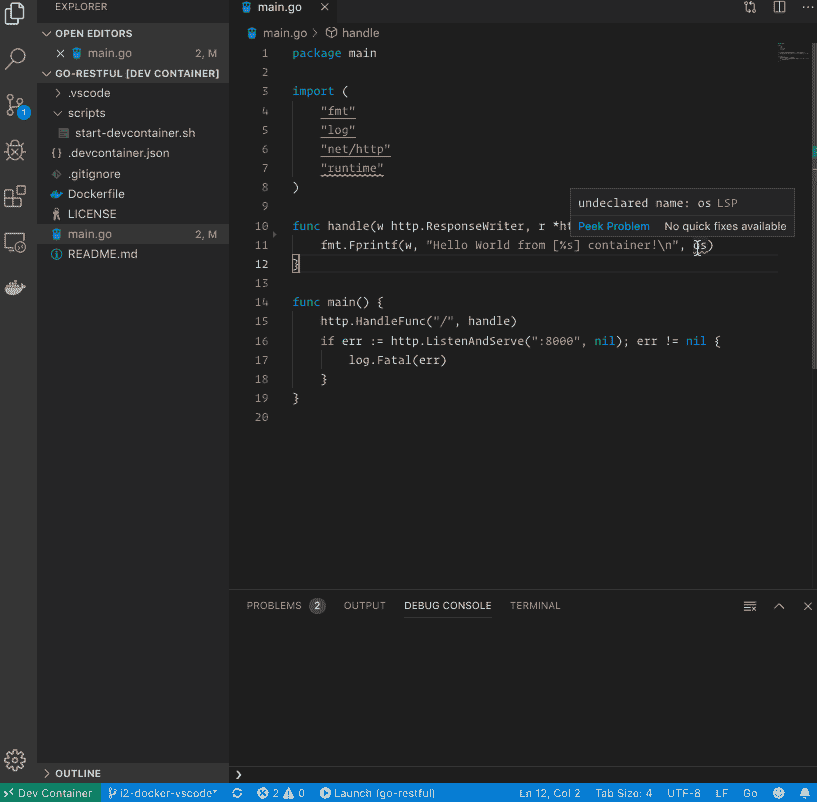

# 一个完整的 Go 开发环境，包含 Docker 和 VS 代码

> 原文：<https://levelup.gitconnected.com/a-complete-go-development-environment-with-docker-and-vs-code-2355aafe2a96>

## [去宁静](/go-restful-series-a7addbfef5b1) — #3


[上次](/setup-simple-go-development-environment-with-docker-b8b9c0d4e0a8)，我创建了一个简单的脚本启动 Docker 容器，它可以从我的本地机器同步并执行 Go 源代码。但是我还没有想好如何支持智能感知和调试，这对于开发是至关重要的。让我们在这篇文章中这样做。

# 考虑

当我研究这个问题的解决方案时，我有点担心，因为它严重依赖于支持在容器内工作的代码编辑器/ide 的供应商。幸运的是，有两个流行的编辑器支持它:GoLand 和 Visual Studio Code(或 VS Code)。

GoLand 支持看起来相当成熟，因为它已经存在一段时间了(起源于 IntelliJ)。但是，该功能仅适用于购买的版本。

VS Code Remote-Containers 扩展最近才发布，所以它没有 GoLand 那么成熟。然而，该扩展是由微软官方开发和维护的(非开源),并计划作为 web 伴侣 IDE 或云 IDE 用于未来的许多服务中——因此它是非常有前途的。在撰写本文时，特性集看起来也足够好，可以开始使用了。还是用 VS 代码吧。

显然，我们可以直接在容器中使用 Vim，并在其中安装令人惊叹的插件。然而，这将是我的最后一次尝试，因为我不仅为我自己，也为我的团队(也为你的团队)设置了这个，而且 Vim 的学习曲线对于大多数开发人员来说是非常沉重的。

# VS 代码远程容器

## 概念

VS Code Remote-Containers 是一个扩展，它帮助开发人员像平常一样使用他们的 VS Code UI，但是所有的命令和动作都是在容器内部传播和执行的。这实际上就像你在一个容器中使用 VS 代码。


VS 代码实现足够强大和抽象，以至于大多数扩展仍然可以正常工作。

有了这个概念，我们可以为几乎所有类型的开发将环境容器化，而不仅仅是 Go。

## 秘诀

安装 [VS 代码远程容器](https://marketplace.visualstudio.com/items?itemName=ms-vscode-remote.remote-containers)扩展。

编写一个`Dockerfile`用运行和调试应用程序所需的包和工具定义您的映像。

在您的工作区根目录(在`.vscode/`目录旁边)创建一个引用`Dockerfile`的`.devcontainer.json`。

```
{
   "dockerFile": "Dockerfile",
   "extensions": [ 
      "ms-vscode.go" 
   ]
}
```

打开包含有 VS 代码的`.devcontainer.json`文件的文件夹。VS 代码会自动检测它，并要求你以容器模式重新打开项目。


然后，VSCode 将基于您的`Dockerfile`构建 Docker 映像和容器(仅第一次)，并设置一些额外的必需包，以便它可以容器化地工作。


这个过程完成后，您就可以像平常一样使用 VS 代码，并且让所有东西都在容器中运行。


上面的例子表明，尽管我甚至没有在本地机器上安装`go`运行时，我可以从我的 VS 代码中执行 Go 代码，并从我的 Safari 中访问执行服务器。一切都是在容器里完成的。

# 履行

按照上面提到的概念和配方，我创建了一个`Dockerfile`。

该图像是基于官方的`golang`图像，所以它可以支持`go`开箱即用。然后，我安装了 Go VS 代码扩展所需的几个不同的工具，以实现智能感知、林挺和调试功能。

然后我写一个`.devcontainer.json`文件。

它简单地引用了`Dockerfile`，并列出 VS 代码应该安装到附加容器中的所有扩展。它还设置了从我的本地机器到我的容器的端口映射，反之亦然，这样我就可以直接从我的浏览器测试我的应用程序。

# 结果

我能够编写具有智能感知所有特性的代码，比如自动完成、自动导入、代码导航等。



我可以在本地机器上不安装 Go runtime 的情况下运行这个应用程序。多亏了端口映射，我也可以用我的 Safari 直接测试我的应用程序。


我能够使用 Go VS 代码扩展支持的令人敬畏的调试特性。


# 限制

我需要的东西差不多都有了。然而，仍然有一些限制，我觉得有点讨厌:

*   为了能够使用 VS 代码 Git Push 命令，我必须做一些工作，这需要将我的 SSH 凭证绑定到容器。
*   我不能使用 VS 代码 Git Commit 命令进行 GPG 签名提交。这是可能的，但是要将 GPG 命令从容器转发到主机需要做大量的工作。

# 总结

尽管仍有一些限制，但我能够解决这里定义的史诗，并拥有一个具有本地质量开发经验的全职容器化开发环境。

感谢微软这么救命的功能！

本文的完整源代码发布在[这里](https://github.com/the-evengers/go-restful/tree/41b3172af912a36643f9b578bdcf242fccabccf6)。