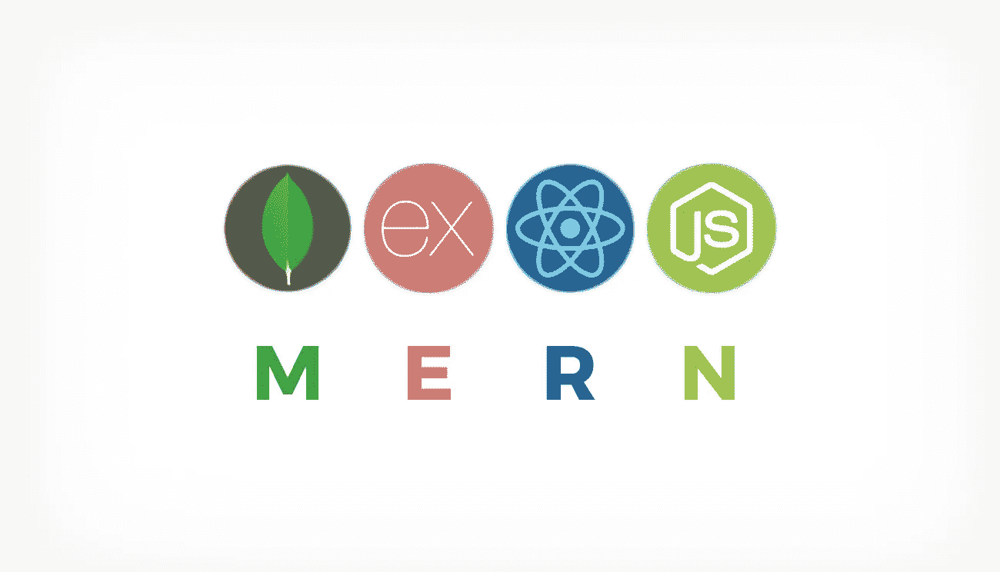

# 使用 M.E.R.N 栈的全栈开发:第 1 部分

> 原文：<https://levelup.gitconnected.com/a-complete-guide-build-a-scalable-3-tier-architecture-with-mern-stack-es6-ca129d7df805>

## 该项目作为 3 层架构的指南/模板

## 三层架构是一种在世界范围内广泛使用的 web 应用程序架构。它基本上包含三层:客户机、服务器和数据库

# 什么是三层架构？


我们的应用程序的架构基于典型的 MVC 模型。我们的客户端层(视图)将使用 ReactJS 作为框架，用 Javascript、HTML 和 CSS 编写。这个层次的架构是用户用来访问我们的应用程序的特性的。

业务逻辑层(控制器)将使用 NodeJs 和 ExpressJS 编写，这一层代表应用服务器，它将充当客户端层和数据库层的通信桥梁。这一层将为用户的设备提供 HTML 页面，接受来自用户的 HTTP 请求，并给出适当的响应。

我们的数据库层(模型)将托管 MongoDB。这是我们存储应用程序运行所需的所有关键数据的地方。

# 什么是 Web 开发？

如果你对 Web 开发完全陌生。我强烈建议你先看/读这段视频和这篇博文:

[](https://engineering.videoblocks.com/web-architecture-101-a3224e126947) [## 网络架构 101

### 当我开始成为一名 web 开发人员时，我希望我知道的基本架构概念

engineering.videoblocks.com](https://engineering.videoblocks.com/web-architecture-101-a3224e126947) 

**本项目包含两部分:**

1.  用 NodeJS/ExpressJS/MongoDB 构建了一个简单/良好的结构化服务器应用程序

*   **第 1.5 部分:【改进】** [**认证的完美结构&用 Node.js 和 JWT**](https://medium.com/swlh/perfect-structure-to-authenticate-authorize-api-with-node-js-and-passport-jwt-d529b1a618ba) 授权你的 API

1.  构建了一个 ReactJS 应用程序，并将其与您的服务器集成。点击这里查看第 2 部分 [**(我如何在一小时内构建 M.E.R.N 代码库)**](https://medium.com/swlh/i-built-a-m-e-r-n-codebase-in-an-hour-742acd71ed7e)



在这篇文章中，我将向你展示**第 1 部分**来构建你的**服务器。**

# 项目结构

在这篇文章的最后，你会看到

```
project
 ├── client
 └── server
   └── controller   — Storing APIs (GET, POST, PUT, DELETE)
    ├── index.js
    └── user.controller.js
   └── database 
    ├── model       — store all the models of the project
    └── schema      — create attribute for each model
   ├── .eslintrc    — config ESLint Airbnb Coding Style
   ├── .babelrc     — migrate ES6->ES5 to run on different browsers
   ├── package.json — config ESLint Airbnb Coding Style
   └── App.js       — Everything a server needs to start
```

你可以在这里找到最终代码！

# 要求

*   [Node.js](https://nodejs.org/en/)
*   [国家预防机制登记处](https://www.npmjs.com/)
*   文本编辑器: [VSCode](https://code.visualstudio.com/) 或者……任何你喜欢的东西。
*   [Postman](https://www.getpostman.com/) :这将允许你测试你的 API (GET，POST，PUT，DELETE 等。)

***推荐:*** **在您阅读帖子的同时，我强烈推荐您研究或点击我高亮或下划线的链接(有链接)**

# 入门指南

打开您的终端并重定向到您想要放置项目的目录:

```
$ mkdir project && mkdir project/server && mkdir project/client && cd project/server/
```

现在，您在服务器文件夹中。让我们初始化我们的节点应用程序:

```
$ npm init --yes
```

这是您存储所有项目依赖项和启动应用程序的脚本的地方

```
{
   “name”: “server”,
   “version”: “1.0.0”,
   “private”: true,
   "description": "",
   "main": "app.js",   
   “scripts”: {
      “start”: “node -r esm app.js”,
      “dev”: “nodemon -r esm app.js"
   }, 
   "keywords": [], 
   "author": "Calvin Nguyen"
   "license": "ISC"
}
```

# 安装

开始之前，您需要在计算机上安装一些依赖项:

## 快速中间件

安装前 3 个中间件来运行您的应用程序:

```
$ npm i express esm nodemon --save
```

*   **Express**:NodeJS 启动服务器项目的必备框架。
*   [**ESM**](https://github.com/standard-things/esm)**:**这个跟 **babel 配套，你以后再安装，**可以让你运行 ES6(新版 Javascript)。
*   [**nodemon**](https://nodemon.io/)**:**这是我最喜欢的；每当您在服务器中进行更改时，它将使您能够自动重新启动服务器。

现在，您的 package.json 将类似于

```
{
  "name": "server",
  "version": "1.0.0",
  "private": true,
  "scripts": {
    "start": "node -r esm app.js",
    "dev": "nodemon -r esm app.js"
  },
  "dependencies": {
    "express": "^4.17.1",
    "esm": "^3.2.25",
    "nodemon": "^2.0.2"
  },
  "devDependencies": {
    "babel-cli": "^6.26.0",
    "babel-core": "^6.26.3",
    "babel-polyfill": "^6.26.0",
    "babel-preset-es2015": "^6.24.1",
    "babel-preset-stage-2": "^6.24.1",
    "babel-register": "^6.26.0"
  }
}
```

# ESLint Airbnb+beauty+Babel

安装[**Eslint**](https://github.com/eslint/eslint)**&**[**更漂亮**](https://prettier.io/) : `npm i eslint prettier`

1.  安装 [**ESLint Airbnb**](https://github.com/airbnb/javascript) 让所有开发者拥有相同的编码风格，遵循一种 Javascript 编码风格

```
$ npx install-peerdeps --dev eslint-config-airbnb
```

创建 ***。eslintrc***

```
{
   “extends”: “airbnb”
}
```

## 巴比伦式的城市

安装

```
$ npm install --save-dev @babel/core
```

创建 ***。babelrc*** 文件并添加如下内容:

```
{
  "presets": ["[@babel/preset-env](http://twitter.com/babel/preset-env)"]
}
```

# gitignore

创建一个 ***。git 忽略服务器项目中的*** 文件，并添加以下内容:

```
package-lock.json
node_modules/
```

这对于现在的每个开发人员来说都很熟悉，但是对于那些新手来说:。当推送至 Github/Gitlab/Bitbucket 时，gitignore 将**忽略那些文件/文件夹**

简单来说，我不想给 git 添加 node_modules/，因为它太庞大了，其他的用 package.json 安装就可以了。

因此，我将 node_modules/添加到。gitignore，也不会推送到 Github/Gitlab/Bitbucket。

# 构建您的服务器

第一步是创建一个包含 Node.js 服务器代码的文件

```
$ touch app.js
```

这个***app.js*** 会在**端口 8080** 上启动一个服务器，初始化你的 app 需要的所有依赖项。将这个简单的代码添加到 app.js

```
// Import all dependencies & middleware here
import express from ‘express’;// Init an Express App. 
const app = express();// Use your dependencies here// use all controllers(APIs) here
app.get(‘/’, (req, res) => {
   res.status(200).json({
      status: ‘Server Run successfully’
   });
});// Start Server here
app.listen(8080, () => {
   console.log(‘Server is running on port 8080!’);
});
```

# 启动您的服务器

你可以在 ***package.json*** 中找到运行这些函数的脚本

```
$ npm start
```

这将运行 package.json 中的**" start ":" node-r ESM app . js "**

*   **节点:**这是运行节点应用程序的主要命令
*   **-r esm:** 为本地运行启用“esm”

或者(要在您进行新的更改时自动运行，运行由 **nodemon** 使用)

```
$ npm run dev
```

# 使用依赖关系/中间件

Express 是一个框架，但这并不意味着它包含了制作一个伟大的 web 应用程序所需的全部内容。然后，您需要导入更强大的库。

一个例子是[](https://github.com/expressjs/body-parser)**:**

```
$ npm i body-parser
```

**将那些高亮线导入 ***app.js*** :**

```
// Import all dependencies & middleware here
import express from 'express';
**import bodyParser from 'body-parser';**// Init an Express App.
const app = express();// Use your dependencies here
**app.use(bodyParser.urlencoded({ extended: false }));
app.use(bodyParser.json());**// use all controllers(APIs) here
app.get('/', (req, res) => {
  res.status(200).json({
    status: ‘Server Run successfully’
  });
});// Start Server here
app.listen(8080, () => {
  console.log('Example app listening on port 8080!');
});
```

# **创建 RESTful APIs**

**现在你的项目越来越复杂，你也不想把你的 API 全部放到 ***app.js*** 里，只用来启动&初始化你的 app。**

**你想把你的 API 放在不同的文件夹里。运行以下命令:**

```
$ mkdir controller 
$ touch controller/index.js && touch controller/user.controller.js
```

**打开您的***user . controller . js***，将这段代码导入其中:**

```
import express from 'express';const userController = express.Router();userController.get('/', (req, res) => {
   res.status(200).json({
      status: 'user Controller API call successfully'
   });
});export default userController;
```

**快速路由器是一个帮助我们创建路由器处理程序的类。它还可以扩展该路由以处理验证、处理 404 或其他错误等。**

## **可量测性**

**假设您的项目有许多控制器(API)。你不想一直把所有控制器导入到你的 ***app.js*** 。然后，您希望使用 1 个文件来导入所有控制器。**

**在你的控制器中打开 ***index.js*** ，导入这个:**

```
import userController from ‘./user.controller’;export {
   userController
};
```

## **将 API 添加到 Express App**

**你刚刚创建了控制器(API)，但是你还没有告诉 Express App 去**使用**它。**

**在 ***app.js*** 中，首先导入控制器:**

```
import { 
   userController,
} from ‘./controller’;
```

**替换这个:**

```
app.get(‘/’, (req, res) => {
   res.status(200).json({
      status: ‘Server Run successfully’
   });
});
```

**有了这个:**

```
app.use(‘/’, userController);
```

**您将得到这样的 **app.js** 文件:**

```
// Import all dependencies & middleware here
import express from "express";
import bodyParser from "body-parser";import { userController } from "./controller";// Init an Express App. 
const app = express();// Use your dependencies here
app.use(bodyParser.urlencoded({ extended: false }));
app.use(bodyParser.json());// use all controllers(APIs) here
app.use("/", userController);// Start Server here
app.listen(8080, () => {
  console.log('Server is running on port 8080!');
});
```

****注意:**再次测试你的应用程序，确保它工作正常。当您在将来开发更多的 API 时，这将变得更加清晰和有组织**

# **数据库ˌ资料库**

**你可以选择任何一种数据库语言来学习和应用。在这个项目中，我将使用 [**MongoDB**](https://www.mongodb.com/) ，因为它有一个优秀的库来与 NodeJS 交互。**

## **安装并运行 MongoDB**

```
$ cd ~
$ brew update
$ brew tap mongodb/brew
$ brew install mongodb-community@4.2
$ brew services start mongodb-community
```

**要停止 MongoDB:只需运行`brew services stop mongodb-community`**

**更多信息，请参考这个文件:[https://github.com/mongodb/homebrew-brew](https://github.com/mongodb/homebrew-brew)**

## **安装猫鼬**

**在您的应用程序中安装[**mongose**](https://www.npmjs.com/package/mongoose)**:“mongose 提供了一个直接的、基于模式的解决方案来为您的应用程序数据建模。”****

****当你使用 MongoDB 驱动时，这个库使你的生活变得更容易。****

```
**$ npm i mongoose**
```

## ****关系****

****在你的 ***app.js*** 中，导入 mongoose，将你的 app 与 MongoDB 连接:****

```
**// Import all dependencies & middleware here
import express from "express";
import bodyParser from "body-parser";
**import mongoose from "mongoose";**import { userController } from "./controller";// Init an Express App.
const app = express();// Use your dependencies here
app.use(bodyParser.urlencoded({ extended: false }));
app.use(bodyParser.json());// use all controllers(APIs) here
app.use("/", userController);// Start Server here
app.listen(8080, () => {
  console.log("Server is running on port 8080!");
 **mongoose.connect("mongodb://localhost/test").then(() => {
    console.log(`Conneted to mongoDB at port 27017`);
  });**
});**
```

****再次启动应用程序时，您会看到两行代码:****

```
**Server is running on port 8080!
Conneted to mongoDB at port 27017**
```

## ****为您的数据库构建一个简单的用户模型和模式对象****

```
**$ mkdir database && mkdir database/models && mkdir database/schemas
$ touch database/schemas/user.schema.js
$ npm i sha256**
```

****首先，创建模式，并初始化数据库中该对象的所有属性。****

****例如，**用户**模式将有两个属性:**电子邮件** & **哈希密码**。****

****打开***user . schema . js***:****

```
**import { Schema } from ‘mongoose’;
import sha256 from ‘sha256’;const userSchema = new Schema({
 hashedPassword: { type: String, required: true },
 email: { type: String, required: true },
});/**
 * [@param](http://twitter.com/param) {*} password
 */
userSchema.methods.comparePassword = function comparePassword(password) {
 return this.hashedPassword === sha256(password);
};export default userSchema;**
```

## ****模型****

****然后，您想要为您创建的每个模式创建一个模型，并将它们添加到 ***index.js*** (因此您只需要调用一个文件):****

```
**$ touch database/models/user.model.js && database/models/index.js**
```

****打开***user . model . js***:****

```
**import mongoose from 'mongoose';
import userSchema from '../schemas/user.schema';const User = mongoose.model('User', userSchema);export default User;**
```

****打开 ***型号/index.js*** :****

```
**import User from ‘./user.model’;export {
   User,
};**
```

# ****使用 API 保存数据****

****打开 ***控制器/user.controller.js*** 。****

****导入 User & **用这两个新的 API(端点)替换 userController.get('/'，…)** :****

```
**import express from "express";
**import { User } from "../database/models";
import sha256 from "sha256";**const userController = express.Router();**/**
 * GET/
 * retrieve and display all Users in the User Model
 */
userController.get("/", (req, res) => {
  User.find({}, (err, result) => {
    res.status(200).json({
      data: result
    });
  });
});****/**
 * POST/
 * Add a new User to your database
 */
userController.post("/add-user", (req, res) => {
  const { email, password } = req.body;****const userData = {
    email,
    hashedPassword: sha256(password)
  };
  const newUser = new User(userData);
  newUser
    .save()
    .then(data => {
      res.status(200).send(data);
    })
    .catch(err => {
      res.status(400).send("unable to save to database");
    });
});**export default userController;**
```

# ****跟着我，你快完成了。测试时间！****

****运行您的服务器:****

```
**$ npm start**
```

# ****邮递员****

****开邮差，如果不知道怎么用的话。请看 [**本教程**](https://www.youtube.com/watch?v=t5n07Ybz7yI) :****

****使用 **POST/** 方法，输入**localhost:8080/add-user**。这将调用“/添加用户”API。****

****把这个加到身上**(如果不知道这个放哪里。请先看视频):******

```
**{
 ‘email’: ‘[calvin.nvqc@gmail.com](mailto:calvin.nvqc@gmail.com)’,
 ‘password’: ‘123456789’
}**
```

********

****API 测试示例****

****检查您的用户数据是否保存到数据库中，打开 Web 浏览器并输入 **localhost:8080/ - >** 该 API 将调用 GET/ API 来检索您数据库中的所有用户****

********

## ****现在，你完成了！祝贺您构建了第一个 API。****

# ******未来的改进******

****对于即将到来的未来，如果你想获得更多牛逼的模板来创建 Java、Python、Angular、React 等全栈 web 应用。****

****有一个很棒的包管理软件叫做 [trivin](https://github.com/calvinqc/trivin) ，它会创建很棒的模板，并且用一行命令就能为你安装所有的依赖项。****

# ****作者说明****

****问候读者，****

****本文是“ ***我与创业公司一起成长”***系列文章的一部分，该系列文章由各种软件开发的*技术教程、新闻和技巧*组成:****

1.  ******用 Node.js(第 1 部分)— ES6** 构建一个结构良好的三层架构****
2.  ****[提高团队代码质量的两个简单技巧](https://medium.com/swlh/2-simple-tips-to-increase-your-team-code-quality-143b879ae2f7)****
3.  ****[认证的完美结构&用 Node.js 授权你的 API](https://medium.com/swlh/perfect-structure-to-authenticate-authorize-api-with-node-js-and-passport-jwt-d529b1a618ba)****
4.  ****[我在一个小时内构建了一个 M.E.R.N 代码库](https://medium.com/swlh/i-built-a-m-e-r-n-codebase-in-an-hour-742acd71ed7e)(第 2 部分)****
5.  ****[如何用 Java 构建 REST API&MySQL 使用 Tomcat](https://medium.com/@calvinqc/build-a-simple-rest-apis-with-java-8-tomcat-jsp-mysql-intellij-on-mac-3308f4e59a03)****
6.  ****使用 Nodemailer、Gmail & Google OAuth2 构建你自己的邮件 API****
7.  ****[WebRTC——支持 Google Meet、Facebook Messenger 的技术](https://medium.com/swlh/webrtc-the-technology-that-powers-google-meet-hangout-facebook-messenger-and-discord-cb926973d786)****
8.  ****[向新的 Github CLIs 问好](https://medium.com/@calvinqc/say-hello-to-the-new-github-clis-7e2612fb3918)****
9.  ****[使用 Java、Springboot、Kafka 进行简单设置](/easy-java-springboot-apache-kafka-setup-on-macos-ceb481e167f8)****
10.  ****[成功的团队合作需要什么](/what-it-takes-to-have-a-successful-team-cooperation-bc21b82e9f3)****
11.  ****[如何使用 Docker、EC2、ECS 和 ECR 将应用部署到 AWS](https://medium.com/swlh/how-to-deploy-an-application-to-aws-using-docker-ecs-and-ecr-aa7785fc9667)****
12.  ****[通过将我们的客户端托管到云存储，我们节省了 45%的总成本](https://medium.com/@calvinqc/we-cut-down-45-of-our-budget-by-switching-to-google-cloud-storage-7e5a6a10542)****

****感谢访问这个系列，并享受阅读！****