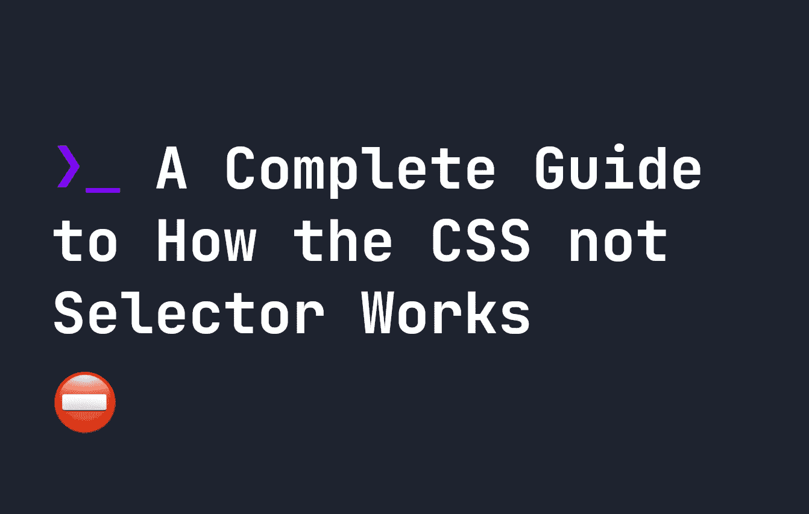
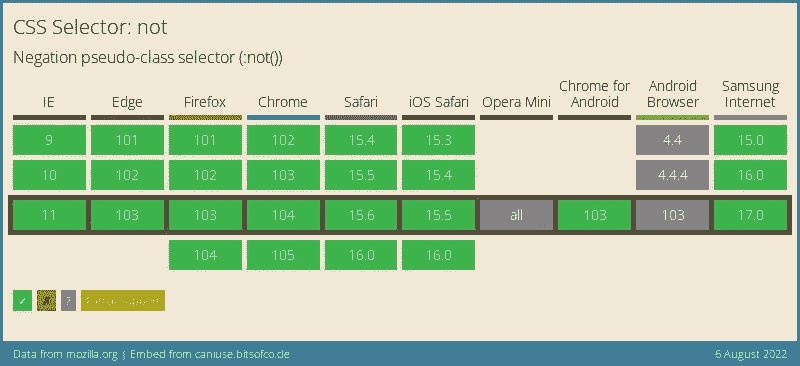

# CSS :not()选择器如何工作的完整指南

> 原文：<https://levelup.gitconnected.com/a-complete-guide-to-how-the-css-not-selector-works-7aadb48a1df7>



# CSS 非选择器

CSS `:not()`选择器被大多数浏览器广泛支持。它的工作方式是，我们创建一个选择器，然后指定它应该**而不是**是什么。例如，假设您有以下 HTML:

```
<div class="not-red">Not Red</div>
<div class="not-red">Not Red</div>
<div>Red</div>
<div>Red</div>
```

我们这里有一堆`div`的，有些不应该是红色的。如果我们希望页面上所有的`div`都是红色的，除了`.not-red`元素，我们可以使用`:not(.not-red)`来确保它们保持红色:

```
div:not(.not-red) {
    color: red;
}
```

这是另一个例子。默认情况下，所有元素都将使用 Arial 字体，除了`.old-fashioned`元素:

```
<div class="old-fashioned">Old Fashioned Text</div>
<div>Some Text</div>
```

在我们的 CSS 中，只有非`.old-fashioned`元素使用 Arial 字体，如下所示:

```
div:not(.old-fashioned) {
    font-family: Arial, sans-serif;
}
```

# CSS 而不是选择器增加了特异性

您可能对 CSS 中的特异性概念很熟悉，即某些选择器“覆盖”其他选择器。例如，`class`比`id`具有更低的特异性，因此任何`id` CSS 属性都将覆盖同一元素上的`class`属性。

`:not`选择器也会影响特异性。例如，如果您的代码中有`div:not(#id)`，它仍然将**算作有`id`的**，所以特异性增加，就好像它有`id`一样。使用`:not()`时记住这一点很有用

# CSS not 选择器和 DOM 结构

关于`:not()`的一个令人困惑的事情是，当你试图用它来阻止样式应用于元素中的东西。例如，假设您有以下 HTML:

```
<div class="container">
    <form>
        <div class="input-element">
            <input type="text" />
        </div>
    </form>
    <div class="input-element">
        <input type="text" />
    </div>
</div>
```

假设您想要将样式仅应用于不在`form`元素内的`input`元素。简单吧？您可以尝试以下方式:

```
div :not(form) input {
    border: 2px solid red;
}
```

只有**这样不行**，原因是`:not()`应用于每一级——我们将每个输入包装在`.input-element`中。那就是说`:not(form)`应用到`.input-element`上，确实是，不是形式。所以两个`input`元素都有红色边框。为了避免这种情况，您需要删除包装元素，并使输入成为表单的直接子元素:

```
<div class="container">
    <form>
        <input type="text" />
    </form>
    <input type="text" />
</div>
```

这样表单中的输入，将不会从`div :not(form) input`中继承样式。

# CSS 不支持选择器

**需要注意的是**有两个版本的`:not()`选择器——一个只接受一个简单的 CSS 选择器，而更新的`:not()`可以接受任何 CSS 选择器。

所有的浏览器都支持单一简单的选择器，就像我们目前使用的一样，包括 ie 浏览器。然而，并不是所有的浏览器都支持复杂的选择器。使用`:not`中的简单选择器，您可以完成以下所有操作:

*   `:not(#id)`
*   `:not(.class)`
*   `:not(element)`
*   `:not([attrbute])`

然而，类似下面的东西只有复杂的选择器才有:

*   `:not(#id, .class, [attribute])`
*   `:not(#id.class)`
*   `:not(element#id, #id.class)`

幸运的是，对复杂选择器的支持仍然很高。目前唯一不支持复杂选择器的浏览器是 Internet Explorer 和一些移动浏览器:

