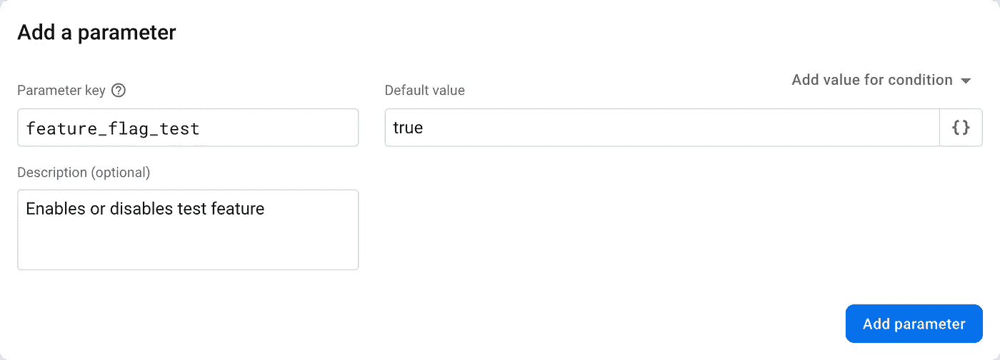
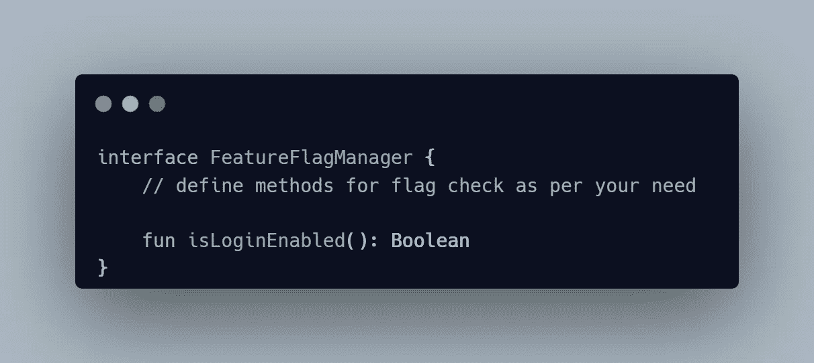
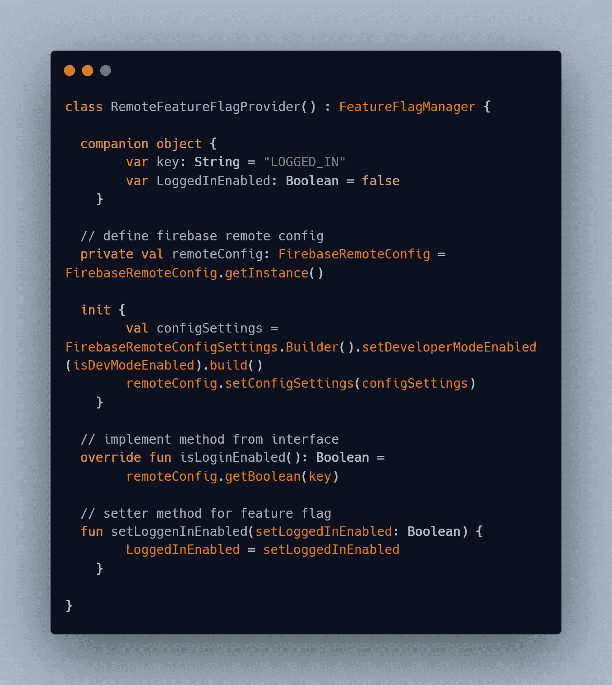
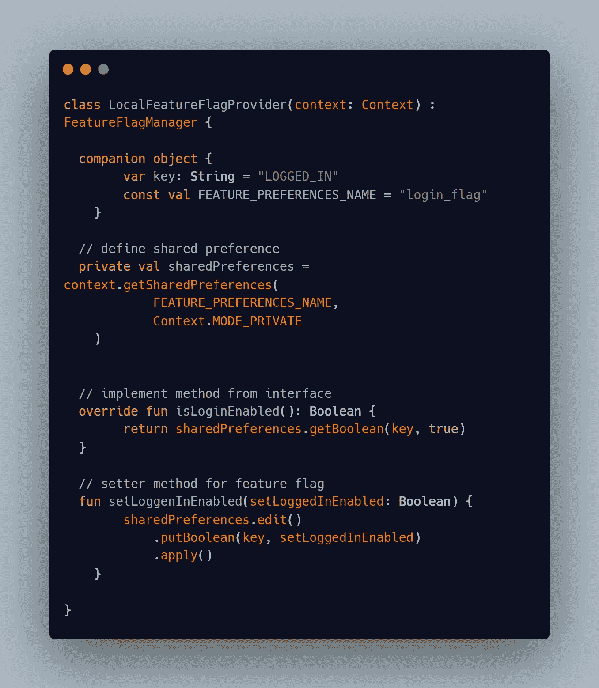

# 在 Android 中实现功能标志的完整指南

> 原文：<https://levelup.gitconnected.com/a-complete-guide-to-implement-feature-flags-in-android-292911c085e6>

在软件开发的世界里，你永远不知道什么时候会出现意想不到的 bug，你的软件可能会因为系统故障而崩溃。在这种情况下，**特征标志/特征切换**就派上了用场。

如果任何功能在应用程序中无法运行，功能标志将帮助开发者立即**启用/禁用**功能。

坚持住…..普拉奇！什么是功能标志？让我们一步一步来看。

来源——un splash

## **什么是特征标志？**

功能标志只是允许您动态启用/禁用系统的某些功能或部分的变量。动态地，我的意思是你甚至可以在运行时启用/禁用它们。

例如，使用此功能标志，我们的应用程序可以向已登录的用户显示一些功能，并向未登录的用户隐藏我们应用程序的其他功能。

另一个例子是，假设你正在构建应用程序的一个特性。该功能尚未完全开发。在这种情况下，您可以对用户隐藏此功能，直到使用功能标志完成。

或者，如果该功能无法运行，您可以禁用该功能的标志，您的应用程序仍然可以工作，不会出现任何系统故障。

## **如何在 Android 中实现功能标志？**

首先，您需要定义特性标志将存储在哪里。您可以远程或本地存储它们。我们将看到如何在本地和远程使用它们。

可以使用类似[**Firebase Remote Config**](https://firebase.google.com/docs/remote-config)的第三方特性标志管理工具。

**在 Firebase 远程配置中添加参数:**

Firebase 允许我们为每个值定义键和描述。

添加配置参数

## **执行特征标志检查**

定义一种方法来检查功能标志的状态。

下面是如何定义和使用远程特征标志的实现。您可以用附加的特性标志来扩展它。

远程特征标志实现

接下来，我们可以使用共享首选项实现一个本地特性标志。**共享首选项**用于本地存储。您可以保存数据，并在应用程序中任何需要的地方使用。

局部特征标志实现

出于测试目的，您可能需要绕过登录流程，测试应用程序的其他功能。在这种情况下，您可以在**调试版本**中启用该登录特性标志，以简单地跳过或绕过登录。

记得在你应用的**发布版本**中启用这个标志。

类似地，您也可以在不同的构建类型中为不同的目的使用特性标志。

## **结论**

功能标志非常强大。它们使代码更加模块化和稳定。它最大限度地降低了意外错误和系统故障的风险。

但是，如果您的特性标志不再被使用，或者特定的特性发生了变化，那么一定要记得清理它们。

如果你已经做到了，你可以关注我的[**推特**](https://twitter.com/prachiijamdade) **。轻敲几下拍手按钮来表达爱意。🙌**

更多来自 [**普拉奇**](https://medium.com/@Prachi-Jamdade)

 [## 现实生活中的数据结构和算法！

### 数据结构和算法是任何技术/编码面试的关键部分。像谷歌、微软这样的大型跨国公司…

levelup.gitconnected.com](/data-structures-and-algorithms-in-real-life-161619607632) 

# 分级编码

感谢您成为我们社区的一员！在你离开之前:

*   👏为故事鼓掌，跟着作者走👉
*   📰查看[升级编码出版物](https://levelup.gitconnected.com/?utm_source=pub&utm_medium=post)中的更多内容
*   🔔关注我们:[Twitter](https://twitter.com/gitconnected)|[LinkedIn](https://www.linkedin.com/company/gitconnected)|[时事通讯](https://newsletter.levelup.dev)
*   🚀👉 [**软件工程师的顶级工作**](https://jobs.levelup.dev/jobs?utm_source=pub&utm_medium=post)