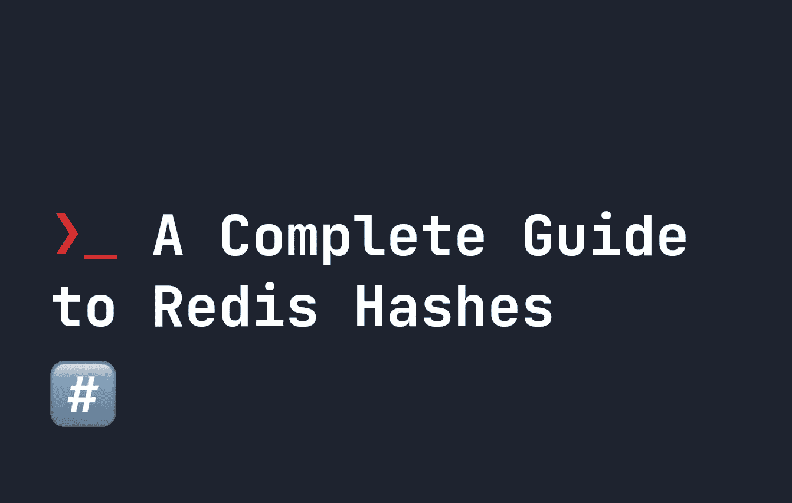

# Redis 哈希表完全指南

> 原文：<https://levelup.gitconnected.com/a-complete-guide-to-redis-hashes-53dd0824dad3>



Redis 散列是存储在 Redis 数据库中的一种记录。它们有点像 JSON 对象，将数据存储为键值对。它们是**可变的**，所以可以根据你的需要很容易地改变和更新。因此，它们是在 Redis 中存储某些类型的数据的好方法。[如果你是 Redis 的新手，在尝试本教程之前，确保你先安装了它。](https://fjolt.com/article/redis-how-to-install)

Redis 散列在结构上是扁平的，所以我们不能像在 JSON 中那样有多个层次。如果我们想添加一个新的散列，我们使用终端命令`HSET`。通过在终端中运行`redis-cli`来启动 redis，然后尝试运行以下命令来设置新的密钥:

```
HSET user:1 keyOne valueOne keyTwo valueTwo
```

redis 散列的命名约定被键入为`hash:key`，所以这里我们用`user:1`来表示用户编号 1。上面的语法可能看起来令人困惑，但它遵循以下约定:

```
HSET hash:key key value key value key value ....
```

因此，当我们编写`HSET user:1 keyOne valueOne keyTwo valueTwo`时，我们**创建了一个名为 user:1** 的新散列，然后我们创建了一个名为`keyOne`的键值`valueOne`，以及一个名为`keyTwo`的键值`valueTwo`。您可以永远延续这种模式，这意味着您的散列可以有任意多的键值对。

# 在 Redis 哈希表中更新和添加新的键

我们可以使用`HSET`命令创建一个 hash，并对其进行更新或添加。例如，要向`user:1`添加新的键和值，我们只需使用新的键和值再次运行`HSET`:

```
HSET user:1 keyThree valueThree
```

如果我们稍后想要更新`keyThree`的值为`valueFour`，我们将再次运行`HSET`来覆盖`keyThree`的值:

```
HSET user:1 keyThree valueFour
```

# 在 Redis 中获取散列键值和散列

如果您想获得特定散列中的所有键和值，您可以使用`HGETALL`。这将返回指定哈希中的所有键和值。例如:

```
HGETALL user:1
```

将返回:

```
1) "keyOne"
2) "valueOne"
3) "keyTwo"
4) "valueTwo"
```

同时，如果你想得到一个散列中一个特定键的值，我们使用`HGET`。例如，为了获得`keyOne`的值，我们运行:

```
HGET user:1 keyOne
```

它将返回:

```
"valueOne"
```

# 将哈希键值增加一个数量

散列的一个常见用例是在记分板上存储用户分数。在这种情况下，如果是一个数字，我们希望将用户的分数增加一定的量是很常见的。例如，假设我们有这个记分牌:

```
HSET scoreboard:1 userNameOne 200
```

如果我们需要更新用户的分数，我们可以很容易地使用`HINCRBY`将用户的分数增加一定的量。假设我们要增加用户的分数`200`。不使用`HSET`，我们可以这样做:

```
HINCRBY scoreboard:1 userNameOne 200
```

# 删除 Redis 中的散列键和值

最后，如果您想要删除特定散列的散列键，我们使用`HDEL`。以我们的第一个例子`user:1`为例，如果我们想删除`keyOne`，我们可以通过运行以下命令来实现:

```
HDEL user:1 keyOne
```

如果您根本不想要散列，并且想要完全删除`user:1`，那么您可以简单地使用`del`来代替:

```
del user:1
```

# 分级编码

感谢您成为我们社区的一员！在你离开之前:

*   👏为故事鼓掌，跟着作者走👉
*   📰查看[升级编码出版物](https://levelup.gitconnected.com/?utm_source=pub&utm_medium=post)中的更多内容
*   🔔关注我们:[Twitter](https://twitter.com/gitconnected)|[LinkedIn](https://www.linkedin.com/company/gitconnected)|[时事通讯](https://newsletter.levelup.dev)

🚀👉 [**将像你这样的开发人员安置在顶级创业公司和科技公司**](https://jobs.levelup.dev/talent/welcome?referral=true)