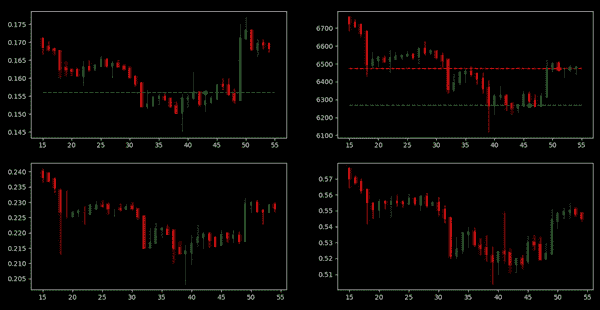
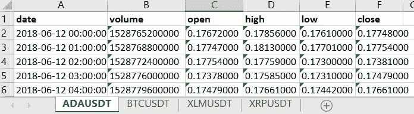
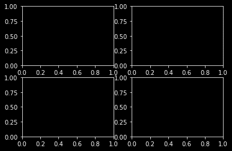

# 用 python 构建一个复杂的强化学习加密交易环境

> 原文：<https://levelup.gitconnected.com/a-complex-reinforcement-learning-crypto-trading-environment-in-python-134f3faf0d7a>

我最近才开始详细了解强化学习，在了解了像 DeepMind 的 **AlphaGo** 和 **AlphaZero** 这样的项目是如何实现该领域的壮举后，我着迷了。这让我渴望了解 deep RL 及其所有的复杂性，所以我决定剖析它的组件，并将它们用于一个有趣的应用程序。

建立一个持续盈利的交易机器人不是一件容易的事情，在某种程度上可能是不可能的。一个完美的模型基本上应该知道市场的状态及其所有变量，以及一些我们甚至不知道存在的变量。有了像 AlphaZero 这样的项目，我觉得有趣的是，该算法能够在围棋比赛中开发出高水平围棋选手尚未发现的策略。基于这种想法，我对探索一个 RL 代理在复杂的交易环境中可以开发的策略很感兴趣，这里的复杂，我只是指跨越**多个市场**。

我读过的大多数关于这个话题的文章都只关注一个市场，比如一个“比特币交易机器人”。我增加这个“复杂性”因素的理由是，首先，我们给我们的代理更多来自不同市场的数据，减少其归纳的可能性，其次，在同一个空间下观察多个市场可能有意义的模式，这个空间将是这个项目的数字货币空间。

# 建设我们的环境

稍后我将使用 Tensorflow 的代理与环境进行交互，因此我将构建一个自定义环境类，它扩展了 TF environments 库提供的 py_environment 类。

需要注意的最重要的两个向量是**动作**和**观察**。在每一步中，我们的代理将选择一个硬币来购买、出售或持有其当前拥有的金额的%,因此我们有一个 int 类型的 numpy 数组，其形状为(3 ),其中第一个值**是我们将使用的配对数量**,第二个值**是购买、出售或持有数量**,最后一个值**是数量**,其中 1 是 10%, 2 是 20%,依此类推。

至于观察空间，我希望我的经纪人观察整个市场，而不仅仅是刚刚交易的硬币。所以现在是(4，5，40)，其中 4 是对，5 是每一步的成交量、开盘价、盘高、盘低和收盘价，40 是回顾窗口，基本上是我们的代理应该回顾多远的数据。这可能不是我们想要的最佳观察空间，但我这篇文章的重点是要有一个完全成熟的环境，我们可以在以后开始试验和设计每个组件。

此外，我们将 wallet 定义为一个列表，其中第一个值是初始美元余额。请注意，我使用的是本地存储的 excel 电子表格形式的数据，我使用了**币安的 API** 来基本上下载每一对的市场数据，用表格分开:

市场数据的 Excel 文件

我不会重复我用来将数据提取成这种格式的脚本，但你可以在这里找到它 [***。***](https://gist.githubusercontent.com/mohdabdin/d54524def4025bad6d9965a6959f0c1b/raw/42d05c2afb14b85135141dfc8e26eb1f6de3c0c5/binance_to_excel.py)

接下来，我们定义我们的 **reset()** 方法来重置每集的环境:

类似于 **reset()** 方法中的构造函数，我们重新初始化所有东西，除了常量，比如价格数据。

现在，转到我们的步骤函数，代理将传递一个“action”给它，并接收一个“timestep”对象，其中包含每步的奖励、状态和折扣。

首先，我初始化了一个“数据”列表，该列表将包含该步骤的状态所需的数据帧**(即在当前步骤及其后 40 步的范围内取行，这是我们的回顾窗口)。然后我添加了我们的剧集结束的条件，也就是我们的经纪人失去所有的钱。**

然后，我们将买入、卖出或持有，基于此，钱包将被更新，最后，我们递增我们的步骤并返回 timestep 对象，作为到下一个状态的转换。

同样，我将把所有的行动强化学习工程留到另一篇文章中，所以我们的奖励目前根本不起作用。这一部分的最终目标是提供一个环境，让代理能够**与**交互，并且能够**可视化呈现**。

# 渲染我们的环境

为此，我定义了一个新的类对象来绘制我们的价格数据和代理的移动到多个子情节上的烛台，这些子情节可以随着每一步迭代更新。

很简单，我使用 plt.subplots(2，2)初始化了支线剧情，这样我们就有了 4 个轴，这样我们就有了 2 行 2 列:

初始情节

一个用于蜡烛图的常用库是“mlp_finance ”,但是由于某种原因，我很难让它工作，所以我决定在我们的“TradingGraph”类中编写自己的蜡烛图绘制函数:

该函数接受一个轴、ohlc 值和索引值，遍历 ohlc 行以绘制两条线，第一条线是一条细线，代表我们的高值和低值，第二条线代表开盘价和收盘价。这种迭代产生了一个蜡烛图。

接下来，我们需要定义接收所有数据的函数，并将其绘制在 4 个支线图上:

我们构造中的“axs”变量将我们的子情节保存在一个二维 numpy 数组中，以便可以通过 index 访问它们，例如[0，0]是第一个子情节，[1，0]是第二个，依此类推。所以我使用了 **flatten()** 函数，所以它是一个大小为 4 的一维数组，现在我们可以迭代数据帧，其中每个数据帧都包含一枚硬币的价格数据，并编辑它的绘图。

接下来，我定义了一个函数来呈现我们的代理进行的交易:

与前面的函数类似，我们对每个图进行迭代，为其买入价格添加一条水平线，用一个点来表示采取该行动的时间，用红色表示买入，用绿色表示卖出。

最后，我们需要一种方法来将我们环境的渲染功能所使用的所有东西放在一起:

在这里我们简单地调用 **render_prices()** 和 **render_trades()** ，后跟 matplotlib 的 **draw()** 。通常情况下，matplotlib 的工作方式是，如果在任何时候调用 **plot()** 函数，它将显示图形，但我们在构造函数中使用了 **plt.ion()** 来告诉它我们将处理何时更新图形。所以每一步我们都要做所有必要的绘图，然后调用 draw 来根据变化重新绘制图形。最后， **plt.pause(0.1)** 用于指示我们在每帧之间等待的时间(以秒为单位)，这是我们的实时绘图更新机制工作所必需的。

我们可以回到我们的环境类，将这个可视化类作为**‘TG’**导入，并定义我们的渲染函数来使用我们刚刚构建的。

# 测试环境

为了测试我们的环境，我创建了一个新的 python 文件来导入环境并开始与之交互:

这运行了 100 个步骤的环境，使用随机的**购买、出售、持有**动作，概率分布分别为 **0.1、0.1、0.8** ，然后选择一个随机硬币，我将数量保持为 2，因为这不会影响我们当前的视觉模型，所以现在没有必要随机化它。

# 我们的最终结果:

肯定有调整的空间，添加我的注释、标签、网格等等。但是现在，我认为这是一个可靠的原型模型，我们可以使用它并开始应用强化学习技术来训练一个智能体。

下一步是向我们的环境中添加一个 pyenvironment tensorflow 包装器，以确保 TF 代理可以正确地进行交互而不会出现问题，但我们将在下一篇文章中讨论这个问题。

# 总结和最终想法

在本文中，我讨论了为 python 中的加密交易设计一个成熟的 TF 代理强化学习环境的过程。你可以在这里找到这个项目的 [***完整代码***](https://github.com/mohdabdin/crypto-trading-RL-environment) 。在我们开始实际应用强化学习之前，还有一些工作要做。我所做的任何更新都将在本文和存储库中更新，所以实际上没有必要检查这些微小的变化。因此，希望在下一篇文章中，我们可以从更有趣的方面开始，并开始使用我的 Tensorflow 代理库提供的最先进的强化学习算法。

这是我做过的最有趣也最令人沮丧的项目之一，从这里开始它只会变得更加有趣，所以希望你发现了它的价值并保持关注:)