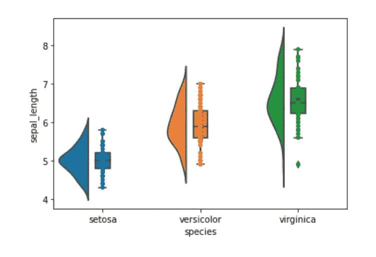
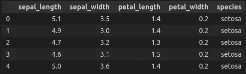
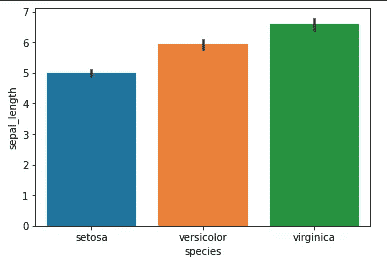
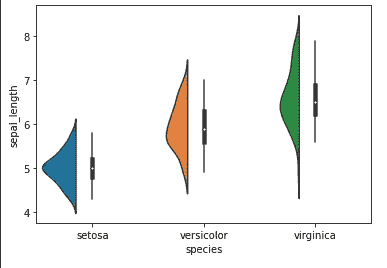
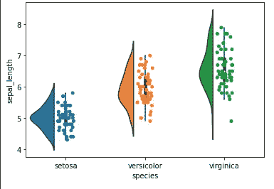
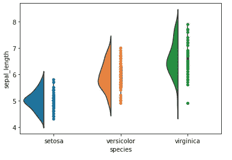
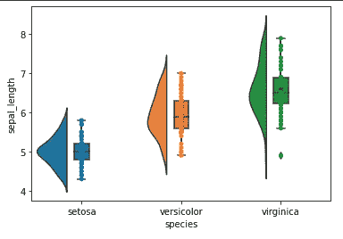

# 使用雨云图的综合数据可视化

> 原文：<https://levelup.gitconnected.com/a-comprehensive-data-visualization-using-raincloud-plots-120212e33197>

## 使用 Python 中的 ptitprince 库生成健壮、干净、有洞察力的数据可视化

你有没有想过，如果你能在一个单独的图中同时画出散点图、箱线图、分布图和小提琴图会怎么样？现在你可以用雨云图了。这种新型绘图的目的是为用户提供基础数据集的一般和个别模式。有了 **ptitprince** 库，我们可以在 Python 中轻松做到这一点！



雨云图(图片来自作者)

在本帖中，我们将学习如何用一个样本数据集来使用、实现和装饰我们的雨云图。一旦您熟悉了总体绘图技术，您就可以练习更高级的功能，或者直接在您当前或即将到来的数据科学项目中实现它。

```
**Table of Content**
1\. Installation
2\. Data Exploration
3\. Cloud Plot
4\. Rain Plot
5\. With Box Plot
```

> 请订阅我的 [**电子邮件简讯**](https://tinyurl.com/2npw2fnz) ，在那里我会定期用简单的英语和漂亮的可视化语言总结编程技巧和人工智能研究论文。

# 装置

在我们开始之前，请确保您拥有本教程所需的库。我们可以通过使用`conda`或`pip`来安装`ptitprince`库

*   使用`conda`

```
conda install -c conda-forge ptitprince
```

*   使用`pip`

```
pip install ptitprince
```

我建议使用`conda`来避免任何依赖冲突。

既然已经包括了初步的，让我们继续我们的教程的主要部分。

# 数据探索

在本教程中，我们将使用著名的`Iris`数据集来描述鸢尾开花植物不同物种的物理特征。

```
import pandas as pd
import seaborn as sns
import matplotlib.pyplot as pltimport ptitprince as pt
```

我们可以如下加载`Iris`数据集:

```
iris = pd.read_csv('https://raw.githubusercontent.com/mwaskom/seaborn-data/master/iris.csv')iris.head()
```



我们的虹膜数据集(图片来自作者)

在我们继续之前，我们可以探索不同种类的鸢尾的物理特征。

```
sns.barplot(x = "species", y = "sepal_length", data = iris)
```



不同鸢尾属物种的萼片长度分布(图片来自作者)

# 云图

现在我们可以开始使用`ptitprince`库来绘制我们的 Raincloud: Cloud 图的第一部分。

首先，我们将定义一个`matplotlib`图形，其中所有不同的图可以组合在一起。

```
f, ax = plt.subplots()
```

然后，我们将首先绘制我们的云图:

```
ax = pt.half_violinplot( x = "species", y = "sepal_length", data =iris, width = .6)
```

在这里我们会得到下面的所有数据点的分布图。



云图(图片来自作者)

# 雨图

现在我们有了云，我们可以让云下雨了(也就是标绘各个数据点)！要做到这一点很简单:

```
ax = sns.stripplot( x = "species", y = "sepal_length", data = iris)
```



雨云图(图片来自作者)

嗯积分分布好像很乱！我们可以通过将参数`jitter=0`传递给`stripplot()`函数来更好地绘制它，如下所示:

```
ax = sns.stripplot( x = "species", y = "sepal_length", data = iris, jitter=0)
```



带抖动(图片来自作者)

现在看起来更整洁了，虽然有些数据点可能会相互重叠！

# 带方框图

为了完整起见，我们还可以将一个箱形图合并到现有的雨云图中。我们可以通过以下方式做到这一点:

```
ax=sns.boxplot(x="species", y="sepal_length",data =iris, width = .15)
```

最终的图看起来会像这样。



带有方框图的雨云(图片来自作者)

# 结束语

绘制雨云图出奇的容易，生成的图形不仅漂亮，而且对数据科学家来说也很直观。它(几乎)为您提供了初始数据探索阶段所需的一切:总体分布和个体趋势。如果你喜欢这篇文章，请随时回复！

如果你想了解更多关于 Raincloud 的信息，你可以参考这篇原始论文

[](https://wellcomeopenresearch.org/articles/4-63/v2) [## 威康开放研究文章:雨云图:稳健数据的多平台工具…

### Allen M，Poggiali D，Whitaker K 等。雨云图:一种用于稳健数据可视化的多平台工具[第 2 版…

wellcomeopenresearch.org](https://wellcomeopenresearch.org/articles/4-63/v2) 

还有`ptitprince`图书馆

[](https://github.com/pog87/PtitPrince) [## GitHub-pog 87/ptit prince:rain cloud 的 python 版本

### “雨云情节”的 Python 实现！见:https://github.com/RainCloudPlots/RainCloudPlots 你可以安装…

github.com](https://github.com/pog87/PtitPrince)