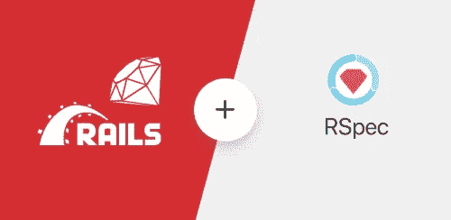
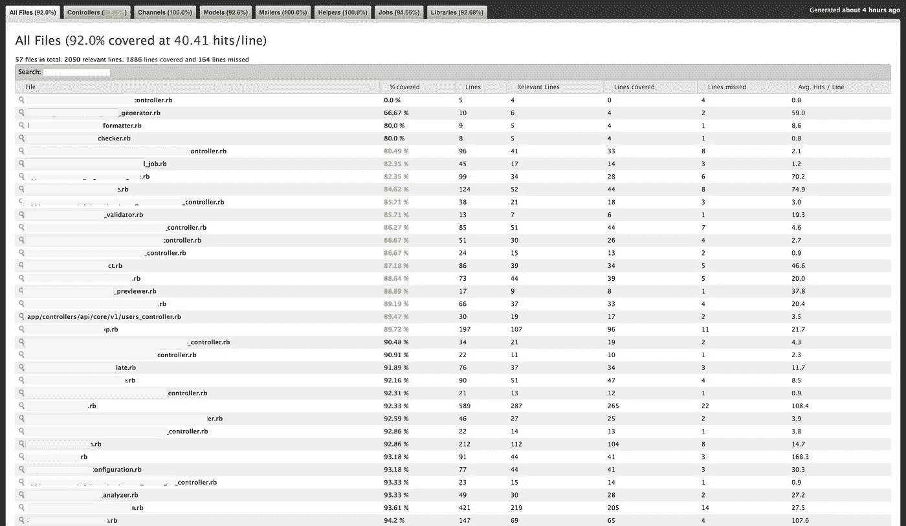
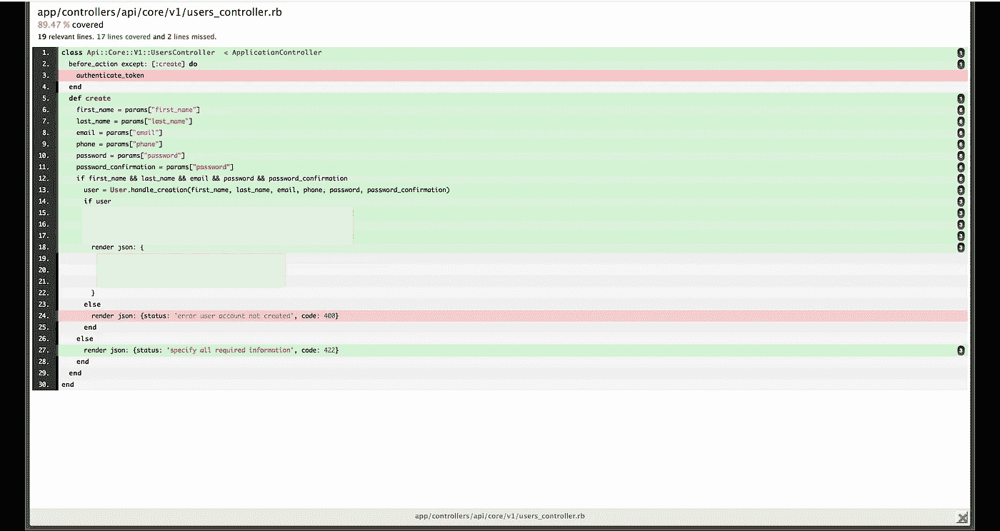
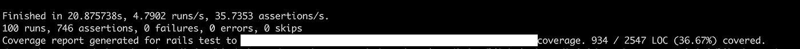
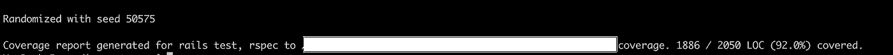

# 关于使用 Rspec 测试和自动化 Rails API 的全面指南

> 原文：<https://levelup.gitconnected.com/a-comprehensive-guide-on-testing-automation-for-rails-apis-with-rspec-317c980f4818>

## 我们如何创建一个自动化测试套件来测试模型、控制器、作业，并在最后计算测试覆盖率？请继续阅读，寻找答案。



图片由[https://hixon rails . com/ruby-on-rails-tutorials/ruby-on-rails-testing-rspec-configuration/](https://hixonrails.com/ruby-on-rails-tutorials/ruby-on-rails-testing-rspec-configuration/)

在本文的范围内，我们的自动化测试套件将由 3 个主要组件组成:一个 [**rake task**](https://medium.com/@josh_works/testing-rake-tasks-in-rails-6573f7185a0a) ，它将设置环境并调用测试套件，[**Rspec expectations**](https://relishapp.com/rspec/)，它将练习并观察我们代码的行为，最后 [**simpleCov**](https://github.com/colszowka/simplecov) ，它将在最后为我们生成一个小的 web 应用程序，以一种理智且符合人类工程学的方式检查我们的测试覆盖率。

# 我们将测试的功能

虽然我同意这不是一个特别有趣的特性，但我们仍然会测试 Rails API 的一部分，它会向新注册用户的收件箱发送电子邮件确认。该功能使应用程序能够通过确保地址所有权和电子邮件可送达性来验证电子邮件地址。

## 让我们来解决这个问题

让我们首先设置 Rspec。我不打算在这里讨论这个，因为有很多优秀的指南可以教你如何去做(例如[像这个](https://medium.com/@amliving/my-rails-rspec-set-up-6451269847f9))。一旦 Rspec 启动并运行，我们将测试我们的模型、控制器、作业和邮件程序。

## 单元测试模型

经过测试，我们的模型会像这样凶猛

用户模型的应用程序代码如下所示

它有两个需要测试的方法；`generate_email_confirmation_link`创建一个唯一的令牌，它可以包含在发送到用户电子邮件地址的 URL 中。它在 30 分钟后过期，如果用户在此之前点击它，我们的客户端应用程序将从 URL 中提取令牌，并将其发送回我们的 API。然后，API 将调用`verify_email`来设置`email_verified`属性，以便验证特定用户的电子邮件。我们将这样测试这个模型:

在第 5 行，我们使用`factory_bot`来创建一个用户(如果您没有使用工厂来生成模拟数据，我强烈建议您查找一个关于如何做的指南)。在新创建的用户上，我们调用`generate_confirmation_link`，这将生成一个指向该用户的 URL。我们从生成的 URL 中提取令牌，并检查是否可以通过 ID 对其进行解码以找到用户(第 8 行)。最后，我们将时间推进到未来(使用 Timecop)并检查令牌是否过期。

## 控制器的单元测试

想象一下为这个控制器制造这个附件的测试。

之后，我们将测试向 web 公开这些功能的用户控制器。它的管道看起来像这样:

如果用户创建成功，我们会通过调用后台作业向他们发送一封电子邮件。我们将不得不单独对这项工作进行单元测试，但是现在我们将简单地测试控制器。

在第 5 行，我们用所需的参数调用控制器的 create 方法。我们断言响应是全绿 200。接下来，我们将发送一个不完整的参数集，断言响应将是 422。请注意，我使用的是“老学校”的控制器测试，而不是新的要求规格。这是因为所讨论的 API 需要签名的 cookies，而目前(据我所知)还不可能用请求规范进行测试。

## 使用 Rspec 对作业进行单元测试

这份工作的好坏取决于你为它写的最差的测试

按照代码的执行路径，我们现在需要测试作业。这很容易测试。异步作业的代码如下所示:

该作业将找到用户，将`email_sent`属性设置为 true，然后调用邮件程序，将电子邮件发送到他们的收件箱。测试这一点很简单，我们只需检查用户的属性是否得到更新。如果是的话，一切都好。

这里需要注意的一点是，我们不是在测试 Sidekiq、Redis 或者 ActiveJob。我们不用担心这个。我们将简单地测试我们的应用程序代码是否合法，是否按照我们期望的方式运行。在每个测试之前(第 7 行)，我们调用 inline testing，这意味着 Rspec 将把这个作业队列放入我们系统的内存中，并使用 Sidekiq 来处理它(在生产中，这个实现将使用 Redis)。

## 邮件程序的单元测试

我们就要结束测试了，坚持住。此操作的最后一站是邮件程序。

该邮件程序将在主题行中按用户姓名发送邮件，并将生成的 URL 注入邮件正文。对此的测试将简单地检查收件人是否准确，生成的主题行是否有意义，以及消息是否来自我们的应用程序的电子邮件地址。

好了，现在困难的工作已经解决了。你想炫耀的权利，这样做，让设置简单覆盖。它会在您每次运行测试套件时生成一个测试覆盖报告，向您的经理和同事展示您是多么的负责任和努力工作。

## 计算测试覆盖率并提交报告

当有人做出破坏测试套件的变更时

为此，我们将在 Rails 应用程序中安装 simpleCov，然后在我们的`spec_helper.rb`中加入一些管道

在第 2 行，我们配置 simpleCov 使用合并。这是为了确保我们最终生成的报告考虑到了这个 Rails 应用程序中存在的所有测试套件(我倾向于根据天气和我的感觉同时使用 rspec 和 test unit)。如果您有多个测试套件，比如 Rspec 和 Test unit(默认情况下 Rails 附带的)，您可以让 simplecov 根据测试套件类型来检测和分类测试覆盖率。要做到这一点，在一个测试文件中用某个名字提到它。例如:

```
SimpleCov.command_name ‘rails test’
```

在你的一个测试单元测试中

```
SimpleCov.command_name 'rspec'
```

在你的一次 Rspec 测试中。这样，它不仅会为您提供每个套件的单独覆盖结果，还会在最后合并覆盖结果，从而为您提供一个总数。

## 创建 rake 任务来自动化测试

为了让我们更接近甜蜜的自动化天堂，我们将创建一个 rake 任务来处理所有这些

我们可以从我们的项目目录运行这个 rake 命令:

```
rails test:full_suite
```

在这里，我们检查 Rails 环境是否是生产环境之外的环境，如果是，那么套件运行。首先，我们将移除测试覆盖文件夹(如果它存在于之前的测试运行中)。我们将删除数据库，创建它，并使用第 7–9 行的代码从头开始迁移它(这将测试数据库连接和迁移历史的有效性)。然后它将调用 rails 测试，最后是我们的 rspec 测试。在一切运行成功之后，我们应该在我们的项目根目录下看到一个由 simplecov 生成的名为‘coverage’的文件夹。

## 查看 simpleCov 测试/代码覆盖报告

运行`rails test:full_suite`后，输入以下代码，在您最喜欢的/默认的网络浏览器上查看漂亮的报告。

```
open coverage/index.html
```



在这里，我们看到我们刚刚测试的控制器有 89%的覆盖率。为什么不是 100 分？让我们通过单击该特定测试来找出原因。



这里我们看到我们没有测试用户无效的情况(第 24 行)。我们可以在未来改进这一点，但现在，你有它；一个关于如何测试 Rails 应用程序大部分部分的快速指南，以及一个自动化的工作流程，通过向您展示您的测试有多有效来增强您的信心。



这里我们看到 rails 测试的覆盖率报告是 36%



当 rspec 测试运行时，我们看到 rails 测试和 rspec 的总覆盖率是 92%

## 打包放到 Github 上

我们可以通过添加 Github 工作流来进一步扩展这个练习，这样每当您或您的团队在 Github 上提交一个 pull 请求时，测试套件就会自动触发并验证所提交的代码。我设置的食谱是这样的。我定义了项目根(我正在处理的 repo 也包含其他内容)和一些特定于我的应用程序的环境变量。

## 解决纷争

并行测试就像并行停放工作一样棘手

对于那些使用 Rails 6 和并行测试的人来说，这是一个快速的提示。在撰写本文时，simpleCov 在计算并行工作者的覆盖率时遇到了一些问题。如果你看到奇怪的测试覆盖结果，请禁用它(在修复之前我得到 0%)。在 test_helper.rb 中注释掉这一行

```
parallelize(workers: :number_of_processors)
```

沙希科是一名来自多伦多的软件工程师，也是 T2 Restarone 公司的创始人。当他不开发软件时，他就在 Medium 和 [YouTube](https://www.youtube.com/channel/UCFl6NiPZtdsLHWUPWhrJj3g) 上创造内容，帮助人们过渡到科技行业。